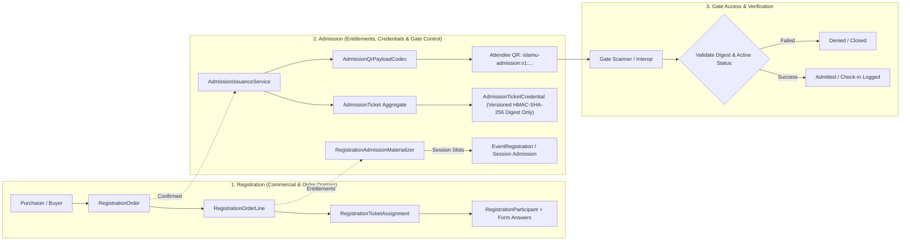
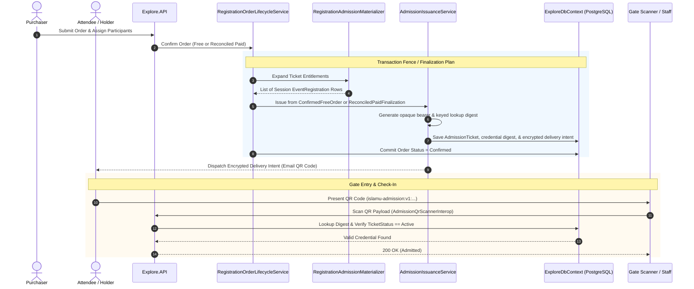
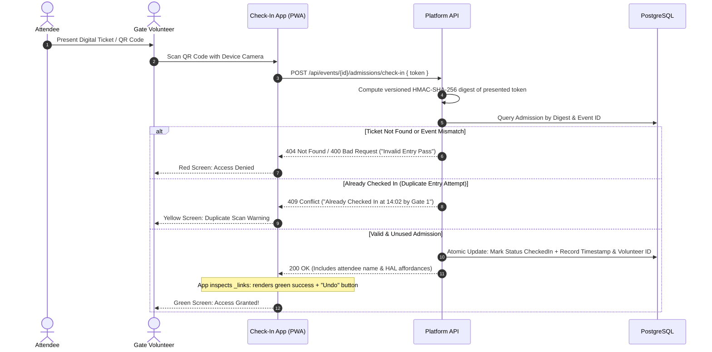

<!-- ABOUTME: Canonical architectural documentation for the Registration and Admission subsystems. -->
<!-- ABOUTME: Explains the distinction between registration orders, entitlement materialization, and zero-knowledge admission credentials. -->

# Registration And Admission Architecture

> **Audience:** Integrators | Contributors | AI agents
> **Status:** Implemented
> **Owner:** Product/Admin
> **Last Verified:** 2026-08-26
> **Source Anchors:** `Explore.Domain/RegistrationOrder.cs`, `Explore.Domain/RegistrationOrderLine.cs`, `Explore.Domain/RegistrationParticipant.cs`, `Explore.Domain/RegistrationTicketAssignment.cs`, `Explore.Domain/AdmissionTicket.cs`, `Explore.Domain/AdmissionTicketCredential.cs`, `Explore.Domain/AdmissionRecoveryCapability.cs`, `Explore.Domain/EventRegistration.cs`, `Explore.Application/Services/Registration/RegistrationAdmissionMaterializer.cs`, `Explore.Application/Services/Registration/AdmissionIssuanceService.cs`, `Explore.Application/Services/Registration/AdmissionRevocationService.cs`, `Explore.Application/Services/Registration/AdmissionRefundRevocationService.cs`, `Explore.Application/Services/Registration/AdmissionEventCancellationService.cs`, `Explore.Application/Services/Registration/AdmissionRecoveryService.cs`, `Explore.API/Controllers/AdmissionTicketRecoveryController.cs`, `Event.Wire.Contracts/Admissions/AdmissionQrPayloadCodec.cs`, `docs/adr/ADR-017-event-participation-authority-model.md`, `docs/adr/ADR-018-registration-order-ticketing-aggregate.md`, `docs/adr/ADR-023-admission-credential-check-in-transfer-recovery.md`

---

## 1. Executive Summary & Conceptual Distinction

In the ISLAMU Event platform, **Registration** and **Admission** represent two fundamentally distinct bounded contexts and lifecycles:

* **Registration** is the **commercial, administrative, and data-collection transaction** between a purchaser and the organizer (*"Who ordered what, which questions were answered, and is the payment reconciled?"*).
* **Admission** is the **access entitlement, cryptographic credentialing, and gate-entry authority** (*"Does this specific human have a valid, unrevoked, authentic credential to enter this session right now?"*).

---

## 2. Architectural Separation Rationale

Registration and Admission are kept in separate aggregates for five critical architectural reasons:

1. **Entitlement Expansion (1-to-Many Mappings):**
   A purchaser buys one ticket type (e.g., *"3-Day Conference All-Access Pass"*). That single order line entitles the attendee to multiple days, tracks, and individual sessions. The registration domain records the $1$ purchase, while the admission domain expands this into $M$ granular session-level [`EventRegistration`](../../src/Explore.Domain/EventRegistration.cs) admission slots.
2. **Purchaser vs. Attendee Independence:**
   A purchaser (e.g., a corporate buyer or family member) often buys tickets for other individuals. The order belongs to the purchaser, but each assigned [`RegistrationParticipant`](../../src/Explore.Domain/RegistrationParticipant.cs) receives their own independently managed [`AdmissionTicket`](../../src/Explore.Domain/AdmissionTicket.cs) and cryptographic QR credential.
3. **Zero-Knowledge Security & PII Isolation:**
   Registration orders store sensitive PII, custom questionnaire answers, and payment provider tokens. Conversely, the admission credential aggregate stores **only versioned keyed HMAC-SHA-256 lookup digests**, never plaintext barcodes, tokens, or PII. The HMAC key remains outside the database in the secret provider, so a database read replica or backup does not contain usable admission credentials or barcodes.
4. **Independent Lifecycle & Revocation:**
   If a ticket is lost, stolen, or reassigned, the admission credential can be rotated or revoked (`AdmissionTicketStatusEnum.Revoked`) without rewriting the immutable financial or tax history of the original [`RegistrationOrder`](../../src/Explore.Domain/RegistrationOrder.cs).
5. **High-Throughput Online Gate Checking:**
   Gate check-in accepts camera, HID, and manual input only through server-authoritative online validation. It resolves the high-entropy bearer digest without loading heavy order history, pricing rules, payment attempts, or custom form answers; there is no offline validation fallback or retained offline admission queue.

---

## 3. Core Aggregates & Domain Entities

### Registration Domain Models

* **[`RegistrationOrder`](../../src/Explore.Domain/RegistrationOrder.cs)**: The aggregate root managing the booking workflow, purchaser actor/account, order lines, financial sums, currency, inventory reservations, and payment state.
  * *Statuses (`RegistrationOrderStatusEnum`)*: `Draft` $\to$ `PendingPayment` $\to$ `Confirmed`, `Cancelled`, `Expired`, `Refunded`.
* **[`RegistrationOrderLine`](../../src/Explore.Domain/RegistrationOrderLine.cs)**: Represents quantity, pricing snapshot, and target [`EventTicketType`](../../src/Explore.Domain/EventTicketType.cs).
* **[`RegistrationParticipant`](../../src/Explore.Domain/RegistrationParticipant.cs)**: Attendee identity facts (name, email, optional linked user ID) and questionnaire responses.
* **[`RegistrationTicketAssignment`](../../src/Explore.Domain/RegistrationTicketAssignment.cs)**: Binds a single unit of an order line to a specific participant.

### Admission Domain Models

* **[`AdmissionTicket`](../../src/Explore.Domain/AdmissionTicket.cs)**: The aggregate root for physical/digital gate admission. Issued automatically only after confirmed free authority or exact reconciled paid-finalization authority.
  * *Statuses (`AdmissionTicketStatusEnum`)*: `Active`, `Suspended`, `Revoked`, `Cancelled`, `Transferred`, `Expired`.
  * *Transition reasons include*: `Issued`, `Reissued`, `Transferred`, `FullyRefunded`, `OrderCancelled`, `ManualRevocation`, and `Compromised`.
* **[`AdmissionTicketCredential`](../../src/Explore.Domain/AdmissionTicketCredential.cs)**: Child entity owning the versioned cryptographic lookup digest (`LookupDigest`) and key version (`LookupKeyVersion`).
* **[`EventRegistration`](../../src/Explore.Domain/EventRegistration.cs)**: The concrete per-session admission slot linking an attendee to a specific [`EventSession`](../../src/Explore.Domain/EventSession.cs), used for session-level capacity tracking and roster management.
* **[`AdmissionRecoveryCapability`](../../src/Explore.Domain/AdmissionRecoveryCapability.cs)**: Durable keyed-digest state for an expiring, single-use, rate-limited guest recovery capability; plaintext is never persisted.

---

## 4. Key Application & Infrastructure Services

### 1. Entitlement Materialization
* **[`RegistrationAdmissionMaterializer`](../../src/Explore.Application/Services/Registration/RegistrationAdmissionMaterializer.cs)**:
  * Evaluates [`TicketTypeEntitlement`](../../src/Explore.Domain/TicketTypeEntitlement.cs) scopes (`Event`, `EventDay`, `EventSession`).
  * Expands each purchased ticket into individual session admission instances (`EventRegistration`) for the assigned participant.

### 2. Credential Generation & Zero-Knowledge Storage
* **[`AdmissionIssuanceService`](../../src/Explore.Application/Services/Registration/AdmissionIssuanceService.cs)**:
  * Executes under a database transaction fence during order finalization.
  * Generates random 32-byte cryptographic bearers.
  * Invokes [`IAdmissionCredentialDigestService`](../../src/Explore.Infrastructure/Services/Registration/AdmissionCredentialDigestService.cs) to compute HMAC-SHA-256 lookup digests.
  * Stages encrypted delivery outbox messages before committing.

### 3. QR Wire Codec & Payload Standard
* **[`AdmissionQrPayloadCodec`](../../src/Event.Wire.Contracts/Admissions/AdmissionQrPayloadCodec.cs)**:
  * Formats admission QR codes with the canonical prefix:
    $$\text{islamu-admission:v1:}\langle\text{43-character Base64url bearer}\rangle$$
  * Total payload length is exactly 63 characters.
  * Strictly redacts plaintext credentials from debugging strings, logs, and OpenTelemetry spans.

### 4. Self-Service Ticket Recovery (Lost Tickets)
* **[`AdmissionTicketRecoveryController`](../../src/Explore.API/Controllers/AdmissionTicketRecoveryController.cs)** & **[`AdmissionRecoveryService`](../../src/Explore.Application/Services/Registration/AdmissionRecoveryService.cs)**:
  * `POST /api/tickets/recovery`: Accepts an attendee email address. Returns an indistinguishable `202 Accepted` response regardless of whether the email exists. It is a `PublicTransactional` write protected by the exact `public_transactional` per-IP policy, idempotency middleware, and a chained tenant recovery budget.
  * Sends a single-use magic recovery link with an encrypted capability token.
  * `POST /api/tickets/recovery/consume`: Consumes the capability via `X-Admission-Ticket-Recovery-Capability`, rotates it atomically, and returns QR and print delivery documents. It uses the dedicated admission-recovery limiter and deliberately does not use idempotency replay because a successful bearer response must remain single-use.

### 4.4 Paid Confirmation, Refund, And Cancellation Authority

* The finalization drain invokes `IAdmissionIssuanceService` only after the registration lifecycle
  reports `Confirmed`. A paid order uses `ReconciledPaidFinalization`; Persistence independently
  verifies one exact `PaymentSucceededObservation`, its succeeded `PaymentAttempt`, currency, and
  snapshotted minor-unit composition. `NotConfirmed` never completes the durable finalization effect.
* `AdmissionRefundRevocationService` consumes only persisted provider-neutral `RefundAttempt`,
  `RefundLineAllocation`, and `PaidOrderAcceptanceSnapshot` entities. It sums cumulative
  buyer-success organizer allocations per accepted order line. Only a fully refunded line matching
  an issued ticket assignment revokes that ticket; partial and add-on-only allocations preserve it.
* Registration-order cancellation is consumed from the order lifecycle outbox. Event cancellation
  stages a separate identifier-only outbox message in the same unit of work; each worker invocation
  handles at most 100 active admission orders and persists a continuation when the batch is full.
  Each order transition and current-credential revocation is independently transactional and
  idempotent, so outbox replay converges after partial progress.
* Paid issuance locks both the registration-order row and its event authority row. Event cancellation
  therefore either commits first and makes issuance fail closed, or waits for issuance to commit and
  then lets the durable cancellation outbox revoke the newly issued credential.
* Payment/refund provider SDK objects, raw webhook payloads, buyer PII, and bearer credentials never
  enter admission revocation facts or outbox payloads.
* Email handoff is deliberately at-least-once: SMTP acceptance and the local handoff receipt cannot
  be committed atomically. Replay uses the same stable intent/idempotency identity and never mints a
  second credential; recovery capabilities remain single-use. Email adapters should deduplicate the
  stable identity where their provider supports it.

---

## Visitor Onboarding And New Allocation Policy

`public_experience.visitor_access_mode` is separate from the existing public display
mode. Its values are `FullRegistrationAndAuth`, `AnonymousOnly` and
`DirectoryListingOnly`. The default permits only capabilities actually available;
it does not promise public signup. Local-only hosting can offer anonymous native
participation and operator login, but cannot configure AccountRequired events on
the strength of Local sign-in alone.

The Application-owned `VisitorAccessCapabilityResolver` has one pure evaluator
for current and complete proposed policy states. Keycloak and Google onboarding
require explicit operator policy and a trusted signup URL; AT Protocol uses its
provider-selected native onboarding flow. SMTP and the identity of the primary
provider are not substitutes for the aggregate capability.

Configuration, direct creation, import, draft update and ordinary/privileged
publication must reject unusable AccountRequired participation. The shared
`EventPublicationExecutor` preserves this condition when privileged publication
skips approval. The common new-order starter rejects new native allocation in
DirectoryListingOnly mode before inventory or order effects. Existing lawful
status and cancellation access do not inherit that new-allocation restriction.

Provider and visitor-setting writes evaluate their complete final effective state,
including inherited tenants and configured unpublished events. Removing the last
eligible public onboarding path conflicts while affected AccountRequired
configurations remain; the writer never silently rewrites those events.
Generic, batch, reset, lock/unlock and control-plane writes use the same boundary.
Configuration import keeps its existing allowed-key contract rather than making
prohibited authentication keys portable.

Both sides acquire the full `VisitorAccessCapabilityResolver.AuthoritySettingKeys`
group through `ISettingMutationLock.ExecuteOrderedGroupsAsync` before opening
their transaction or reading its authority snapshot. Existing SMTP/reporting
groups join that one outer acquisition in the canonical order. `ExecuteManyAsync`
is not an outer lease: it may open a transaction itself. Rejected mutations leave
policy, event and allocation state unchanged; notifications follow commit.

## Limited Post-Confirmation Guest Status

`GetGuestRegistrationStatusQuery` uses a separate
`GuestRegistrationStatusAccessGuard`, not the general checkout guard. It reuses
the existing random guest capability/hash and returns a PII-free lifecycle DTO.
The original `ExpiresAt` still bounds checkout, forms, payments and participant
editing. Status access does not extend those authorities or expose admission
credentials.

New challenged guest allocation establishes nullable UTC
`RegistrationOrder.GuestStatusAccessUntilUtc` in its existing serializable
transaction under the event row fence. `RegistrationOrder.GetGuestStatusDeadline`
uses finite authoritative `Event.LastSessionEndUtc` plus 30 days. A missing,
unrepresentable or already elapsed result rejects the new guest allocation before
order/hold or irreversible payment state; account allocation is unchanged.
There is no migration default, historical backfill or invented event-end snapshot.

The authorized status read takes existing order/event fences and fresh
tenant-qualified entity snapshots. Confirmed or post-confirmation Cancelled
orders require the exact hash and a live persisted promise. A conditional
stamp/scope/hash/deadline update may extend that live promise to a later current
event deadline; earlier or null schedules cannot shorten it. Expired or missing
promises do not revive. If the original promise expires during a CAS wait, the
extension rolls back. Disclosure rechecks time after read/transaction waits.

The DTO contains only event/order IDs, status lookup IDs, actual confirmation/
cancellation times, current last-session end and the promised deadline. Event
cancellation is not inferred to be order cancellation or completed revocation.
No names, contact, answers, participant IDs, payment details, private location,
raw capability or hash enter the status projection. Confirmed guest cancellation
is the separate explicit POST below, never an effect of a status GET.

The API accepts `X-Registration-Order-Capability` only and returns generic 404
for invalid, absent, foreign, deleted, expired or unpromised access. Status and
post-confirmation discovery are private/no-store and no-referrer, including
short-circuit errors. Status HAL is separate from checkout HAL: self and an
eligible existing public calendar relation only. Public calendar uses its
existing query, Ical.Net serializer, stable UID and Public location disclosure;
`calendar/my-access` is not extended to guests.

The private browser landing scrubs fragment material before analytics/network
initialization and restores only the exact scoped capability in memory. Explicit
copy/download is the durable user action, with no bearer URL in server-rendered
markup. See [the adopter guide](../public/documentation/readme/events-and-ticketing/email-optional-participation.md).

## Free Anonymous Confirmed Cancellation

`CancelConfirmedGuestRegistrationCommand` reuses the limited P09 capability and
live promise but adds exact free/anonymous/attendance eligibility. Unconfirmed
orders have no authority for this purpose and return generic 404. Valid
post-confirmation authority on ineligible paid, attended or unsupported state
returns bounded 409. `cancel-registration` HAL is projected from the same native
eligibility service; no role, current balance or client status flag grants it.

`AnonymousCancellationRules` uses pinned booking/participation/account facts,
frozen line/add-on/contribution totals and exact order-level paid acceptance,
payment-attempt and success-observation history. GuestAllowed and
CapabilityTokenAllowed remain supported anonymous profiles. Generic Confirmed
terminal rules and active-only hold release remain unchanged; explicit
aggregate/coordinator methods own this narrower transition.

One serializable Application transaction holds order/issuance exclusion while
discovering full ticket lineage. Native assignment/readiness, ticket and target
fences follow their established order and sorted identities. Check-in does not
take the order lock, so that lock alone or an empty active-state query cannot
prove no attendance. Current counters and append-only history, including undo,
remain evidence. Mutation state is reloaded after any P09 promise CAS.
Issuance also reloads an already tracked order under its authority fence, so a
previously observed Confirmed state cannot issue admission after cancellation
has released capacity. The refresh preserves the surrounding tracked graph.

The transaction-bound core of `AdmissionRevocationService` is reused without
nesting its public UoW wrapper. Exact consumed holds are conditionally released
under pool fences, preserving quantity and consumption history while recording
release time/stamp. Revocation, release and order transition commit together;
deadline crossings and failed evidence checks roll back effects. Duplicate
success cannot repeat those effects. Existing paid/refund/staff callers keep
their prior transaction and authority contracts.

The bodyless capability-header POST is private/no-store/no-referrer and suppresses
generic response replay; each invocation rechecks current authority and the
aggregate owns idempotence. The browser confirms a captured event/order/capability
and route generation, allows one pending operation, and refreshes canonical
status after success or conflict. The BFF retains antiforgery and private failure
headers. No capability is added to URLs or request bodies.

## 5. End-to-End Lifecycle Sequence

---

## 6. Phase 21 Online Check-In Model

### Authority And Data Flow

| Stage | Server-authoritative input | Persisted result | Operator-visible result |
|---|---|---|---|
| Capability issuance | Authenticated organizer authority and one exact `AdmissionTarget` | A tenant/event/target/action/expiry-scoped scanner capability with a keyed digest only | Plaintext is disclosed to the issuer once; later reads are masked. |
| Check-in | Staff identity or the dedicated scanner capability, opaque QR/manual value, and entitlement-target state | One append-only `AdmissionCheckInEvent` and atomically updated target state | `admitted`, idempotent already-admitted, or generic rejection. |
| Undo | Authorized action, exact active check-in fact, and closed reason code | A compensating append-only undo fact linked to that check-in; no prior fact is deleted | Corrected admission state with preserved history and no operator prose. |
| Revocation or expiry | Server-side capability and credential lifecycle facts | Scope or credential becomes unusable immediately | Generic rejection; detailed fixed reason remains internal. |

`AdmissionTarget` also owns a durable `Active`/`Stopped` operational status. Authorized stop and
restore commands update that state under the target concurrency token and append a bounded
PII-free operator audit fact in the same transaction. Check-in rules and scanner-capability
issuance both consult the state, so a stopped target fails closed without deleting credentials or
historical facts. Reconcile appends a reason-coded operator decision without mutating the
append-only check-in stream.

Undo accepts only `OperatorCorrection`, `DuplicateScan`, `WrongTarget`, or
`ExceptionalReconciliation`. The enum identity is persisted; free-form operator text is not part
of the check-in contract or append-only fact.

Successful check-in results expose the persisted UUIDv7 fact identity. The advertised
`undo-admission-check-in` relation is tied to that exact active fact; an arbitrary, historical, or
cross-target identifier cannot undo current state. Authorized detail reads return only the fact
identity, bounded outcome, target, timestamp, and currently valid undo affordance.

An `AdmissionScannerCapability` has **one exact `AdmissionTarget`**. A door or target needs a separate capability; a bearer must not select a target from request input or span multiple targets. Staff writes use the normal authenticated staff path, while scanner writes use the dedicated scanner path. The authorities, routes, and audit identities stay separate.

### Credential And Audit Boundaries

- Capability issuance has one UUIDv7 issue request. Exactly one concurrent winner receives plaintext; persistence and every later list, read, and revoke response retain only a masked representation or no secret at all.
- A check-in fact is not a mutable `IsCheckedIn` flag. Current state is the concurrency projection of append-only check-in and undo facts.
- Public wrong-scope, malformed, expired, revoked, and otherwise invalid authority receives the same generic failure. Internal audit keeps only a bounded fixed reason code needed for reconciliation; it does not retain plaintext credentials, attendee data, raw scanner input, or device fingerprints.
- The exact-target check-in summary requires `targetId` and reports only target type, `long` CheckedIn/Undone and Active/Inactive counts, and an hourly last-activity bucket. Rejected attempts are not persisted facts and are not reported as a count.
- The event audit read uses an opaque keyset cursor over immutable `OccurredAtUtc` and UUIDv7 fact identity, ordered by both values descending. Pages contain no more than 100 rows and export only the opaque cursor, action, outcome, target type, hourly time bucket, and next cursor. New check-ins cannot shift an in-progress traversal, and no fact identifier is exposed as an API field. It is not a roster, ticket lookup, actor/device report, or cross-event enumeration surface.
- Both reporting reads require `EventCheckInView`, are private/no-store and authenticated-rate-limited, and return generic absence when their authorized lineage is unavailable.
- `check-in-admissions` is the HAL entry relation. Clients render check-in, undo, issuance, revocation, stop, restore, and reconciliation controls only when the relevant HAL relation is present.

### Online-Only Operational Boundary

Connectivity loss is a denial of admission validation, not permission to validate locally. The scanner must show a bounded outage state, retain no offline validation or submission queue, and resume only after the service is available. Emergency exception admission is **not implemented**: any future design must be a separate authenticated, reasoned, append-only operator action with later reconciliation; it must not be inferred from a scanner outage.

See [Operations](OPERATIONS.md#admission-check-in-operations-phase-21) for incident response, export-safe audit, alerts, and rollback evidence.

### Anonymous Cancellation And Committed Attendance

`AnonymousCancellationService` retains the shared order, event, assignment,
ticket, target and capacity-pool fences through its transaction. Its explicit
`IUnitOfWork.ExecuteReadCommittedAsync` boundary ensures attendance reads after
lock acquisition observe check-ins committed while earlier fences were pending.
PostgreSQL Serializable snapshots cannot provide that freshness merely by
acquiring `FOR UPDATE` locks later in the transaction. MySQL also receives
explicit Read Committed rather than relying on its default Repeatable Read.
SQLite retains Serializable writer exclusion.

Order cancellation, admission revocation and exact consumed-capacity release
remain atomic. Any recorded attendance, including subsequently undone entry,
rejects guest cancellation. The real PostgreSQL regression commits check-in
before cancellation's first assignment fence and verifies rejection without
releasing capacity; no sleep or polling determines the interleaving.

## 7. Related Documentation & ADRs

* [ADR-017: Event Participation Authority Model](adr/ADR-017-event-participation-authority-model.md)
* [ADR-018: Registration Order And Ticketing Aggregate](adr/ADR-018-registration-order-ticketing-aggregate.md)
* [ADR-023: Admission Credential, Check-In, Transfer, And Recovery](adr/ADR-023-admission-credential-check-in-transfer-recovery.md)
* [Payments Architecture & Provider Integration](PAYMENTS.md)
* [Domain Model Reference](DOMAIN.md)
* [API Architecture](API.md)
