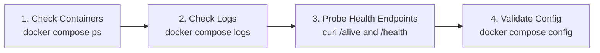

<!-- ABOUTME: Operator troubleshooting and recovery guidance for deployment and runtime failures. -->
<!-- ABOUTME: Explains readiness responses and optional email without exposing private diagnostics. -->

# Troubleshooting & Operational Health

This guide provides fast diagnostic procedures and step-by-step recovery recipes for common issues encountered during deployment, authentication, database migrations, and runtime operations.

---

## Quick Diagnostic Flow

When diagnosing an unexpected failure, follow this four-step sequence:



1. **Check Container Status**:
   ```bash
   docker compose ps
   ```
2. **Inspect Container Logs**:
   ```bash
   docker compose logs --tail=100 -f event-api
   docker compose logs --tail=100 -f event-ui
   docker compose logs --tail=100 -f keycloak
   ```
3. **Query Health Endpoints**:
   ```bash
   curl -i http://localhost:7039/alive
   curl -i http://localhost:7039/health
   ```
4. **Verify Configuration Syntax**:
   ```bash
   docker compose config --quiet
   ```

---

## Common Issues & Recovery Recipes

### Recipe 1: Keycloak "Invalid Parameter: redirect_uri" or Infinite Login Loop

#### Why this happens
Keycloak validates the redirect URI sent by the browser against its client whitelist. If your reverse proxy terminates TLS but does not forward `X-Forwarded-Proto: https` and `X-Forwarded-Host`, Keycloak believes the request came over unencrypted HTTP or an internal container IP and rejects the callback.

#### Step-by-Step Fix:
1. **Fix Reverse Proxy Headers**: Ensure your reverse proxy (Caddy, Traefik, or Nginx) forwards the client headers to Keycloak:
   - *Nginx*:
     ```nginx
     proxy_set_header Host $host;
     proxy_set_header X-Forwarded-For $proxy_add_x_forwarded_for;
     proxy_set_header X-Forwarded-Proto https;
     ```
   - *Caddy*:
     ```caddy
     reverse_proxy keycloak:8080 {
         header_up X-Forwarded-Proto {scheme}
         header_up X-Forwarded-Host {host}
     }
     ```
2. **Configure Keycloak Client Allowed URIs**:
   - Log into Keycloak Admin Console at `https://auth.example.org/admin`.
   - Navigate to **Clients** $\to$ **`event-blazor`**.
   - Under **Valid Redirect URIs**, enter: `https://events.example.org/*`
   - Under **Web Origins**, enter: `https://events.example.org`
   - Click **Save** and test logging in again.

---

### Recipe 2: API Fails at Startup with `Instance:OperatorIdentity Validation Failure`

#### Why this happens
In production (`ASPNETCORE_ENVIRONMENT=Production`), ISLAMU Event implements a fail-closed legal compliance check. An instance will refuse to open HTTP ports if the operator legal identity variables are blank.

#### Step-by-Step Fix:
1. Open your `.env` file.
2. Ensure the following six legal identity keys are populated with real values:
   ```env
   INSTANCE__OPERATORIDENTITY__OPERATORID=01912a7e-1234-7000-8000-000000000001
   INSTANCE__OPERATORIDENTITY__PUBLICNAME=Community Events Foundation
   INSTANCE__OPERATORIDENTITY__LEGALNAME=Community Events Foundation Non-Profit
   INSTANCE__OPERATORIDENTITY__PUBLICCONTACTEMAIL=contact@example.org
   INSTANCE__OPERATORIDENTITY__TERMSURL=https://events.example.org/terms
   INSTANCE__OPERATORIDENTITY__PRIVACYURL=https://events.example.org/privacy
   ```
3. Restart the stack:
   ```bash
   docker compose restart event-api
   ```

---

### Recipe 3: Headless Onboarding Fails with `GenerationDrift`

#### Why this happens
When using headless automated onboarding (`INSTANCE_BOOTSTRAP_MODE=ConfiguredAdministrator`), the platform guards against configuration replay attacks using a monotonic generation counter. If you edit bootstrap parameters without incrementing the generation counter, startup halts immediately.

#### Step-by-Step Fix:
1. Inspect the current generation number in `.env`:
   ```env
   INSTANCE_BOOTSTRAP_BINDING_GENERATION=1
   ```
2. Increment the value to a strictly higher integer (e.g., from `1` to `2`).
3. Confirm that `INSTANCE_BOOTSTRAP_ADMIN_SUBJECT` exactly matches the user's UUID (`sub` claim) from Keycloak.
4. Restart `event-api`:
   ```bash
   docker compose restart event-api
   ```

---

### Recipe 4: Database Migration Lock or Connection Refused

#### Why this happens
If `event-api` starts before PostgreSQL is ready or before `event-migrationservice` completes, the API may timeout or log database lock errors.

#### Step-by-Step Fix:
1. Check PostgreSQL container health:
   ```bash
   docker compose ps postgres
   docker compose logs --tail=50 postgres
   ```
2. Manually run the one-shot migration service and confirm it exits with code `0`:
   ```bash
   docker compose run --rm event-migrationservice
   ```
3. Once migrations succeed, start the API:
   ```bash
   docker compose up -d event-api event-ui
   ```

---

### Recipe 5: All Authenticated Actions Return `403 Forbidden` (Cerbos Fail-Closed)

#### Why this happens
When `AUTHORIZATION_PROVIDER=cerbos` is selected, ISLAMU Event enforces **fail-closed security**. If the Cerbos PDP container is unreachable, unhealthy, or has not loaded policies, all actions are denied immediately. It does not fall back to local RBAC.

#### Step-by-Step Fix:
1. Check Cerbos PDP health endpoint:
   ```bash
   curl http://localhost:3592/_cerbos/health
   ```
2. If Cerbos is running but policies are missing, upload policies via `cerbosctl`:
   ```bash
   docker run --rm -v "$PWD/cerbos/policies:/policies:ro" \
     ghcr.io/cerbos/cerbosctl:0.51.0 \
     --server=localhost:3593 --plaintext \
     put policy -R /policies
   ```
3. If Cerbos is experiencing an extended outage and you need immediate emergency access, switch to local RBAC in `.env`:
   ```env
   AUTHORIZATION_PROVIDER=local
   ```
   Then restart `event-api`:
   ```bash
   docker compose restart event-api
   ```

---

### Recipe 6: Lost Setup Secret Recovery

#### Why this happens
If you left `SETUP_SECRET=` blank in `.env`, the container generated an ephemeral single-use secret inside the volume upon first boot.

#### Step-by-Step Fix:
1. Copy the setup secret out of the container to your local terminal:
   ```bash
   docker compose exec event-api cat /app/data/setup-secret
   ```
2. Open `http://localhost:7002/setup` in your browser and paste the secret.
3. Once onboarding completes, the setup secret file is permanently deleted automatically.

---

### Recipe 7: Lost Instance Administrator Access

Use this break-glass procedure only when an existing platform account is
already linked to the exact AT Protocol DID that should regain instance
administration. It cannot create or link an account.

1. Back up the application database.
2. Stop API, UI, worker, and migration replicas while keeping the database
   reachable.
3. Check out the exact source revision deployed to the instance.
4. Export the same structured migrator secret authority used by the deployment.
   Do not place a connection string or password on the command line.
5. Run:
   ```bash
   dotnet run --file eng/tools/EmergencyAdminProvisioner.cs -- \
     --grant-did 'did:plc:replace-with-the-exact-linked-did' \
     --apply
   ```
6. Run the same command a second time. The expected result is
   `instance-administrator-recovery: already-present`.
7. Restart every replica, sign out, and sign in again so cached authority and
   session claims are refreshed.

Exit codes are `0` for granted/already present, `64` for invalid command input,
`65` for an unknown/ineligible DID, invalid role authority, or pending
migrations, `70` for configuration/database failure, and `130` for
operator cancellation.

The tool does not create users, resolve handles, modify onboarding state, grant
tenant authority, or contact a personal data server. Its output intentionally
contains no DID, user/tenant ID, database locator, secret, or exception text.
Production container images do not carry this source/SDK tool; run it from the
matching checkout on a trusted host with database access.

If the previous platform administrator is compromised, add `--reassign` to the
command. This verifies and grants the replacement first, then removes every
other platform-administrator grant in the same serializable transaction.
Without `--reassign`, the operation is additive.

---

## Health Check Endpoints Reference

The platform exposes standardized, sanitized health endpoints:

| Endpoint | Method | Purpose | Healthy Response |
|---|---|---|---|
| `/alive` | `GET` | **Liveness Probe**: Confirms the process is running. | `200 OK` with sanitized JSON status |
| `/health` | `GET` | **Readiness Probe**: Checks required infrastructure and reports optional-service health. | `200 OK` with sanitized JSON status |

Both `Healthy` and `Degraded` readiness return HTTP 200. `Unhealthy` returns HTTP 503. Inspect the individual checks to distinguish an optional email incident from a core dependency failure.

### Optional Email Readiness

| Situation | Health result | Operator action |
|---|---|---|
| Outbound email is disabled, including an unconfigured installation with delivery left off | `smtp` is `Healthy`; no SMTP connection is attempted | No mail server is needed for this readiness check. |
| Email is explicitly enabled, but configuration is incomplete, SMTP connection/authentication fails, or the network probe times out | `smtp` is `Degraded`; `/health` stays HTTP 200 if core checks are healthy | Check the instance's delivery setting, SMTP address, port, TLS mode, and credentials through the configured [secret authority](secrets.md). |
| Required configuration/secret authority, database access, or health-check composition fails | `Unhealthy`; `/health` returns HTTP 503 | Restore the failing core dependency. Optional email does not bypass these checks. |

The SMTP readiness probe and instance connection test use **instance SMTP settings**. They do not validate a tenant's separate mail server.

The `email-dispatch` check is `Healthy` when its worker is intentionally disabled. A selected but disabled scheduler is `Degraded`, while failures reading the dispatch database remain `Unhealthy`. HTTP 200 alone does not confirm that email can be delivered.

When delivery is disabled or its configuration is unavailable, optional notifications
are recorded as skipped rather than kept for a later flood of email. In-app delivery
continues. Required email can be parked while its delivery requirements are unavailable;
an operator hold is a separate reason and must not be released by restoring SMTP.
If a capability-held message offers a park action, using it places that message
under an explicit operator hold. Repeating the hold does not replace its original
reason or time. Follow the actions offered by the server; a message already being
sent cannot be taken back by parking it.
Do not assume that correcting SMTP has sent a parked message. Inspect its delivery
state, and never automatically replay a message whose acceptance is unknown. A send
already admitted before a policy change may still complete.

Old managed-administrator invitation messages are retired and always skipped,
including after email or administrator access is restored. Managed provisioning
now links an existing Local administrator instead of producing an invitation.
A skipped audit entry is not a sent email.

### Deliberately Disabling Email

Use the disable action advertised in the instance SMTP or current tenant email
settings. Tenant controls respect instance delegation and individual settings
locks. If no action is offered, changing a generic setting or resetting an override
does not bypass that restriction.

1. Request the disable preview and review its affected scopes and policy revision.
   Disabling instance delivery does not necessarily disable a tenant that uses its
   own independently enabled transport.
2. Type `DISABLE EMAIL DELIVERY` exactly and confirm before the preview expires.
   Cancelling leaves delivery unchanged. The confirmation expires after five
   minutes and is valid only for the administrator, scope and impact that produced it.
3. If policy, scope or administrator authority changes, obtain a new preview.
   A stale confirmation returns a conflict instead of silently applying different
   impact; do not automatically retry it.

Disable preserves SMTP configuration and locks, and takes effect at new send
admission. A send already admitted may still finish. Re-enabling delivery does not
replay skipped optional history or release operator holds and unknown outcomes.
Keep confirmation tokens out of logs and support tickets; the preview contains no
SMTP credentials or message content.

Example partial response when outbound email is disabled and core checks are healthy (other checks omitted):

```json
{
  "status": "Healthy",
  "message": "Ok",
  "totalDuration": 18,
  "checks": [
    {
      "name": "smtp",
      "status": "Healthy",
      "description": "smtp_disabled",
      "duration": 1,
      "data": { "enabled": false, "state": "Disabled" }
    }
  ]
}
```

*Note: Health responses never disclose passwords, connection strings, or PII.*

### AT Protocol readiness recovery

Inspect the `atproto-authentication` entry on the browser-facing host's
`/health` response. Disabled AT Protocol is healthy. A failed AT Protocol
primary is unhealthy (`503`); a failed optional AT Protocol login with an
explicit Local Identity or Keycloak primary is degraded (`200`). That optional
failure does not itself take the host out of service, although other checks
can still fail. `/alive` does not depend on the AT Protocol store probe.

1. For `state_store_unavailable`, restore the private API connection, primary
   database availability/current migrations, and shared OAuth signing keys.
   Do not expose or copy key values, assertions, callbacks, or database rows
   into a support report.
2. Wait more than ten seconds for the cached readiness result to expire and
   request `/health` again. The probe has a two-second deadline, uses random
   non-secret data, and does not automatically retry or hedge requests.
3. Start a new login from the handle form. Do not retry an old callback or
   consume request after a lost response. A healthy store probe does not
   guarantee a user's external PDS or discovery service is available.
4. If expired rows accumulate, confirm the global scheduler is enabled and
   `atproto-transient-cleanup` is running every minute. It remains needed when
   login is disabled. Monitor its fixed success/failure and completed-row
   counters; never extend expiry to recover an old login.

See [AT Protocol readiness, cleanup, and retention](../federation-and-open-protocols/at-protocol-and-bluesky-jetstream.md#readiness-cleanup-and-retention)
for cleanup limits, shared protection-key persistence, and backup-retention
boundaries.

---

## Related Guides & Next Steps

* **[Environment Variables Reference](environment-variables.md)** — Fix missing legal identity keys or secret provider errors.
* **[Docker Compose Runbook](../self-hosting/docker-compose.md)** — Production container restart and migration lifecycle.
* **[Keycloak Authentication](../security-and-identity/authentication.md)** — Configure reverse-proxy redirect URIs and client origins.
* **[Authorization Guide](../security-and-identity/authorization.md)** — Understand Cerbos fail-closed behavior vs. Local RBAC.
* **[First-Run Administration Guide](../administration-and-branding/admin-guide.md)** — Complete initial setup wizard with the recovered setup secret.
