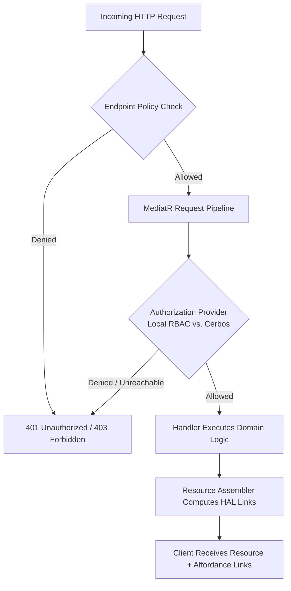

# Authorization & Access Control

Authorization in ISLAMU Event determines *what* an authenticated identity is permitted to do. The platform provides a runtime choice between **Local Database-Backed RBAC** and an external **Cerbos Policy Decision Point (PDP)**.

---

## Authorization Pipeline Flow

Every mutation and sensitive query passes through a multi-stage, fail-closed authorization pipeline before reaching business logic:



1. **Endpoint Boundary**: Broad policy checks verify caller identity and minimum claims.
2. **MediatR Pipeline**: The request evaluates the caller, tenant context, resource state, and requested action against policy rules.
3. **Execution Gate**: Handlers only execute if authorization explicitly returns `Allow`.
4. **HATEOAS Affordance Gating**: The response dynamically attaches allowed actions in HAL `_links` (e.g., `_links.edit`, `_links.refund`). The client renders UI buttons strictly based on the presence of these links.

---

## Choosing Your Authorization Provider

| Decision Factor | Local RBAC (`AUTHORIZATION_PROVIDER=local`) | Cerbos PDP (`AUTHORIZATION_PROVIDER=cerbos`) |
|---|---|---|
| **Ideal For** | Single-tenant communities, standard organizations, minimal resource footprint | Enterprise operators, dynamic policy authoring, audit-heavy deployments |
| **Infrastructure** | **Zero extra containers**; runs in-process using primary database | Dedicated Cerbos container or external PDP cluster over gRPC |
| **Latency** | Database-query latency; one authority profile per optimized batch | 1–3 ms network round-trip via HTTP/2 cleartext (`h2c`) |
| **Policy Updates** | Governed via software releases and database migrations | Decoupled policy file uploads via `cerbosctl` without rebuilding the app |
| **Failure Mode** | Database down = app down | PDP down = **fails closed** (access strictly denied; no silent fallback) |

> [!TIP]
> **Our Recommendation:**
> - **We recommend Local RBAC** for the vast majority of self-hosters. It has zero external dependencies, minimal RAM overhead, and satisfies standard community and multi-tenant security boundaries out of the box.
> - **We recommend Cerbos** if you have dedicated security teams who write and version YAML policies independently of application code, or need centralized authorization across multiple external systems.

---

## Local RBAC Overview

When `AUTHORIZATION_PROVIDER=local` is set:
- Evaluates permissions against user roles (`InstanceAdmin`, `TenantAdmin`, `OrganizationOwner`, `Member`, `Attendee`).
- Automatically enforces multi-tenant boundaries via EF Core global query filters.
- Requires no external policy service or gRPC configuration; authority reads use the primary database.

### Tenant administrator membership eligibility

When tenant administrator authority is resolved, suspended, banned, removed, or deleted memberships do not contribute administrator tenant IDs, even if an unrevoked role grant remains in inventory. This applies to Cerbos principals, user-owned API-key authority, and administrator UI authority responses. Other tenants' active memberships remain independent. Grant inventory and tenant lifecycle behavior are unchanged; no database migration or configuration change is required. Eligibility is separate from the next-request freshness guarantee below.

### Administrator role changes take effect on the next request

After a role grant or revocation commits, new API requests read current administrator
authority from the database, even when the caller's authentication claims are unchanged.
No cache flush or sign-in refresh is required. This applies to Local RBAC and the
administrator attributes sent to Cerbos, across nodes reading the same authoritative
database and for changes committed by external administration tools.

Requests or database snapshots already in progress may finish using their earlier
view. Independent databases or lagging read replicas are not covered by this guarantee.
Browser display claims can still lag; server-issued HAL links and server authorization
remain the action boundary. Existing role permissions and tenant isolation are unchanged.
The development-only administrator cache-invalidation endpoint is removed; the identity
snapshot diagnostic remains available. No database migration or new configuration is required.

### SQLite event-role permissions

SQLite deployments support the same persisted event-role permissions as other primary database providers. The event-role permission lookup uses a portable query, restoring authorized session-language writes and their HAL edit links where SQLite previously reported an unsupported SQL APPLY operation. Tenant boundaries, active assignment periods, permission checks and machine-account restrictions are unchanged; this does not grant new access. Upgrade the application normally: no database migration, configuration change or policy republishing is required. Continue using server-issued HAL links rather than inferring actions from a role name.

### Organization evidence actions

Organization administrators can submit and view their organization's legitimacy evidence. Tenant administrators can view and review evidence in their tenant; tenant administration alone does not grant submission, and organization administration alone does not grant review. Accounts with both roles can perform both actions. With Local RBAC, these permission decisions remain the same whether checked individually or together when building HAL links. Clients must continue using server-issued links rather than inferring authority from roles.

---

## Cerbos PDP Overview

When `AUTHORIZATION_PROVIDER=cerbos` is set:
- Evaluates policies via high-performance gRPC requests to Cerbos port `3593`.
- Requires Cerbos policies and schemas to be uploaded via `cerbosctl` (see [Coolify with Cerbos & Traefik](../self-hosting/coolify-cerbos-traefik.md)).
- **Fail-Closed Guarantee**: If Cerbos becomes unreachable or returns an error, ISLAMU Event denies access immediately. It will **never** silently fall back to local RBAC, preventing accidental security elevation during infrastructure outages.

---

## The Golden Rule of Client UI Affordances

> [!IMPORTANT]
> **Never Check Roles in Frontend Code!**  
> Clients (Blazor WebAssembly or third-party mobile apps) must never inspect user roles or JWT claims to decide whether to show an "Edit", "Delete", or "Refund" button.
> 
> The UI checks **only** if the action link exists in the server's response:
> ```csharp
> @if (Model.Links.ContainsKey("edit"))
> {
>     <MudButton Href="@Model.Links["edit"].Href">Edit Event</MudButton>
> }
> ```
> If an event is locked, past due, or the user lacks permission, the server omits the link and the button disappears automatically.

---

## Related Guides & Next Steps

* **[Authentication Architecture](authentication.md)** — Understand how Keycloak tokens and BFF sessions validate identity.
* **[Coolify with Cerbos & Traefik](../self-hosting/coolify-cerbos-traefik.md)** — Production deployment of the Cerbos PDP.
* **[Admin Hierarchy & Roles](../administration-and-branding/admin-hierarchy.md)** — Review permission sets across Instance, Tenant, and Event scopes.
* **[Troubleshooting Cerbos Denials](../configuration-and-operations/troubleshooting-and-health.md#recipe-5-all-authenticated-actions-return-403-forbidden-cerbos-fail-closed)** — Diagnose policy missing errors or gRPC network timeouts.
