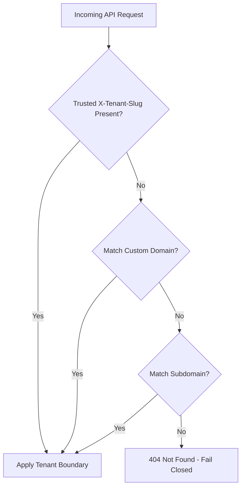

# Multi-Tenancy Architecture

ISLAMU Event defaults to single-tenant operation. To operate multiple independent community centers or organizational chapters from a single deployment, set `DEPLOYMENT_MODE=multi_tenant` in your environment (see [Environment Variables Reference](../configuration-and-operations/environment-variables.md#1-core-deployment--networking)) before initial onboarding.

---

## Default Browser Tenant URLs

Browser navigation uses a root tenant slug by default:

```text
https://events.example.org/al-nour/events
                           └────── tenant slug
```

The BFF resolves `al-nour`, treats `/al-nour` as the tenant base path, and
continues routing `/events`. Calls from the BFF to the API carry the resolved
tenant as a trusted `X-Tenant-Slug` header. The browser does not need to create or
manage this header, and a browser-supplied value is stripped at the BFF boundary.

This default works on one ordinary deployment hostname and certificate. It does
not require wildcard DNS or wildcard TLS. An operator may configure a nonempty
path prefix, such as `/communities`, to publish
`/communities/{slug}` instead. Nonempty prefixes are supported configuration,
not legacy compatibility aliases.

---

## API Tenant Resolution Hierarchy

After BFF path translation, multi-tenant API requests resolve tenant context
through this strict, fail-closed sequence:



1. **Trusted BFF Tenant Context**: `X-Tenant-Slug` is created from server-resolved
   browser route context (see [Architecture & Request Flows](../getting-started/architecture-and-request-flows.md#1-browser-request-flow)).
2. **Custom Domain Matching**: Resolves a tenant mapped to the request host (see
   [Custom Domains & SEO](../administration-and-branding/custom-domains-and-seo.md)).
3. **Subdomain Matching**: Maps `tenant.events.example.org` to the registered
   tenant identifier when subdomain routing is configured.
4. **Fail Closed**: If no tenant matches, the API returns `404 Not Found`. An
   unknown host never falls back to an arbitrary tenant.

Instance-management routes are explicitly tenant-exempt; they are not another
fallback in this tenant-resolution chain.

---

## Reserved Tenant Slugs

Root routing shares a namespace with application and infrastructure paths.
Tenant creation and slug changes therefore reject reserved names
case-insensitively. The protected catalog covers:

* application roots such as `admin`, `events`, `login`, and `onboarding`;
* framework and API roots such as `_blazor`, `_framework`, `api`, and `mcp`;
* authentication callbacks, health/metrics endpoints, and static-asset roots;
* governed names such as `official`, `security`, `system`, and `islamu`.

Slugs must be at least three characters and use lowercase letters and numbers,
with single hyphens only between segments. Choose a stable community identifier
such as `al-nour` rather than a system path or an identity-implying name.

---

## Database & Query Filter Isolation

Every multi-tenant entity implements `ITenantScoped`. EF Core applies global query filters automatically:
* If ambient tenant context is absent, queries evaluate to `false` and return empty sets rather than leaking cross-tenant data.
* System workers and background dispatchers must explicitly opt into cross-tenant processing using bounded tenant predicates.

---

## Governance & Settings Cascade

Settings flow downward through a five-tier hierarchy:
$$\text{Instance} \longrightarrow \text{Tenant} \longrightarrow \text{Organization} \longrightarrow \text{Group} \longrightarrow \text{User}$$

Instance administrators can lock specific governance properties (such as footer links, legal notices, or payment gateways) to prevent tenants from modifying them (see [White-Labeling & Branding](../administration-and-branding/white-labeling.md)).

---

## Acceptance Testing

1. Configure at least two test tenants, such as `tenant-a` and `tenant-b`.
2. Visit `/tenant-a/events` and `/tenant-b/events` on the same deployment host and
   verify each request stays in its tenant.
3. Confirm a reserved application path such as `/login` is not interpreted as a
   tenant and that creating a tenant with slug `login` is rejected.
4. Verify that creating an event under Tenant A is invisible to attendees on Tenant B.
5. For enabled host routing, access an unmapped hostname and confirm the API
   returns `404 Not Found` rather than selecting a default tenant.
6. Verify that background outbox workers process messages with the correct tenant context.

---

## Related Guides & Next Steps

* **[Custom Domains & SEO](../administration-and-branding/custom-domains-and-seo.md)** — Bind custom vanity domains to individual tenants.
* **[White-Labeling & Branding](../administration-and-branding/white-labeling.md)** — Configure tenant-specific logos, themes, and CSS tokens.
* **[Admin Hierarchy & Scopes](../administration-and-branding/admin-hierarchy.md)** — Understand permissions for Instance Admins vs. Tenant Admins.
* **[Deployment Tiers & Sizing](../self-hosting/deployment-tiers.md)** — Review hardware requirements for multi-tenant deployments.
