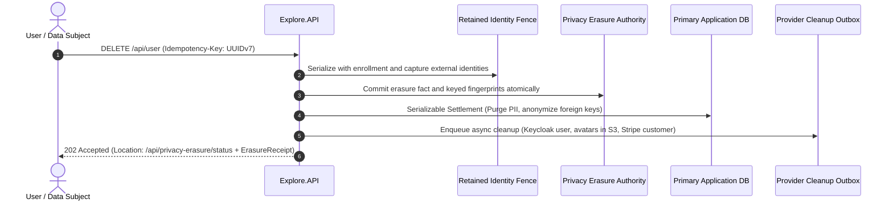

# Privacy Erasure & GDPR Compliance

Under data privacy regulations such as the GDPR, when an attendee or user requests account deletion, the platform must guarantee that their personal identifiable information (PII) is completely destroyed and **cannot be accidentally resurrected** by database restore operations or distributed retries.

ISLAMU Event implements an **Authority-First, Anti-Resurrection Architecture** to enforce this guarantee.

---

## The Anti-Resurrection Workflow

The erasure process follows a strict sequence to prevent data leaks or partial deletions:

1. **Anti-Resurrection Fence**: An authority database transaction orders enrollment against erasure capture. A retained keyed fingerprint prevents the same external identity from enrolling under a fresh User UUID after its binding has been removed.
2. **Authority Fact**: The erasure event is recorded in a dedicated, isolated authority store *before* local data disposal begins.
3. **Serializable Settlement**: In one atomic transaction, the user’s personal data is scrubbed, registrations are anonymized, and foreign keys are safely unlinked.
4. **Asynchronous External Cleanup**: Background outbox workers delete the user from Keycloak, purge media from S3/local storage, and notify external payment gateways.
5. **Single-Use Receipt**: The user receives a `202 Accepted` response with an opaque `ErasureReceipt` capability token. The receipt can be used to query `/api/privacy-erasure/status` until completion, after which all trace of the receipt is destroyed.

---

## Verified Identity Addresses

Account erasure removes the account's verified identity address claims and all
associated verification proofs, including proofs already invalidated. These
are removed before the sign-in bindings and profile PII in the same local
transaction. Another account's claims and proofs are unaffected; no address or
verification history is copied into the retained erasure authority.

A failed local purge remains fenced and can be replayed. When a primary
database backup restores these records, startup replay purges them again before
traffic is admitted, provided the retained authority is preserved independently.
Releasing an address claim does not lift the erased account's anti-resurrection
fence or authorize a delayed synchronization to recreate its personal data.

## External Identity Retention And Key Provisioning

Deleting an account retains a minimal keyed fingerprint of each external sign-in
identity for the existing erasure-authority retention period. The index contains
no email, plaintext issuer/subject or DID. It is still pseudonymous privacy
evidence, not anonymous data. A delayed sign-in cannot automatically create a new
account with the same identity during retention. Explicit reenrollment is not
available.

Before starting the API, provision `PRIVACY_ERASURE_IDENTITY_FENCE_KEY` with
32 securely generated random bytes encoded as base64, and assign the nonsecret
`PRIVACY_ERASURE_IDENTITY_FENCE_KEY_ID`. Store the secret in your explicitly
selected Infisical authority (`/privacy`) or injected environment. Explicit shared
.NET User Secrets are supported only in Development/Testing. Do not put the key
in application settings, source control, backup manifests or support logs.

Use the same key and ID on every replica and retain them securely alongside the
recovery procedure for every supported authority backup. A missing or mismatched
key blocks readiness and external enrollment; there is no fallback. Live rotation
is unsupported. Back up the authority counter, retained intents and identity index
as one unit, independently of a primary-only restore. Startup re-erases matching
restored bindings before serving traffic, including when a restored account has a
different User UUID or legal-hold audit identifiers have been pseudonymized.

Compaction uses the existing maximum backup horizon plus safety margin. A held
fact keeps its fingerprint until the hold is released and the fact is compacted.
This is not a separate indefinite raw-identifier catalogue.

## Choosing an Authority Storage Topology

The Privacy Erasure Authority store must be configured in your environment via `PRIVACY_ERASURE__AUTHORITY__TOPOLOGY`:

| Topology | Storage Mechanism | Best Fit | Primary Constraint |
|---|---|---|---|
| **`EmbeddedSqlite`** | Dedicated SQLite database at `/app/data/privacy_erasure_authority.db` | Single-server Compose and Standalone | Single API container writer; requires volume persistence |
| **`CoLocated`** | Shared table schema within primary PostgreSQL DB | Minimal dev environments | No independent protection if primary DB is restored from stale backup |
| **`ExternalDatabase`** | Completely isolated external PostgreSQL instance | High-availability enterprise clusters | Requires managing a secondary PostgreSQL database |

> [!TIP]
> **Our Recommendation:**
> - **We recommend `EmbeddedSqlite`** for standard self-hosters. It runs with zero operational overhead, uses dedicated storage, and guarantees that even if your primary PostgreSQL database is restored to a state from last week, the SQLite erasure store will prevent previously deleted users from being resurrected!
> - **We recommend `ExternalDatabase`** only for enterprise multi-node clusters running multiple API replicas that cannot share a local SQLite file.

---

## The Golden Rule of Disaster Recovery

> [!CAUTION]
> **Never Restore the Primary Database Without the Erasure Store!**  
> If you restore an older database snapshot (e.g., from 3 days ago) to recover from corruption, any user who requested account deletion yesterday would normally be restored ("resurrected") into the database.
> 
> When ISLAMU Event starts, the **`PrivacyErasureStartupGate`** automatically replays all facts from the Privacy Erasure Authority against the application database before HTTP traffic is allowed. If an erased user is found in the restored database, the gate immediately re-purges their records and re-establishes the anti-resurrection fence!

---

## Related Guides & Next Steps

* **[Backup, Restore & Upgrade](../configuration-and-operations/backup-restore-upgrade.md)** — Production backup scripts and disaster recovery rehearsals.
* **[Docker Standalone Runbook](../self-hosting/docker-standalone.md)** — Operate the embedded SQLite erasure authority on a single server.
* **[Environment Variables Reference](../configuration-and-operations/environment-variables.md#7-privacy-erasure-authority-gdpr--anti-resurrection)** — Configure erasure topology and busy timeout dials.
* **[Custom Properties Governance](../events-and-ticketing/custom-properties.md)** — Learn how long-tail attendee answers are scrubbed during account deletion.
