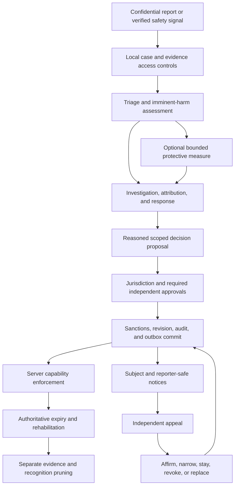

# I-VSD Architectural Consultation: Cross-Solution Moderation, Scoped Sanctions, Due Process, and Identity Continuity

Last Updated: 2026-10-07 Europe/Brussels

## Review Metadata

- Mode: standalone
- Subject: Banning system and moderation identity fence across ISLAMU Solutions
- Workstream: none; no moderation implementation plan/context/tasks triad was supplied or found
- Report kind: architectural-consultation
- Report status: current
- Disposition: ready-for-planning
- Report revision: `R7-2026-10-07`
- Evidence cutoff: 2026-10-07
- Reviewed input: trust/youth input Git blob `ab9df80debaf5a297a2d9a67e3c3e2ab12e642f6`; scenario input blob `4b7e4d362a6b5d39d5258e293d1de0579299536f`; experience input blob `9fdf90e475464c3f9b10cd691f9828fc493d99515f`; contestability input blob `623ce9aa23a94fed64d9c580720a77b74c99515f`; customization input blob `cf8a38cda54dd193dced37b57d0cd45b1088e804`; original redesign input blob `a07f719876bce0f9ff5d8c0cf7a5b318f13dee61`; trust evidence HEAD `8633a693a290afb388805616e4f893d189100c44`, with unrelated concurrent changes excluded
- Supersedes: `R6-2026-10-07` of this same consultation; adds communication, deceptive-content and child/age protection without replacing prior scenario contracts
- CTO review: architectural refinements applied; implementation readiness remains unapproved
- I-VSD alignment: current for this consultation revision; not `plan-aligned` with an implementation triad
- User approval: authorizes consultation redesign, not implementation, operational activation, legal conclusions, or religious rulings
- Research methods: bounded repository inspection, attempted main-session graph/Context7/Tavily calls, delegated Tavily primary-source research, and native official-documentation fallback; earlier verified Context7 evidence retained

## Executive Summary

ISLAMU needs a moderation capability that protects people across its participating solutions without turning every community dispute into exclusion from every product. An identity-wide ban, an Event-only ban, an instance suspension, a community restriction, and a prohibition on sending messages are different decisions. They need different issuing authorities, evidence, remedies, enforcement points, and retention rules. Two ban counters and a recognition hash cannot represent this system.

The recommended product is **one reusable moderation domain and application engine, embedded by default in each solution, with an optional remotely hosted authority using the same engine**. The embedded deployment MUST provide full local reporting, investigation, sanctions, appeals, identity continuity, audit, and recovery in a locally runnable single binary. It MUST NOT require Keycloak, Cerbos, Coop, Osprey, Infisical, Redis, a message broker, or a separate moderation process. Existing approved local authentication, authorization, secret-authority, and storage choices still apply. Remote hosting changes transport, authority ownership, and availability requirements; it does not create a second implementation of the rules.

Cross-software moderation operates inside an **explicit trust domain**: a named set of operators and installations that accept a documented moderation constitution and identity-mapping contract. Official ISLAMU-operated products can participate in one such domain. Independently operated installations do not join merely because they run ISLAMU software, authenticate through the same identity provider, or recognize the same DID. This distinction prevents a central service, compromised provider, or tenant moderator from acquiring undeclared authority over unrelated communities.

Every sanction names its subject, issuing authority, scope, restricted capabilities, effective interval, rule version, evidence basis, decision revision, review deadline, and appeal route. Scope and severity are independent. A serious Event-only upload ban does not necessarily restrict another solution. An identity-wide restriction can prohibit messaging while preserving reading, appeals, data requests, and eligible transactions. An organization suspension is not automatically a ban on every member.

The primary differentiator should be **precise protection with explainable, reversible enforcement**: reliable action restrictions; confidential reporting; trained review; independent appeals; local autonomy within a published safety floor; accessible recovery; transparent incident and appeal status; and corrections that reach every enrolled recipient. AI and external queues can assist review, but cannot silently become sanction authorities. Broad permanent exclusions require stronger evidence and approval than narrow temporary interventions.

The system must also serve **both configuration extremes as first-class products**. A small self-hoster starts with a complete, curated local policy and a simple administration view, not an empty policy designer. A large ISLAMU-operated platform can configure its reason taxonomy, sanction templates, graduated responses, review queues, approval matrices, language variants, delegated community policies, retention, and fairness controls. Advanced mode exposes the same engine's configuration; it does not switch to a separate product, remove safeguards, or require remote hosting.

Moderation configuration is a governed control plane: scalar settings use the existing hierarchical settings conventions; rich policies and catalogues use typed, versioned definitions; the Administration Console, native commands, configuration manifests, and tenant configuration packages share the same validation and coordinated mutation authority. Portable configuration contains no subjects, cases, sanctions, credentials, endpoint bindings, or adjudicator privileges. Importing a policy never grants permission to issue it. Recommendation 15 defines this contract, including progressive disclosure, catalogue lifecycles, preview/diff/approval, staged activation, extensions, and fairness.

**Contestability is a first-class subsystem, not an appeal link added after banning.** It provides specific notice, an opportunity to respond, independent human review, meaningful explanations, safe correction of false data, an accountable remedy, and appropriate external redress. Existing banned accounts still authenticate and perform their permitted restricted actions. Support staff can initiate and execute authorized, revision-bound sanction corrections through the same native commands and Administration Console; they never edit database rows or trust an email sender as proof of identity.

A committed ban creates a durable subject notice and eligible email delivery describing the restriction and how to contest it. A committed contestation creates acknowledgement plus a durable alert for the authorized reviewing administrators, including an email delivery channel. Email is a sibling of the durable in-app/portal notice, not the authority for the sanction or its reversal. Failure, missing verified address, unsafe recipient, disabled delivery, or uncertain provider acceptance remains visible without blocking meaningful contestation or pretending a message was read. Recommendation 16 specifies these workflows and their anti-abuse boundaries.

The restricted experience must tell a person **why, where, for how long, what changed, what still works, and what happens to their existing events and bookings**. Moderators select curated reasons, corroborated facts and appropriate templates; a generated, previewed notice supplies meaningful explanation without a compulsory blank essay. Additional subject explanation and private reviewer notes are separate, optional fields except where an unusual decision genuinely needs information the structured form cannot express.

Event consequences are not one automatic cascade. Public browsing, new registration, existing admission, organizer management, speaker/session reading, private-location disclosure, and refund/support duties are separate capabilities. Recommendation 17 defines impact-aware decisions, continuity handoff, tightly scoped read access, participant-level safety restrictions, and derivatives such as tickets, maps, calendars, queued notices and offline door lists. A digital ban is not automatically authority to exclude someone from every physical venue; a physically unsafe participant must not retain private venue details merely because an old registration row remains.

**Every actual restriction comes from an approved configuration profile, not a universal “ban level” switch.** Infraction class, assessed severity, response grade, scope, duration, executable effects and consequence recipe are separate values. A higher messaging response can last longer or cover more authorized messaging targets; it does not acquire event exclusion, venue secrecy or organizer removal merely because its level increased. Combined effects require separate supported grounds and jurisdiction.

Recommendation 18 supplies a concrete proposed reference pack: five response grades, 20 named scenarios and ten complete consequence bundles. Each defines what happens to publication, management, resources, new/existing admission, private information, orders/capacity, notices and restoration. Operators can adopt or change supported profiles through the governed settings/catalogue/manifest lifecycle, from a small manual local setup to ISLAMU's richer deployment. These are proposed defaults, not silently approved live policy.

The trust/youth addon in section 24 contributes 13 additional profiles and four complete strategies: 33 named profiles and 14 base/additive consequence strategies in total. Its age/quota/definition guards are explicitly distinguished from punitive account sanctions.

Attendee misconduct is a separate typed report/incident workflow in recommendation 19. The organizer can report a qualified event participant without acquiring authority to blacklist them globally. A report is not a finding; emergency protection, final event exclusion, community attendance restriction and cross-solution action have different proof and approval requirements. Organizer retaliation, mistaken guest identity, copied reports and forged “instance” provider scope are explicitly rejected.

**Trust also requires protection before a sanction exists.** Participant chat needs current membership, purpose, contact consent and child-safe routing; local spam/bot controls must work without Coop/Osprey. Approval of an organizer or event version cannot authorize a later phishing form, hidden financial promotion or substituted destination. Typed storage/encryption of a form answer does not make collecting an account password or wallet secret legitimate.

The ISLAMU profile expressly requires correctly classified debate content to be unavailable to under-18 and unresolved-age audiences. This is an operator safeguarding policy, not a universal legal/religious conclusion or a judgment about users' beliefs. Classification is independent of event format, applies through direct/API/cache/notification/resource/registration paths, and survives a publisher changing the visible category name. Organizer guidance, protective reclassification and fair confirmed-violation escalation complement platform responsibility.

ISLAMU's requested birth-date collection is a new private identity-data requirement. A declared birthday does not prove age, and a visitor without qualified age evidence is not assumed adult. The report specifies protected age eligibility, proportional assurance, correction and privacy gates; it does not recommend universal ID collection or religion inference. A centralized nonprofit can adopt stronger reviewed defaults than a small host while keeping the same local engine, protected floors and truthful limits.

Perfect detection, age verification and physical protection cannot be guaranteed against false declarations, hidden/off-platform conduct or already distributed data. The delivered contract is measurable layered prevention, staffed review, fair remedy, privacy and accountable operations—not a claim that an AI score, badge, or nonprofit status eliminates risk.

The 2026-10-05 report also contained technical and ethical errors. Raw delimiter concatenation is not collision-safe serialization. OIDC issuer/subject values cannot be indiscriminately lowercased. A movable AT Protocol PDS is not the stable account identity. Verified email does not prove one human identity. HMAC data is not automatically anonymous. A database transaction does not atomically update unrelated databases and remote services. Banning someone does not justify automatically wiping all their content. These claims are corrected below.

This is a comprehensive architecture and provider-responsibility specification, not proof of a perfect implementation. Disconnected applications cannot instantly learn a new remote ban; downloaded content cannot be recalled; distinct unlinked identities remain an accepted recognition limit. The report defines observable correctness, operational gates, and explicit consistency choices instead of promising impossible guarantees. `ready-for-planning` permits a repository-grounded implementation plan; it does not authorize a production rollout or claim that banning is already implemented.

## Scope

### Included

- Identity-wide, solution/project, deployment-instance, tenant, organization/group, resource, and action-specific sanctions.
- Human users, delegated/service principals, organizational actors, and content/resource subjects, without conflating their responsibilities.
- Reporting, protective intervention, investigation, adjudication, appeal, expiry, rehabilitation, correction, and oversight.
- Cross-solution identity mapping, trust enrollment, recipient qualification, revocation, reconciliation, and departure.
- Embedded single-binary and optional remote-authority deployment bindings with shared policy semantics.
- API, native operations, BFF, SignalR, MCP, machine credentials, queued work, and external side-effect enforcement.
- Active-ban deletion continuity, ordinary fresh registration, pseudonymous recognition, retention, key rotation, and restore protection.
- Clean Architecture, native CQS, HAL, portable persistence, transactional outbox/inbox, accessibility, localization, operator recovery, and measurable release gates.
- Highly configurable moderation settings, portable typed policy/catalogue manifests, administrative editing, simple/advanced presets, delegated customization, reviewed extensions, and configuration fairness.
- Procedural fairness, contestability, human/algorithmic recourse, support-assisted authorized unbanning, restricted-account recovery actions, and durable subject/admin email notifications.
- Clear restricted-account experience, guided moderator reason composition, organizer/event continuity, speaker/session-resource accommodations, participant-level physical safety and coordinated location/admission disclosure.
- Complete configurable scenario/effect/consequence contracts and participant-misconduct intake with separate reporting, protective, adjudication and cross-scope powers.
- Human/event/team chat and comments; provider-free spam/bot controls; deceptive events/links/forms; protected DOB/age assurance; audience-sensitive classification and graduated publication enforcement.
- Islamic value-sensitive analysis of provider responsibility across UX, architecture, governance, support, operations, and data sharing.

### Not established by this consultation

No code, generated migrations, authentication authority, shared identity service, microservice, policy engine, or deployment packaging is implemented here. No existing plan is approved or silently broadened. Religious rulings, statutory applicability, retention terms, staffing capacity, identity-proofing requirements, and actual performance remain subject to the named validation gates.

The consultation preserves the full cross-solution vision. Later implementation MUST split risk into reviewable PRs, not shrink this vision to an Event-only fence. Required dependent slices belong in one coherent plan, not scattered mandatory backlog fragments or competing active triads.

## Claim Boundary

Selected Islamic values guide provider-controlled decisions. They do not certify outcomes or supply binding religious-legal conclusions. The previous report's categorical `HARAM`/`Wajib` labels and universal legal-compliance assertions are withdrawn. Qualified Sunni scholars own contested religious determinations; deployment-specific counsel owns legal applicability and lawful processing assessments.

Standards and industry guidance provide functional constraints, not a complete moderation constitution. Santa Clara Principles are voluntary guidance. GDPR, DSA, and the ICO Children's Code have deployment-dependent applicability. An erasure exception for legal claims is not blanket authorization to retain all sanction histories forever.

Evidence levels below distinguish **source-inspected reality**, **primary-document facts**, **proposed design**, and **unvalidated outcomes**. Neither a current report nor an architectural score is runtime, adversarial, stakeholder, or operational proof.

## Source-Grounded Current State

### Verified repository reality

| Evidence | What was inspected | Supported conclusion |
| --- | --- | --- |
| `E01` | [Account moderation roadmap](../../dev/next/account-moderation-retention.md) | Future requirements distinguish ordinary erasure, restricted existing accounts, and rejection before provisioning after active-ban deletion. Capture is not authorized merely for warnings or past bans. |
| `E02` | [Public erasure guide](../../docs/public/documentation/readme/security-and-identity/privacy-erasure.md), fresh registration and reserved-key sections | Moderation recognition is a future lifecycle. Reserved keys are optional for ordinary erasure/enrollment. Live rotation is not implemented. |
| `E03` | [Coop and Osprey guide](../../docs/public/documentation/readme/integrations-and-ai/coop-and-osprey.md) | External queues/signals do not replace local policy, enforcement decisions, or authoritative database state. |
| `E04` | [UserExternalLogin](../../src/Explore.Domain/UserExternalLogin.cs) and [AuthenticationProviderKind](../../src/Explore.Domain/Enums/AuthenticationProviderKind.cs) | Existing bindings are application-user/provider records. The enum includes Development; it is not proof of a portable global human identity. |
| `E05` | [Existing identity-fence repository](../../src/Explore.Persistence/Privacy/ErasureAuthority/ProviderPrimitives/EfCorePrivacyErasureAuthorityRepository.IdentityFence.cs), identity gate/find/subject methods | A provider-specific serialized identity gate and erasure facts exist. Their names do not establish the proposed moderation ledger or cross-solution authority. |
| `E06` | [PrivacyErasureApplier](../../src/Explore.Application/Services/PrivacyErasureApplier.cs), local application sequence | Current erasure hard-deletes some PII/tokens, tombstones actors, soft-deletes the user, records coverage, and queues provider/cache work. It is not a universal cascade that physically deletes every account-related row. |
| `E07` | [OspreyModerationSignalProvider](../../src/Explore.Infrastructure/Services/Moderation/OspreyModerationSignalProvider.cs), evaluation entrypoint | Advisory evaluation adapter exists with HTTP/gRPC selection. Inspection was bounded; it is not proof that all callback/enforcement paths are safe. |
| `E08` | [CoopReviewQueueProvider](../../src/Explore.Infrastructure/Services/Moderation/Coop/CoopReviewQueueProvider.cs), mirroring entrypoint | Queue mirroring is an existing integration seam, not a sanction authority. |
| `E09` | [TenantDelegationSettingDefinitions](../../src/Explore.Domain/Settings/Definitions/TenantDelegationSettingDefinitions.cs) | Instance-level reporting-provider delegation locks exist. The proposed moderation-policy lock is not an implemented setting. |
| `E10` | [GovernanceSettingKeys](../../src/Explore.Domain/Constants/GovernanceSettingKeys.cs), bounded settings inventory; [Quick Reference](../../docs/internal/QUICK_REFERENCE.md) | Existing governance has explicit setting families and a five-tier cascade. Moderation jurisdiction cannot be inferred from a setting override alone. |
| `E11` | [EventReportProviderEnvelope](../../src/Explore.Application/Features/EventReporting/Models/EventReportProviderEnvelope.cs) and [ReviewCaseEnvelope](../../src/Explore.Application/Features/EventReporting/Models/ReviewCaseEnvelope.cs) | Both carry tenant/case/scope/idempotency metadata. The proposed `AuthorReputationSnapshot` is absent from these inspected contracts. |
| `E12` | [ActorModerationRecord](../../src/Explore.Domain/ActorModerationRecord.cs) | An actor/action/reason/time/decision-maker record exists; this shape is not the comprehensive scope, expiry, appeal, and capability model proposed here. |
| `E13` | [global.json](../../global.json), [PROJECTS.md](../../PROJECTS.md), [AGENTS.md](../../AGENTS.md) | SDK is pinned to 10.0.302; native CQS, HAL, generated artifacts, targeted verification, and embedded-first requirements constrain delivery. |
| `E14` | [SettingDefinition](../../src/Explore.Domain/Settings/SettingDefinition.cs) | Definitions declare type, default, category, scope bounds, locks, allowed values, and `RequiresCoordinatedMutation`. Sensitive metadata is not permission to store new secrets in settings. |
| `E15` | [Configuration Manifest](../../docs/internal/CONFIGURATION_MANIFEST.md), structural/authority/import sections; [ConfigurationManifestReader](../../src/Explore.Infrastructure/ConfigurationManifest/ConfigurationManifestReader.cs) | Bounded strict JSON, independent allowlists, typed documents, startup modes, and coordinated atomic application exist. Adding a setting definition does not automatically make it portable. |
| `E16` | [ConfigurationPortabilityRegistry](../../src/Explore.Application/Features/ConfigurationManifest/Catalog/ConfigurationPortabilityRegistry.cs) and [catalogue descriptors](../../src/Explore.Application/Features/ConfigurationManifest/Catalog/ConfigurationManifestCatalogDescriptors.cs) | Portability declares authority, classification, schema, dependencies, mapping and supported operations. General `tenant.lookups` and extension portability are currently unavailable; moderation catalogue support must be explicitly implemented. |
| `E17` | [Setup Assistant live import architecture](../../docs/internal/SETUP_ASSISTANT_ARCHITECTURE.md), live import section; [public manifest guide](../../docs/public/documentation/readme/configuration-and-operations/configuration-manifests.md) | Staged upload/preview/apply binds artifacts, target revisions, mappings, approvals, expiry, and one-time sessions. Manifests exclude runtime/provider bindings, secrets, PII, application and operational state. |
| `E18` | [PublicationPolicyMutationBoundary](../../src/Explore.Application/Settings/PublicationPolicyMutationBoundary.cs) and [ICoordinatedSettingMutationStore](../../src/Explore.Application/Contracts/Persistence/ICoordinatedSettingMutationStore.cs) | Existing policy mutation validates a complete proposed state under coordinated authority. The inspected store is publication-specific, not an already generic moderation policy store. |
| `E19` | [EventReportReasonCode](../../src/Explore.Domain/Enums/EventReportReasonCode.cs) and [EventReportReasonCodePolicy](../../src/Explore.Application/Features/EventReporting/Policies/EventReportReasonCodePolicy.cs) | Current report reasons are enum-backed with static metadata/options. They are not operator-editable moderation lookup tables. |
| `E20` | [InstanceModerationReportingSettingsController](../../src/Explore.API/Controllers/InstanceModerationReportingSettingsController.cs) and [InstanceGovernanceSettingsController](../../src/Explore.API/Controllers/InstanceGovernanceSettingsController.cs), bounded administrative entrypoints | Administration already separates reporting-provider locks and instance governance through authenticated native commands. This is not a comprehensive moderation configuration UI. |
| `E21` | [Notifications](../../docs/internal/NOTIFICATIONS.md), lifecycle channel and moderation sections; [Notification](../../src/Explore.Domain/Notification.cs) | Durable in-app records and sibling `NotificationIntent`/`NotificationDelivery` channels exist. Notifications are user-owned and tenant-scoped; refresh hints are not durable notice or email. Account-sanction/appeal occurrences are not proven implemented. |
| `E22` | [EmailDeliveryCapability](../../src/Explore.Application/Models/EmailDeliveryCapability.cs) and [IEmailDispatchEligibilityEvaluator](../../src/Explore.Application/Contracts/Notifications/IEmailDispatchEligibilityEvaluator.cs) | Delivery capability and dispatch-time eligibility outcomes distinguish eligible, skipped, paused, lost-claim, deferred and parked states. They do not guarantee inbox receipt. |
| `E23` | [IEmailService](../../src/Explore.Application/Contracts/Infrastructure/IEmailService.cs) and [IEmailDispatchTransport](../../src/Explore.Application/Contracts/Infrastructure/IEmailDispatchTransport.cs) | Existing provider-agnostic tenant-qualified email and optional dispatch-pointer transport are extension seams; they are not a new mandatory mailbox/broker service. |
| `E24` | [Outbox Pattern](../../docs/internal/OUTBOX_PATTERN.md) and notification lifecycle documentation | Durable post-commit delivery and SMTP-specific state exist; moderation use cases must not call SMTP inside their business transaction. A default no-op dispatcher is not actual email delivery. |
| `E25` | [Event](../../src/Explore.Domain/Event.cs), actor/organizer fields; [public event eligibility](../../src/Explore.Persistence/Extensions/PublicEventEligibilityQueryExtensions.cs), eligibility predicates | Publishing actor, organizer actor and claims are separate concepts. Public eligibility checks the publisher's suspension/lifecycle, not a browsing attendee's sanction; a personal ban must not blindly rewrite creator provenance or suspend an entire organizational publisher. |
| `E26` | [EventRegistration](../../src/Explore.Domain/EventRegistration.cs), participant/order/entitlement fields; [ParticipantAdmissionEligibility](../../src/Explore.Domain/ParticipantAdmissionEligibility.cs), readiness; [AdmissionCheckInRepository](../../src/Explore.Persistence/Repositories/AdmissionCheckInRepository.cs), check-in range | Admission is participant/order/ticket-qualified, with revocation and transactional scan checks. A moderation-to-admission linkage across all paths was not established. |
| `E27` | [EventResource](../../src/Explore.Domain/EventResource.cs); [resource authority reader](../../src/Explore.Application/Services/EventResourceAuthoritySnapshotReader.cs), speaker/registrant/ticket facts; [resource access rules](../../src/Explore.Domain/Services/EventResourceAccessRules.cs); [resource architecture](../../docs/internal/EVENT_RESOURCES.md) | Audience-qualified metadata/payload access already distinguishes speakers, session resources and tickets. Event-wide speaker facts and registrant fallback facts require deliberate moderation composition, not blanket “speaker read-only” permission. |
| `E28` | [Location disclosure evaluator](../../src/Explore.Application/Services/EventLocationDisclosureEvaluator.cs); [disclosure service](../../src/Explore.Application/Services/EventLocationDisclosureService.cs); [registration access resolver](../../src/Explore.Application/Services/EventLocationRegistrationAccessService.cs); [registration audience contract](../../src/Explore.Application/Contracts/Services/EventLocationRegistrationAccess.cs) | Private disclosure evaluates purpose, audience, reveal time and current registration coverage. `AnyCurrentRegistrant` can include pending/waitlisted states; `ConfirmedParticipant` differs. The inspected coverage resolver does not itself check admission `RevokedAt`. |
| `E29` | [EventCalendarController](../../src/Explore.API/Controllers/EventCalendarController.cs); [attendee calendar export](../../src/Explore.Application/Features/Events/Handlers/Queries/GetAttendeeEventCalendarExportRequestHandler.cs); [notification recipient materialization](../../src/Explore.Application/Services/NotificationFanoutRecipientMaterializationService.cs); [fanout template factory](../../src/Explore.Application/Notifications/NotificationFanoutRecipientTemplateFactory.cs) | Calendar/notification projections have purpose-limited location behavior. Materialization-time eligibility is not proof of final send-time authorization, and independent retained calendar/email copies cannot be recalled. |
| `E30` | [Authenticated order access](../../src/Explore.Application/Features/RegistrationOrders/Handlers/Commands/AuthenticatedRegistrationOrderAccessCommandHandlers.cs); [guest order access](../../src/Explore.Application/Features/RegistrationOrders/Handlers/Commands/GuestRegistrationOrderAccessCommandHandlers.cs); [order hold creation](../../src/Explore.Application/Features/RegistrationOrders/Handlers/Commands/CreateOrderWithHoldCommandHandler.cs); [participant admission commands](../../src/Explore.Application/Features/Admissions/Handlers/Commands/ParticipantAdmissionCommandHandlers.cs); [check-in service](../../src/Explore.Application/Services/Registration/AdmissionCheckInService.cs) | Account, guest challenge, capacity, readiness and staff scan authority have distinct flows. The bounded inspected registration range did not establish attendee-ban enforcement; provider-wide policy coverage remains unverified. |
| `E31` | [SubmitEventReportDto](../../src/Explore.Application/DTOs/EventReporting/SubmitEventReportDto.cs), [submission command](../../src/Explore.Application/Features/EventReporting/Requests/Commands/SubmitEventReportCommand.cs), [submission handler](../../src/Explore.Application/Features/EventReporting/Handlers/Commands/SubmitEventReportCommandHandler.cs) | Current structured intake targets `EventId` and carries reason/text/consent; it has no typed attendee/registration-participant target. A person's name in text does not turn it into a safe participant-sanction workflow. |
| `E32` | [EventReportProviderTargetScope](../../src/Explore.Domain/Enums/EventReportProviderTargetScope.cs) and bounded native admission command inspection | Existing `Local`/`Instance`/`Tenant` values concern provider/report dispatch, not permission to issue those sanction scopes. Admission revocation and complaint adjudication are distinct operations. |
| `E33` | [User](../../src/Explore.Domain/User.cs) and [UserPii](../../src/Explore.Domain/UserPii.cs), inspected definitions | Sensitive identity fields have a separate PII record, but the inspected models contain no birth-date property. A bounded Domain/Application literal search also found no DOB member; this is not proof against every external identity attribute. |
| `E34` | [EventTypeEnum](../../src/Explore.Domain/Enums/EventTypeEnum.cs) and [EventType](../../src/Explore.Domain/EventType.cs) | Current enum is Conference/Webinar/Workshop; lookup ownership can be global/tenant. These formats are not an enforced debate/content-age classification model. |
| `E35` | [EventTicketType](../../src/Explore.Domain/EventTicketType.cs) and [EventTicketCatalogVersion](../../src/Explore.Domain/EventTicketCatalogVersion.cs), age/guardian metadata | Ticket minimum/maximum age and guardian constraints exist. They do not establish identity DOB collection or age-filtered discovery/chat across the platform. |
| `E36` | [AiConversation](../../src/Explore.Domain/Ai/AiConversation.cs), [AiAssistantController](../../src/Explore.API/Controllers/AiAssistantController.cs), [InstanceMessagingSettingsController](../../src/Explore.API/Controllers/InstanceMessagingSettingsController.cs), [communications guide](../../docs/public/documentation/readme/communications-and-notifications/README.md) | Inspected conversations are AI conversations; messaging administration covers delivery/resolver infrastructure. Notifications/SSE/push do not prove implemented person-to-person/event chat or comment ACLs. |
| `E37` | [Form authoring](../../src/Explore.Application/Services/Registration/RegistrationFormAuthoringCommandService.cs), [authoring commands](../../src/Explore.Application/Features/RegistrationForms/Requests/Commands/RegistrationFormAuthoringCommands.cs), [validators](../../src/Explore.Application/Features/RegistrationForms/Validators/RegistrationFormAuthoringValidators.cs), [publish preflight](../../src/Explore.Application/Services/Registration/RegistrationFormPublishPreflightService.cs), [schema generator](../../src/Explore.Application/Services/Registration/FormSchemaArtifactGenerator.cs), [field renderer](../../src/Explore.Blazor.Client/Components/Registration/FormRenderer/PortableFormField.razor), [submission effects](../../src/Explore.Application/Services/Registration/RegistrationProviderSubmissionWriteEffectService.cs) | Typed labels/fields/visibility/consent, choices/file availability, schema and sensitive-answer protection seams exist. The bounded inspection does not establish prohibition of secret solicitation, full answer/export redaction or renderer security. |
| `E38` | [Report submission](../../src/Explore.Application/Features/EventReporting/Handlers/Commands/SubmitEventReportCommandHandler.cs), [decision execution](../../src/Explore.Application/Features/EventReporting/Handlers/Commands/ExecuteReportDecisionCommandHandler.cs), [integration callback](../../src/Explore.API/Controllers/ModerationIntegrationController.cs), [composite provider](../../src/Explore.Infrastructure/Services/Moderation/CompositeEventReportProvider.cs) | Published-event intake, unsafe-link reason, local decision authority and advisory integration seams exist. Draft/private/age-blocked/message/form subjects and post-approval substitution need explicit new coverage. |

The knowledge graph was consulted before code exploration. At the recorded HEAD, a one-hop impact query over the actor moderation record, erasure applier, and report envelope returned 22 directly changed nodes, 11 impacted nodes, and six additional affected files. The affected-flow query returned zero indexed flows for the selected erasure/envelope paths. **Zero indexed flows is a coverage limitation, not proof of zero callers or zero risk.** Future planning must trace enrollment, binding changes, native authorization, and provider execution explicitly.

No moderation triad referencing this consultation or its roadmap was found in the searched `dev/` artifacts. Another workstream has a pre-existing `*-cto-review.md`; it is unrelated and was not changed. This review creates no branch, worktree, review file, ADR, backlog brief, or implementation triad.

The customization follow-up queried the graph before inspecting settings/manifest/reason seams. A one-hop query over `SettingDefinition`, `EventReportReasonCodePolicy`, and `ConfigurationPortabilityRegistry` reported 24 directly changed nodes, seven impacted nodes, and six additional files. Graph lookup did not resolve several manifest classes or settings-controller names; bounded native inspection supplied those facts. This is exploratory impact context, not a product-code change or complete call-graph proof.

The contestability follow-up observed concurrent repository commits. Earlier `E01`-`E20` remains evidence of the recorded earlier inspections; `E21`-`E24` was inspected at the contestability HEAD above. Initial graph results lagged HEAD and returned no indexed appeal nodes, which is not proof that appeal code is absent. A later one-hop email/notification query matched HEAD and reported ten directly changed nodes, 23 impacted nodes, and seven additional files. No staged changes, branch or implementation records were modified by this review.

The experience follow-up combined main-agent native inspection with a read-only disclosure/admission investigation, graph first. Its graph was stale, and an Event LSP outline request timed out; current bounded source reads supplied evidence instead. Several guessed speaker/location type names did not exist and are not used as source claims. `E25`-`E30` records inspected code, not executed behavior. Uncovered derivatives include final queued-send checks, historical notices, external registration, search/OpenGraph/federation/MCP exports, ticket-print content and addresses inside arbitrary attachments/descriptions.

The concrete-scenario follow-up reused those inspected boundaries and read the actual submission/dispatch contracts. Its graph remained stale, so no complete current caller/permission coverage is inferred. The current event-report path is not relabeled as implemented attendee misconduct reporting.

For trust/youth expansion, main-session graph, Context7 and Tavily calls returned disabled-server errors. No services were enabled. Delegated bounded inspection used available graph/native reads; delegated primary research used Tavily. Official ASP.NET documentation was fetched directly when main Context7/Tavily could not deliver. No new participant-chat, viewer-age or credential-form safety coverage is inferred from AI/SMTP/ticket components.

### Corrections to the previous blueprints

| Previous assertion | Corrected requirement |
| --- | --- |
| Two counters plus `BanKind` constitute the moderation engine | Model adjudication, independent sanctions, capability effects, scope, authority, appeals, and bounded history. Counters are derived policy inputs. |
| `v1:kind:issuer:subject` neutralizes delimiter collisions | Use versioned unambiguous byte serialization with length-delimited fields and deterministic encoding. |
| Lowercase issuer/subject generally; strip issuer slashes | Preserve validated protocol identity semantics. OIDC issuer and subject are case-sensitive; no generic URL rewriting. |
| Bind AT Protocol identity to its PDS origin | Bind to the validated account DID and its protocol namespace; PDS migration does not change the sanction subject. |
| Verified email prevents shared-family-email false positives | Mailbox control is not human uniqueness or proof that two accounts are the same person. No email-only merge or sanction inheritance. |
| Tier A means every trace of the account is physically gone | Promise the documented purge/tombstone/retention lifecycle, not absolute oblivion of lawful records, backups, or independent recipients. |
| HMAC digests and reputation counters are non-PII | Treat recognizable digests, pseudonyms, behavioral histories, and small-cohort signals as potentially personal information. |
| PostgreSQL-specific SQL demonstrates database portability | The shown SQL was not portable. Define logical constraints; generate provider-specific migrations through repository tooling. |
| Redirect query parameters convey authoritative ban status | Return a subject-bound recovery view; no sensitive reasons, trusted expiry, or enforcement decision from browser query parameters. |
| A missing subject can simply return from the admission interceptor | Required identity evidence that is missing or invalid fails the affected admission check. |
| Current-key-only lookup is enough for rotation | Read every retained approved key generation; HMAC-only old records cannot be rehashed without seeing the underlying identifier again. |
| Serializable transactions make multi-store erasure atomic | Single-store atomicity and cross-store durable coordination are different contracts, requiring explicit gates and recovery. |
| Instance ban immediately wipes the user's content | Quarantine/remove offending content through separate authorized decisions; preserve appeal/legal evidence within policy. |

## Findings

All findings remain **open** unless stated otherwise: design mitigation is not implemented resolution. Stable `IVSD-F001` through `IVSD-F040` and their `IVSD-M*` mappings are preserved. `IVSD-F041` through `IVSD-F048` add communication abuse, deceptive publication/forms and child/age responsibilities.

### IVSD-F001: Deletion must not erase an active sanction

A sanctioned person can otherwise return through fresh provisioning while victims still face the same risk. Conversely, preserving old permissions or purchases to retain a ban would resurrect unrelated private account history. The provider controls identity capture, the erase/admit ordering, and the retained-purpose boundary.

`IVSD-M001` requires an independently owned moderation subject, scoped active sanctions, and coordinated capture before binding disposal. Preserve original effective/expiry instants and only separately justified history. A fresh account gets a fresh internal ID and no recovered private graph. This serves harm prevention and justice without treating erasure as loss of all rights. Existing erasure code is not evidence that this future ban engine exists.

- Lifecycle/severity/type: open / critical / future security-and-privacy integration gap.
- Principles/domains/stakeholders: non-harm, justice, trusteeship / identity, privacy / victims, sanctioned users, operators.
- Controlled decision/evidence: erase/admit coordination / `E01`, `E02`, `E05`, `E06`; source-inspected requirements and seams.
- Mitigation/owner/validation: `IVSD-M001` / identity and privacy maintainers / deterministic delete/admit/link races and restore tests.
- Escalation: deployment-specific legal basis and scope of retained recognition.

### IVSD-F002: A safety ledger must not become a perpetual shadow identity

Fingerprinting every erased person, or capturing a person solely for old warnings, would convert an account-deletion promise into indefinite tracking. Reusing the same digest across unrelated installations would also enable correlation beyond the sanction's purpose.

`IVSD-M002` preserves the existing active-ban-only capture boundary. Expiry of enforcement, expiry of justified history, and deletion of recognition are separate transitions. Permanent exclusion requires periodic necessity review, not permanent retention of all evidence. Concealing faults and rehabilitation require a real route out of a served sanction; they do not imply erasure of independently required legal records.

- Lifecycle/severity/type: open / high / retention and purpose-limitation risk.
- Principles/domains/stakeholders: dignity, concealment of faults, rehabilitation, trusteeship / privacy, governance / all users and reformed participants.
- Controlled decision/evidence: capture eligibility and cross-domain sharing / `E01`, `E02`, `S08`; inspected policy and primary legal text.
- Mitigation/owner/validation: `IVSD-M002` / privacy owner / no-capture, purge, legal-hold, recipient-correction tests.
- Escalation: action-only erasure continuity extension and any indefinite recognition policy.

### IVSD-F003: Sanction time and state need explicit semantics

A nullable expiry cannot distinguish no sanction, an indefinite sanction, scheduled activation, and a revoked decision. Re-registration must not restart a seven-day suspension. An expiry sweeper that is late must not prolong it.

`IVSD-M003` separates lifecycle state, start/end instants, review deadline, and retention deadline. Server `TimeProvider` evaluates `[EffectiveFrom, EffectiveUntil)`; UI countdowns are descriptive only. Appeals, expiry, and renewal create versioned transitions. A new sanction must cite a new authorized decision rather than silently extending the old one.

- Lifecycle/severity/type: open / high / domain-state correctness gap.
- Principles/domains/stakeholders: justice, truthfulness / domain, UX / sanctioned people, moderators.
- Controlled decision/evidence: time/state representation / `E01`, `E12`; source requirements and proposed model.
- Mitigation/owner/validation: `IVSD-M003` / domain owner / exact-boundary, overlap, restart, clock-fault tests.
- Escalation: policy owners set defensible review and duration bounds.

### IVSD-F004: Authentication identifiers are not interchangeable human identities

OIDC pairwise subjects can differ across clients; equal bare subjects can belong to different issuers. AT Protocol hosts and handles can change. Local subjects from two installations are unrelated. Generic lowercasing, issuer rewriting, or email equality can punish the wrong person or admit the sanctioned account.

`IVSD-M004` requires protocol-qualified exact identity evidence and explicit, verified mapping into a trust-domain subject. Linking/unlinking is authorized, auditable, and challengeable. Independent identities remain unlinked absent proof. Justice requires both evasion resistance and protection against false attribution.

- Lifecycle/severity/type: open / critical / false linkage and recognition bypass.
- Principles/domains/stakeholders: justice, trusteeship / identity, federation / household members, compromised-account users, all participants.
- Controlled decision/evidence: stable identity and mapping / `E04`, `S01`, `S02`, `S03`, `S10`; inspected shape and protocol facts.
- Mitigation/owner/validation: `IVSD-M004` / identity owner / issuer-case, pairwise-subject, PDS migration, malicious-link tests.
- Escalation: identity assurance, controller boundaries, and contested linkage review.

### IVSD-F005: Context can improve review while also creating stigma

Reviewers need context, but unresolved reports, account age, verification tier, and global ban counts are not reliable guilt measures. Sending them to every external queue can leak behavioral history and bias adjudication against newcomers or less verified people.

`IVSD-M005` replaces a universal reputation score with purpose- and scope-qualified confirmed findings, overturned status, expiry, and uncertainty. Default external dispatch remains metadata-first. Allegations are distinguished from adjudicated facts; access to more history requires a justified review need. AI can prioritize cases but does not determine guilt.

- Lifecycle/severity/type: open / high / information-sharing and biased adjudication risk.
- Principles/domains/stakeholders: careful verification, justice, excellence / data, AI / reported users, reporters, reviewers.
- Controlled decision/evidence: context selection and dispatch / `E03`, `E07`, `E08`, `E11`, `S07`; inspected seams and guidance.
- Mitigation/owner/validation: `IVSD-M005` / moderation and privacy owners / scope-filtered payload, reversal, bias evaluation.
- Escalation: new behavioral attributes or materially automated adverse decisions.

### IVSD-F006: Key custody and rotation can forget bans or expose people

Losing a recognition key breaks matching; a leaked key and ledger permit guessing against known identities. A stored key ID alone solves neither problem. Old HMAC digests cannot simply be converted to a new key without the original input.

`IVSD-M006` requires an approved stable secret authority, separate recognition and signing purposes, retained-generation inventory, value-free diagnostics, coordinated rotation, and recovery drills. Approved environment injection is a first-class standalone option; Infisical is not mandatory. Pseudonymous records remain access-controlled personal information.

- Lifecycle/severity/type: open / critical / cryptographic custody and recovery risk.
- Principles/domains/stakeholders: trusteeship, privacy / operations / subjects, operators.
- Controlled decision/evidence: key lifecycle / `E01`, `E02`, `E05`, `E13`; inspected configuration contract.
- Mitigation/owner/validation: `IVSD-M006` / security and operations owners / lost-key, overlap, compromise, partial-rollout drills.
- Escalation: compromised-key retention trade-off and recovery authorization.

### IVSD-F007: Cross-software protection must not become covert surveillance

Device tracking, IP-based identity linking, public accusation registries, and speculative account graphs can harm innocent users and create a centrally searchable dossier. Cross-software reach magnifies that harm.

`IVSD-M007` prohibits these mechanisms as product policy. Restrict recognition to verified permitted identifiers and explicit mappings. Ordinary rate-limiting or security-log processing has a separately assessed purpose; it is not permission to correlate people for bans. The accepted distinct-identity evasion limit remains explicit.

- Lifecycle/severity/type: open / high / surveillance and reputational harm risk.
- Principles/domains/stakeholders: privacy, dignity, avoidance of spying and unfounded suspicion / data, UX / all communities.
- Controlled decision/evidence: correlation and disclosure / `E01`, `S08`; inspected policy and primary privacy text.
- Mitigation/owner/validation: `IVSD-M007` / architecture and privacy owners / collection inventory and export-access review.
- Escalation: any proposed identity-correlation expansion; no religious ruling inferred here.

### IVSD-F008: Authority failure is not a clean moderation result

A timeout, missing key, stale policy, or unreadable ledger must not be interpreted as “no active restriction.” Blocking every recovery page on that same outage is also harmful and can trap people without appeal.

`IVSD-M008` distinguishes deny, permit, and authority-unavailable. Deny covered protected actions when required authority is unavailable; preserve independently safe recovery paths. Ordinary erasure does not acquire an unrelated mandatory recognition secret. Explicitly disabled optional retention is not accidental fallback from an enabled authority.

- Lifecycle/severity/type: open / critical / fail-open and overbroad outage handling.
- Principles/domains/stakeholders: trusteeship, non-harm, accessibility / security, operations / victims, subjects, self-hosters.
- Controlled decision/evidence: failure composition / `E01`, `E02`, `S05`, `S06`, `D01`; inspected and documented semantics.
- Mitigation/owner/validation: `IVSD-M008` / application and operations owners / unavailable-provider, stale-snapshot, recovery tests.
- Escalation: owner must approve each action's freshness/availability budget before activation.

### IVSD-F009: Shared infrastructure needs bounded protective authority

An operator may need to quarantine dangerous uploads or suspend abusive credentials to protect other tenants and infrastructure. That responsibility does not establish a universal legal rule, justify arbitrary cross-product exile, or authorize wiping every item authored by the user.

`IVSD-M009` grants explicit instance-protection capabilities with reasoned, time-bounded emergency intervention and subsequent review. Content quarantine, user participation restrictions, tenant service suspension, and infrastructure shutdown are separate decisions. A legal takedown is recorded under its actual authority and challenge limits.

- Lifecycle/severity/type: open / critical / shared-service safety and excessive-remedy risk.
- Principles/domains/stakeholders: non-harm, proportional justice, trusteeship / operations, governance / tenants, attendees, operators.
- Controlled decision/evidence: protective authority and content disposition / `E09`, `E10`, `S09`; inspected delegation seams and legal text.
- Mitigation/owner/validation: `IVSD-M009` / instance safety owner / narrowly scoped emergency and evidence-preservation tests.
- Escalation: counsel and trained safeguarding personnel determine actual legal/reporting duties.

### IVSD-F010: Policy inheritance is not permission to erase community autonomy

Local communities can legitimately differ in ordinary conduct rules. An instance or suite authority can also abuse a “safety floor” to impose uniformity or retaliate against a community. A configurable warning ladder alone does not resolve that conflict.

`IVSD-M010` separates published shared safety obligations from tenant etiquette, delegated authority, and controlled policy exceptions. Rules are versioned and understandable; local decisions cannot silently acquire wider scope. Settings locks do not confer cross-solution jurisdiction. Consultation and justice require challengeable authority, not just configurability.

- Lifecycle/severity/type: open / high / autonomy and policy-governance risk.
- Principles/domains/stakeholders: consultation, justice, legitimate local variation / governance / tenants, community leaders, suite stewards.
- Controlled decision/evidence: policy floor and delegation / `E09`, `E10`, `S07`; source seams and guidance.
- Mitigation/owner/validation: `IVSD-M010` / governance owner / inheritance, lock, exception, scope-escalation tests.
- Escalation: steward approves the constitution; contested religious norms require scholarly input.

### IVSD-F011: A forged or excessive decision could exclude people everywhere

A valid provider signature proves origin, not jurisdiction. If an advisory callback or tenant moderator can issue an identity-wide sanction, compromise of that boundary can exclude innocent people across products and expose their histories.

`IVSD-M011` makes trust enrollment, bounded delegation, subject mapping, recipient qualification, capability scope, and independent approval prerequisites. Cross-solution permanent exclusion requires two distinct authorized reviewers; the proposer cannot supply both approvals. This is the **Worst Break**, with mandatory failing tests before enforcement implementation.

- Lifecycle/severity/type: open / blocker / cross-solution authority compromise.
- Principles/domains/stakeholders: justice, trusteeship, non-harm / security, federation / all participating communities.
- Controlled decision/evidence: decision admission and jurisdiction / `S01`, `S04`, `S07`; primary standards/guidance plus proposed boundary.
- Mitigation/owner/validation: `IVSD-M011` / security and suite governance owners / forged, over-scoped, replayed, colluding-reviewer tests.
- Escalation: activation requires a staffed independent-review mechanism.

### IVSD-F012: Distributed revocation has unavoidable freshness limits

Cached claims and disconnected receivers cannot enforce a remote decision they have not learned. An asynchronous outbox does not make distributed bans instantaneous. False guarantees would mislead victims and operators.

`IVSD-M012` declares an action-specific consistency profile, revision tracking, bounded positive caches/leases, gap detection, and authoritative reconciliation. Critical actions require current authority or remain unavailable. Report acknowledgements distinguish accepted, locally applied, pending, and quarantined recipients.

- Lifecycle/severity/type: open / critical / stale admission and misleading guarantees.
- Principles/domains/stakeholders: truthfulness, trusteeship, non-harm / distributed systems / users, operators, safety staff.
- Controlled decision/evidence: freshness and offline policy / `S04`, `S05`, `S06`, `D02`, `D03`; documented limits.
- Mitigation/owner/validation: `IVSD-M012` / infrastructure owner / partitions, missed events, old tokens, in-flight action tests.
- Escalation: approve exposure bounds per capability; do not advertise unmeasured guarantees.

### IVSD-F013: Partial restrictions need an exhaustive action contract

A publication ban can be bypassed through create-and-publish, scheduled jobs, imports, an MCP tool, or a machine credential acting for the same user if only the visible publish button is checked.

`IVSD-M013` requires a versioned capability catalogue and enforcement in native use cases as well as transport. Resolve ownership and delegation server-side. Unknown security-sensitive capabilities cannot become implicitly permitted; new catalogue versions need policy review and endpoint coverage.

- Lifecycle/severity/type: open / critical / alternative-path authorization bypass.
- Principles/domains/stakeholders: justice, trusteeship / application, API / victims, organizers, integration users.
- Controlled decision/evidence: action registration and enforcement / `E13`, `S05`, `S11`, `D01`; repository rules and authorization guidance.
- Mitigation/owner/validation: `IVSD-M013` / solution application owner / every equivalent action path and on-behalf credential tests.
- Escalation: each product owner signs off on its coverage inventory.

### IVSD-F014: Notice and appeal must survive suspension and deletion

Opaque bans, appeals controlled by the original moderator, inaccessible language, or a deleted account with no proof-bound remedy leave people unable to challenge mistakes. Reporters also need a safe route to challenge inaction.

`IVSD-M014` provides specific notices, protected evidence summaries, independent human review, accessible status, and proof-bound recovery for deleted subjects without creating a normal account. Revocation recomputes effective restrictions; it does not lift unrelated valid sanctions.

- Lifecycle/severity/type: open / high / due-process and accessibility failure.
- Principles/domains/stakeholders: justice, dignity, truthfulness, excellence / UX, support / sanctioned users, reporters, language minorities.
- Controlled decision/evidence: remedies and review independence / `E01`, `S07`, `S09`, `S12`; requirements and guidance.
- Mitigation/owner/validation: `IVSD-M014` / appeals owner / deleted-subject recovery, recusal, notice, reporter-appeal tests.
- Escalation: legal deadlines and external-remedy obligations where applicable.

### IVSD-F015: Reports, compromised accounts, and moderator abuse require different responses

Many reports are not many independent facts. A compromised account is not evidence that its owner intended the misconduct. An administrator can misuse access, widen sanctions, retaliate against reporters, or inspect unrelated cases.

`IVSD-M015` separates allegations, corroborated evidence, actor attribution, and decision authority. Require recusal, scoped evidence access, dual control for broad decisions, protected staff complaints, moderator credential revocation, and a bounded emergency lane. Volume may alter triage capacity, not establish guilt.

- Lifecycle/severity/type: open / critical / adversarial adjudication and insider misuse.
- Principles/domains/stakeholders: careful verification, justice, privacy / governance, security / reporters, accused users, moderators.
- Controlled decision/evidence: adjudication and privileged access / `S07`, `S09`, `S10`, `S12`; guidance and proposed design.
- Mitigation/owner/validation: `IVSD-M015` / moderation operations owner / brigading, retaliation, compromised-account, privilege-abuse exercises.
- Escalation: independent oversight for complaints against the issuing authority.

### IVSD-F016: Evidence integrity and privacy need compatible lifecycles

Indefinite immutable evidence can contradict erasure and expose victims. Immediate indiscriminate destruction can prevent a fair appeal or necessary legal response. Neither an audit hash nor removal of a display name proves anonymity.

`IVSD-M016` separates restricted evidence storage, integrity-protected minimal decision facts, correction annotations, recipient notices, bounded retention, and narrowly authorized holds. Audit integrity means detectable unauthorized changes, not an eternal personal dossier.

- Lifecycle/severity/type: open / high / evidence retention and disclosure risk.
- Principles/domains/stakeholders: trusteeship, concealment of faults, justice / privacy, operations / reporters, subjects, operators.
- Controlled decision/evidence: evidence disposition / `E06`, `S08`, `S09`; inspected lifecycle and legal text.
- Mitigation/owner/validation: `IVSD-M016` / privacy and evidence owners / access, deletion, hold, appeal preservation, restore tests.
- Escalation: counsel defines record-class obligations and lawful disclosure exceptions.

### IVSD-F017: Standalone support fails if embedded mode is a reduced product

A mandatory moderation server, cloud identity broker, external review queue, or network-only secret service would violate the requested single-binary default. Separate embedded and remote rule implementations would drift on precisely the safety boundaries that need parity.

`IVSD-M017` uses one engine and deployment bindings, with full embedded case/appeal functionality and approved local authorities. Remote mode is explicitly selected, never an outage fallback. Disconnected standalone installations cannot promise simultaneous suite-wide enforcement.

- Lifecycle/severity/type: open / critical / deployment and maintainability mismatch.
- Principles/domains/stakeholders: trusteeship, autonomy, truthfulness / architecture, portability / self-hosters, maintainers.
- Controlled decision/evidence: packaging and provider composition / user requirement, `E13`; proposed architecture, not packaging proof.
- Mitigation/owner/validation: `IVSD-M017` / platform owner / dependency-free standalone and common conformance suite.
- Escalation: reusable-package ownership, licensing, and operational support contract before extraction.

### IVSD-F018: Restore or policy replay can reinstate an overturned sanction

An old backup, delayed apply message, missing revocation tombstone, or lost approval policy can resurrect bans or silently restore permissions. Merely storing current rows is insufficient for recovery.

`IVSD-M018` persists authoritative revisions, bounded replay protection, restore watermarks, and reconciliation state. Restore remains gated until policy, identity mappings, active sanctions, reversals, and retention are reconciled. A corrected case cannot be reactivated by an older signed message.

- Lifecycle/severity/type: open / critical / recovery and replay corruption.
- Principles/domains/stakeholders: justice, trusteeship / persistence, operations / subjects, operators.
- Controlled decision/evidence: recovery and history compaction / `E01`, `E02`, `E05`, `S04`; existing requirements and proposed contract.
- Mitigation/owner/validation: `IVSD-M018` / persistence and operations owners / stale backup, out-of-order reversal, cursor-gap tests.
- Escalation: explicit supported backup horizon and recovery procedure.

### IVSD-F019: Safety operations must account for children, victims, and moderator wellbeing

Exposing reporters, copying dangerous evidence into ordinary tickets, untrained handling of urgent threats, or unstaffed appeal queues can defeat an otherwise sound design. More invasive age verification is not automatically a safer answer.

`IVSD-M019` requires protective defaults, confidential reporting, restricted evidence handling, trained safeguarding escalation, meaningful language support, and workload/exposure controls. Community members do not become investigators. Staffing evidence is an activation gate for broad sanctions.

- Lifecycle/severity/type: open / high / safeguarding and operational readiness gap.
- Principles/domains/stakeholders: non-harm, dignity, trusteeship, excellence / support, operations / children, victims, reviewers.
- Controlled decision/evidence: reporting defaults and handling capacity / `S07`, `S09`, `S13`; primary guidance.
- Mitigation/owner/validation: `IVSD-M019` / safeguarding owner / staffed exercises and representative usability validation.
- Escalation: trained personnel and jurisdiction-specific duties; contested classifications to scholars.

### IVSD-F020: Simple and advanced operators need the same complete configurable engine

A small self-hoster should not have to invent a policy, classify every setting, and assemble an appeal workflow before handling the first report. A large platform should not be forced into one fixed warning ladder, reason list, or queue. Treating these as separate implementations would create inconsistent protection and unnecessary maintenance.

`IVSD-M020` provides curated versioned presets, progressive disclosure, effective-configuration explanations, and the same configurable engine in both deployments. Presets are complete starting configurations, not secret authorities. Advanced features remain available locally; enabling an expert view cannot enable federation or relax remedies by itself.

- Lifecycle/severity/type: open / high / operator usability and configuration-completeness gap.
- Principles/domains/stakeholders: excellence, trusteeship, consultation / product, operations / small self-hosters, large operators, moderators.
- Controlled decision/evidence: configuration experience and defaults / user requirement, `E14`, `E20`; inspected seams and proposed design.
- Mitigation/owner/validation: `IVSD-M020` / moderation product and platform owners / default-profile completeness, simple/advanced parity and operator usability tests.
- Escalation: representative small and large operators must validate presets before they are advertised.

### IVSD-F021: Editable catalogues must not rewrite the meaning of past decisions

Custom reasons and sanction types are necessary, but changing a label, severity mapping, or template must not silently reclassify a person's old conduct. Numeric lookup IDs from another installation cannot safely identify the same rule. Deleting a referenced reason can break appeal and audit explanations.

`IVSD-M021` uses scoped, namespaced, versioned catalogues with local `int` lookup IDs, immutable published codes/revisions, localization, retirement, and authoritative reference mapping. Decisions bind the actual rule/reason/template revision. Operators customize sanction composition and presentation; new executable effect kinds still require reviewed implementation.

- Lifecycle/severity/type: open / critical / catalogue reinterpretation and cross-installation mapping risk.
- Principles/domains/stakeholders: justice, truthfulness, trusteeship / domain, persistence / subjects, reviewers, federation recipients.
- Controlled decision/evidence: catalogue ownership and lifecycle / `E16`, `E19`; inspected static reasons and portability limitations, with the versioned replacement explicitly proposed.
- Mitigation/owner/validation: `IVSD-M021` / domain and catalogue owners / referenced-retirement, code collision, revision binding and import mapping tests.
- Escalation: new rule classification or cross-solution equivalence needs governance review.

### IVSD-F022: Configuration import must not smuggle wider authority or private state

A manifest can become a mass-assignment boundary if arbitrary keys, privileged ownership, hidden defaults, or source-instance IDs are accepted. A legitimate tenant import must not disable suite safeguards, change a provider endpoint, import bans, or grant its author adjudicator privileges.

`IVSD-M022` extends the existing explicit portability contract rather than inventing a second configuration loader. Admit only registered scalar settings and typed moderation sections; bind preview/diff/mapping/approval to the target revision and recheck at apply. Cases, subjects, active sanctions, keys, runtime bindings and staff authority remain excluded.

- Lifecycle/severity/type: open / blocker / manifest authority escalation and sensitive-state import.
- Principles/domains/stakeholders: trusteeship, justice, privacy / administration, portability / all governed communities and data subjects.
- Controlled decision/evidence: manifest allowlists and target admission / `E15`-`E17`, `S14`; inspected contracts and primary security guidance.
- Mitigation/owner/validation: `IVSD-M022` / configuration portability and security owners / hostile import, stale preview, lock bypass, over-scoped section and write-free validation tests.
- Escalation: any expansion of sovereign, runtime, or private-data portability requires an explicit separate review.

### IVSD-F023: A policy must never become active half-updated

Changing the reason catalogue, sanction templates, reviewer quorum, intake, and appeal requirements one setting at a time can temporarily create impossible or unsafe combinations. A file watcher or framework reload notification is not proof that every handler sees one approved complete policy.

`IVSD-M023` compiles and validates a complete proposed policy revision, coordinates mutation with affected authorities, and publishes one immutable activation snapshot. A case records its relevant conduct/procedure revisions; an import or rollback cannot erase sanctions or reopen previously closed subjects. Replicas acknowledge applied versions rather than implying instant fleet-wide activation.

- Lifecycle/severity/type: open / critical / partial policy activation and concurrent-admin race.
- Principles/domains/stakeholders: trusteeship, truthfulness, justice / application, operations / subjects, staff, platform operators.
- Controlled decision/evidence: activation and rollback / `E14`, `E15`, `E18`, `D04`; inspected coordinated mutation and documented options semantics.
- Mitigation/owner/validation: `IVSD-M023` / application and configuration owners / concurrent edit, incompatible dependency, atomic snapshot and rollback tests.
- Escalation: activation semantics that alter rights, retention, or cross-solution responsibility revalidate I-VSD.

### IVSD-F024: Personalization cannot become hidden unequal treatment

Community rules, language support, accessible notices, and case routing legitimately vary. Undisclosed harsher sanctions for newcomers, unverified users, demographic groups, political opponents, donors, or non-paying members do not follow from ordinary customization. “More restrictive” is not automatically more just.

`IVSD-M024` distinguishes presentation preferences, legitimate contextual policy, and individualized decisions. Templates require transparent scope and evidence; accommodations improve access without changing guilt standards. Prohibit VIP immunity, arbitrary group punishment, unrelated attribute predicates, and covert expansion of sanctions. Test policy equivalence and evaluate outcomes with privacy-preserving evidence.

- Lifecycle/severity/type: open / high / discriminatory configuration and procedural unfairness.
- Principles/domains/stakeholders: justice, dignity, consultation, excellence / governance, UX, evaluation / minority communities, newcomers, vulnerable people, all subjects.
- Controlled decision/evidence: personalization predicates and exceptions / `S07`-`S10`, `S13`, user requirement; primary guidance and proposed safeguards.
- Mitigation/owner/validation: `IVSD-M024` / governance, accessibility and privacy owners / equal-context decision, accommodation, exception and fairness review fixtures.
- Escalation: sensitive-data evaluation and contested local norms require qualified review; no fairness certification is inferred.

### IVSD-F025: Extensions must not create an unreviewed second enforcement system

Large operators need policy packs, typed signals, workflow routing, and new supported capabilities. Arbitrary scripts, SQL predicates, unsigned hot-loaded plugins, or provider-supplied “sanction kinds” can instead bypass jurisdiction, leak evidence, or split embedded/remote behavior.

`IVSD-M025` separates declarative customization, advisory integration, and reviewed executable extensions. Extensions declare supported engine/catalogue versions, effect handlers, configuration schema, portability, tenant/authority context, dependencies, and conformance. Unknown executable semantics fail activation; administrators cannot turn a new lookup label into arbitrary code.

- Lifecycle/severity/type: open / critical / extension privilege and semantic-drift risk.
- Principles/domains/stakeholders: trusteeship, non-harm, privacy / extensibility, architecture / users, self-hosters, maintainers.
- Controlled decision/evidence: extension admission / `E13`, `E16`, `S11`; repository constraints and proposed contract.
- Mitigation/owner/validation: `IVSD-M025` / platform and extension owners / missing-handler, incompatible-version, secret-egress and embedded/remote conformance tests.
- Escalation: executable dependencies and changed collection/authority require security, provenance and I-VSD review.

### IVSD-F026: Fair procedure matters even when the sanction is upheld

A system can reach the same final outcome through an unfair process: no meaningful notice, no chance to respond, a conflicted reviewer, or an unexplained dismissal. Counting successful unbans alone would therefore miss procedural failure. The provider controls what the affected person can understand, submit, track and challenge.

`IVSD-M026` defines a complete contestation case with intelligible reasons/evidence summary, opportunity to respond, independent review, progress, reasoned outcome and further remedy. Good-faith challenges are not new misconduct. Product complaint handling is free and accessible; legal obligations and time limits are assessed per deployment rather than asserted universally.

- Lifecycle/severity/type: open / high / procedural justice and meaningful remedy gap.
- Principles/domains/stakeholders: justice, truthfulness, dignity / governance, support / sanctioned people, reporters, independent reviewers.
- Controlled decision/evidence: complaint procedure and explanation / `E01`, `S07`, `S09`, `S12`; inspected requirements and refreshed primary guidance.
- Mitigation/owner/validation: `IVSD-M026` / appeals and governance owners / affirmed-outcome fairness, response, recusal, language and escalation fixtures.
- Escalation: applicable DSA complaint period/exemptions and external remedies require deployment-specific legal assessment.

### IVSD-F027: Support-assisted unbanning must be an authorized domain transition

A person may contact support by email because they cannot navigate the interface. That must lead to a usable remedy, not a request for an engineer to edit a database row. But a forged sender, stale ticket or overprivileged support agent must not be able to erase someone else's restrictions.

`IVSD-M027` requires authenticated support tooling, verified claimant linkage, delegated correction authority, current expected revision, independent approvals where required, and an auditable native command. It can revoke, narrow, stay or replace identified sanctions without lifting unrelated ones. Support never reconstructs deleted private account data or manufactures an ordinary account to handle an appeal.

- Lifecycle/severity/type: open / critical / privileged correction and support impersonation risk.
- Principles/domains/stakeholders: justice, trusteeship, privacy / application, support / subjects, staff, victims.
- Controlled decision/evidence: support intake and remedy execution / `E01`, `E13`, `E20`, `S11`; inspected boundaries and proposed command contract.
- Mitigation/owner/validation: `IVSD-M027` / application and support-security owners / forged email, wrong subject, stale revision, duplicate remedy and independent-sanction tests.
- Escalation: support delegation and extraordinary broader amnesty require separately reviewed authority.

### IVSD-F028: A ban must not remove the very actions needed to challenge it

Authentication denial for every existing banned account would contradict the established policy and trap users without evidence access, appeal, deletion or safe existing obligations. Conversely, treating a restricted login as normal participation would reopen the harm.

`IVSD-M028` keeps the account authenticated with an explicit server-enforced recovery/action contract. Participation restrictions and recovery capabilities are separate; partial sanctions preserve unaffected rights. Deleted admission-banned identities instead use proof-bound recovery without normal provisioning. Anti-abuse limits must leave an effective alternate complaint route.

- Lifecycle/severity/type: open / critical / locked-out remedies or unrestricted-session bypass.
- Principles/domains/stakeholders: justice, non-harm, accessibility / identity, API, UX / sanctioned users and communities.
- Controlled decision/evidence: restricted-session action coverage / `E01`, `D01`, `D02`; inspected policy and framework limits.
- Mitigation/owner/validation: `IVSD-M028` / identity and solution owners / still-authenticated allowlist, forbidden-action, SignalR, deletion and appeal-abuse tests.
- Escalation: any restriction of a remedy channel requires necessity, independent review and a usable alternative.

### IVSD-F029: Email notices must be reliable, scoped and safe—not a privilege channel

If the ban commits but its notice disappears, a person cannot understand or challenge it. If an appeal commits without a review alert, it can remain unattended. Sending evidence or links to stale/unverified recipients, or interpreting a reply as an unban instruction, creates a different abuse boundary.

`IVSD-M029` records notice/alert intent with the authoritative transition and dispatches through the existing lifecycle/outbox pipeline. Use current verified recipient authority, narrow disclosure, deduplication, safe link purposes, typed failures and independent portal access. SMTP acceptance is not proof of reading; unknown outcomes are not blindly resent as exactly-once delivery.

- Lifecycle/severity/type: open / high / lost notice, privacy leakage and mail-triggered escalation.
- Principles/domains/stakeholders: trusteeship, truthfulness, privacy, justice / messaging, operations / subjects, reviewers, support staff.
- Controlled decision/evidence: event-to-recipient delivery / `E21`-`E24`, `D05`; inspected delivery contracts and protection semantics.
- Mitigation/owner/validation: `IVSD-M029` / notifications and security owners / atomic intent, eligible admin/subject routing, failure, supersession, replay and safe-link tests.
- Escalation: service-notice requiredness, verified-address purpose and permitted disclosure need privacy/legal review.

### IVSD-F030: Human review must be able to correct automated inputs and outputs

An “AI appeal” that simply reruns the same model or asks a reviewer to accept its score is not meaningful contestability. A person needs to correct mistaken attribution and relevant data, understand the actual basis, and obtain a human decision that can reverse the effective restriction.

`IVSD-M030` preserves the rule/input/model provenance needed for a bounded explanation, marks automated versus human steps, supports independent human review and reasoned override, and propagates approved corrections. Recourse is not disclosure of confidential source code or a guarantee that the sanction changes; it is an effective route to a justified remedy.

- Lifecycle/severity/type: open / high / ineffective human review and algorithmic recourse.
- Principles/domains/stakeholders: justice, careful verification, truthfulness / AI, governance / reported people, reviewers, victims.
- Controlled decision/evidence: review hooks and data correction / `E03`, `S07`, `S08`, `S09`; primary guidance and proposed review contract.
- Mitigation/owner/validation: `IVSD-M030` / moderation and AI-governance owners / changed-evidence, attribution correction, independent human override and reasoned affirmation fixtures.
- Escalation: materially automated adverse decisions and claimed legal explanation rights require applicable-law assessment.

### IVSD-F031: A clear restriction notice must describe effective consequences, not just a label

“You are banned” does not explain whether publishing, messaging, registration, event management or physical admission changed. A single countdown can also imply full restoration while another sanction remains. People need a specific factual reason, rule, scope, timing, surviving actions, event consequences and remedy.

`IVSD-M031` provides a server-authored restriction hub, per-capability status, precise timezone-aware expiry/review, reasoned notices, accessible alternatives and a change timeline. Indefinite sanctions never show a fake countdown; a scheduled review is not a promise of unban. Changes/failed continuity work remain visible and contestable.

- Lifecycle/severity/type: open / high / confusing or misleading restricted experience.
- Principles/domains/stakeholders: truthfulness, justice, dignity, excellence / UX, notifications / sanctioned people, support staff.
- Controlled decision/evidence: effective consequence explanation / `E01`, `E21`, `S07`, `S16`; inspected seams and accessibility guidance.
- Mitigation/owner/validation: `IVSD-M031` / moderation experience owner / overlapping-sanction, countdown, localization, accessible status and consequence fixtures.
- Escalation: representative restricted users must validate understanding; no accessibility compliance is certified here.

### IVSD-F032: Low-effort moderator decisions still need individualized adequate reasons

A compulsory blank essay increases workload and inconsistent notices. A one-click reason label with no factual basis is equally inadequate, especially for serious exclusions. Private notes can also accidentally leak into user emails.

`IVSD-M032` uses curated versioned reason/template lookups, structured corroborated facts, explicit scope/duration and dependency impact, with a generated notice preview. Optional additional subject explanation is separate from restricted reviewer notes. Unknown/special reasons need enough context rather than “Other” becoming an explanation loophole.

- Lifecycle/severity/type: open / high / moderator burden and empty-boilerplate notice.
- Principles/domains/stakeholders: careful verification, truthfulness, excellence / administration, governance / reviewers, subjects.
- Controlled decision/evidence: guided reason composition / `E19`, `S07`, `S09`; static current options and proposed configurable workflow.
- Mitigation/owner/validation: `IVSD-M032` / moderation administration owner / template variables, missing facts, label revision, privacy separation and subject-preview tests.
- Escalation: severe/special-case explanation requirements and local taxonomy wording require policy review.

### IVSD-F033: Suspending an organizer must not orphan events or punish their attendees

A person's lost management permission can leave published events, resources, registration changes and attendee needs unattended. Automatically hiding every event or swapping its publishing actor would either harm attendees or falsify provenance. Organization membership is not personal guilt.

`IVSD-M033` requires a dependency-aware continuity plan: authorized co-steward review, explicit temporary stewardship/handoff, safe pending operations, participant notices, and deliberate postpone/cancel decisions where no safe steward exists. Preserve creator/history and unrelated organizational rights; safety restrictions remain effective even when handoff is delayed.

- Lifecycle/severity/type: open / critical / event continuity and collateral harm.
- Principles/domains/stakeholders: non-harm, trusteeship, justice / event governance, operations / attendees, organizers, organizations, speakers.
- Controlled decision/evidence: ownership/provenance and continuity / `E25`, `E26`, `S15`; inspected actor semantics and venue-responsibility guidance.
- Mitigation/owner/validation: `IVSD-M033` / event governance owner / co-steward consent, no-successor, provenance, tenant boundary and failure-recovery tests.
- Escalation: contractual/financial cancellation duties and physical-event readiness require qualified operators.

### IVSD-F034: Read-only speaker access is neither harmless nor universal

A speaker may need their session's PDF while barred from management or publication. The same “read-only” access can expose private location, attendee data, another session's material or confidential attachments. An event-wide speaker fact is broader than one assigned session.

`IVSD-M034` allows only explicitly authorized session/resource/audience-qualified reads after current ordinary and moderation checks. Role alone never overrides a physical safety or protected-information restriction. Use an approved sanitized derivative or staff-mediated delivery where an original PDF contains prohibited data; do not promise generic perfect redaction.

- Lifecycle/severity/type: open / critical / overbroad read accommodation and indirect disclosure.
- Principles/domains/stakeholders: trusteeship, privacy, non-harm / resources, authorization / speakers, attendees, venue occupants.
- Controlled decision/evidence: resource-level exceptions / `E27`, `E28`, `D01`; inspected audience behavior and authorization semantics.
- Mitigation/owner/validation: `IVSD-M034` / resource and event owners / session qualifier, direct-ID, final-read fence, embedded private data and lost-role tests.
- Escalation: copyrighted/confidential materials and speaker obligations require resource-owner approval.

### IVSD-F035: Digital sanctions and physical exclusion are distinct—but must compose

Online publishing abuse does not automatically justify physical exclusion. Conversely, a corroborated safety concern may require denying registration, existing admission and private venue details while leaving public browsing available. An old registration cannot be a permanent private-location credential.

`IVSD-M035` separates platform participation, event admission and premises authority. Scope safety decisions to justified events/communities/capabilities with trained oversight. Qualify every private disclosure by current subject/participant eligibility and moderation, not registration existence alone. Publicly known addresses and already revealed information remain explicit limits.

- Lifecycle/severity/type: open / blocker / unsafe admission or location leakage.
- Principles/domains/stakeholders: non-harm, justice, privacy / registration, location, physical safety / communities, victims, accused participants, hosts.
- Controlled decision/evidence: coordinated disclosure/admission / `E26`, `E28`, `E30`, `S15`; inspected separate gates and operational guidance.
- Mitigation/owner/validation: `IVSD-M035` / registration, location and safeguarding owners / ban-before-register, ban-after-confirmation, reveal/scan race and anonymous-projection tests.
- Escalation: an issuer needs actual event/premises jurisdiction; lawful exclusion and urgent safety responses are not inferred from software ownership.

### IVSD-F036: Bookings and derived artifacts can escape a visually correct ban

A participant can hold a ticket, join a group order, be waitlisted, transfer a credential, use an external registration provider, or carry an old calendar/door printout. Banning an order's purchaser must not automatically exclude every guest. Reversal must not recreate refunded/cancelled rights or displace another person's seat.

`IVSD-M036` uses participant-qualified impact and execution fences, explicit credential/booking/refund settlement, current eligibility at derivatives/dispatch, and a recoverable typed impact plan. A restriction hub explains irreversible/already-completed effects and next steps; the software cannot recall downloaded artifacts or physically prevent every walk-in.

- Lifecycle/severity/type: open / critical / indirect bypass and collateral booking corruption.
- Principles/domains/stakeholders: justice, trusteeship, truthfulness / bookings, derivatives, operations / buyers, guests, attendees, venue staff.
- Controlled decision/evidence: participant/derived consequence coordination / `E26`, `E29`, `E30`, `S15`; inspected mechanisms and uncovered paths.
- Mitigation/owner/validation: `IVSD-M036` / participation and delivery owners / group/guest/transfer, capacity/refund, queued disclosure, offline roster and restoration tests.
- Escalation: provider contracts, legal/financial obligations and offline operational limits need explicit deployment policies.

### IVSD-F037: Response level must not secretly select unrelated effects

If every “level 3 ban” automatically removes management, admission and resources, an ordinary messaging infraction becomes a physical/community exclusion without relevant findings. Configurability must cover the actual family/effect relation, not just durations around a universal lockout.

`IVSD-M037` normalizes infraction class, severity, grade, scope, typed effects and consequence bundle. Publish complete profiles with cause/effect compatibility and required evidence; every active effect cites its justified finding. Increasing a grade cannot add an unrelated effect family or silently widen jurisdiction.

- Lifecycle/severity/type: open / critical / implicit cross-effect punishment.
- Principles/domains/stakeholders: justice, truthfulness, consultation / policy, domain / subjects, self-hosters, communities.
- Controlled decision/evidence: effect selection and configuration / user clarification, `E14`, `E16`, `E19`; inspected settings and proposed reference pack.
- Mitigation/owner/validation: `IVSD-M037` / domain and policy owners / family/grade orthogonality, unsupported effect and complete-profile fixtures.
- Escalation: new cause/effect compatibility or materially changed policy needs governance/I-VSD review.

### IVSD-F038: Listed consequences need deterministic handling, not per-case invention

A consequence inventory is insufficient if each moderator still guesses whether to cancel tickets, preserve resources or hide events. Different entrypoints can then perform different side effects for the same configuration, especially during failure or reversal.

`IVSD-M038` defines complete typed consequence bundles and deterministic dependency predicates, executed by owning native handlers. Publication/management/admission/data/orders have explicit modes, including no-change modes. Invalid or incomplete profiles cannot activate; the effective decision records the compiled bundle and source revisions.

- Lifecycle/severity/type: open / critical / incomplete consequence and restoration contract.
- Principles/domains/stakeholders: trusteeship, justice, excellence / application, operations / attendees, organizers, staff.
- Controlled decision/evidence: scenario execution recipes / `E25`-`E30`; inspected independent lifecycles and proposed recipes.
- Mitigation/owner/validation: `IVSD-M038` / application and Event integration owners / full profile-to-consequence matrix, failure and expiry/correction tests.
- Escalation: financial/provider policies and irreversible actions must have supported authoritative mappings before activation.

### IVSD-F039: Organizer attendee reports are an allegation channel, not ban authority

An organizer needs to report actual participant misconduct, but can also retaliate, invent an incident, misidentify a guest or attempt to exclude a critic across the suite. The current report contract targets an event, not a participant. Reusing it without target proof would not solve this boundary.

`IVSD-M039` adds a typed event-participant report subject to the shared case pipeline, with current event/roster authority, claimed facts, evidence provenance, conflict checks and independent review. Host emergency powers are narrow and expiring. Final/broader decisions require their own authorized evidence and reviewers.

- Lifecycle/severity/type: open / blocker / retaliatory or misbound physical-participation sanctions.
- Principles/domains/stakeholders: careful verification, justice, non-harm / intake, safeguarding / attendees, reporters, hosts, communities.
- Controlled decision/evidence: target resolution and report-to-decision transition / `E26`, `E30`, `E31`, `S07`, `S09`; inspected gaps and primary safeguards.
- Mitigation/owner/validation: `IVSD-M039` / reporting and safeguarding owners / cross-event target, reporter-as-judge, false report, duplicate incident and emergency-expiry tests.
- Escalation: legitimate host/premises authority and trained independent review must be established.

### IVSD-F040: Weak local attribution cannot become a shared identity finding

A ticket credential or guest contact may identify a participation record without proving which human acted. Many reports of one incident do not prove repeated misconduct; provider target labels do not prove jurisdiction. Broad propagation would magnify mistaken identity and abuse.

`IVSD-M040` separates incident, participant binding, verified account linkage, independent findings and transport metadata. Unknown identities remain local incident subjects. Broader attendance/suite decisions require qualified linkage, independently resolved cases, explicit delegation and stronger approvals; correction retracts the mistaken contribution.

- Lifecycle/severity/type: open / critical / false identity and evidence amplification.
- Principles/domains/stakeholders: justice, privacy, trusteeship / identity, federation / guests, households, unrelated operators.
- Controlled decision/evidence: scope escalation and corroboration / `E04`, `E26`, `E31`, `E32`, `S01`, `S10`; inspected identity/participant limits.
- Mitigation/owner/validation: `IVSD-M040` / identity and governance owners / borrowed credential, duplicate allegation, forged provider scope and correction-propagation fixtures.
- Escalation: wider identity assurance and recognition-on-erasure eligibility require explicit bounded policy.

### IVSD-F041: Chat purpose and current recipient authority matter beyond authentication

Organizer, attendee, speaker and team roles do not authorize every conversation, stranger contact or private answer. Removed members and old connections can otherwise receive data after their role/age/consent changes. Child contact is a separate protection boundary.

`IVSD-M041` defines typed conversation kinds, role/participant membership, recipient consent, current send/read/attachment authority and protected support exceptions. No attendee-list harvesting or role-based blanket adult-to-child DM. The default transport can use durable native operations plus existing refresh hints; a hub is not the security authority.

- Lifecycle/severity/type: open / critical / communication ACL and child-contact risk.
- Principles/domains/stakeholders: privacy, non-harm, justice / chat, authorization / attendees, staff, speakers, children.
- Controlled decision/evidence: contact/membership and delivery / `E26`, `E36`, `D02`, `D06`, `S19`; inspected gaps and official guidance.
- Mitigation/owner/validation: `IVSD-M041` / communication and safeguarding owners / cross-room, role-removal, child-contact, ban and queued-delivery fixtures.
- Escalation: lawful message processing, safeguarding staffing and any encryption/content-review trade-off.

### IVSD-F042: Optional providers cannot be the only spam or bot defense

Bots can send messages, comment, create events or amplify links; humans and compromised accounts can do the same. CAPTCHA, email verification, AI scores or declared account type do not prove benign human behavior. Small hosts still need meaningful native protection.

`IVSD-M042` requires local typed quotas, fanout/invite budgets, duplicate controls, bounded risk review, explicit integration mandates and reports/blocks. Suspicion triggers constrained protective work, not guilt or permanent exile. Coop/Osprey assist under the same authority/disclosure contract.

- Lifecycle/severity/type: open / high / amplification and provider-dependency failure.
- Principles/domains/stakeholders: trusteeship, justice, excellence / abuse controls / visitors, legitimate newcomers, operators.
- Controlled decision/evidence: local controls and risk interpretation / `E03`, `E07`, `E08`, `E38`, `S11`; inspected integration and proposed defense.
- Mitigation/owner/validation: `IVSD-M042` / abuse-prevention owner / provider-off, burst/fanout/duplicate, sanctioned service-principal and false-positive fixtures.
- Escalation: invasive correlation/profiling or third-party challenge introduction requires separate review.

### IVSD-F043: A legitimate-looking event can become a scam after approval

Trusted identity or an initially harmless description does not validate later payment/registration destinations, hidden financial purpose or hostile form edits. Approval of one revision cannot follow arbitrary substituted content. Crypto-related subject matter alone is not evidence of fraud.

`IVSD-M043` binds review to material content/form/destination versions, enforces current risk/redirect/publication gates and supports precise event/form protective holds. Confirmed misrepresentation gets proportionate native effects, safe participant notice and actual settlement/support—not inferred physical guilt or promised recovery of external funds.

- Lifecycle/severity/type: open / critical / deceptive publication and stale approval.
- Principles/domains/stakeholders: truthfulness, non-harm, trusteeship / publication, links / attendees, donors, organizers, visitors.
- Controlled decision/evidence: purpose/destination integrity / `E27`, `E29`, `E37`, `E38`; inspected seams and proposed version controls.
- Mitigation/owner/validation: `IVSD-M043` / publication and fraud-response owners / post-approval edit, imported/scheduled publication, redirects and legitimate-topic false-positive fixtures.
- Escalation: financial rules, lawful investigation and external-provider remedies require qualified owners.

### IVSD-F044: Form type, consent and encryption do not legitimize requesting secrets

A plain text field can ask for platform passwords, OTPs or wallet recovery material. A protected database row still stores a harmful request's answer. Labels, translations, options and imported schemas can bypass a field-kind-only rule.

`IVSD-M044` prohibits event-host secret solicitation, checks definitions/rendering/publication/material edits, withholds ambiguous risky prompts for review and prevents suspected secrets entering normal storage/logs/providers. Legitimate platform authentication/payment occurs only in its explicitly trusted flow.

- Lifecycle/severity/type: open / blocker / credential theft and sensitive-answer leakage.
- Principles/domains/stakeholders: trusteeship, privacy, non-harm / forms, security / all participants, children and support staff.
- Controlled decision/evidence: field-purpose and response handling / `E37`, `S11`, `S14`; inspected typed protection gaps.
- Mitigation/owner/validation: `IVSD-M044` / forms and security owners / secret type/text/translation/import, preview, safe errors and no-secret-copy fixtures.
- Escalation: privacy/security incident handling if data was already collected.

### IVSD-F045: DOB and inferred age require privacy, assurance and correction boundaries

Full DOB exposes more than an age threshold and can supply knowledge of childhood with legal consequences. A false/self-declared birthday is not proof; age estimation or religion inference can add surveillance and unjust exclusion. Nonprofit status is not a blanket exemption.

`IVSD-M045` puts requested DOB in a private identity authority with narrow purpose/retention and supports minimal approved age assertions. Keep declared versus assured/unknown states, correction and qualified human remedy. No raw DOB or religious-belief inference in organizer/advisory/public data.

- Lifecycle/severity/type: open / critical / child privacy and false age assurance.
- Principles/domains/stakeholders: privacy, dignity, justice / identity, data governance / children, families, adults and operators.
- Controlled decision/evidence: age source and assurance / `E33`, `E35`, `S08`, `S10`, `S17`-`S19`; inspected gaps and primary guidance.
- Mitigation/owner/validation: `IVSD-M045` / identity, privacy and safeguarding owners / false DOB, threshold/correction, issuer, deletion, guardian and leak fixtures.
- Escalation: lawful basis, jurisdiction/consent, child-focused risk assessment and DPIA where required.

### IVSD-F046: Age-sensitive content needs classification and every disclosure path

Event format is not risk classification. A conference/session can contain debate; retagging it as a workshop cannot make it suitable for an under-18 audience. UI filtering alone leaks through direct links, caches, notifications, forms and guest bookings.

`IVSD-M046` adds independent reviewed classifications and audience rules, inherited across event/session/resource/thread contexts. ISLAMU's debate rule uses an 18-year floor and qualified adult eligibility; unknown viewers receive the safe catalogue. Actual participants—not buyers—need eligibility before age-restricted admission.

- Lifecycle/severity/type: open / blocker / audience/discovery and classification bypass.
- Principles/domains/stakeholders: non-harm, trusteeship, truthfulness / discovery, publication / visitors, young people, adults and organizers.
- Controlled decision/evidence: classification/disclosure / `E25`, `E28`, `E34`, `E35`, `S13`, `S19`; inspected distinct surfaces and guidance.
- Mitigation/owner/validation: `IVSD-M046` / discovery and content-policy owners / unknown/minor/direct/cache/guest/edited-classification and age-boundary fixtures.
- Escalation: taxonomy/rationale with qualified community/scholarly review; adult choice and classification appeal preserved.

### IVSD-F047: Misclassification correction and punishment need separate decisions

An unclear category, honest error or changed definition is not deliberate deception. But repeated confirmed concealment can defeat child protection. Report counts or an automated label must not become automatic warnings or publication bans.

`IVSD-M047` corrects current audience first, then distinguishes guidance from confirmed violations using accepted policy/version/facts. A concrete bounded progression moves repeat findings into publication review/pause, with independent review and appeal. Never add physical exclusion from a category error.

- Lifecycle/severity/type: open / high / unfair or ineffective graduated publication enforcement.
- Principles/domains/stakeholders: justice, truthfulness, consultation / moderation, taxonomy / organizers, young audiences, reviewers.
- Controlled decision/evidence: qualifying recurrence and proportionality / `E19`, `E34`, `E38`, `S07`, `S09`; inspected boundaries and proposed rule.
- Mitigation/owner/validation: `IVSD-M047` / classification and moderation owners / error-versus-evasion, duplicate/overturned finding, rule-change, progression and reversal fixtures.
- Escalation: accepted definition/evidence standards and procedure staffing before deployment.

### IVSD-F048: Trust claims need staffed controls, measured coverage and honest limits

Calling a platform nonprofit, centralized, verified or “AI moderated” does not demonstrate protection. Unknown ages, hidden destinations, private/encoded messages and retained external copies remain limits. Lower-resource deployments cannot silently advertise stricter capabilities they lack.

`IVSD-M048` publishes adopted policy/coverage, funds qualified review and incident support, exposes truthful safety state and evaluates protection/fairness/privacy. Strict and basic packs share core protections and native execution, with prerequisites visible; no provider outage or badge bypass grants trust.

- Lifecycle/severity/type: open / high / misleading trust and operational underdelivery.
- Principles/domains/stakeholders: trusteeship, truthfulness, excellence / governance, operations / all audiences and nonprofit stewards.
- Controlled decision/evidence: trust promise and activation / `E13`, `E36`-`E38`, `S07`, `S12`, `S17`-`S19`; evidence and proposed gates.
- Mitigation/owner/validation: `IVSD-M048` / trust/safety leadership / provider-off, staffing, incident, abuse/false-positive, child-safe and transparency review.
- Escalation: no legal, religious, age-assurance or “perfect safety” certification is inferred.

## Recommendations

### 1. Define the product promise in measurable terms

The selling point is not “we ban more people.” It is that a restriction is **accurate in subject, limited in scope, reliable on every relevant action, comprehensible to the affected person, reversible through real remedies, and operable without cloud dependence**.

Required product capabilities are confidential reports; structured investigation; temporary protective measures; content remedies; scoped warnings and sanctions; action restrictions; independent appeals; rehabilitation and probation; moderation of service/delegated principals; suite enrollment and scoped propagation; moderated erasure continuity; operator recovery; and privacy-preserving oversight.

Blocking, muting, declining contact, and personal content filters are user controls, not adjudicated misconduct. They do not add strikes or silently become shared bans. Discovery downranking or reduced distribution is an explicit reviewable capability effect, not an undisclosed “shadow ban.” Tenant/service quarantine and child-safeguarding interventions have their own subjects and remedies.

### 2. Separate identity, authority, scope, effect, and policy

These five concepts MUST NOT collapse into one `IsBanned` field.

| Concept | Meaning and invariant |
| --- | --- |
| Identity | The proven account or principal being evaluated. Not necessarily one uniquely identified human. |
| Authority | The operator or delegated role entitled to issue this decision. Signature validity alone supplies no jurisdiction. |
| Scope | Where the decision applies: trust domain, solution, instance, tenant, organization/group, or resource. |
| Effect | What is restricted: admission, participation, publishing, messaging, uploads, administration, or a typed obligation. |
| Policy | The versioned rules, evidence standards, approvals, duration bounds, retention, and remedies used to decide. |

Every evaluation context is server-authored and qualified by `TrustDomainId`, `SolutionId`, `InstanceId`, relevant tenant/organization/resource coordinates, `ModerationSubjectId`, capability, current time, policy version, and authority revision. Proposed IDs are explicit qualified identifiers, not bare tenant slugs or trusted browser headers.

“Project” here means a registered product/solution such as Event, not a tenant, repository folder, or arbitrary caller-supplied label. Organization/group and resource ownership are product relationships, not additional steps in a universal linear scope hierarchy.

#### Scope examples

| Sanction | Required result |
| --- | --- |
| Identity-wide participation exclusion in official suite domain | Applies to that verified suite subject in every enrolled installation covered by the issuing authority; recovery remains available. |
| Event-only ban | Blocks covered Event capabilities across explicitly selected Event installations; other solutions remain usable. |
| Event instance ban | Applies only to that deployment, not every Event instance. |
| Tenant A messaging ban | Messaging in Tenant A is denied; Tenant B and unrelated publishing remain governed by their own policies. |
| Event X publishing restriction | Stops direct publish, publish-on-create, imports, schedules, and delegated execution affecting X. |
| Suite-wide messaging restriction | Applies only to installations that implement and enroll the shared messaging capability; it does not imply a ban on reading or logging into unrelated tools. |
| Organization suspension | Restricts the organizational actor/service, not every member's personal account absent separate findings. |

Use a typed selector with required coordinates for each scope, not nullable fields whose combinations are guessed. IDs MUST be qualified across installations; a tenant UUID collision in another installation does not create jurisdiction.

#### Effective restrictions

An action is allowed only if ordinary authorization permits it **and** the moderation evaluation permits it **and** any required obligations are satisfied. Applicable denials compose by union. Narrow authority cannot override a valid wider restriction, and revoking one sanction cannot erase another independent sanction.

Scopes are evaluated by membership/ownership predicates, not “largest enum wins.” A trust-domain restriction may be capability-limited; a resource restriction may be severe. Permanent scope does not mean permanent ownership of all user data.

Recovery capabilities are separate typed operations outside participation grants. A decision cannot delete its own appeal route. Abuse of an appeal channel can lead to a narrow rate or contact restriction, with an alternative remedy channel and review; it cannot silently remove all remedies.

### 3. Establish a moderation constitution and authority matrix

| Issuer | Default permitted authority | Forbidden escalation |
| --- | --- | --- |
| User | Personal block/mute/report and authorized own-data requests | Sanctioning others or modifying shared evidence |
| Resource/organization moderator | Explicit assigned resource/community conduct scope | Automatic tenant, instance, solution, or identity-wide bans |
| Tenant moderator | Assigned tenant cases and capability restrictions | Other tenants, suite identity, unrelated installations |
| Instance safety officer | Published instance safety floor, bounded infrastructure protection | Claiming authority over every deployment of the product |
| Solution steward | Explicit enrolled solution jurisdiction | Other solutions without suite delegation |
| Suite adjudicator | Explicit trust-domain mandate for cross-solution harms | Unenrolled operators or opaque universal blacklists |
| Appeals reviewer | Assigned review scope, with authority to correct the challenged decision | Original issuer reviewing their own case; lifting unrelated sanctions |
| Machine integration | Contracted input/transport capability only | Gaining sanction authority through a valid webhook or API credential |

Moderation power MUST be a separately granted capability; “administrator” is not enough. Assignment, privilege revocation, evidence access, export, and broad-sanction approvals are audited. A reviewer whose authority has been revoked cannot approve a pending decision using an old session.

Recommended activation defaults: identity-wide sanctions disabled until a constitution, verified subject mapping, and independent review staffing exist; permanent cross-solution exclusion requires two distinct authorized reviewers with conflict checks; automatic permanent bans disabled. Emergency intervention defaults to the narrowest effective resource/instance scope, expires no later than 24 hours unless independently renewed, and cannot become permanent because a reviewer missed a deadline. These are proposed product defaults, not already approved operator policies.

Local autonomy does not permit retaliation or evasion of agreed safety obligations. Central authority does not permit punishing legitimate disagreement as cross-service danger. Shared policy changes require a new version, impact review, operator notice, and explicit recipient acceptance where delegation changes.

### 4. Use one reusable engine with embedded and remote bindings

The proposed reusable component is **ISLAMU Moderation**. This is a logical package/module boundary, not an existing repository project or a dependency selected in this review.

| Layer | Responsibility |
| --- | --- |
| Moderation Domain | Scope and capability semantics; case/decision/sanction/appeal invariants; transition methods; policy values. No HTTP, EF provider, IdP, UI, or queue dependency. |
| Moderation Application | Native commands/queries, manual validation, jurisdiction checks, adjudication, evaluation, erasure coordination, and transactional orchestration through contracts. |
| Persistence | Entity repositories, indexed projections, portable mappings, concurrency/gates, provider-specific migrations, authority checkpoints, and outbox/inbox durability. Repositories return entities. |
| Infrastructure | Identity/secret providers, signature validation, optional remote transport, evidence storage, notifications, Coop/Osprey, and observability adapters. |
| Solution integration | Registers capabilities and trustworthy resource/tenant/delegation context; invokes the common engine from use cases. |
| API/BFF/client | Transport and safe session composition; generated contracts; server HAL affordances; accessible presentation. No duplicated sanction arithmetic. |

Keep the core domain small enough to understand. Extract it from repository-native behavior once the first bounded Event slice proves the seams; do not start with a universal policy DSL, duplicated persistence entities, or a generic workflow framework. Shared native-operation contracts must preserve the repository's dependency directions. A reusable extraction is a deliberate package-boundary change requiring architecture tests and ownership, not permission for Domain to reference Event infrastructure.

#### Deployment bindings

| Mode | Authority and dependencies | Guarantees and limits |
| --- | --- | --- |
| `Embedded` - default | Full engine in the solution process; durable local SQLite authority/storage for the minimum standalone profile; approved local identity and secret injection | Full local moderation and remedies with no mandatory remote process. Single writer ownership; no shared SQLite file across replicas/NFS. |
| `RemoteAuthority` - explicit | Same engine hosted as an independently operated service; authenticated solution-to-authority contract; shared durable relational authority | Cross-solution adjudication and evaluation for enrolled installations. Network freshness and in-flight limits must be declared. No automatic local fallback. |
| Embedded with enrolled signed updates | Local engine plus explicit trusted snapshot/decision exchange | Useful for intermittent/offline operators; bounded or manual propagation, never instantaneous cross-software authority. Imports must meet the same admission rules. |

Single-binary means the minimum profile can authenticate, authorize, collect reports, review, sanction, appeal, schedule sweeps, and store state locally without starting another daemon. Optional email, queues, AI, external identity, authorization, or secret services enhance that profile; they do not supply missing mandatory moderation workflows.

Several solution modules in one process may share one embedded engine and transactional store. Separately deployed processes cannot obtain instantaneous shared decisions merely from identical packages. They select remote authority or explicitly bounded enrolled synchronization. Separate offline standalone installations remain locally authoritative.

The remote provider is a real deployment choice, not a shim for a legacy API. Both bindings run common semantic conformance fixtures; transport, failure, concurrency, and deployment tests remain binding-specific. Parity covers authority, scope, rights, lifecycle, and failure semantics, not a false claim that local transactions and distributed delivery have identical consistency.

### 5. Model the complete lifecycle

Cases, decisions, and sanctions have different states.

- **Case:** submitted, triaged, investigating, awaiting response/review, decided, or closed. Closure does not destroy the sanction or evidence policy.
- **Decision:** proposed, approved, rejected, corrected, or superseded. It records rule/evidence revisions and authorized reviewers.
- **Sanction:** scheduled, active, stayed, expired, revoked, or superseded. Temporary/permanent duration is explicit and independent of lifecycle.
- **Appeal:** submitted, admissibility review, independent review, decided, or externally referred. A stay is an explicit authorized decision, not automatic removal of all protection.
- **Protective measure:** narrow temporary intervention with its own expiry and mandatory review; not a concealed permanent punishment.



Warnings are structured decisions with reason, scope, relevant conduct category, appeal, and decay. A report is not a warning. A warning is not a global strike. Counts derive from qualifying confirmed, unexpired, non-overturned decisions within the applicable policy scope and window.

Progressive policies are typed and versioned: qualifying category, window, thresholds, permitted interventions, maximum duration, approval requirements, decay, probation, and retention. Different reports of one incident do not multiply strikes. Changing a policy does not retroactively reclassify resolved conduct without a specifically authorized reviewed transition.

Temporary bans end at their recorded UTC instant even if a sweep is delayed. Probation is a new disclosed capability/obligation policy with its own expiry, not an invisible permanent risk score. Renewals cite fresh evidence and cannot accumulate indefinitely through automatic “temporary” extensions.

### 6. Define capability effects rather than a binary lockout

The catalogue MUST distinguish ordinary participation from recovery and existing obligations. Example proposed capabilities include `event.publish`, `event.register`, `message.send`, `resource.upload`, `community.join`, `tenant.administer`, and `moderation.decide`. Exact names are implementation proposals, not existing routes.

Supported effect types should be deliberately limited:

1. **Deny:** no permission to perform the named action in scope.
2. **Require review:** submission goes to a real pending state and cannot become public through an alternative route.
3. **Limit:** a typed rate/quota obligation with authoritative accounting, not merely a UI suggestion.
4. **Quarantine/remove:** a resource/content decision with separate evidence and restoration semantics.
5. **Notify/warn:** disclosed notice without covert permission loss.

Do not encode arbitrary scripting expressions in sanction rows. Every effect requires a solution-owned enforcing handler and a conformance test. Unknown effect kinds, unsupported catalogue versions, or unmapped protected actions quarantine the decision and deny affected dependent actions rather than silently dropping protection.

A participation ban does not automatically confiscate purchases, settle disputes, cancel contracts, erase financial records, or block statutory requests. Event must separately define safe refund, cancellation, ticket-transfer, organizer replacement, attendee notice, and urgent location/safety access. Sensitive duties use qualified recovery workflows; they do not restore ordinary participation.

Machine credentials MUST carry validated on-behalf attribution where appropriate. User restrictions apply to user-delegated work; service-principal restrictions apply to the service. The system must not invent a human owner for a genuinely autonomous service or let a revoked user escape through an old API key.

### 7. Enforce at every use-case and execution boundary

Authentication proves a credential; authorization and moderation decide an action. Sign-in claims and cookies are not the authoritative current sanction ledger.

| Boundary | Required enforcement |
| --- | --- |
| Enrollment/admission | Check identity-wide/selected solution admission restrictions before new User/Actor/binding/session creation. Tenant-only and action-only sanctions do not become universal sign-in bans. |
| Native CQS | Common evaluation before the protected use case; trusted resource/tenant ownership and delegated actor context; commit-bound coordination for races. |
| HTTP API/MCP | Same native authority, not a second transport-only rule. Reject missing/wrong tenant and forged target coordinates. |
| BFF/browser | HttpOnly server session, server-owned tokens, antiforgery for unsafe requests, stripped untrusted headers, generated API contracts. |
| SignalR/long-lived sessions | Current authority per protected invocation; targeted disconnect/invalidation helps convergence but is not the only enforcement. |
| Queued jobs/imports/schedules | Re-evaluate responsible subject and capability at execution; queued-before-ban is not authorized forever. |
| External side effects | Check at dispatch; use operation IDs and explicit idempotency; document already-dispatched effects that cannot be recalled. |
| Uploads/downloads | Qualify minting and redemption of access links; short-lived URLs or proxy enforcement where required. Previously downloaded bytes are not revocable. |
| HAL/UI | Emit links from server evaluation; client renders available actions from `_links`. Hidden buttons never replace server checks. |

ASP.NET Core resource authorization documentation confirms that `[Authorize]` alone cannot evaluate a resource that has not yet been loaded (`D01`). Context7 also confirms SignalR's cached-principal concern (`D02`). The repository is pinned to .NET 10; .NET 11 authentication-refresh examples returned in documentation are not a usable .NET 10 implementation contract.

Protected subject/case data needs authenticated subject proof or privileged resource authorization, even when a repository convention marks ordinary public GET endpoints anonymous. A subject-sensitive view is not a public lookup API. Preserve the existing transport policy and enforce the data-access boundary explicitly; do not assume `GET` means public evidence.

Errors use repository RFC 7807 ProblemDetails: `401` for absent required authentication, `403` for a known prohibited action, `409` for stale decision/concurrency conflict, `429` for an enforced quota/rate limit, and `503` for required authority unavailable. None carries raw identity claims, keys, reporter information, internal provider exceptions, or sensitive evidence.

### 8. Specify distributed consistency honestly

Three distinct concepts MUST be visible to operators:

- **Decision commitment:** the authority durably accepted a valid decision.
- **Recipient application:** one enrolled installation applied a particular revision.
- **Action admission:** an operation passed its required authoritative or freshness-bounded check.

Remote action admission is not atomic with a later product-database commit merely because both services use transactions. A read immediately before a write still has a check-to-use race.

#### Consistency profiles

| Profile | Enforcement contract |
| --- | --- |
| Commit-serialized local | Sanction revision/subject gate and protected state transition share a proven local transactional ordering. A sanction committed first prevents later admission/commit under the older revision. |
| Current remote authority | Obtain a current, operation-bound evaluation from the linearizable authoritative revision; no indefinite positive cache. Already admitted in-flight operations have a separately bounded settlement window. |
| Bounded snapshot | Admit only against a complete verified scope snapshot/lease within the action's approved maximum age. An expired lease denies covered protected actions until reconciliation. |

Recommended starting limits for ordinary remotely governed mutations are a maximum five-second positive snapshot age, one-second maximum clock uncertainty, and five-second maximum in-flight settlement. The resulting conservative exposure bound is **eleven seconds**, not five. These are proposed acceptance limits, not measured guarantees; expiry/monotonic-clock semantics, complete snapshots, and bounded execution must be demonstrated. If prerequisites cannot be established, use current authority or disable the covered action.

Critical authority changes, identity linking, administrative actions, and high-impact safety operations default to current authority with no positive snapshot cache. A requirement for “no product commit after remote revocation” additionally needs a proven permit/fencing or authority-owned execution protocol; this report does not pretend an ordinary RPC provides it. Such a capability MUST NOT advertise strict commit serialization until implementation proves it.

Permits/receipts, if used, bind authority generation, subject revision, solution/instance/scope, capability, resource, operation ID, expiry, and intended audience. They are not reusable bearer permissions across resources. Starting a new action after expiry is forbidden; a long-running action cannot silently renew itself from stale state.

SSF/CAEP are candidates for security-event interoperability (`S04`), not a complete sanction protocol. Session-revocation events do not encode every product action or provide adjudication. OAuth token revocation/introspection can have propagation/cache windows (`S05`, `S06`).

#### Propagation and reconciliation

The authority transaction writes decision/sanction state, revision, minimized audit fact, and outbox work. Receivers authenticate and authorize the sender, validate audience/delegation/schema/policy/subject, deduplicate by authority-qualified message ID, and apply a monotonic aggregate revision with an inbox entry in one local transaction.

Do not assume ordering across subjects or across the network. Detect missing sequence ranges and incomplete snapshot coverage. Delayed activation cannot overwrite a newer revocation. Removal/correction messages need retained ordering evidence until all supported replay/backup horizons pass. A global cursor is a transport checkpoint; aggregate revisions are the correctness boundary.

Receivers acknowledge durable application separately from receipt. Failed recipients remain visible with revision lag and safe status; outbox retries/dead letters do not report “enforced everywhere.” Reconciliation fetches a complete authorized snapshot plus watermark, validates it, installs it transactionally, and then processes later changes. Partial snapshots cannot prove absence of a restriction.

### 9. Design identity mapping and deletion recognition precisely

An active local account maps to a moderation subject through trusted enrollment and verified binding. A suite subject is qualified by its identity authority/trust domain; it is not the Event user UUID reused everywhere. Applications receive audience-specific identifiers where practical, reducing unnecessary correlation. A trusted resolver maintains the authorized mapping; tenant moderators cannot query an unrestricted suite identity graph.

OIDC identity uses validated issuer and subject semantics, including pairwise-subject/sector behavior. Do not infer that different pairwise subjects are the same user. Cross-client mapping needs the authority's explicit contract or user-mediated proof of control. AT Protocol uses the verified DID; a PDS endpoint is transport/resolution context, not part of the stable banned identity. Local identity includes a stable deployment/authority namespace; copying a database into a new trust domain cannot inherit undeclared global identity.

Link/unlink and account-recovery flows are attack surfaces. Require fresh proof and conflict checks; serialize binding changes with relevant subject admission gates; do not merge on a browser field or contact address. Correction of a false link must stop incorrectly inherited restrictions, notify affected controlled recipients, and preserve a minimally retained correction record.

#### Recognition serialization and keys

Use HMAC-SHA-256 over a versioned, purpose-bound, unambiguous encoding of approved identity kind, stable authority namespace, exact validated protocol identifier, and applicable trust-domain recognition purpose. Length-delimited UTF-8 fields or another independently specified deterministic encoding avoid delimiter ambiguity. Store 32 digest bytes or one strictly specified hexadecimal representation.

Issuer aliases are supported only through an approved provider contract; a generic lowercasing/trailing-slash rule is forbidden. Neither Keycloak subjects nor Google subjects should be assumed to have a universal parseable UUID/numeric form merely because a current provider commonly emits one. Development identities cannot enroll into production federation.

Recognition keys are authority-local and purpose-separated. Do not share raw digests or a common secret among unrelated operators. Remote recognition requests require authenticated, scoped, abuse-controlled service access; no public “is this email banned?” oracle. Mailbox equality alone does not justify propagation or linking, even if both addresses are verified.

#### Erasure and partial sanctions

The existing `E01` policy remains the floor:

- Ordinary erasure and warnings/past bans without an active ban create no new recognition fence.
- Existing banned accounts may authenticate into a restricted surface.
- A subject deleted during an active admission ban is recognized and receives **Account suspended** before normal replacement provisioning.
- Expiry/revocation restores eligibility without resurrecting the erased private account graph.

**Proposed extension, not silently approved:** an adjudicated action-specific ban may need minimal recognition on erasure to prevent that same action ban resetting. A future policy must explicitly define qualifying action bans, necessity, duration, review, scope, and user notice before enabling this capture. Mere rate limits, warnings, allegations, or probation do not qualify by default. Until that extension is approved and mapped, the existing narrower capture policy wins.

For a qualifying action-only continuation, a fresh account can be provisioned with only the still-active scoped capability restrictions; it is not globally rejected. A tenant ban cannot block enrollment into unrelated communities. An admission ban rejects only its covered solution/instance/domain. These distinctions are mandatory acceptance scenarios, not a reuse of “any fence means no signup.”

Deleted subjects can obtain a short-lived, purpose- and audience-bound recovery principal after proving a retained recognized identifier. This is not a new User/Actor, ordinary application cookie, or inherited account. It exposes only their own bounded notice/appeal/privacy-status capabilities. No raw reasons or authoritative expiry in URL parameters; no public fingerprint-status lookup.

#### Cross-store ordering

When the account store and moderation authority differ, do not call external providers while holding a product database transaction or claim distributed atomic erasure.

1. Reserve/fence admission for the verified subject and binding revision through the selected authority.
2. Durably commit the eligible minimal recognition and retained sanction revision.
3. Purge/tombstone local data and bind a durable receipt/checkpoint through the existing erasure orchestration.
4. Reconcile retries and incomplete stages idempotently. An unresolved capture/admission state denies affected provisioning; a recoverable failure must not report erasure complete.
5. Preserve independently required old-account anti-resurrection protection. It does not become a sanction on a legitimate new account.

Use per-subject/qualified-identity ordering where possible; the existing provider-specific erasure gate is a seam to investigate, not justification for a fleet-wide lock on every login.

### 10. Make due process a first-class workflow

#### Report and investigation

Offer confidential, accessible reports with safe attachment handling and urgency categories. Acknowledgement reveals no accused person's private history. Give reporters case status and a route to challenge inaction without revealing confidential findings. Deduplicate related incidents, retain evidence provenance, and distinguish first-hand evidence from repeated allegations.

Protect reporter identity by default and explain necessary disclosure exceptions. Give the subject enough factual/rule context to respond through safe redaction or a summary. Evaluate account compromise, language/cultural context, malicious reports, mistaken resource ownership, and uncertainty before attributing conduct. Do not display disturbing evidence automatically; trained reviewers use controlled access and exposure safeguards.

#### Decision and notice

A notice MUST explain the affected capability/resource, applicable rule and version, intelligible reason, scope, effective/expiry instant or permanence, review schedule, material automation involvement, retention impact, and available remedies. Reporter-safe and subject-facing notices are separate views.

Require the least restrictive effective intervention and evidence commensurate with severity. Permanent cross-solution exclusion requires documented cross-solution risk, reliable attribution, explicit jurisdiction, independent approvals, and scheduled necessity review. A local etiquette breach is not enough.

#### Appeals and correction

Appeals accept new evidence, mistaken identity/account-compromise claims, proportionality challenges, and procedural complaints. Reviewers must be uninvolved and conflict-free; complaints about an authority have a channel outside that authority's control. A standalone operator lacking an independent reviewer must disclose the limit and keep broad/permanent delegated sanctions disabled until an agreed external review arrangement exists.

Publish response objectives and progress updates, with faster urgent-harm review. Legal time limits override product targets where applicable. Missed review deadlines create escalation and can end an emergency measure; they never silently affirm permanent guilt.

Affirming, narrowing, staying, revoking, or replacing a decision is versioned. Recompute remaining sanctions rather than blindly “unban user.” Restore quarantined content only where safe and authorized. Notify controlled recipients of material corrections; track unacknowledged recipients. Already disclosed copies and independent operators cannot be promised erased without evidence.

### 11. Use durable relational state without an event-sourcing obligation

The recommended baseline is ordinary typed aggregates, minimized decision history, indexed current enforcement projections, and transactional outbox/inbox. Full event sourcing, a graph database, a workflow server, or an external policy language is not required merely because the product is complex.

| Proposed aggregate/record | Purpose and ownership |
| --- | --- |
| `ModerationSubject` | Stable purpose-bound subject; distinct from erased private account identity; qualified authority and subject kind. |
| `ModerationCase` | Allegations, assigned scope, investigation state, evidence references, and reviewer assignments. |
| `ModerationDecision` | Rule/evidence revision, reason, attribution, approvals, and correction links. |
| `ModerationSanction` | One independently revocable scoped effect, lifecycle, start/end/review/retention, and concurrency revision. |
| `ModerationAppeal` | Proof-bound claimant, challenged decision, independent reviewer, evidence response, and remedy status. |
| Contestation procedure extension | Evolve the appeal aggregate to include pre-final response, procedural/data complaints and support-assisted intake; no parallel synonymous workflow engine. |
| `ModerationIdentityFence` | Eligible deleted-subject recognition, key/encoding version, retention purpose/deadline, shared subject reference. |
| `ModerationTrustEnrollment` | Issuer/recipient delegation, allowed scopes/effects, approved keys, policy/catalogue versions, and departure state. |
| `ModerationInbox` / outbox work | Replay-safe delivery and durable local application/dispatch status. |
| `ModerationEnforcementProjection` | Indexed active restrictions with revision and coverage; never more authoritative than the ledger. |
| `ModerationImpactPlan` | Proposed typed event/dependency consequence and completion record; authority-qualified revisions/dispositions, safe continuity and durable settlement, not arbitrary executable scripting. |
| `ModerationPolicyBundle` / policy change set | Immutable effective configuration, catalogue dependencies, approvals and activation revision; distinct from individual cases and sanctions. |
| Moderation catalogue definitions | Scoped local `int` lookups for report/decision reasons, violation categories, severity, sanction types/templates, queues and remedy labels; qualified codes and publication revisions for portability. |
| Profile/consequence configuration | Typed class/grade/template bindings and complete consequence recipe definitions; no single rank-driven all-ban effect switch or arbitrary execution fields. |
| Communication/audience records | Proposed human conversation/member/message/comment state; protected age assertion/source and classification/audience definitions; independent of existing AI chat and raw public DOB. |
| Moderation localization/preset definitions | Typed accessible notice/localization packs and curated preset base revisions; no executable effect or hidden authority. |

These are proposed logical names, not existing classes. `UserModerationLedger`, previously proposed as a counters table, is not an adequate independent authority. Derive counters from qualifying decisions; introduce a summary projection only when measured demand justifies it.

Keep authority-owned global records separate from tenant-owned case/evidence queries. Explicit tenant-qualified predicates and existing query-filter/RLS defenses protect tenant records. Cross-tenant authority evaluation returns the minimum decision, not unrestricted case data. Do not casually disable filters to obtain a suite-wide result.

Enforce typed scope validity, nonnegative counters where materialized, decision/sanction referential integrity, unique authority-qualified operation/message IDs, unique eligible digest/key/purpose mapping, and valid temporary intervals. Use `Guid` UUIDv7 aggregate identities, `int` lookup values, and `long` cursors/revisions where appropriate.

Index enforcement by qualified subject and scope/capability/effective interval; recognition by purpose/kind/key/digest; work by status/deadline; history by subject/scope/category/window; appeals by assigned review/deadline. Avoid scanning the full case/evidence history for every request. Domain/application owns evaluation; persistence returns entities and maps no API DTOs.

EF optimistic concurrency detects conflicting updates, not all admission races or duplicate inserts (`D03`). Define the actual subject/revision gate and transaction ownership separately. SQLite single-writer behavior, PostgreSQL locking/RLS, and SQL Server/MariaDB/MySQL semantics require provider-specific evidence. Application-managed concurrency values are needed where native generated tokens are unavailable.

Migration files and snapshots are generated only through repository tooling. The old SQL blueprint is removed rather than preserved as a compatibility contract. A reusable authority's hosted provider support must be explicitly declared; do not infer that every existing primary database supports every authority topology.

### 12. Bound data sharing, evidence, audit, and rehabilitation

Default external context is metadata-first and case-scoped. Send only information necessary for the selected provider purpose: reason category, relevant scope, final qualifying findings within a bounded window, current protective measures, uncertainty, and revision. Do not send a cross-suite behavioral dossier, plaintext identity, reporter details, complete appeal evidence, or credentials.

Any transport credentials needed by existing provider adapters remain infrastructure concerns; public/shared moderation contracts and browser DTOs MUST NOT expose them. Candidate shared envelopes are not copies of the existing secret-bearing infrastructure envelope.

| Record class | Required lifecycle |
| --- | --- |
| Allegations/report attachments | Restricted access, investigation/appeal need, category-specific expiry; unsubstantiated allegations do not become permanent strikes. |
| Confirmed findings | Relevant scope/category/window, reversals and decay, minimal reasons; no public stigma registry. |
| Active sanctions | Exact enforcement interval and necessity review; independent correction/revocation. |
| Identity recognition | Only eligible capture purpose; active enforcement and separately justified history deadline; erase when purpose ends. |
| Appeal and correction | Preserve enough for meaningful review and non-resurrection of overturned decisions; minimize subject/evidence linkage. |
| Integrity audit | Minimal accountable transitions/access facts, retention and privileged access; governed corrections/deletion compatible with obligations. |
| Delivery tombstones/checkpoints | Retain for the documented maximum replay/backup horizon, then compact safely; reject ancient input outside that horizon. |
| Legal hold | Named authority, purpose, record classes, expiry/review, access control; no blanket “everything forever.” |

Permanent sanctions have no automatic participation expiry but still require review and proportionate record retention. A review deadline is not a hidden expiry unless policy explicitly says so. Silence is not renewed evidence.

Public transparency uses sufficiently aggregated, privacy-reviewed statistics, including decision categories, scope, turnaround, appeal outcomes, and correction failures. Avoid small-cohort deanonymization and demographic profiling without a separately justified evaluation purpose. Subjects get their own decision record; moderators get only assigned evidence; operators get safe operational health.

### 13. Operate and recover without silently changing authority

#### Configuration contract

The following new settings are **proposed**, not currently supported environment variables. Final names/catalogue entries require implementation planning and simultaneous public/internal documentation.

| Setting family | Proposed default/behavior |
| --- | --- |
| Authority mode | `Embedded`; `RemoteAuthority` only by explicit operator selection. Failure never changes mode. |
| Trust domain/enrollment | Local domain by default; no automatic federation. Wider jurisdiction needs explicit enrollment and constitution. |
| Remote endpoint/audience/credentials | Required and validated only in remote mode; TLS and scoped machine authentication; no browser exposure. |
| Capability consistency profiles | Local commit-serialized where proven; current authority for critical remote actions; bounded snapshots only with approved limits. |
| Emergency measure maximum | Proposed 24-hour ceiling before independent renewal; no unattended permanent conversion. |
| Identity-wide sanctions | Disabled until authority, reliable mapping, dual control, and independent remedies are staffed. |
| Retention | No universal invented day count. Require purpose-specific operator policy and validated legal/safeguarding constraints. |
| Recognition secrets | Preserve `PRIVACY_ERASURE_IDENTITY_FENCE_KEY` and `PRIVACY_ERASURE_IDENTITY_FENCE_KEY_ID` anchors until an approved catalogue change; required only for enabled eligible recognition. |

Secrets originate in the explicitly selected approved authority: environment injection for the minimum standalone profile, Infisical where chosen, or Development/Testing-only User Secrets where explicitly selected. No predictable/ephemeral fallback, database-stored secret values, or mandatory cloud secret service.

Startup verifies selected provider composition, durable storage ownership, authority generation, key inventory for retained records, policy/catalogue compatibility, restore checkpoints, and required local jobs. Readiness denies affected protected traffic until reconciliation; liveness is distinct. Safe privacy/appeal routes must have an independently validated degraded-mode contract.

#### Key rotation and compromise

Separate recognition HMAC keys from transport signing/encryption keys and session credentials. Write new recognition using the active generation; read all retained eligible generations. On recognized presentation, approved re-keying can compute a new digest without keeping the raw identifier, but untouched old records still require the old key until pruning or a reviewed recovery decision. No bulk “rehash” claim.

Rotation inventories affected records/replicas, distributes approved generations, verifies convergence, changes writers, reconciles readers, and retires old material only when evidence supports it. Compromise may force a trade-off between continued recognition and privacy exposure; isolate the compromised authority, restrict matching access, and use a reviewed incident plan. Missing keys never become clean absence.

#### Backup, restore, and provider departure

Back up the authority, subject mappings, policies, key references/material through the approved custody process, outbox/inbox state, and evidence according to their separate classes. A primary database restored alone cannot prove current bans or reversals. Gate traffic; reconcile newer authority facts and erasure/revocation watermarks; rebuild projections; verify recipients; only then restore covered operations.

Trust-domain departure is explicit: stop accepting new delegated decisions, revoke machine access, settle pending appeals, preserve justified local restrictions through named local adoption or expiry, notify users of governance changes, and prune unnecessary shared mappings. Unplugging the service is not a secret mass-unban or permanent lockout.

Embedded-to-remote migration exports minimized typed records/checkpoints, validates identity/scopes/policy/keys, imports under a new authenticated authority generation, proves enforcement parity, and switches ownership at a controlled boundary. Avoid concurrent uncontrolled dual writers. Remote-to-embedded requires local adoption of actual authority and recovery rules, not copying opaque remote rows and calling them local.

#### Observability and incident controls

Measure safe aggregate authority failures, revision/recipient lag, stale lease denials, oldest outbox/inbox work, dead letters, overdue protective reviews/appeals, correction completion, and recognition-pruning backlog. No subjects, fingerprints, evidence, credentials, or high-cardinality tenant/person identifiers in ordinary metrics/logs/traces.

A compromised delegate's kill switch revokes that delegate and quarantines its pending decisions; it does not revoke every valid unrelated sanction. Break-glass access is narrowly scoped, independently authenticated, time-bounded, audited, and reviewed. A recovery session does not grant participant or sanction-issuing authority.

Quartz sweeps handle expiry notifications, review escalation, retention, and reconciliation scheduling. Enforcement evaluates time inline and does not await a sweep. Durable outbox/inbox drains use the repository's existing mechanisms; no new hand-rolled polling service.

### 14. Evaluate alternatives and complexity deliberately

| Alternative | Assessment and decision |
| --- | --- |
| Expand only the erasure fingerprint table | Reject as the complete product: it cannot represent authority, partial restrictions, adjudication, or remedies. Retain recognition as one subsystem. |
| One compulsory global moderation microservice | Reject: violates standalone autonomy and concentrates availability/governance risk. Offer the shared engine as an optional host. |
| Separate local and cloud implementations | Reject: semantic/security drift and duplicated maintenance. Share engine and conformance fixtures. |
| Encode bans in IdP-disabled accounts/JWT roles only | Reject: overbroad project impact, cached-token exposure, poor scope and remedies. Identity authentication and sanction authority remain distinct. |
| Adopt a remote policy engine as the sanction database | Reject as ownership model. Cerbos or another selected authorization provider can evaluate ordinary access, not replace adjudication/history. |
| Automatic global blacklist from reports, email, or AI score | Reject: attribution, proportionality, insider abuse, privacy, and remedy failures. |
| Unbounded offline positive cache | Reject: no finite revocation guarantee. Use explicit bounded freshness or deny covered actions. |
| Universal event sourcing/graph/workflow platform | Not justified now. Relational aggregates, minimized history, projections, and outbox solve the identified requirements with fewer operating systems. Reconsider only on measured need. |
| Immediate wiping of all banned-user content | Reject: destroys appeal evidence and unrelated content/obligations. Use separate quarantine/removal decisions. |
| Perfect distinct-person recognition | Reject as a promise: incompatible with accepted non-surveillance limits and many-to-many credential ownership. |

No new dependency, vendor, container image, or package version is selected by this report. Optional standards interoperability is not an instruction to copy another system's implementation. Public AGPL distribution and every approved alternative outbound path must remain lawful for any later dependency selection.

### 15. Make highly configurable moderation a governed product capability

This section is a required architecture expansion, not optional polish. It specifies how the same moderation engine remains easy for a small self-hoster and extensible for the largest participating ISLAMU platform.

Its planning inventory comprises 23 configuration families and 14 editable catalogue categories. The catalogue distinguishes operator-defined policy data from registered executable semantics; the configuration experience distinguishes presentation preferences from approved enforcement changes.

#### 15.1 Progressive configuration: complete defaults, not separate engines

Two dimensions remain independent: **operator experience** (`Simple` or `Advanced`) and **active policy preset**. A user can choose a simple interface while running a complex reviewed policy. An advanced operator can use a standard preset without customizing every field. Changing the interface must never change enforcement.

| Experience / example preset | Operator experience | Required behavior |
| --- | --- | --- |
| Simple / Local Community | Guided setup, ready-to-use reasons/templates, one local review queue, explicit manual decisions, useful notices and appeal status | Fully local and single-binary; reporting and remedies work immediately; external signals/federation disabled unless explicitly enrolled. No hidden permanent auto-ban ladder. |
| Advanced / Community Network | Rich catalogues, delegated tenant policies, specialized queues, typed graduated responses and scheduled policy changes | Same engine and safeguards; show inherited values, locks, effective scopes, compatibility and change impact. |
| Advanced / ISLAMU Suite | Cross-solution policy packs, shared-taxonomy mapping, stronger review matrices, specialist teams, controlled integration and fairness evaluation | Requires explicit suite jurisdiction, reviewer independence and operational staffing. It remains a policy configuration, not a universal blacklist or mandatory cloud edition. |

These preset names and contents are proposals. They are not new deployment modes, existing enum members, marketing tiers, or validated community policies.

The shipped local preset MUST be a fully validated immutable revision with a modest curated taxonomy, manual review, narrow temporary measures, readable notices, and a disclosed remedy arrangement. A small operator can begin without constructing a rule graph or running another service. Broader/permanent powers whose independent-review prerequisites are unmet remain unavailable; the interface explains how to meet them.

Advanced controls use progressive disclosure: basic fields first, grouped expert fields, searchable setting explanations, dependency warnings, effective-value inspection, and a safe preview. Do not require raw JSON editing for routine tasks. An expert typed editor can coexist with forms, but it uses identical schemas and native validation.

Preset updates do not silently overwrite local customization. Bind `PresetCode` and revision to the installed base; show a three-way diff between old base, local overrides, and proposed new base. Conflicts require explicit resolution. Resetting a preference is different from resetting an active policy; neither deletes cases or sanctions.

#### 15.2 Separate four kinds of configuration

| Kind | Authoritative storage and mutation | Portability / examples |
| --- | --- | --- |
| Deployment configuration | Explicit selected runtime authority; validated startup or coordinated provider migration | Nonportable in moderation manifests: authority topology, endpoints, credentials, database, signing/recognition keys, storage bindings. |
| Governed scalar settings | Existing typed setting registry and applicable hierarchical settings; coordinated native mutation when safety-dependent | Explicitly allowlisted portable switches, bounds, preset selection, locale preferences, and policy references resolved at the destination. |
| Rich moderation definitions | Typed relational catalogues and immutable/versioned policy aggregates; complete policy validation | Approved typed policy/catalogue documents with scoped names and dependency mapping; never arbitrary JSON/EAV execution rules. |
| Operational and subject state | Existing domain records, adjudication authority and restricted stores | Not configuration: reports, evidence, decisions, sanctions, appeals, subject identity, holds on actual cases, staff assignments and credentials. |

The existing five-tier settings cascade remains User -> Group -> Organization -> Tenant -> Instance where a registered setting permits it. **Suite/solution authority is a separate policy/delegation dimension, not an invented sixth or seventh tier silently added to `SettingScope`.** Incoming suite policy constrains a local authority through explicit enrollment and supported policy references.

User-scope preferences cover language, accessible presentation and notification choices, not their own sanction strength, retention exemption, reviewer quorum, or access permission. Organization/group overrides require an explicitly applicable community relationship. Arbitrary overlapping memberships cannot select the weakest discipline policy; policy composition must declare how applicable profiles combine.

Every proposed setting definition needs exact type/default, scope bounds, category, allowed values or semantic bounds, lock behavior, mutability/restart requirements, coordinated-mutation flag, dependencies, portability classification, and public/internal documentation. `IsSensitive` metadata does not authorize secret values in a settings row.

Scalar resolution returns an **effective value explanation**: inherited or local, owning scope, active definition/profile revision, lock/ceiling, permitted edit/reset affordances, and pending change status. Privileged topology/key details remain restricted. The UI must not merely show the stored override while hiding the actual effective policy.

Safety composition is typed, not “every smaller number is safer.” A maximum temporary duration is a ceiling; reviewer quorum and remedy access are floors; delegated capability/scope sets are set restrictions; presentation labels have no authority effect. Longer bans, longer retention, and broader collection are not automatic safety improvements. Invalid combinations are rejected as a complete proposed state.

#### 15.3 Operator-editable catalogues and lookup tables

Lookup configuration is central to the product. The existing static `EventReportReasonCodePolicy` cannot be described as fulfilling this requirement. The recommended replacement is scoped editable catalogues with seeded defaults and published definition revisions; obsolete hard-coded reason-option paths are removed once the new contract is ready.

| Proposed catalogue | Configurable fields / behavior | Boundary that remains enforced |
| --- | --- | --- |
| Report reasons | Qualified code, localized label/description, categories, available report targets, form guidance, optional subreason, visibility/order | A reporter selects an allegation, not a verdict. Selection never issues a sanction or establishes legal guilt. |
| Decision/ban reasons | Rule reference, subject-facing explanation template, evidence standard, compatible scope and sanction families | Separate from report reasons; adjudication records the actual proved basis and version. |
| Violation categories/subcategories | Parent taxonomy, community applicability, repeat-offense grouping, related guidance | No cross-solution equivalence or strike aggregation merely because labels resemble each other. |
| Severity definitions | Display label, calibrated priority/response guidance, allowed intervention envelope | Severity does not automatically widen jurisdiction or imply permanent punishment. |
| Sanction type definitions | Operator name, supported subject kind, typed effect composition, capability set, duration/review bounds, notices, eligibility constraints | Only registered executable effects; no arbitrary scripts or capability grants from a lookup row. |
| Sanction templates | Named combinations of approved types, required parameters, scoped applicability, approval requirements | Templates are proposals until a valid individual decision; changing a template does not mutate existing sanctions. |
| Duration/progression profiles | Qualifying category, counted findings/window, advisory or bounded automatic response, decay, maximum total duration, probation | No allegation-based strikes, automatic permanent exclusion, or indefinite temporary renewal. |
| Evidence standards | Required verified facts, admissible source classes, confidence/uncertainty recording, subject-response requirements | A prose label such as “confirmed” is not proof. Policy must enforce the declared required facts. |
| Review priorities and queues | Urgency code, team-role requirements, business calendar, routing predicates, escalation/overflow | Team membership/permission is separately granted; queue configuration cannot grant staff evidence access. |
| Disposition/remedy reasons | Dismissal, duplicate, insufficient evidence, narrowed action, restoration or referral labels and notice templates | Executable case/appeal transitions remain defined by the engine; a new label cannot invent a privileged transition. |
| Appeal categories | Mistaken identity, new evidence, procedure, proportionality, account compromise, contextual accommodation | No removal of meaningful appeal categories required by the applicable policy/rights floor. |
| Retention policy classes | Purpose, record category, necessity review, bounded schedules and legal-review requirement | No manifest-imported case holds, indefinite blanket retention, or erasure exception invented by a category name. |
| Notice/localization packs | Locale, accessible plain-language text, variable allowlist, fallback and branding | No reporter disclosure, raw HTML/script injection, omitted mandatory reasons/remedies, or changing machine authority via translated text. |
| Capability/subject descriptors | Human-readable descriptions and operator-selected supported subsets | Executable capabilities, subject-kind semantics and handler coverage are registered by reviewed solution code, not administrator text. |

Report-reason and decision-reason catalogues can share approved taxonomy references, but they MUST NOT be the same status or be automatically converted into one another. A general `Other` report route accepts bounded explanation without making arbitrary text executable policy.

Each locally persisted lookup has an `int` primary identity, owner qualification, stable namespaced code, publication revision, active/retired state, sort/localization metadata, and explicit dependencies. Policy bundles and approval/change-set aggregates use UUIDv7 `Guid`; cursors use `long`. Across installations, references use **authority namespace + stable code + definition revision**, not the local numeric lookup ID.

Published semantic fields are immutable. Editing creates a new draft revision; active and historical decisions retain their original reason/rule/template revision and required subject-facing explanation context. Labels and translations can be corrected through a traceable non-semantic localization revision; a correction cannot disguise a semantic reclassification.

Retired values disappear from new-choice lists but remain explainable in valid historical cases. Referenced definitions are not casually hard-deleted. An unused draft may be removed under its owning authorization. Codes cannot be recycled to mean different conduct. Parent taxonomy links and dependencies are acyclic and scoped; limits on depth/count/size are schema-owned.

Instance/global defaults may be adopted into a tenant profile without copying authority. Tenants can add local reason codes and narrower templates within delegation. A suite steward can publish shared safety definitions, but an unrelated operator is not forced to install them. A local reason maps to a shared category only through an explicit reviewed equivalence with provenance; mapping creates no shared ban by itself.

#### 15.4 Configuration families and administration settings

The following catalogue is the minimum planning inventory, not an implemented list of keys or environment variables. Dotted setting names are illustrative proposals where shown; complex fields belong in typed documents/relational definitions rather than comma-separated strings.

| Family | Configuration surface | Simple behavior / advanced controls |
| --- | --- | --- |
| Experience and presets | Simple/Advanced UI preference; installed preset/base revision; explicit overrides | Curated local default; advanced three-way upgrades and profile dependencies. |
| Reporting access | Existing intake policy integration, allowed target kinds, confidential/anonymous report policy, required fields, attachment limits | Accessible guided reports; advanced reason-specific forms and safeguards. Disabling one intake path must preserve the required safety/remedy route. |
| Intake abuse controls | Rate/window bounds, duplicate grouping, safe contact limits, abuse review | Bounded defaults; distinguish abusive traffic from legitimate frequent reporters and appeals. |
| Reasons and taxonomy | Catalogue enablement, local additions, ordering, localization, shared mappings | Seeded usable reasons; deep operator-controlled catalogues with immutable semantic revisions. |
| Sanction repertoire | Available supported types/effects, duration ceilings, scope/capability applicability | Manual narrow actions; advanced typed composites and per-category restrictions. |
| Progressive response | Advisory thresholds, eligible confirmed findings, decay, probation, anti-double-counting, maximum cumulative duration | Automatic punitive escalation off by default; advanced bounded rules with explicit approvals and human challenge. |
| Evidence and attribution | Required facts, provenance, uncertainty, compromise checks, response opportunity | Explainable manual review; advanced category-specific standards, without treating popularity as proof. |
| Queue and assignment | Routing, required specialist roles, priorities, staffing calendars, overflow | One local queue; advanced teams and escalation while access remains separately authorized. |
| Review approval | Scope/type quorum, separation of duties, recusal, proposal expiry | Narrow local review; stronger and configurable approval requirements for wider effects, never below required floors. |
| Emergency interventions | Eligible categories, narrow scope, maximum TTL, required review/renewal | Explicit expiring protection; advanced trained escalation and urgency policies. |
| Appeals and complaints | Categories, deadlines/objectives, independent review eligibility, stay conditions, external routes | Visible appeal status; advanced dispute routing and procedural checks. |
| Notifications | Recipient views, channels, locale, templates, delivery escalation | Local in-app notices work without email; optional channels never become the only remedy. |
| Retention and pruning | Approved record-class policy, review dates, purpose/expiry, queue monitoring | Conservative bounded classes; advanced legal/safeguarding requirements with documented activation gates. |
| Governance/delegation | Lockable fields, scope ceilings, allowed templates, who may propose/publish | Local control with explained locks; suite/instance policy floors and explicit recipient delegation. |
| Federation policy | Supported shared capability categories, proposed equivalences, recipient enrollment prerequisites | Off until explicit enrollment; advanced approved sharing profiles. Actual keys, grants and endpoints remain nonportable runtime/authority state. |
| Enforcement freshness | Policy requirements per capability, permitted stale-age/in-flight ceilings | Proven local semantics; advanced remote profiles subject to the existing complete exposure bound. |
| Advisory integrations | Permitted signal categories, evidence-disclosure policy, local reaction ceilings | Off or metadata-first; advanced reviewed providers. Connection/credential setup is a separate deployment surface. |
| Automation | Eligible deterministic protective rules, confidence inputs, expiry/review limits, human checkpoints | No automatic permanent ban; advisory-first defaults and explicit bounded opt-in. |
| Fairness and exceptions | Transparent applicability predicates, accommodation routes, reviewed exceptions, comparison fixtures | Same conduct standards by default; advanced evaluated context, never donor/VIP immunity. |
| Accessibility/personalization | Language, text size/contrast preferences, accessible notice formats, notification windows | Usable defaults; individual accommodation does not alter culpability or unrelated people's rights. |
| Audit/transparency | Safe event classes, aggregate reporting, disclosure redaction, access review | Minimal accountable records; advanced aggregate oversight, no public blacklist. |
| Policy release | Draft/review/publish/retire, effective date, revision pinning, staged recipients, verified rollback | Immediate local activation only after validation; advanced explicit rollout and acknowledgements. |
| Extension governance | Approved pack IDs/versions, supported schemas/effects, code-owner admission | No extensions required; advanced reviewed additions with full local/remote conformance. |

Every family must have explicit Administration Console coverage or an intentionally read-only/operator-controlled surface. A discoverable settings catalogue returns metadata, effective value and allowed actions, not confidential source values or a generic unrestricted mutation API.

High-impact change permissions are distinct from sanction-issuing permissions. A case reviewer may select approved reasons/templates without editing their definitions; a taxonomy editor may draft labels without gaining permission to publish a suite-wide policy; a publisher may activate an approved revision without assigning themselves as a reviewer.

#### 15.5 Portable manifests and tenant configuration packages

Extend the established `ConfigurationManifest` and `TenantConfigurationPackage` contracts. Do not add a parallel `moderation-config.json` reader, generic lookup-dump import, or unbounded extension bag.

The current registry's `tenant.lookups` and extension sections are unavailable (`E16`). Proposed moderation catalogue portability is therefore a deliberate capability: register explicit moderation sections with schema, owner, authority, portability class, dependencies/references, export/preview/diff/apply/verify behavior, and supported rollback/deletion disposition. No flag is enabled solely because a setting or lookup table exists.

| Proposed portable section | Contains | Does not contain |
| --- | --- | --- |
| Moderation scalar policy settings | Allowlisted supported values and portable logical profile references | Runtime endpoints, credentials, keys, arbitrary setting names, staff grants |
| Moderation reason/taxonomy catalogue | Bounded typed definitions, namespaced codes/revisions and localization | Allegations, actual misconduct history, evidence, raw subject identifiers |
| Moderation sanction/template catalogue | Supported effect references, typed parameters, applicability and approval requirements | Active sanctions, permissions to issue them, invented handlers |
| Moderation workflow policy | Queue/routing/retention/appeal policies and role requirements | Actual team memberships, case assignments, operational queue contents |
| Moderation notice/preset pack | Typed notice templates, presentation variants, preset base/dependency references | Scripts, secrets, private disclosures, deployment bindings |

These are logical section proposals, not valid members of the currently shipped wire schema. Choose exact section keys and contract revision during implementation; update shared wire contracts, source-generated serializers, schema generation, compiler, portability catalogue, live import, standalone CLI, export metadata and documentation together. Tenant packages include only independently allowed tenant sections.

Preserve strict ingestion rules: UTF-8 JSON, no unknown/duplicate fields, no implicit coercion, bounded file/depth/token/object/array/string budgets. The existing 4 MiB and 256-entry-per-array bounds are not automatically sufficient for large catalogues; the plan must measure realistic packs and specify bounded typed partitioning or an explicitly reviewed limit change. Do not promise unlimited reasons or disable size guards.

Portable references are logical source codes. A preview resolves them into target-local records under target authority; instance/tenant IDs and active policy revisions are server-owned. Mapping must detect collisions, absent dependencies, unsupported effect handlers, incompatible revisions, semantic mismatch and lock violations. A “same display name” match is forbidden.

Export supports an **Overrides** view and a **Portable effective** view where the existing owning contract supports them. A flattened effective export identifies omitted authority, base revisions, and origin; flattened values do not import the source operator's locks or powers. Preserve the established omission metadata. A target may enforce stronger/different local prerequisites, and preview must expose every difference.

Import must name its supported apply behavior. Merge can add approved definitions/overrides; retirement applies only to explicitly selected owned definitions with safe references. Omission must not ambiguously mean revoke all policy, reset all values, or delete active sanctions. Destructive replacement is not assumed to be a generic current mode.

Validation and preview are write-free for moderation configuration. They return normalized typed diff, effective before/after policy, scope affected, dependencies, authority/lock conflicts, reference mappings, required approvals and safe fairness warnings. Import cannot become an approval merely because schema validation succeeded.

Bind apply to artifact digest, selected-section digest, mapping digest, target configuration/catalogue revision, approval digest, expiry and actor/target authority. Revalidate all bindings and permissions inside the owning mutation boundary. A stale preview returns conflict and requires a fresh preview; do not silently recompute a different change and apply it.

Schema/structural validation is only the first gate. Domain validation checks jurisdiction, scope composition, remedy/safety floors, referenced definitions, durations, evidence standards, complete routing, retention prerequisites and fairness constraints. The same native validation owns bootstrap imports, live administration and future CLI application paths.

Manifest checksums detect artifact identity, not issuer jurisdiction. A third-party/community policy pack is reviewed data, not a privileged authority even if signed. Existing startup modes remain `Off`, `ValidateOnly`, and `Bootstrap`; validation-only never publishes a policy or creates moderation audit/outbox rows. Moderation support does not silently change startup rerun semantics.

#### 15.6 Administration and coordinated policy publication

The proposed Administration Console has distinct capability-owned surfaces:

1. **Overview and effective policy:** preset, active revision, inherited/locked values, remedy readiness, and safe health.
2. **Reason/taxonomy editor:** draft/review/localize/retire and dependency inspection.
3. **Sanction designer:** configure supported typed effect compositions and templates, preview subject/scope consequences.
4. **Progression and automation:** independently understandable conditions, qualifying findings, expiry and human checkpoints.
5. **Queues and review requirements:** role requirements, routing/calendar/SLA, conflicts and recusal prerequisites.
6. **Appeals, notices and accessibility:** mandatory content and locale fallback, independent-review rules and accommodation.
7. **Delegation and shared policy:** effective floors/ceilings, locks, controlled equivalence and enrolled scope.
8. **Manifest import/export:** staged artifact, preview, mapping, diff, required approval and apply status.
9. **Policy release and comparison:** immutable revisions, synthetic simulations, staged recipients and reversal/rollback disposition.
10. **Privacy and oversight:** retention policy configuration, safe aggregate fairness review, and separate protected operational access.

A local simple view groups these into a few guided tasks and hides complexity, not required functionality. Expert mode exposes detailed controls without a raw “edit all settings” endpoint. Existing controllers are partitioned by route capability; future moderation configuration APIs must follow that convention, native CQS, RFC 7807 and generated HAL/OpenAPI contracts rather than a generic lookup/CRUD framework.

A proposed `ModerationPolicyMutationBoundary` follows the established **pattern**, not the publication-specific types, from `E18`. Safety-dependent settings use coordinated mutation metadata. Compile the complete proposed catalogues, templates, settings and applicability into a validated immutable policy snapshot; reject the whole proposal if any dependency is invalid.

Acquire deterministic qualified target/dependency locks before reading the transaction's authoritative snapshot; recheck current revision, locks, approvals and permissions; publish catalogue/policy references, revision, minimized audit and outbox effects atomically within the owning local store. No external provider calls inside that transaction.

Framework `IOptionsMonitor` notifications (`D04`) may expose deployment option updates, but they are not this policy protocol. A request/action uses one coherent approved policy revision rather than reading a different live option for each field. Cached projections invalidate after commit and reconcile through durable effects; old and new fields cannot be mixed into an undocumented hybrid.

Policy publication and **activation** are distinguished. A local single-process activation can atomically switch its current snapshot after validation. A remote fleet has recipient application states and acknowledgements; each action applies its declared revision/freshness profile. A scheduled change must enforce `EffectiveFrom` and readiness rather than trusting a timer event.

Do not retrospectively change the rule applicable to old conduct by modifying the active preset. Record the substantive rule revision applied to the finding and the procedure revision used for current review; if a more favorable policy should affect existing sanctions, use an explicitly authorized review/change set with notice. A rollout cannot rewrite individual decisions through a bulk settings update.

Rollback publishes a new approved policy revision restoring compatible configuration. It does not decrement decision cursors, recover erased PII, revoke all current sanctions, or restore retired privileges. Definitions still referenced by cases remain available for interpretation. Any effect on pending reviews or individual sanctions is a separate authorized action.

#### 15.7 Fairness, personalization and policy simulation

Fairness is an enforceable requirement, not a promise that administrator freedom produces equitable results.

- The same verified conduct, applicable rule, authority, evidence and relevant context must receive the same available decision envelope regardless of unrelated account prestige, donor status, popularity or personal dislike.
- Personalization covers accessible presentation, language, communication needs and legitimate community context. A subject preference cannot grant immunity or alter another person's sanction.
- Legitimate policy differences are visible: local conduct rules, scope, intervention limits and review requirements. Do not disguise a harsher default as a translation or rename.
- Exceptions name purpose, authorized scope, justification, expiry, review and affected obligations. No secret VIP list, blanket group guilt, hidden permanent probation, or infinite exception renewal.
- Greater collection, longer retention and broader sanctions require necessity/proportionality review; a configurable checkbox does not justify them.
- Child-protective and disability accommodations improve safety and participation without treating a person as guilty because of an attribute. Sensitive attributes must not be introduced as casual penalty predicates.

A bounded policy simulator evaluates synthetic cases and approved de-identified fixtures against a proposed revision. It displays applicable rules, evidence prerequisites, permitted effects, scope, duration/approval bounds, remedy availability and differences from the active revision. It does not issue decisions, write strikes, send notices, or claim to predict the correct human outcome.

Simulation and differential/property-based fixtures can prove specific invariants: renaming a label leaves machine effects unchanged; reversing an unrelated finding does not change a scope; changing a protected irrelevant attribute does not worsen the response; unavailable evidence cannot satisfy a required standard. Do not use live private case histories for arbitrary expert experimentation.

Outcome fairness review examines reversals, missed appeals, false links, outlier duration/renewal, configuration exceptions, language accessibility and inconsistent application, using separately justified privacy-preserving evaluation. No demographic collection or automated “fairness score” is mandated by this report. Independent oversight validates actual outcomes before fairness is marketed as established.

#### 15.8 Extension contract without unbounded customization

Support three distinct extension levels:

1. **Declarative packs:** additional bounded reasons, templates, notices, routing/progression profiles and reviewed mappings composed from already supported effects.
2. **Advisory adapters:** typed evidence/signals or external review queues, with explicit disclosure, timeouts and local adjudication.
3. **Executable product extensions:** reviewed code introducing a real capability/effect handler, schema, domain/application validation, persistence needs and all enforcing entrypoints.

Administrators can install an approved declarative pack without deploying a microservice. They cannot introduce an executable effect by editing `SanctionTypeDefinition`. No arbitrary runtime JavaScript, SQL, shell, reflection-loaded unreviewed assembly, or general expression engine is introduced through configuration.

An executable extension declares exact namespace/version, supported engine/wire/catalogue versions, registered effect/capability codes, bounded parameters, required authority/context, data classification/retention, portability support, resource limits, integration failure behavior, and common embedded/remote conformance. It must be compatible with intended licensing and preserve Clean Architecture. No extension grants jurisdiction simply because a suite operator installs it.

Activation fails when a policy references an unavailable handler or incompatible extension; do not drop an unknown effect and grant access. Removal is dependency-aware: retire templates, reconcile active referenced policy/sanctions, and approve migration before removing required code. Both deployment bindings implement the same supported extension semantics.

#### 15.9 End-to-end examples for both extremes

**Small independent community:** the operator installs the single binary, selects the local preset, chooses language and an understandable reporting contact, and uses seeded report reasons and temporary/manual sanction templates. One local queue, in-app notices, local settings and complete case history work without external AI, email or federation. A reason can be added through a bounded draft form, reviewed and published as a local revision. An appeal remains visible, and any limitation in independent staffing is disclosed rather than hidden by “simple mode.”

**ISLAMU-operated suite:** the operator adopts an approved shared safety pack and registers supported capabilities for each solution. Specialized report categories route to trained teams, case decisions use reason-specific evidence standards, different sanction templates target precise actions/projects, and broader sanctions require the configured independent quorum. Tenants retain delegated local conduct definitions and accessible notices. Policy publication previews catalogue mappings, compares synthetic cases, records approvals, stages recipient activation and reports actual applied revisions.

**Portability between them:** exporting the suite's approved policy configuration does not export its users, allegations, cases, bans, reviewer accounts, keys, or power. A smaller operator can preview and adopt supported parts, see unmet staffing/handler/authority prerequisites, choose a local profile, and decline federation. Same engine, different explicit configuration; neither is a reduced-quality fork.

#### 15.10 Configuration definition of done

A later implementation is incomplete until both extremes can operate the same tested capabilities; every setting family has a governed surface; reasons and sanction templates are actually editable and revisioned; portable sections are explicitly supported; admin/native/manifest mutations enforce identical validation; and complete policy updates cannot transiently disable protection or remedies.

Documentation must explain exact keys/types/defaults/scopes, supported preset revisions, catalogue ownership, effective-value resolution, locks, import/preview/rollback, upgrade conflicts, extension prerequisites, and the difference between configuration and operational state. Ship public operator guidance and internal architecture anchors together with actual feature delivery, not as aspirational existing behavior.

### 16. Implement contestability, support remedies and lifecycle email as one coherent subsystem

This is a required implementation design. It must not be deferred to a generic contact page, an inbox monitored by chance, or manual database repair.

#### 16.1 Define procedural fairness and contestability precisely

| Concept | Required product mechanism | What it does not imply |
| --- | --- | --- |
| Procedural fairness / justice | Notice, impartial procedure, relevant evidence, opportunity to be heard, accessibility, reasoned result and reviewable accountability | A fair process does not require every sanction to be reversed. |
| Right to appeal / contest | An accessible proof-bound complaint about a specified decision, accepting new evidence and mistaken-identity/procedure/proportionality claims | Filing a complaint does not automatically remove all protection or grant normal access. |
| Digital due process | Meaningful alleged-rule/evidence disclosure and a response opportunity before nonurgent final penalties; bounded urgent protection with prompt subsequent review | This product term is not a universal constitutional entitlement or religious/legal certification. |
| Human-in-the-loop review | A qualified, uninvolved person or panel can inspect relevant facts, hear the challenge and decide an effective remedy | A rubber stamp or rerun of the same model is insufficient. |
| System contestability | Explicit hooks from challenged decision through evidence, review, correction, enforcement revision and notification | An appeal form with no authorized correction handler is not a complete system. |
| Algorithmic recourse | Correct relevant false data/attribution, introduce context, request human re-evaluation, and obtain a reasoned effective correction where justified | No promise of a different result, secret-source disclosure, or ability to manipulate other subjects. |
| Meaningful explanation | Specific rule/version, factual basis, applicable scope/effect, duration, automation involvement, available remedies and relevant uncertainty | Do not expose reporter identity, dangerous evidence, security exploits, raw model secrets or unrelated histories. |
| Internal complaint handling | Free, usable submission/status/review/outcome for eligible subjects and reporter challenges, with applicable retention/window rules | DSA Article 20 does not automatically apply to every installation; service categories and exemptions matter. |
| External redress | Explain available independent dispute/legal routes and provide safe authorized exports/referrals | Internal review must not extinguish or obstruct external rights; no fictional certified body is promised. |

For deployments covered by DSA Article 20, validate the applicable complaint window, including the provision's at-least-six-month period, qualified human supervision and relevant exemptions. Do not shorten it with a generic “appeals expire after seven days” preset. Product response objectives are separate from statutory eligibility and legal deadlines.

Nonurgent adverse decisions normally permit response before finalization. Credible imminent harm can justify a narrow temporary protective measure first; record why pre-action notice was unsafe/impracticable, provide safe notice, and require prompt independent review. This exception cannot turn every automated signal into a permanent ban.

#### 16.2 Existing banned accounts remain authenticated with permitted actions

Do not disable the IdP account or reject all normal authentication merely to represent an existing participation ban. The server resolves the account, computes its current restrictions, and issues/maintains a restricted session. Ban enforcement still applies to direct API/native/MCP/SignalR/delegated paths.

| Account situation | Required access behavior |
| --- | --- |
| Existing full participation-banned account | May authenticate; explicit recovery capabilities remain available, ordinary prohibited participation does not. |
| Existing partially restricted account | May authenticate and perform unaffected authorized actions; show the exact restricted capability/scope. |
| Account deleted during active admission ban | No replacement normal User/Actor/binding/session; verified short-lived recovery principal can expose the permitted notice/contest/privacy status. |
| Temporary ban expires or is revoked | Recompute remaining restrictions; restore eligible access without restarting duration or resurrecting old authority. |

The minimum recovery action set includes viewing one's restriction/notice and timeline, reading an appropriately redacted factual basis, submitting/tracking a contest, supplying bounded evidence, requesting human review, contacting support, receiving one's case/notice updates, signing out, deleting one's existing account, and eligible privacy/existing-obligation workflows. Updating a contact address requires proof and must not change identity linkage or clear sanctions.

Recovery evidence upload is a dedicated bounded channel with file-type/size scanning and scoped storage; it is not permission to use general publication, messaging or resource upload APIs. A subject can see their own case status, not other people's reports or the moderator's full evidence database.

Server-authored HAL links reflect current permitted actions. A banned person can open the notification/recovery inbox and use those relations; client route guards and hidden links are only UX. Every recovery mutation checks current subject ownership, allowed operation, applicable limits and antiforgery where the BFF requires it.

#### 16.3 Contestation record, lifecycle and human decision

Use a proposed `ModerationContestation` aggregate or explicitly evolve `ModerationAppeal`; do not create two synonymous case engines. The wider contestation term covers pre-final response, appeal of an active decision, incorrect-data complaints and procedural challenges.

The record binds claimant authority, challenged decision/sanction revision, scope, category, statement/evidence references, submission time, applicable rule/procedure revisions, eligibility window, review assignment, acknowledgement, deadlines and reasoned remedy. It does not rely on an email address or user-supplied case ID as ownership proof.

Suggested lifecycle: `Submitted` -> `Acknowledged` -> `EligibilityReview` -> `AwaitingInformation` or `IndependentReview` -> `DecisionReady` -> `Decided` -> `RemedyApplied`/`FurtherRedressAvailable` -> `Closed`. Unsupported/duplicate input receives an intelligible disposition and available next step; it must not silently vanish.

An authorized stay is a separate versioned transition with scope and expiry. A contestation is not an automatic global unban, and a rejected appeal does not extend the ban. New material evidence may justify reopening under policy; one pending contest per decision/ground may be deduplicated without barring legitimate new information.

Review must separate alleged facts from confirmed findings, account compromise from intentional conduct, automation outputs from human conclusions, and misconduct from good-faith challenge. Require recusal, relevant language/context competence and review authority. A panel's membership is current privileged state, not imported configuration.

Each outcome explains the reviewed grounds, evidence considered, uncertainty and why it was affirmed, narrowed, stayed, revoked, replaced or referred. Fairness is assessed even for affirmed outcomes. Record material failure to hear the person or resolve an identity correction; do not measure success only by reversal rate.

#### 16.4 Explanation and algorithmic recourse hooks

A decision trace stores the minimum provenance needed to explain and review it: applied rule/policy version, relevant validated facts, signal source and automation/model version when material, confidence/uncertainty classification, attributed subject/scope, approving humans, and actual executed effect revision.

Do not turn that trace into an unlimited raw prompt/model/evidence archive. Privileged reviewers access approved details; subjects receive meaningful safe summaries. Explanation refusal/redaction has a recorded justification and alternative means to contest; “security reasons” cannot be a blanket opaque dismissal.

A human reviewer can request corrected facts, invalidate a false linkage, disregard a defective signal, and issue an effective scoped remedy. Corrected data propagates to controlled case/context projections and recipients; stale scoring/history must stop contributing. Human override records reasons and authority, not a hidden database mutation.

Corrections do not automatically retrain models, globally rewrite policy, or disclose a reporter. Any model/policy update follows its own reviewed configuration/AI process. An independent human may affirm the original decision, but the result must reflect actual consideration of the challenge.

#### 16.5 Support email intake and authorized unbanning

Support assistance is a first-class administrative workflow usable by a non-engineer. A person can write to the published support contact; authenticated support staff can link the request to a proof-bound contestation and trigger the same remedy commands as the in-app reviewer.

An email `From` address, displayed sender name, reply chain, forwarded sanction notice, screenshot, case reference or knowledge of an internal ID is not enough to authenticate the subject. Support opens a bounded intake record, requests safe verification through an existing account/recovery session or an approved identity challenge, and records only necessary evidence/provenance. Do not require arbitrary identity documents where the existing credential is sufficient.

For deleted subjects, verification uses a presented recognized identifier and purpose-bound recovery; do not recover their former profile/contact from backups or provision an account merely to handle the ticket. A newly supplied contact address may be verified for this support purpose under a disclosed bounded lifecycle, not used to infer global identity or evade a ban.

Manual mailbox handling is supported in the minimum standalone profile: staff record/link the request in the Administration Console. Optional mailbox/webhook integration may ingest typed support submissions after sender/provider verification and abuse controls, but it never executes “unban” from email text or an external classification.

The Administration Console exposes proposed native commands such as `SubmitModerationContestation`, `ResolveModerationContestation`, and `RevokeModerationSanction`/`ReplaceModerationSanction`. These are logical command names, not existing API claims. Each command requires authenticated current staff authority, qualified target ownership, expected decision/sanction revision, operation idempotency key, structured reason, supporting review reference and required approvals.

“Unban” is a user-facing action that resolves to explicit domain transitions. The transaction corrects/revokes the identified sanction, increments authoritative subject/enforcement revision, updates the retained recognition's applicable restriction projection, recomputes remaining sanctions, records minimized audit and queues correction/notice work. It does not delete the ledger or lift unrelated tenant/project/domain sanctions.

Support cannot revoke a suite ban if delegated only tenant correction power. Broader or permanent sanctions require the configured independent approval, including after an email request. Lost staff access, revoked delegation or a stale preview invalidates the action. A retry returns the committed result without repeating a transition.

Emergency recovery or a steward-authorized broader amnesty is a distinct reviewed capability, not a hidden support override. No normal operation requires editing `BanKind`, timestamps, fingerprints or database rows.

#### 16.6 Prevent abuse without denying meaningful complaint access

Use per-subject/decision/channel rate limits, duplicate detection, bounded attachments, safe text rendering, idempotency and scoped evidence access. First meaningful complaints and genuinely new urgent information must have an effective route even when a general intake rate is reached.

Duplicate appeals update the existing record or receive a clear reference; do not create hundreds of administrator emails. Reminders coalesce by appeal/review stage and policy. A support flood does not become many strikes or independent evidence of the original allegation.

Good-faith contestation, disagreement or criticism is not retaliation-worthy misconduct. Threats or separate abuse in a complaint can be investigated independently, with evidence and proportional contact restrictions. It cannot silently terminate all redress. Provide an alternate supervised channel where limiting the normal channel is necessary.

Recovery links and email actions are audience-, purpose-, subject/case- and expiry-bound. GET/link preview must not revoke a sanction, consume a one-time approval, or execute a staff command; mail scanners and forwarding make such behavior unsafe. State-changing actions require explicit authenticated confirmation, relevant antiforgery and current authorization.

Cryptographic protection/expiry (`D05`) does not implement one-time use or administrative permission. Redemption/approval needs a server-owned consumed/revoked record and current subject/staff authority. A forwarded receipt grants neither ordinary access nor reviewer power.

#### 16.7 Required notification events and recipients

Reuse the existing `NotificationIntent`/`NotificationDelivery` lifecycle with new reviewed moderation occurrence/category definitions. Do not create a separate SMTP-only notice system or use refresh hints as a durable complaint acknowledgement.

| Committed occurrence | Required user/portal outcome | Email/admin behavior |
| --- | --- | --- |
| Sanction imposed or materially changed | Subject can see the specific restriction, reasons, expiry/review and contest route | Create subject email-channel state and send to an eligible current verified address when delivery is available; include safe restriction/contestability guidance. |
| Contestation submitted by a banned subject | Durable acknowledgement, reference, status and next step; ordinary access remains restricted | Create a durable alert plus email-channel state for the authorized reviewing administrators/team. Notify the correct scope, not all administrators indiscriminately. |
| More information requested / review scheduled | Subject sees the request, safe response route and applicable deadline | Eligible subject email prompts without evidence leakage; reviewer task remains durable. |
| Contestation resolved | Reasoned subject outcome and available next remedy, even if the ban is affirmed | Send outcome guidance to eligible subject; inform current responsible staff with safe data. |
| Sanction stayed/revoked/narrowed/replaced | Effective restrictions are recomputed and the subject sees what access changed | Correction email/portal notice and authorized recipient propagation; do not claim every recipient applied it until acknowledged. |
| Urgent/overdue independent review | Visible review task and escalation state | Coalesced required staff alert to eligible escalation recipients, according to scope and staffing policy. |

The explicit requirement is email notification when a ban is imposed and when a banned person contests it. The engine records these delivery obligations even if no safe address or configured transport exists. It must not invent a recipient, resurrect erased contact data, or call a no-op dispatcher and report success.

Recipient identity and case-view authority are different checks. Subject messages target only a verified account-owned or specifically verified recovery contact. Reviewer messages target currently authorized staff/role recipients; a tenant cannot nominate an unrelated email address as a way to export case information. Role membership/delegation and address eligibility are rechecked before provider handoff.

An existing full-banned account can access required safety/contest notices despite ordinary channel mute or participation restrictions. Requiredness is a server-owned, reviewed category policy; generic preferences cannot suppress a mandated remedy notice. Optional reminders and promotional traffic remain preference-controlled. This does not automatically authorize email despite every legal objection or disabled operator mail policy.

Email subjects/bodies default to minimal disclosure: service identity, intelligible account-update/restriction information, applicable safe scope/duration, a non-sensitive reference, and instructions to sign in to the protected recovery view or contact support. Detailed reasons must be available in that view. Additional email detail is limited by a reviewed disclosure tier, not arbitrary template variables.

Never email reporter identity, raw allegations/attachments, identity digests, private location, secrets, access tokens or internal provider errors. Admin mail can say a verified contestation needs review and provide a safe portal entry, without copying the complaint dossier. Configurable localization/branding must preserve mandatory explanation and remedy content.

Existing `Notification` requires tenant-qualified ownership (`E21`). Suite/instance notices must use an explicitly designed qualified recipient projection or appropriate dedicated authority view, not an arbitrary fake tenant or a cross-tenant query-filter bypass.

#### 16.8 Transactional delivery, failure and correction

Commit a minimized business occurrence/notice intent or durable outbox pointer with the sanction/contestation transition. A same-store transaction that fails cannot emit a successful ban/appeal notice. Across a remote authority boundary, its committed occurrence/outbox and recipient inbox protocol supply durable coordination; no claim of one SMTP transaction across products.

Dispatch occurs after commitment through registered real lifecycle/SMTP handlers. In-app and email are sibling channel deliveries; SMTP failure does not erase portal notice, reject an otherwise valid complaint, or automatically clear the sanction. The minimum local product still works without an SMTP service.

Use business-occurrence/recipient/channel deduplication and authority-qualified operation IDs. Separate queued, handed-off, accepted, skipped, paused/parked, retryable, dead-lettered and uncertain outcomes. Provider acceptance is not proof that a person received/read the email. After uncertain SMTP handoff, reconcile under existing receipt policy; blindly resending until success can duplicate sensitive notices.

At dispatch, current eligibility can only narrow the approved disclosure/channel ceiling, not add recipients or private data. A revoked administrator loses pending case-alert delivery. A verified contact changed/revoked after enqueue is reevaluated; never use untrusted address text from the complaint as a replacement.

If a ban is reversed before an unfenced pending notice sends, supersede or compose an accurate current-state notice. Already provider-fenced/sent notices retain their delivery evidence and receive a new corrective occurrence where necessary; do not rewrite history as if they never sent. A delayed “you are banned” email must not misrepresent current effective access.

Email failure and overdue review are visible to operators through safe counts/status and authorized work queues, with controlled retries/escalation. Never log body, address, token, complaint evidence or a subject fingerprint in ordinary telemetry. Delivery records containing necessary contact data have their own bounded lifecycle.

#### 16.9 Configure the subsystem without weakening it

Extend the existing families rather than inventing another settings engine: contest categories and eligibility windows; response/review calendars; independent-review role/quorum; stay/reopen conditions; support-channel intake; claimant verification methods; complaint/attachment limits; safe notice templates; subject/admin required categories; disclosure tiers; escalation/reminder cadence; optional SMTP/dispatch availability; and authorized support correction capabilities.

Portable policy includes typed procedure/template/routing requirements, not actual reviewer grants, case data, addresses, support credentials or mail endpoints. Privilege and runtime connection setup remain separate. Manifest/admin/native mutation uses the same complete-state validation and cannot disable explanation, meaningful contest access or required independent review beneath the applicable floor.

Simple mode provides an obvious “Why am I restricted?” and “Contest this decision” flow, readable status, in-app notices and optional local email delivery. Advanced mode adds specialist panels, support integration, calibrated routing, approved automation traces and independent redress. Both use the same correction authority and truthful delivery semantics.

#### 16.10 Invariant-first contestability verification

Before handler implementation, Phase Red must prove restricted existing accounts can authenticate and perform only allowed actions; complaint submission creates the durable case and authorized alert intent atomically; sanctions produce safe subject notice; forged support mail cannot authorize a remedy; unban commands are scoped/versioned/idempotent and preserve independent sanctions; human review considers corrected evidence; and SMTP/recipient failure cannot destroy remedies or disclose private data.

Use exact events/barriers for concurrent ban/revoke/submit/dispatch races, not sleeps. Include mail-scanner GETs, forwarded receipts, revoked staff, expired/replayed tokens, duplicate complaint floods, superseded notices, missing verified addresses, unknown SMTP outcomes and deleted-subject recovery. No test should assert only “email service called once” or rely on SMTP timing luck.

### 17. Make the restricted and moderator experiences consequence-aware

The best experience is not a softer-looking lockout. It is precise, understandable protection with continuity for innocent dependents and no accidental safety bypass.

#### 17.1 A complete restriction hub

An existing authenticated subject gets a stable **Account restrictions** view plus contextual notices beside affected actions. Avoid repeated blocking interstitials that prevent appeals, ticket/refund access or other permitted work. A partial action restriction must not be presented as a universal account ban.

The server supplies one coherent, ownership-qualified effective view:

| Information | Required explanation |
| --- | --- |
| Decision and factual basis | Specific confirmed/reviewed basis, rule and revision, intelligible safe evidence summary, automation involvement and uncertainty; no unsupported allegation presented as certainty. |
| Scope and issuer | Which solution/instance/community/event/session/capability applies; who has jurisdiction and where to request review. |
| Timing | Effective start, exact temporary end, local timezone plus unambiguous UTC value, and review date where different. |
| Current restrictions | Concrete “cannot publish”, “cannot register”, “cannot manage this event” or other effects, not only a sanction-type label. |
| Remaining access | Explicit permitted actions and working server HAL links: public browsing, specific resources, support/contest/privacy/settlement as applicable. |
| Existing events/roles | Event-by-event management change, replacement steward/status, speaker/material access and required actions. |
| Registrations and admission | Which participant/event/session/ticket is affected, whether future registration or existing physical admission is denied, and safe settlement/support status. |
| Private information | Which location/resources are no longer disclosed; do not display the protected address while explaining its loss. |
| Remedy and progress | Contest route, current review stage, response objective, ability to submit new evidence and appropriate external redress. |
| Consequence timeline | Material restriction/impact/appeal/correction events and truthful pending/failed handoffs or deliveries. |

Do not compute a universal “unbanned in 2 hours” from the earliest sanction expiry. Show per-restriction end; for a capability denied by multiple active sanctions, explain remaining blockers. Indefinite exclusion has no fabricated end or countdown. A periodic review is not an expiry promise.

Countdowns are descriptive and server-time anchored. Clock skew, offline state and stale data must not change enforcement or falsely confirm restoration. After expiry, refresh current authority and show restored eligibility or remaining blockers; a delayed sweep must not extend the ban. Do not announce every countdown second to assistive technology.

Accessible notices use text, not color/icon alone; plain language and locale/timezone handling; keyboard-accessible actions; appropriate status announcements; and preserved drafts where a response is interrupted. RTL, small screens and assistive-technology behavior need actual later UI QA. Regulatory/procedural response windows are not silently shortened by UI timeouts.

Notifications link to this protected view and summarize actual effects. A material consequence change—handoff failed, admission revoked, session material exception approved, ban narrowed—gets a separate durable occurrence rather than silently changing the original notice.

#### 17.2 Guided moderator decisions with useful default reasons

Routine moderation starts with structured choices, not an empty mandatory textarea. Use the published decision/ban reason catalogue and sanction templates from section 15, distinct from allegation/report reasons.

Recommended flow:

1. **Verify target and evidence:** show qualified person/principal, case, affected scope, corroborated facts and known uncertainty. Reports and AI suggestions remain inputs.
2. **Select reason:** localized searchable categories/subreasons with policy guidance and supported fact fields. Examples may distinguish unsolicited messaging, unsafe participation or resource misuse without claiming religious/legal guilt.
3. **Select effect and limits:** permitted template, exact capabilities/targets, duration, review/approval requirement and emergency status. Reason/severity alone cannot select wider jurisdiction.
4. **Review dependency impact:** current events, co-stewards, speakers, participants, resources, private disclosure and pending work, limited to the moderator's authority.
5. **Preview the subject experience:** generated reason/rule/facts, restrictions, time, continuity status and contest links, plus separate safe subject/admin email previews.
6. **Confirm under current authority:** required approvals, expected versions, proportionality and explicit impact disposition; commit through native commands.

Curated notice templates bind allowlisted typed variables: applicable rule, safe factual summary, scope, affected actions, UTC end/review, remaining capabilities and remedy. They cannot inject arbitrary HTML/script, private notes, reporter identity or raw evidence. Version/localization references are retained with the decision.

Structured facts can make a notice individualized without a moderator writing an essay: incident category, relevant date/window, case/item context, confirmed recurrence and proportionate response basis. Selecting a generic reason with no adequate basis must fail readiness. Do not auto-fill allegations or model speculation as confirmed facts.

**Additional explanation to the subject** is optional, bounded and previewed; **private reviewer notes** are a separately authorized field never automatically copied to email or the subject view. An “Other/special case” or unusually broad decision requires enough explanation not supplied by the standard fields, but does not force every routine moderator into free-text composition.

Template defaults save effort, not judgment. A moderator can narrow an effect/duration within policy, but cannot exceed delegation, disable remedies or revive overturned strikes. A reason label edit does not rewrite old notices.

Bulk decisions require per-target verified applicability and individualized effective impact, reviewed counts and sampled previews. One selected reason cannot certify every person in a report brigade or suspend every guest in a purchaser's order.

#### 17.3 Assess direct and indirect consequences before declaring a decision complete

Introduce a proposed typed `ModerationImpactPlan`, owned by application/domain orchestration, not a generic script executor or new workflow platform. It records qualified affected dependencies, source revisions, authorized action disposition, owner/deadline, completion/exception state and minimized notification requirements.

The reusable moderation Domain defines restrictions and invariant values; the Event adapter resolves event-specific roles, admission, ownership and resource effects through native contracts. Do not make the shared Domain reference Event persistence or let a repository return an unrestricted moderation DTO.

| Dependency | Questions the plan must answer |
| --- | --- |
| Publishing identity versus organizer | Is this a personal participation restriction, content/publisher suspension or organizational actor decision? Who can actually steward the event? |
| Published/upcoming events | Continue safely, assign a trusted steward, postpone, cancel or quarantine? What do attendees need now? |
| Co-organizers and represented organizations | Which independent roles remain valid, and who accepts an authorized handoff without losing provenance? |
| Sessions/speakers/resources | Is specific read access necessary and safe? Which files embed location/private data? |
| Bookings/participants | Which actual participant loses admission; what happens to companions, orders, waitlists, credential transfers and capacity? |
| Venue/private information | Is registration/disclosure still eligible after the restriction? Which derivatives are already released or pending? |
| Transactions and obligations | Refund/cancellation/contract response, ticket reconciliation and authorized safe support. No confiscation by a ban flag. |
| Queued/delegated work | Scheduled publishing, registration finalization, exports, mail and machine credentials must re-evaluate at execution. |
| External/physical operations | Provider admission instructions, door readiness, safely scoped staff notices and unavoidable retained-copy limits. |

Preview must use fresh role/registration/resource/policy revisions. If a relevant dependency changes before commit, recompute/reconfirm the changed plan under authority; do not approve one view and execute a different consequence. Cross-tenant/project details appear only where the moderator has the relevant impact-view permission.

Protection starts at the authoritative capability/subject fence, not after every async effect finishes. Co-steward assignment, cancellation/provider settlement and notices may be durable asynchronous work with checkpoints and explicit safe pending state. A failed handoff must not reopen harmful management or location access simply to clear the queue.

Urgent narrow protection can precede complete continuity settlement with recorded responsibility and prompt review. Nonurgent broad exclusion should not be declared administratively complete while unowned attendee obligations remain.

#### 17.4 Protect organizer continuity without falsifying ownership

“Has an event” is not one role. Current Event has a publishing `ActorId`, optional `OrganizerActorId`, claims and other authority relationships (`E25`). A human subject can represent an organization/group without owning its identity or being its sole legitimate steward.

Do not automatically suspend an organization, hide its events, change creator/publisher provenance or delete resources because one controller is personally sanctioned. Conversely, content/publisher or organization-specific protection can justify event quarantine through its own decision.

Preferred continuity sequence:

1. Deny the affected person's prohibited management/delegated actions immediately.
2. Preserve eligible independent co-stewards and resolve their current ordinary authority.
3. Offer an explicitly scoped, time-bounded stewardship assignment to a qualified consenting replacement, with required organization/event approval.
4. Preserve original creator/history and record who now controls which operations. Do not simply rewrite `ActorId` to impersonate a new origin.
5. Notify affected participants with minimal operational information: new support/steward, schedule/availability change and safe next steps—not a public accusation against the former organizer.
6. If no safe steward can fulfill obligations, escalate to authorized postpone/cancel/support workflows with refund/capacity/provider handling.

An organizer restricted only from unrelated messaging/attendance need not lose every event-management capability. Decide by sanctioned action and current event context. Editing or logistics functions that also republish content/contact attendees must enforce their real effect set, not their friendly button label.

A fully management-banned organizer can request continuity changes through support/recovery. A different authorized steward executes the change; the recovery channel does not restore unrestricted management, attendee export or a covert contact route. Any narrow direct accommodation must have explicit purpose/approval/expiry and cannot override a necessary safety denial.

#### 17.5 Give a speaker necessary reading, not an unlimited privileged role

A speaker may need their assigned session's existing PDFs/slides or obligations without publishing, editing, admitting attendees or attending physically. Support that distinction deliberately.

| Situation | Safe candidate outcome, subject to ordinary permission and current policy |
| --- | --- |
| Publishing-only restriction | Read permitted existing assigned-session resources; deny prohibited modifications/publication. |
| Event-management restriction | Preserve specifically approved session-resource reads; no management APIs, attendee lists or unrelated session material. |
| Physical-attendance exclusion | No private venue/admission data; approved harmless session material may remain readable through a qualified separate purpose. |
| Resource misuse/confidentiality restriction | Deny the affected payload; consider a resource-owner-approved sanitized derivative or staff-mediated fulfillment. |
| Lost/expired speaker assignment or actor control | No continued automatic access merely because the person once spoke there. |

Prefer a session-qualified `SessionSpeaker` audience, not `AnyEventSessionSpeaker`, for this accommodation. Current resource authority can construct both (`E27`). The ordinary authorization and moderation layers must both permit the exact resource/operation; a role label is not an override.

Read-only does not mean safe: an original PDF, URL, metadata, image, filename or calendar may contain a private address, attendee information or another protected detail. A reviewer/resource owner must approve the specific safe artifact; automatic arbitrary PDF redaction is not promised. Sanitized artifacts keep provenance and separate eligibility.

Final download/redirect preparation and completion must recheck the relevant authority revision; a resource URL minted before a sanction cannot remain a universal bypass. Already downloaded bytes/external URLs cannot be recalled.

#### 17.6 Separate platform discipline, event admission and premises decisions

Define three independently justified decisions:

- **Digital participation restriction:** relevant capabilities such as messaging, publication or new registration.
- **Event participant admission restriction:** specified participant/events/sessions/time window, including existing credential eligibility.
- **Physical premises/safeguarding decision:** actual host/venue authority and trained operational response, which software can communicate/enforce at supported entrypoints but cannot perform physically.

A corroborated physical safety concern can justify denying new registrations, revoking affected existing admission and withholding private logistics. A report alone is not corroborated misconduct. Use narrow temporary protection during investigation where justified, with the same notice/review safeguards.

The scope may be one event, a community or an explicitly governed wider safety mandate; one moderator cannot declare exclusion from every venue or solution. Digital posting abuse is not automatic evidence of physical danger. Physical exclusion does not require pretending public events are secret.

Someone barred from participation can still browse exactly the event information available to an anonymous visitor. Authentication must not accidentally add private location, registration, ticket or management projections. Public-address information cannot be made secret by banning one viewer.

Require current moderation checks across registration start, continuation, payment-dependent completion, approval, seat allocation, guest claiming, ticket transfer and check-in—not only the register button. Existing door revocation is a useful mechanism but is not proof of full moderation linkage (`E26`, `E30`).

An already checked-in or physically present person is an operational incident, not an API permission the system can retract from reality. Give authorized trained staff minimal necessary instructions and safe escalation. Avoid public name-and-shame alerts or broad dissemination of allegations/portraits.

Offline scanners/lists have an explicit freshness/communications policy. They cannot learn a new ban while disconnected. High-risk admission requires current authoritative clearance or a documented staffed decision path; stale paper/QR artifacts are not proof of current permission.

#### 17.7 Couple private-location disclosure to current eligibility, not row existence

Current location audiences distinguish `AnyCurrentRegistrant` and `ConfirmedParticipant`; pending/waitlisted registrations can qualify for the former. These are deliberate existing semantics, not synonyms for valid physical admission.

For a private venue under a safety restriction, the recommended profile requires both the intended audience/reveal-time conditions **and** current qualified participant/moderation disclosure eligibility. Private physical-event defaults should use confirmed/eligible participation unless an explicitly reviewed logistical purpose requires otherwise.

Revoking `ParticipantAdmissionEligibility` alone does not establish that every private-location path stops (`E28`). Therefore the implementation must join the relevant current authority or enforce an explicit private-location capability fence at each disclosure purpose. Do not rely on a registration row still being “current” or an old client `_links` value.

| Disclosure surface | Required consequence |
| --- | --- |
| Event/session/group/agenda detail | Same purpose-qualified public/private rules; no legacy raw location fallback. |
| Coordinates/maps/geocells/distance | Review each derivative's reveal capability; hiding the address string alone may still reveal the venue. |
| Calendar/ICS/export | Reauthorize new attendee exports; no-store is useful but does not revoke imported third-party copies. |
| Email/push/notification history | Narrow private fields at final eligible delivery/view, not only earlier fanout materialization; sent copies remain an explicit limit. |
| Ticket/QR/badge/printouts | Private logistics and credential validity are separately governed; printed content cannot be remotely erased. |
| PDFs/images/external links | Respect embedded private content and audience/expiry; safe resource reading may require an approved derivative. |
| Search/OpenGraph/federation/MCP/API | Canonical safe projection and current authority; cache/export source IDs or routes cannot leak hidden information. |
| Support/moderation notices | Explain loss/reason without unnecessarily reproducing protected address or victim details. |

Queued notifications must not freeze a once-valid disclosure forever. A final-send check can narrow the immutable allowed field ceiling, not introduce new data/recipients. Newly prohibited location data is omitted or the notice is superseded; corrective communication cannot undo an already revealed address.

Operators are told the honest boundary: public information, prior downloads, forwarded messages, external calendars and a person's memory cannot be recalled. Respond through proportional venue/operational safeguards and reviewed relocation/communication if necessary, not a false “location erased everywhere” claim.

#### 17.8 Handle bookings, guests, orders and obligations individually

The purchaser, attendee/registration participant, speaker and organizer can be different principals. One banned buyer can have purchased for several innocent guests; one excluded guest can belong to an otherwise valid family/group order.

Target actual participant eligibility. Do not revoke every companion, suspend an organizational account, refund the entire order or release every seat from a personal sanction unless an independent authorized rule justifies that effect.

| Existing state | Required decision, not automatic assumption |
| --- | --- |
| Pending/held order | Prevent prohibited final admission; settle hold/capacity/payment state under the actual native lifecycle. |
| Waitlist | Deny prohibited promotion/registration and apply disclosed waitlist policy; no private venue grant from mere queue presence. |
| Confirmed participant/ticket | Current admission and disclosure fence; explicit credential invalidation/settlement, safe cancellation/refund route and staff roster update. |
| Checked-in participant | Coordinate authorized physical response; preserve truthful historical check-in and current restriction separately. |
| Group purchase/guest | Verify the actual assignment; preserve unaffected participants and challenge-bound legitimate guest access. |
| Transfer/reassignment | Re-evaluate recipient qualification and restriction; rotate/retire old credentials as the owning lifecycle requires. |
| External/walk-in registration | Enforce through supported provider/venue agreements and current local admission; disclose unsupported control rather than implying coverage. |
| Refund/cancellation/contract | Preserve qualified request/status access; apply actual provider/legal terms, not punishment by financial confiscation. |

Guest contact confirmation is not proof of unique human identity. Risk-proportionate approved participant assurance and qualified host review can reduce bypass, but no device/IP tracking, speculative identity merging or universal face recognition is introduced. The accepted distinct-identity recognition limit applies here too.

Seat release, credential changes and local booking consequences need the appropriate transaction/order revision and idempotency. External refunds/provider cancellation are durable post-commit coordination with visible receipts/failures, not atomic cross-service guarantees. Do not deny eligible financial/privacy support while that settlement is pending.

#### 17.9 Restore permissions without resurrecting old rights or corrupting live events

Ban expiry/revocation recomputes current permissions. It does not automatically reassign event stewardship, restore a cancelled/refunded ticket, reclaim another attendee's allocated seat, rejoin a changed organization, or recover erased private data.

Show a restoration checklist: actions now permitted, remaining sanctions, current role eligibility, event/stewardship outcome, whether new registration is needed/possible, unresolved settlement and support/contest links. Rejoin/restore operations follow their own current ownership, capacity, consent and safety rules.

Race tests cover ban versus reveal/download, check-in, seat promotion, transfer, management handoff, notification dispatch and reversal. Same-store gates order relevant revisions; remote effects use the already declared profiles and durable reconciliation. A pending plan must never be mistaken for committed restoration.

#### 17.10 Profiles, operations and definition of done

Small operators get curated reason templates, a readable restriction hub and a few explicit impact choices: keep eligible co-steward, request handoff, approved session reading, participation/admission restriction and safe settlement escalation. They are not required to invent an event policy dependency graph.

Large platforms can configure jurisdiction-qualified impact templates, specialized event/safeguarding teams, stewardship workflows, provider adapters, logistics disclosure and per-capability accommodations. These remain supported typed policies, not arbitrary scripting or role immunity.

Delivery is incomplete until both moderator and subject views agree with server-enforced effective actions; notices explain existing-event consequences; guided reason composition works without routine essays; private notes never leak; safe continuity and resource accommodations exist; and participant/admission/location/derivative paths are actually integrated and tested.

Manual representative UX and real venue-operations validation remain required. Software correctness, a helpful countdown and an appealing UI cannot certify a physically safe event or a fair decision.

### 18. Define a complete configurable sanction reference pack

Sections 6 and 17 identify mechanisms. This section makes their **selection and execution concrete**. The named reference pack is proposed `ISLAMU Moderation Reference 1`; its values are recommendations for adoption/review, not an already approved live ISLAMU constitution.

Where an earlier section lists candidate outcomes, the activated complete profile and bundle below select the actual handling. Runtime moderators do not invent an unconfigured cancellation, resource exception or extra restriction. Unknown required configuration is an activation error, not a reason to use a universal ban fallback.

Small operators can use a curated supported subset without editing matrices. Advanced operators can publish their own versioned compatible profiles. Both use the same core invariants, schemas, native authority and complete compiled consequence contract.

#### 18.1 Normalize the axes instead of using one ban-level enum

| Axis | Proposed typed representation | Interpretation |
| --- | --- | --- |
| Infraction class/subreason | Scoped `int` lookup, qualified code/revision, fact/evidence standard and allowed effect-class bindings | What was actually found; labels can be customized without secretly changing semantics. |
| Assessed severity | Scoped `int` lookup and calibrated evidence/context guidance | How serious the found conduct is; not a privilege grant or automatic punishment. |
| Response grade | Scoped `int` lookup with published grade semantics and compatible template set | A response envelope, not scope, guilt or a universal list of extra restrictions. |
| Issuing scope | Typed qualified selector under current jurisdiction | Where it applies; independent of grade. |
| Duration/review | Typed finite interval or reviewed indefinite policy | Exact timing bound when the decision commits; not a nullable magic flag. |
| Executable effects | Registered closed semantic kinds and typed capability/target/parameter values | What is actually denied, limited, reviewed or quarantined. |
| Consequence bundle | Versioned lookup/reference to complete typed handler modes | How events, resources, participation, disclosure and settlement respond. |
| Finding/approval basis | Decision references, required facts, qualified reviewers and authority revision | Why each effect and scope is authorized. |

Persist lookup identities as `int`, aggregate/change-set identities as UUIDv7 `Guid`, and cursors as `long`. Export qualified code/revision references and map them to target-local IDs. No free-form policy strings, ad-hoc SQL predicates or arbitrary execution JSON substitutes for these contracts.

Cause/effect compatibility is explicit governed configuration. The reference pack permits attendance/private-venue restriction for qualified physical-safety findings, and entitlement invalidation for proved registration-integrity findings; it does **not** attach these to ordinary messaging/publication grades. A steward may introduce a new supported compatible policy only through justified purpose, evidence, jurisdiction and approval review—not by increasing a number.

Every effect cites its applicable finding. Independent approved findings can combine into one effective union, but each retains its original scope, duration, appeal and retention. The UI explains this composition.

#### 18.2 Reference response grades and timing

| Grade | Reference meaning | Default timing when the template uses a digital duration | Approval floor |
| --- | --- | --- | --- |
| `G0` - advisory/warning | Reasoned notice; no permission loss | No enforcement interval | Authorized scoped reviewer; allegation alone is not a confirmed warning. |
| `G1` - narrow/temporary | Narrow supported effect or urgent protection | 24 hours; emergency physical hold ends at the earlier of 24 hours or known event end | Authorized effect issuer; emergency host intervention has mandatory independent follow-up. |
| `G2` - scoped temporary | Specified capabilities/targets, not all product access | 7 days | Authorized reviewer with adequate finding and no prohibited conflict. |
| `G3` - reviewed extended | Longer/wider **compatible** response within jurisdiction | 30 days | One uninvolved qualified reviewer for narrow digital effects; two for solution/suite, privileged-administration or cross-event attendance profiles in this pack. |
| `G4` - reviewed indefinite | Explicit supported exclusion with no automatic participation expiry | No end; necessity review every 90 days in this proposed pack | Two independent qualified approvals for every indefinite reference profile; staffing/rights prerequisites must exist. |

These defaults are not universal legally approved periods or retention durations. Exact per-template timing overrides are declared below. Event-window decisions bind the selected end instant at commit; rescheduling does not secretly extend them. A policy update cannot retroactively lengthen an existing sanction.

Grades do not require everyone to start at `G0`, do not assert “three reports = G3”, and do not automatically progress. Proven severity/context can justify another compatible template, with its actual evidence and approval. A small host can disable unsupported/broad grades while retaining full local supported moderation.

#### 18.3 Proposed named scenario profiles

All capability names below are semantic proposals for the registered catalogue, not claims about existing endpoints. Each profile preserves current ordinary authorization, recovery/contest rights, unrelated scopes and independent sanctions.

| Profile | Infraction/decision and configured grade | Exact effect envelope | Consequence bundle / timing |
| --- | --- | --- | --- |
| `CFG01` - confirmed warning | Any compatible confirmed conduct, `G0` | Notice only; no denial, strike by allegation or new erased-identity capture | Unaffected / no enforcement interval |
| `CFG02` - narrow messaging pause | Messaging abuse, `G1` | Deny send/contact through selected messaging targets/channels in qualified scope; no attendance, resource or management ban | Unaffected / 24 hours |
| `CFG03` - extended messaging pause | Confirmed messaging misuse, `G2` or `G3` | Same compatible messaging effect set over explicitly approved scope; grade changes time/review, not physical effects | Unaffected / 7 or 30 days |
| `CFG04` - reviewed contact protection | Confirmed targeted harassment, `G2` or `G3` | Deny approved direct/public contact capabilities against selected targets/scope; support/contest channels remain separate | Unaffected / 7 or 30 days |
| `CFG05` - publication review | Publication misuse, `G1` | Require actual review before supported publication/public-edit operations; drafts and unrelated valid actions remain | Publication review / 24 hours |
| `CFG06` - publication pause | Confirmed publication abuse, `G2` or `G3` | Deny new publication/public edits and equivalent scheduled/imported publication in selected scope; do not automatically hide safe existing events | Publication pause / 7 or 30 days |
| `CFG07` - upload pause | Upload misuse, `G1`, `G2` or `G3` | Deny new upload/resource-publication effects in selected scope; existing authorized safe payload reads remain | Unaffected / 24 hours, 7 or 30 days |
| `CFG08` - targeted resource-read restriction | Confirmed confidentiality/access abuse, `G2` or `G3` | Deny named resource/session payload reads and protected redirect destinations; no blanket event/speaker ban | Selected read protection / 7 or 30 days |
| `CFG09` - unsafe resource quarantine | Verified unsafe resource, object decision | Quarantine specified resource/version; stop public/private payload release until authorized review/removal/restoration | Object quarantine / review due within 24 hours; overdue escalates, never automatically releases unsafe bytes; no personal ban inferred |
| `CFG10` - event-management pause | Confirmed management misuse, `G2` or `G3` | Deny selected event-management operations, including delegated equivalents; no automatic creator/publisher rewrite | Management continuity / 7 or 30 days |
| `CFG11` - tenant-administration restriction | Verified privileged misuse, `G3` or eligible `G4` | Deny selected tenant administration/privilege/decision-publication capabilities; independently authorized personal roles remain | Management continuity only for operations actually denied / 30 days or reviewed indefinite |
| `CFG12` - tenant online-participation pause | Verified broad online-community misconduct, `G3` or eligible `G4` | Deny configured tenant messaging/publication/upload/join/new-online-registration effects; **preserve previously valid physical admission absent a separate ground** | Digital participation / 30 days or reviewed indefinite |
| `CFG13` - solution digital-participation pause | Verified broad solution misconduct, `G3` or eligible `G4` | Covered solution digital participation/new admission to ordinary product use denied; existing account restricted login/recovery and qualified obligations remain | Digital participation / 30 days or reviewed indefinite |
| `CFG14` - suite digital-participation exclusion | Independently established cross-solution harm, `G3` or `G4` | Explicit mapped digital capabilities across enrolled domain; no unenrolled host reach, automatic physical exclusion or IdP account disabling | Digital participation / 30 days or reviewed indefinite; two qualified approvals |
| `CFG15` - event safety hold | Credible imminent event risk, protective `G1` | Hold specified participant admission/new registration and private event logistics; deny venue-sensitive operations that would defeat the fence | Event safety / earlier of 24 hours or known event end; mandatory review |
| `CFG16` - confirmed event safety exclusion | Independently confirmed relevant physical misconduct, `G2`/`G3` | Revoke specified event/session/date admission and new registration; withhold protected logistics; unrelated events/digital rights unchanged | Event safety / bound selected event-window end; no silent reschedule extension |
| `CFG17` - community attendance pause | Qualified recurrent risk across independently resolved incidents, `G3` | Selected community attendance/new registration/private logistics denied; messaging/publication not denied absent another finding | Community safety / 30 days; two qualified approvals |
| `CFG18` - reviewed community attendance exclusion | Serious continued qualified physical risk, `G4` | Same compatible community physical-participation envelope; not a worldwide or all-product digital blacklist | Community safety / indefinite with 90-day review; two qualified approvals |
| `CFG19` - registration-integrity restriction | Proved ticket/registration abuse, `G2` or `G3` | Deny selected new registration; invalidate only proved ineligible/fraudulent entitlements and their derived access; preserve independent valid bookings | Registration integrity / 7 or 30 days; no physical-danger label inferred |
| `CFG20` - compromised-account protection | Credible credential compromise, protective `G1` | Pause risky credential-backed mutations/delegation while recovery is verified; no misconduct strike or assertion of guilt | Account protection / verified recovery or 24-hour review boundary; explicit renewed authority if needed |

`CFG12`-`CFG14` are not defaults for a minor single-action infraction. Each covered digital effect needs the broad conduct/profile finding. New registration may be unavailable as a product/community action while an existing lawful physical booking remains valid; these are different controls.

For physically restricted profiles, venue-sensitive management/reads are prohibited only where they expose or defeat the selected location/admission fence. Harmless public management fields do not automatically become forbidden; operations with mixed effects must split supported safe/native actions or remain denied.

Speaker accommodations are never global flags. The selected read purpose and exact resource's content must remain safe. A profile cannot claim strict action-ban deletion continuity until the qualifying recognition purpose, identity assurance and key/retention policy are approved and enabled. Warnings, object quarantines and security incidents do not silently become active-ban identity retention.

#### 18.4 Ten complete consequence bundles

Each bundle expands into an explicit immutable value for **every** impact dimension. “Unaffected” means current ordinary permission/eligibility, not grant access. It is not a null/unknown value.

All bundles include: preserve independent people/roles and origin; enforce current prohibited effects at use/dispatch; retain qualified contest/support/privacy/settlement routes; durable safe subject/admin notice; compose remaining sanctions; and no recall of already disclosed copies.

| Bundle | Publication/management/resources | Admission/private information | Orders/capacity and restoration |
| --- | --- | --- | --- |
| Unaffected | Preserve safe published content, independent management and current resource audiences; only the named effect changes | New/existing eligibility and private disclosure follow current ordinary rules, without physical-exclusion additions | No booking/seat changes; expiry removes only this effect and recomputes remaining restrictions |
| Publication review | New/public-edit work enters real pending review; no accidental public release; current safe events and management unaffected | Ordinary eligibility/disclosure retained | No automatic cancellation/refund; pending work needs current review/authority after expiry |
| Publication pause | Stop denied publication/import/schedule effects; preserve safe existing published events; harmless supported management remains | Ordinary eligibility/disclosure retained | No booking/seat changes; blocked scheduled work does not auto-publish after expiry without fresh authority |
| Selected read protection | Deny exact protected metadata/payload/redirect as configured; preserve unrelated resources/events; no fake blanket speaker privilege | Ordinary admission; only targeted information affected unless a separate valid location restriction exists | No booking/seat changes; restoration requires current audience/role and resource still available |
| Object quarantine | Stop release of named resource/version; safe teaser/status only; event/siblings unaffected unless explicitly unsafe too | Ordinary admission/location retained; quarantined embedded details are not exposed | No personal ban/cancellation inferred; object restore is an authorized resource decision, not automatic account unban |
| Management continuity | Preserve safe published content and original actor/history; deny selected management; qualified co-steward or supervised handoff executes blocked duties | Existing valid admission/disclosure remains unless another profile applies; new registrations pause **only if required stewardship becomes unresolved** | Own the continuity task; no full-order confiscation; role/handoff restoration needs fresh consent/authority |
| Digital participation | Enforce covered digital effects; management consequences use the continuity recipe; safe qualified obligation/session reads remain | New online registration/join denied as configured; existing valid physical admission and protected booking logistics remain absent another ground | Preserve independent existing bookings; no automatic refund/cancel/venue blacklist; no cancelled rights resurrected on expiry |
| Event safety | Safe public event projection preserved; necessary harmless session material only; protected logistics/venue-sensitive operations denied; steward sensitive duties if needed | Hold/revoke only selected event participant/window; block new covered registration/private disclosure; current scan/credentials fenced | Settle only affected participant/hold/seat under native lifecycle; safe cancellation/refund status; expiry does not reissue cancelled tickets |
| Community safety | Same event-safety recipe for qualified events/participants in the selected community scope; unrelated tenants/solutions unchanged | Community physical participation/private logistics denied; unrelated digital effects unchanged | Per-participant settlement and current rosters; no parent-order/global-actor revocation; reviewed restoration rather than historical resurrection |
| Registration integrity / Account protection | The two profiles use one explicit bounded protective bundle with a required `ProtectionPurpose` discriminator: entitlement-integrity or credential-recovery | Integrity invalidates only proved bad entitlements and their derived access; recovery pauses risky account mutations without asserting physical danger | Integrity follows affected native settlement; recovery verifies credentials/roles before lifting; no automatic misconduct strike, full-order cancellation or role recreation |

The final row is one typed bundle with two required, exhaustively handled variants, not a string switch or optional ambiguous mode. Thus ten bundles cover all 20 profiles.

Published bundle fields include explicit enum/lookup-backed modes for content disposition, management, resource reading, new admission, existing admission, location/derivatives, order/hold settlement, capacity, credentials, notifications, recognition capture, pending work and restoration. Data may be normalized; handlers remain domain/application-owned and registered.

A bundle must not enable a capability grant: current ordinary authorization remains necessary. A policy profile combining multiple findings compiles explicit union/ordering rules for conflicting bundle dimensions. For example, event safety beats “retain ordinary location,” without turning unrelated publication into a ban. Conflicting irreversible operations require the owning validated resolution, not “highest grade wins.”

The reference composition rules are deterministic:

- Denial wins over review/limit/current permission only on the same qualified operation/target; publication review wins over unreviewed release where there is no denial.
- Quarantine or selected read denial masks release of its resource/version; it does not revoke unrelated resource audiences.
- Participant safety revocation wins over hold/preserve in its participant/event/window. Entitlement-integrity invalidation affects the proved entitlement, not every independently valid credential.
- A private-disclosure denial wins over ordinary-audience preservation in its own purpose/scope, including any unsafe role exception. Harmless separate resource purposes remain separately evaluated.
- Management continuity runs once for the actual denied essential operation set; a publication-only effect cannot manufacture broader management loss.
- Booking/credential/capacity work is deduplicated by owning target transition. Multiple profiles cannot double-release a seat or repeat a refund. The owning financial policy receives the complete qualified cause set; unsupported conflicting cause mapping blocks nonurgent application or becomes an explicitly owned pending rights-review during necessary urgent protection.
- Each contribution retains its own interval. Expiry/reversal removes that contribution only; an indefinite or later-ending remaining denial still blocks the operation. These are effective rules, not a numeric-grade priority.
- The protective bundle's integrity and recovery variants may both occur as separately tagged instances; execution preserves both required guards and does not overwrite one discriminator with the other.

#### 18.5 Deterministic dependent-operation recipes

These algorithms are the reference handling, not a menu left to each moderator. An operator may publish a supported alternative recipe version under the same invariant/authority validation.

**Safe published event:** preserve published event and origin unless a separately valid content/publisher decision explicitly quarantines it. Do not map personal participation restriction to `Actor.IsSuspended`. If content itself is unsafe, apply the object/event decision and notify participants of the operational outcome.

**Management lost:** if no denied operation is needed, no handoff occurs. Otherwise resolve an eligible consenting current co-steward; if one exists, preserve/assign only the needed current authority. If none exists, create a supervised continuity task owned by the configured qualified fallback steward. Deadline is the earlier of 24 hours after effect activation or two hours before event start; already due means immediate escalation. If no accepted owner by deadline, the reference recipe pauses new registrations/blocked operations, sets the platform continuity state to awaiting qualified stewardship, sends the safe participant/support occurrence and escalates the owned task. It does not automatically delete/postpone/cancel the physical event or refund the whole order. A separately authorized host/provider action may change the actual event status; its supported typed disposition is recorded rather than invented by the personal ban.

A nonurgent profile that can remove sole essential management cannot activate without a configured qualified fallback/settlement owner. Urgent narrow protection can commit first, but still assigns the mandatory escalation and cannot reopen prohibited authority. This avoids “ban now, let somebody guess later.”

**Existing participant exclusion:** first fence current admission/private disclosure in the selected scope, then invalidate applicable local credentials and update the authorized roster. Release only that participant's held/allocated capacity once under the owning versioned transaction where policy requires it. Keep innocent companions/order lines live. Trigger the current typed cancellation/refund-entitlement policy for the affected line, never an invented automatic whole-order refund.

**Paid or external settlement:** invoke the registered owning cancellation/refund rules and provider operation idempotency; record proposed normalized outcomes `NoRefundDue`, `RefundPending`, `RefundConfirmed` or `Disputed`, exhaustively mapped to actual supported native/provider results. The reference profile uses the existing published rights/terms for unused excluded participation, not financial confiscation by ban. Missing rights/provider mapping blocks nonurgent profile activation; provider failure remains pending with safe subject/support status. Never report an atomic cross-provider refund.

**Waitlist/hold/promotion:** blocked subject cannot promote/finalize into covered admission. Resolve only their hold/position through existing fair native allocation; do not silently advance friends, change ordering or remove the group. Reveal private details only under actual current approved audience/admission facts.

**Guest/transfer:** resolve the real participant and target scope; evaluate recipient/current entitlement before transfer or claim; rotate/retire prior credentials through the owning lifecycle. A buyer's sanction is not a guest's guilt; a ticket or mailbox is not proof of unique human identity.

**Speaker/material need:** where read is not prohibited, require current assigned session and exact safe audience; expose the approved resource only. If it embeds prohibited logistics/evidence, deny the original and open a resource-owner task for a specifically approved safe derivative/mediated delivery. No unresolved task grants original bytes.

**Private derivatives:** apply the current qualified disclosure fence at view, final export/send, resource completion, ticket/logistics production and supported federation/MCP projection. Expire/reject old access leases as required. Sent/downloaded/printed copies remain a documented operational limit, not a deletion promise.

**Event rescheduled:** preserve the committed sanction end instant. Create a qualified review task before new private reveal/credential production if the risk remains relevant; a new justified decision is required to extend/replace protection. Rescheduling is not automatic punishment renewal.

**Expiry/reversal:** remove only the resolved effect contribution and evaluate remaining active restrictions/current rights. Do not recreate cancelled/refunded tickets, reclaim someone else's seat, reverse a steward's accepted assignment or restore removed membership/private account history. Offer the actual current rejoin/registration/restoration request through safe links.

#### 18.6 Compile complete policy, then select a supported scenario

A draft profile names reason/class revisions, grade, allowable scope/subject kind, fact/evidence prerequisites, exact effect set/parameters, timing, approvals and complete bundle. Compile before activation; every effect and consequence handler must be supported in both selected deployment binding and solution integration.

The compiler rejects: missing modes/dependencies; digital grade implicitly adding physical effects; private-disclosure denial contradicted by an unqualified role exception; unsupported handler/catalogue; management loss without required fallback; missing financial mapping; unclear capture eligibility; expired/overbroad jurisdiction; or required remedy removal. No “unknown means default full ban.”

At case time, select the compatible profile under verified findings/current jurisdiction, instantiate qualified targets/intervals, resolve actual dependencies and versions, preview the complete notice/impact, obtain approvals, and commit the decision plus durable effects. The recorded effective plan is reproducible from its immutable profile revision and factual snapshot; runtime ownership/eligibility is still rechecked.

Personalization affects supported local rules, calibrated templates, language/accessibility and justified context, not covert case-specific privilege. A changed profile is a new reviewed revision, not a private override concealed in a reason label.

#### 18.7 Simple default versus ISLAMU advanced configuration

The proposed simple preset enables warning, narrow messaging, publication/upload protection, manual targeted resource decisions and supported management continuity. It defaults to manual adjudication and no automatic escalation/federation. Event-local safety can be enabled only with the required host authority, qualified participant binding, follow-up and disclosure/admission integration; unsupported powers appear unavailable with an explanation.

The proposed ISLAMU advanced pack enables additional reviewed tenant/solution/suite and attendance profiles when their actual integration, staffing, delegation and retention prerequisites pass. It may customize durations, review envelopes, supported capability sets, named recipes and calibrated cause/effect relationships. No microservice is required merely to use advanced configuration.

Both use the same complete profile schema, effective-setting view, manifests and native policy mutation. Portable packs include definitions, references and bounded policy—not actual bans, participant identities, reviewer grants, venue incidents or credentials. An imported physical-policy profile is data requiring target admission, not an instruction to exclude everybody.

#### 18.8 Worked composition and reversal examples

**Messaging G2 in Tenant A:** choose `CFG03` for seven days. Sending covered messages is denied; the person's valid Event B ticket, venue disclosure and safe session PDF remain governed normally. Existing organizer management remains unless the specific operation is a prohibited contact effect. Expiry removes this messaging contribution only.

**Messaging plus one-event physical exclusion:** independently approve `CFG03` and `CFG16`. Messages stop in Tenant A; selected Event B registration/admission/private logistics stop; an approved harmless assigned-session PDF can remain available. No unrelated Event C exclusion appears. Revoking the physical finding restores only current eligible Event B rights, not already cancelled ticket/seat state.

**Publication G3 organizer:** choose `CFG06` for 30 days. New public changes/scheduled publishing stop; safe existing published events remain. Supported logistics that do not publish/contact through prohibited capabilities remain allowed. There is no forced stewardship transfer unless an essential operation is actually denied.

**Management G2 sole organizer:** choose `CFG10` for seven days. Handoff uses the configured fallback and deadline recipe; attendees receive safe operational support status, not private allegations. Account login/contest and approved session-reading survive. Unban does not seize control back from the accepted replacement.

**Unsafe attendee reported, not yet proved:** create the participant case in section 19. No automatic `CFG16`/`CFG17` applies. A genuinely urgent, authorized event hold may use `CFG15`, ending within its bound and receiving independent review. Duplicate reports do not create recurrence.

**Family order with one excluded participant:** `CFG16` targets that verified participant/event. Their credential/logistics/settlement is handled; companions keep independent valid rights. The purchaser is not automatically globally banned.

### 19. Separate attendee misconduct reporting from sanction authority

#### 19.1 Typed report target and legitimate access

Extend the shared moderation case subject model with an explicit **event-participant incident**, not a second unrelated case engine and not a name embedded in current `ReporterText`.

The native submission binds event/session/date, qualified participant/registration/order reference where known, reporter principal and actual relation, allegation category, observed facts/time window, evidence provenance, urgency claim, confidentiality/contact choices and consent where required. Resolve all linked IDs server-side in the current tenant/event; mismatched/hidden/unrelated participant targets are rejected.

An authorized organizer/venue staff member can select a participant from their permitted scoped roster or use a safe event-local report token. This exposes no unrestricted user search, cross-tenant profile, suite history or participant contact export. An attendee/witness uses their own qualified intake or support-assisted/challenge-bound route without gaining roster authority. Lack of registration must not silence an actual victim/witness; the intake's authentication/abuse boundary remains explicit.

Participant incidents do not require the event to be publicly visible or still published. Private, completed, cancelled or subsequently hidden events use protected case/relationship proof and the applicable complaint window, not the public event-content reporting gate. A former organizer may report as a qualified witness/support source, but not assert current host powers. A declined/cancelled registration does not by itself erase a legitimate earlier incident or remedy.

If the person is an unknown walk-in or credential attribution is uncertain, record a local incident subject and evidence uncertainty. Do not mint a global account identity, link by resemblance/email, or ban the order purchaser by default. Host handling can still address the actual onsite incident within real jurisdiction.

#### 19.2 Three distinct powers

| Power | Who may exercise it | Reference outcome |
| --- | --- | --- |
| Report/allege | Authorized participant-intake caller or support-assisted source | Case and safe acknowledgement only; no sanction/strike. |
| Protect urgently | Explicit qualified host/event safety role with credible grounds | Narrow event `CFG15`, necessary disclosure/admission gates, reason/expiry and independent follow-up. |
| Adjudicate/propagate | Unconflicted qualified moderator/panel under current scope delegation | Compatible final profile from verified findings; broader powers require the separate proof/approval below. |

Being the organizer or reporter does not satisfy all three. Immediate actual premises control can differ from platform case authority; preserve a safe operational response while requiring accountable review of software restrictions. The current provider enum's “Instance” value is never sanction jurisdiction.

#### 19.3 Exact case progression and decision thresholds

1. **Receive:** validate target/caller/policy and bounded evidence; create one incident case with provenance and acknowledgement. No automatic participant guilt.
2. **Triage:** distinguish ordinary interpersonal dispute, concrete policy violation and credible imminent risk. Reporter severity is a claim. Escalate urgent safety to trained authorized staff.
3. **Protect if necessary:** apply only `CFG15` with recorded facts, smallest event scope, bounded end and independent review task. A missed deadline does not convert the hold into permanent exclusion.
4. **Investigate:** verify attendance/credential linkage, actual account attribution, firsthand versus copied statements, contradictions and relevant context; offer safe response and separate allegations from facts.
5. **Resolve:** insufficient/mistaken/duplicate allegations close with intelligible disposition and no strike. Confirmed minor conduct may warn; confirmed event-specific safety risk may use `CFG16`. Record why the selected compatible response is proportionate.
6. **Escalate only with additional proof:** `CFG17` requires at least two distinct independently resolved relevant incidents at two distinct events in the same community within a proposed 180-day policy window, reliable subject linkage, community jurisdiction and two independent qualified approvals. Overturned/nonqualifying cases are excluded. The window is not permission to retain every allegation for 180 days. `CFG18` additionally needs serious continued risk, necessity/review and staffed remedies. Reports about the same occurrence are one incident. A different exceptional-risk profile requires its own approved specification rather than silently bypassing this reference threshold.
7. **Notify and contest:** scoped subject reason/expiry/effects and safe reporter status; durable admin/subject notice; independent contest procedure. Do not expose reporter identity or detailed sanctions to unauthorised reporters.
8. **Correct/reconcile:** revoke mistaken local findings/effects, recompute remaining restrictions and notify controlled recipients. Copied context/reputation contribution must stop; old messages cannot resurrect it.

Guest/unknown-account subjects need a protected contest route independent of current admission validity: an eligible account/recovery principal, verified case contact or narrowly proof-bound case receipt. Revoking a QR/ticket must not revoke every way to contest. Historical participation proof grants no new entry or ordinary account access; the purchaser is not automatically entitled to another guest's private case. A safety profile cannot activate for that subject mode without its actual supported remedy channel.

Cross-solution digital or wider-domain action is **not** a final step automatically reached by repeated attendance grades. It requires a separately justified compatible finding and enrolled jurisdiction. A confirmed local incident is not a universal blacklist licence.

#### 19.4 Prevent organizer abuse, report brigading and identity errors

- Snapshot the reporter's actual current role and target visibility; stale former organizers and forged event IDs cannot submit as host authority.
- The reporter/accused controller and conflicted staff cannot supply independent final approvals. Simple operators lacking the required independent arrangement cannot activate those broader profiles.
- Correlate incident identity/provenance to detect duplicates, copied evidence and the same witnesses; report count or organizer prestige is not corroboration.
- An allegation may concern a borrowed/stolen credential. Validate attribution; attendance confirmation proves a record/event relation, not necessarily who performed the conduct.
- An organizer-created roster row is not independent proof that the person attended or consented. Check incident-time relationship/provenance, accepted assignment/credential facts and actual attribution evidence; a fabricated event, retroactive assignment or manual scan cannot manufacture a global finding merely because the owner controls those records.
- Preserve uncertainty and safe subject response. New contradictory evidence can stop/replace an unjustified effect.
- Require structured relevant facts; vague “bad attendee” or dislike is not a final safety finding. Legitimate disagreement, complaint or appeal is not retaliation-worthy misconduct.
- A knowingly abusive report is a separate reviewed case against its actual source, not an automatic punishment or a reason to suppress every future complaint.
- Bound repeated intake and attachments while preserving meaningful urgent/new evidence and an alternate safe route. Never reward multiple organizer accounts with multiple “independent” approvals.
- Restrict evidence access/exports and notify users appropriately; no shared public accusation list or device/IP/face-linking system.

Reporter reliability can inform workload triage only under disclosed reviewed criteria, not secretly change guilt standards or erase due-process rights. Where DSA misuse rules apply, assess their actual warnings/individual-review requirements; no universal legal applicability is assumed.

#### 19.5 Retention, deletion and host departure

Case/evidence retention follows its bounded purpose and appeal/hold rules. Physical-action identity continuity is an explicitly qualifying proposed policy extension from section 9, not blanket recognition capture for all reports/warnings. Activation and claims of delete/re-register resistance require approved purpose, verified linkage, keys and actual coverage; uncertain guest identity cannot supply it.

Leaving a host/event/community or revoking organizer access does not erase an approved independent finding, but also does not confer new authority on that former host. Recipient departure/correction uses the existing explicit trust-domain process.

#### 19.6 Required operational and implementation contract

Ship participant-targeted submission/validation, safe roster/token resolution, triage and follow-up, conflict/independence checks, scoped protective/final native commands, disclosure/admission integration, subject/reporting/admin views and correction propagation together for the selected slice. Do not advertise attendee misconduct moderation after adding only an “incident reason” dropdown.

Each supported profile must have deterministic tests for target/cause/grade/scope/effects, all consequence modes, mixed-role dependencies, reverse/expiry and failure. Each host workflow must prove reporter permissions, unsupported identities, separate powers and fair case progression before broad policy activation.

### 20. Define safe human chat and comment purposes

#### 20.1 Required new communication model

Existing AI conversations and notification hints are not the requested human chat. Introduce durable, tenant/event-qualified conversation/message/member/attachment state through native commands and entity repositories, with immutable occurrence IDs, message ordering/cursors, revision-bound membership and minimized audit.

Transport follows the same authority: HTTP native operations and existing SSE refresh hints are a viable local default; any selected realtime hub calls the same use cases. Hints contain no unauthorized body/recipient/preview, and the client fetches current permitted data. SignalR authentication/size limits do not implement purpose ACLs or spam/child safeguards (`D06`).

#### 20.2 Conversation-kind reference rules

| Kind | Membership and allowed purpose | ISLAMU reference protection |
| --- | --- | --- |
| Organizer-attendee logistics | Qualified event staff and actual participant/support target; operational questions/updates | No arbitrary attendee harvesting; minor/unknown private replies use an accountable supervised route, not unsolicited personal DM. |
| Event staff/speaker team | Explicit accepted team/assigned session roles, not everyone who ever registered | Removal/reassignment fences future access; session teams see only their rooms/resources. |
| Attendee/community group | Explicit joined/eligible audience and clear moderation | Opt-in participation, bounded posting/attachments, child-safe group policy and blocking/reporting. |
| Peer direct message | Mutual permitted contact and current eligible membership/age | Unsolicited stranger DM disabled; strict pack requires qualified adult contact eligibility and recipient opt-in. |
| Youth/supervised channel | Approved purpose, qualified safeguarding staff and authorized protected participants | No age/profile broadcasting; no private adult-minor side channel; appropriate guardianship/consent where required. |
| Support/safety/contest | Proof-bound case/account/guest purpose and qualified staff | Available despite participation bans; not a way to contact arbitrary attendees or disclose event-restricted material. |
| Declared service/bot channel | Registered integration mandate and scoped machine principal | Identified purpose, separate budget and no human impersonation or privileges by bot label. |

These logical kinds are proposed registered enum/lookup semantics, not arbitrary administrator-defined executable chat scripts. A participant's presence does not imply contact consent or access to all conversations.

#### 20.3 Enforce at membership, send, read and final delivery

Native checks bind sender/responsible subject, conversation purpose, event/session/tenant, current role/member revision, recipient consent/blocks, age eligibility, sanctions and supported payload. Guessing an ID or joining a transport group supplies no authority.

Recheck queued/fanout delivery and protected history/attachments after role/age/ban changes. A removed speaker or organizer cannot keep current access through an old socket, token, cursor or cached room membership. Already received copies remain an explicit limit.

Platform-required transactional notices are separate constrained capabilities/templates from human messaging. A messaging ban cannot erase contest/safety notices; an organizer cannot mark an arbitrary message “required” to evade blocks or quotas.

Forwarding, mentions, link previews, attachments and reply notifications use the recipient's current audience/privacy ceiling. An adult author cannot expose an age-restricted event to a minor through its preview card. A room's permitted age/content audience also applies to linked resources.

#### 20.4 Child contact and insider protection

Under-18 and unresolved-age accounts default to private contact settings, no unsolicited adult/stranger DM, no public presence/last-seen discovery and no attendee-list-to-contact shortcut in the strict pack. Necessary organizer communication uses accountable official/supervised channels with current staff authority.

Verified organizer/speaker status is not proof of safety or permission for private child contact. Staff role changes and evidence access are audited; complaints about staff have an independent safeguarding route. A guardian/buyer is not automatically entitled to another participant's confidential chats.

Unknown/declared-young age grants the safe public audience, not automatic membership in a protected youth room. Youth membership needs its actual approved group/participant assurance and supervision; an adult claiming a child's birthday cannot thereby enumerate/contact children.

Provide understandable block/report/help and trained escalation. Suspected grooming/contact evasion is a dedicated case, not a report volume score. Child-safety evidence is restricted and not copied into ordinary admin email, tickets or external AI payloads.

Reports concerning a guardian or staff member route to qualified independent safeguarding, not automatically back to the implicated controller. Explain confidentiality limits safely; guardian status does not grant universal access to safety complaints.

#### 20.5 Privacy and encryption trade-off

Publish the selected channel model: server-moderated readable channels versus any explicitly supported end-to-end encrypted/report-only mode. Do not claim server content detection in a mode where the server cannot inspect plaintext, or introduce an undisclosed backdoor.

Role/contact/rate controls can remain in either model; content reports require appropriately selected evidence and a lawful reviewed disclosure. External content analysis is optional and purpose-minimized. No broad raw child/private conversation ingestion into Coop/Osprey, model training or behavioral advertising.

Retention, edit/removal, safety holds, attachment handling, access/export and recipient history are typed policy. Deleting a message from current UI does not promise deletion of previously received copies. Moderators see assigned case evidence, not a universal private-chat inbox.

#### 20.6 Comment-specific behavior

Event/session/community comments use a typed parent audience and same local actor/rate/report/review/age controls. Reactions, repeated mentions and nested replies are real contact/amplification effects, not an unguarded alternative to banned DM.

Suspected bot comments can be withheld/de-amplified or rate-limited under a bounded protective policy; confirmed abuse can use scoped comment/message/publication profiles. No automatic admission cancellation or identity-wide ban from a comment classifier. Current source inspection did not establish an implemented event-comment subsystem.

### 21. Ship meaningful local spam and automation defenses

#### 21.1 Native baseline with no mandatory provider

Local controls include current authenticated/challenge-bound actor permission, per-operation body/attachment limits, per-subject/conversation/recipient/tenant budgets, invitation/fanout limits, idempotency, bounded duplicate/link-pattern checks, recipient blocking, protected reporting and moderator queues.

No anonymous general chat/comment/event-publication writes. Guest/support purposes have their own bounded authenticated capabilities. Request/network burst limiting protects infrastructure under its separate purpose; shared IPs/devices never become proof of one person's identity or grounds for a ban.

#### 21.2 Proposed strict starting budgets

Values are reference configuration, not measured safety guarantees or active settings:

| Operation | Proposed initial budget / disposition |
| --- | --- |
| Human text body | 8 KiB application limit; attachment rules separate |
| Messages | 10/minute and 200/hour per responsible subject, with conversation/recipient checks |
| Repeated identical normalized payload/URL | At most 3 to the same audience window within 10 minutes before bounded review/limit |
| New contact invitations | 5/day unless a reviewed service/logistics mandate permits another budget |
| Event creation by a new publisher | 3/day; first two distinct approved events require human pre-publication review in strict pack; rejected/draft/duplicate revisions do not satisfy that history |
| Comments | 10/minute per subject and parent audience, plus duplicate/mention limits |
| Service/bulk notices | Explicit approved recipient-purpose budget; never disguised as unrestricted human send |
| Protective quota cooldown | Up to 15 minutes, clear retry state; repeated patterns can trigger human review |

Budgets can be calibrated by supported typed context, not donor/VIP immunity. Necessary safe reports/appeals have independent limits and an effective alternative. Quota controls are not guilt findings or permanent strikes; legitimate organizers get explanation and review.

#### 21.3 Detect behavior, not an imaginary perfect human/bot distinction

Bounded signals can identify burst/fanout, repeated links, evasion of blocks, inconsistent declared purpose, repeated rejected definitions and compromised credentials. Email confirmation/CAPTCHA/account age/badges are imperfect signals, not innocence proofs.

Declared legitimate automations use scoped service principals and approved operations. Humans can scam; bots can be legitimate. Confirmed abusive effects determine response. Coordinated abuse assessment needs qualified evidence and privacy review, not speculative cross-tenant device graphs.

Challenges are optional accessible adapters; the minimum local system supports controlled review/verification without a cloud CAPTCHA or AI dependency. A solved challenge never grants recipient consent, age eligibility or sanction override.

#### 21.4 Coop/Osprey and failure behavior

Local controls remain active with integrations disabled. Coop can assist queues/review and Osprey can supply risk signals through existing adapters; neither is the current sanction, child-age or destination authority.

Validate origin/audience/scope/version/idempotency; treat stale/forged/over-scoped signals safely. Disclose only approved minimum public/case content, not passwords, birthdays, raw responses or child/private dossiers. A signal can trigger a justified bounded hold/review, not automatic permanent exclusion.

Unavailable advisory services never mean safe/no abuse. Strict required-review items stay pending under local workflow; low-risk eligible local operations continue according to profile. No automatic switch to a different authority or false “AI cleared” badge.

#### 21.5 Fair intervention and measurement

Use operational limiting, object/message quarantine and investigation before confirmed actor punishment where uncertainty exists. Give retry/review paths, reason/time and independent appeal for adverse decisions. Distinct underlying incidents—not repeated reports/blocked requests—qualify for progression.

Measure aggregate queues, abuse/false-positive reversals, delivery/fanout pressure and staffing objectives without raw bodies/addresses/DOB/high-cardinality subject metrics. Disable misleading trust claims when capability/staffing prerequisites are unmet.

### 22. Prevent deceptive events, destinations and credential-harvesting forms

#### 22.1 Verify purpose and material versions

Organizer responsibility includes accurate event purpose, commercial/financial promotion, registration/payment flow and relevant audience classification. A declared crypto/financial topic is not automatically a scam; misrepresentation, prohibited secret requests and actual deceptive conduct are distinct facts.

Bind review to event/session content, form definition/localization/schema, destination/resource version and relevant purpose. Material edits, imports, schedules, MCP/delegated operations and post-approval URL substitutions invalidate the affected approval. A clean first version or verified organizer never clears future content automatically.

#### 22.2 Destination controls and honest limits

Validate supported schemes and unsafe URL construction; no credential/userinfo URLs or arbitrary active script embeds. Strict profile limits approved registration/payment/authentication destinations and makes external origin/purpose clear.

Any automated fetch/inspection is a separately bounded safe network operation with egress/redirect/private-address and resource limits. Do not send account cookies/tokens/private case data to a destination scanner. DNS/redirect/content change and off-platform deception remain limits; a TLS certificate is not a fraud verdict.

At redirect/resource completion recheck current approved destination/version and scope. A changed/unknown high-risk destination is blocked/pending review, not opened using a stale “approved” result. Trusted integrations have explicit mappings, not exceptions from every content check.

#### 22.3 Prohibited collection versus legitimate trusted flows

Event-host forms must never solicit platform/third-party login passwords, OTP/recovery codes, wallet private keys/seed phrases or equivalent authentication secrets. Actual login/payment verification happens only in its explicitly trusted system/provider flow, never a host's generic form pretending to be that flow.

Registered typed fields/purposes and minimal participant eligibility are required. “Consent”, organizer visibility or encryption cannot authorize secret solicitation. DOB/age requirements belong in the approved identity/participant eligibility purpose; organizers receive necessary eligibility, not a shortcut to everyone's full birthday.

#### 22.4 Validate definitions, renderers and submission without leaking secrets

Check kinds/namespace/purpose and semantic requests across labels, help, options, translations, descriptions, imported templates and material edits. Strict forms cannot introduce arbitrary scripts/HTML/opaque executable fields. Safe registered structured extensions need schema, purpose, visibility and review.

Known prohibited solicitation fails validation/publication; ambiguous suspicious wording is withheld for context-aware human review, not an automatic permanent organizer ban. Educational “never share a password” text is not the same as asking for one.

Attendees receive clear pre-submit security guidance and a protected report action. Do not echo suspected secrets in errors, logs, traces, analytics, moderation evidence or advisory payloads. Block/minimize unsafe processing before normal response/outbox storage where supported; field-definition evidence generally proves solicitation without retaining the answer.

No detector can recognize every secret pasted into arbitrary text. Minimize freeform risk, provide warnings and safe local review, and maintain explicit incident handling instead of claiming perfect filtering.

#### 22.5 Precise protective and confirmed outcomes

Credible scam/phishing risk may hold only implicated event/form/destination publication, new collection/registration and redirects for up to 24 hours with owned review. Safe independent bookings/roles/resources and support remain; physical exclusion requires its own ground.

Confirmed prohibited/deceptive content is removed/quarantined with reasons, safe participant notice and proportionate publication/form restrictions. Invoke actual cancellation/refund/dispute rules for affected rights; no promised recovery of external crypto funds or whole-order confiscation.

If secrets were already collected, restrict normal response/export/provider access, activate privacy/security incident response, notify eligible affected people through trusted channels and direct recovery at the legitimate issuer. Never ask them to resend credentials; retain only necessary controlled evidence/holds and govern deletion.

#### 22.6 Reporting coverage

Support typed message/comment/form/destination/draft/private event subjects in the shared case pipeline. The existing published-event report gate is insufficient. A visitor/child can report unsafe exposure through a bounded protected receipt/support route without viewing more age-restricted content or gaining roster data.

Report volume, automation or crypto words do not establish guilt. Current role/facts, independent review, meaningful notice/correction and safe confidential evidence remain mandatory.

### 23. Define private age eligibility and age-sensitive discovery

#### 23.1 ISLAMU policy and classification definition

For the ISLAMU profile, adversarial/persuasive debate events or sessions—including the given interfaith debate example—have minimum eligible audience age 18. Other self-hosters may adopt supported categories/thresholds under their own reviewed legal/community policy; no event topic is a universal religious ruling.

Define classification by activity/context, not presumed faith of a user/speaker. Distinguish debate from ordinary religious education, dialogue and cooperation. Qualified community/scholarly input, examples and organizer classification appeals are required.

Add independent, versioned content-classification lookups, minimum-audience rules and review state; do not merely add “Debate” as a mutually exclusive Conference/Webinar/Workshop format. One event can have multiple classifications; the applicable stricter audience floor survives selecting another format/category.

#### 23.2 Requested DOB and lawful minimal alternatives

ISLAMU plans private date-of-birth collection for registered users. Store a `DateOnly`-appropriate value under the selected protected identity authority, not public profile/settings/form payloads. Define purpose, legal basis/notice, retention, correction, access and erasure coverage before implementation.

Full DOB exceeds the information in a simple age-threshold proof. The system also supports approved minimal age-band/threshold assertions for operators or users where policy permits an alternative. Do not automatically require government-ID copies or repurpose birth dates/assurance for advertising, religion inference or general reputation.

If applicable child-consent/account rules prohibit collection/persistence before a lawful step, registration must follow that gate rather than collect all PII first. GDPR Article 8, COPPA and DSA/ICO duties differ by deployment; the 18-year debate rule is not those laws' universal service-access age.

#### 23.3 Declared, assured and unknown ages

Typed age state distinguishes unknown, declared under-18/adult and appropriately assured eligibility, with source/assurance/subject binding, policy revision, as-of time and expiry. An adult-looking DOB is not automatically assured adult.

The strict pack requires its accepted adult-assurance level for restricted audience/contact actions. Anonymous/unresolved/contradictory evidence receives the child-safe catalogue; no silent adult fallback. Approved local/manual or privacy-preserving assertions can satisfy the contract without mandatory cloud service; unsupported assurance leaves restricted features unavailable.

Age computation uses the authority's calendar/timezone and documented leap-day/threshold rule, not browser clock or a user-chosen timezone. Future/invalid dates fail validation. Changes and birthdays recompute current eligibility; expired evidence does not auto-upgrade to adult.

False DOBs, shared accounts and borrowed proofs remain limits. Adults posing as children require contact safeguards beyond age checks. No default device/IP/face or religious-belief inference is introduced.

#### 23.4 Enforce viewer and actual participant eligibility everywhere

Age disclosure applies to listing/search/recommendation/counts, direct slug/ID/API/MCP, previews/OpenGraph, sessions/resources, registration/guest assignment, threads, calendar/export and notifications. Unknown/under-18 audiences receive neither restricted card nor protected description/preview.

Shared caches/projections bind audience eligibility/assurance and policy/classification revision; no adult response can populate a child-safe cache. Recheck current recipient at final dispatch/read. Client filtering, browser birthdate or caller-supplied age headers are not authority.

Actual attendee/guest eligibility matters, not the buyer's age. An adult cannot purchase an adult-restricted entitlement for an unresolved/minor participant and bypass admission rules. Existing eligibility issues use a non-disciplinary hold/support/settlement route, not a misconduct ban on the child.

Role/organizer status does not bypass age floor. Duty-based adult safeguarding reviewers have explicit qualified evidence access, not a generic admin exception. An organizer lacking required adult eligibility needs an appropriately authorized adult steward, not a false category.

#### 23.5 Material classification changes and corrections

Events/sessions/resources inherit relevant audience constraints. Child-safe label/category edits cannot erase a parent's verified restricted classification. New risky material/destination/form changes trigger re-evaluation.

The simple reference rule applies the whole-event 18-year floor when a restricted segment cannot be safely separated. Advanced mixed-age events may expose only an approved safe parent summary while the debate session/material/thread/entitlement remains adult-restricted. That variant activates only with complete session disclosure, resource, ticket/door and preview segregation; an all-access ticket cannot admit a minor to the restricted session. Calling the event “mixed” does not waive those prerequisites.

For uncertain new content, strict publication remains pending. For an already visible credible age-risk mismatch, narrow current disclosure conservatively while human review resolves context; do not allow ongoing child exposure because punishment is undecided.

Confirmed reclassification invalidates supported projections/caches/queued previews; already exported/sent/off-platform copies cannot be recalled. A newly introduced policy narrows current access as applicable but does not retroactively label prior permitted conduct dishonest.

#### 23.6 Privacy, correction and guardianship

Organizers/moderators/advisory services receive only necessary feature-eligibility/context, not raw DOB. Derived age bands remain personal data. Protect self-service correction, conflicting evidence, human review and alternative assurance; no punitive strike merely for correcting a birthday.

Age/identity records, derived claims/caches and guardian grants have purpose/retention/erasure coverage. A ban fingerprint does not retain/recreate erased birthday/profile data. At adulthood, re-evaluate guardian access and contact consent rather than leaving child supervision privileges indefinitely.

Guardianship is verified for its purpose; same surname/email or a ticket purchase does not establish it. Known/minor consent and reporting accessibility require trained legal/safeguarding review. Defaults avoid behavioral recommendation profiling for children; any proposed exception needs a separately justified child-interest purpose.

#### 23.7 Honest audience promise

The platform promises enforcement against its current accepted evidence and supported paths, not discovery of every visitor's true age. Anonymous visitors can access off-platform copies; false claims may defeat weak declaration-only modes. Strict requirements cannot silently downgrade during outage.

Publish assurance/coverage and understandable access/correction routes without exposing sensitive event metadata or the recipient's age. The child-safe service and safety/contest support remain usable while restricted access awaits eligibility.

### 24. Bind strict trust policy to fair configurable profiles

#### 24.1 Organizer obligations and separate protection from punishment

Before publication, show intelligible classification examples, require all applicable classifications/purpose, record policy acceptance/version and offer “uncertain—request review.” The platform also reviews/reports/reclassifies; a checkbox never transfers away provider responsibility.

Good-faith ambiguity/error: correct/give guidance without a punitive finding. A confirmed accepted-policy violation can warn. Deliberate concealment requires actual evidence—not inference from religion, unpopular content or an AI label.

#### 24.2 Concrete repeat-classification reference progression

Within a proposed 180-day window, count only distinct final qualifying conduct findings under the applicable known policy; duplicates/overturned cases and repeated reports do not count. Distinct evasion attempts after a clear correction can qualify only under their explicitly reviewed attempt rule.

| Stage | Reference response | Consequences |
| --- | --- | --- |
| Ambiguous/first good-faith error | Protected correction/guidance | Resolve classification; no strike or account ban. |
| First confirmed violation | Correct audience plus reasoned warning | Explain rule/evidence/next step; no extra physical/management loss. |
| Second qualifying finding | Publication pre-review for 7 days | Every covered new/material publication requires actual approval; safe existing events/rights remain. |
| Third qualifying finding | Publication pause for 7 days | Stop covered publication/edit/schedule/import bypasses; preserve unrelated rights. |
| Fourth or independently justified persistent deliberate evasion | Reviewed publication pause for 30 days | Current scoped publish restriction, notice and appeal; no automatic permanent/domain/physical ban. |

Broader temporary product restrictions need separate compatible multi-capability findings and approvals from the existing pack, not a hidden automatic consequence. Expiry re-evaluates current content/audience approval; it does not release unsafe pending content automatically.

#### 24.3 Thirteen additive trust/youth reference profiles

This proposed `ISLAMU Trust and Youth Reference 1` adds to the 20 general profiles, using the same typed engine and policy mutation:

| Profile | Trigger / configured timing | Exact effect and consequence |
| --- | --- | --- |
| `CFG21` - chat quota protection | Valid budget exceeded; up to 15-minute cooldown | Local operation/fanout limit and safe retry/review; no guilt strike, ticket or age change. |
| `CFG22` - confirmed comment/contact spam | Qualified finding; 24-hour scoped posting/review | Stop/require review of named comment/contact effects; preserve unrelated event/admission/resource rights. |
| `CFG23` - confirmed abusive automation | Proven abusive actor/service effects; 7/30-day reviewed scope | Restrict named creation/publication/send capabilities, not every legitimate bot or existing event. |
| `CFG24` - deceptive-event protective hold | Credible event/form/destination risk; at most 24 hours with review | Hold implicated publication/new collection/registration/redirects; safe independent bookings/support remain. |
| `CFG25` - confirmed deceptive publication | Qualified findings; 7/30-day scoped publication/form restriction | Quarantine/remove implicated content, notify safely, execute owning rights/incident process; no inferred physical ban. |
| `CFG26` - prohibited-secret form guard | Known prohibited definition/purpose, no disciplinary timer | Reject/withhold unsafe definition/submission; no secret copy; actor penalty requires separate finding. |
| `CFG27` - child/unknown contact protection | Current age/contact eligibility policy | Deny unsolicited/private unsafe contact; permitted supervised/support/transactional routes remain. |
| `CFG28` - adult-sensitive audience gate | ISLAMU debate minimum 18 plus accepted assurance | Hide/deny restricted disclosure/participation across supported paths; no age-based misconduct strike. |
| `CFG29` - classification uncertainty/correction | Credible mismatch or honest error pending resolution | Narrow audience/publish exposure and seek review/guidance; do not fabricate guilt or a permanent penalty. |
| `CFG30` - first confirmed classification violation | First final qualifying finding | Correct classification and warn with reasons; no unrelated restrictions. |
| `CFG31` - repeat classification publication review | Second qualifying finding; 7 days | Require real review of covered new/material publication; preserve safe existing content and rights. |
| `CFG32` - classification publication pause | Third qualifying finding; 7 days | Deny covered publication across equivalent paths; no automatic physical/management/resource denial. |
| `CFG33` - persistent classification evasion pause | Fourth/justified persistent finding; 30 days with human review | Same compatible publish envelope; stronger time/review, safe notice/appeal and no automatic exile. |

Eligibility, quota and definition guards are policy/security controls, not adjudicated sanctions requiring a misconduct finding. Every **disciplinary** effect still cites its justified finding; each protective control records its rule/grounds, limits and remedy. This distinction replaces any overly broad reading that every age/rate denial is a “ban.”

#### 24.4 Four complete additive consequence strategies

`ChatSafety`: current member/contact/age/sanction checks at send/read/delivery, quota/attachment/forward/preview rules, safe block/report and support exceptions; no booking or physical effects inferred.

`PublicationIntegrity`: affected event/form/destination version hold/quarantine, new intake/redirect guards, material re-review and owned incident/rights work; preserve independent objects/participants, private facts and original provenance.

`AgeAudienceEligibility`: current qualified viewer/participant age floor across disclosure/registration/threads/derivatives, privacy/correction and child-safe fallback; no misconduct/capture/history penalty.

`ClassificationIntegrity`: conservative current audience correction plus the explicitly selected finding/progression effect, versioned approvals and safe notice; no irreversible cancellation or unrelated sanction.

Each expands all existing bundle dimensions, with explicit no-change modes, registered handler/purpose/retention and prerequisite mappings. Composition follows section 18: scoped denial wins only in its context; a profile cannot discard another valid independent protection.

#### 24.5 Simple, strict and advanced adoption

Local/basic deployments keep native permission/size/budget/report controls, known secret prohibition, safe definitions/links and current configured audience policy; no mandatory Coop/Osprey/cloud challenge/age vendor. A low-resource host can use supported manual review and a smaller profile set, without falsely advertising unavailable assurance.

The ISLAMU strict pack selects private DOB/approved assurance, under-18/unknown debate exclusion, protected child contact, first-two-publication review for new organizers, re-review of material form/destination/classification edits, trained incident/safeguarding support and the stated fair progression. Activation requires actual coverage, lawful collection and staffing.

Advanced operators can publish supported alternative budgets/categories/durations/capabilities/disclosure ceilings/queues and local or remote provider choices. Core authority, truthful assurance, prohibited credential collection, meaningful remedy and applicable legal protections are not bypassed by an imported profile or “strict mode off” checkbox.

Add all new controls to the same settings/catalogue/manifest/admin model, with normalized types, qualified codes/revisions, declared scopes/locks, complete-state validation and preview. Do not add an opaque “AI safety settings” bag or duplicate local/cloud algorithms. Portable packs contain policy, never raw messages/responses/DOB/guardian proof or live grants.

## Behavioral Scenarios

The scenarios use RFC 2119 requirements. They are independent expected behavior, not test assertions copied from future implementation.

| ID | WHEN | THEN |
| --- | --- | --- |
| `SC01` | An Event-only ban is active | Covered Event actions MUST be denied; another solution MUST NOT inherit the ban without a separately valid applicable decision. |
| `SC02` | A suite subject has an identity-wide participation ban | Enrolled covered installations MUST enforce it under the declared consistency profile; unrelated self-hosters MUST NOT be treated as enrolled. |
| `SC03` | Tenant A denies messaging | Tenant B and unrelated capabilities MUST remain independently evaluated; no global account lockout. |
| `SC04` | An action is permitted by roles but prohibited by a sanction | The action MUST be denied through API, native CQS, MCP, queued, and delegated equivalents. |
| `SC05` | A signed advisory callback requests a broad sanction | It MUST NOT become an executable sanction; receipt creates at most an authorized advisory input. |
| `SC06` | A tenant moderator proposes wider jurisdiction | The proposal MUST fail authority validation; no outbox decision or scope widening is committed. |
| `SC07` | One reviewer or conflicted identities supply both required approvals | Permanent cross-solution exclusion MUST remain unapproved. |
| `SC08` | One sanction is revoked while another still prohibits the action | Effective denial MUST remain; the revoked restriction MUST stop contributing. |
| `SC09` | A temporary sanction reaches its exact end instant | Its denial MUST end without waiting for a sweep; sign-in/retry/deletion MUST NOT restart it. |
| `SC10` | A clean or warnings-only account is erased | No new recognition fence MUST be created; otherwise admissible re-enrollment MUST use a fresh internal account without private-history resurrection. |
| `SC11` | An active admission-banned account is erased and returns | Recognition MUST reject covered provisioning/session creation; proof-bound remedies MUST NOT require a replacement ordinary account. |
| `SC12` | A qualifying action-only ban is erased after policy approval | Only approved scoped capability continuity MAY attach to the fresh account; global admission MUST NOT be denied solely because a recognition row exists. |
| `SC13` | Delete, admit, link, or unlink race on the same proved identifier | No unrestricted admission or duplicate moderation history MUST arise; incomplete authority state MUST fail closed on affected paths. |
| `SC14` | Equal subjects occur under different OIDC issuers or pairwise sectors | The system MUST NOT infer equality; validated explicit mapping is required. |
| `SC15` | An AT Protocol account changes handle/PDS but retains DID | Matching the same proved DID MUST preserve applicable sanctions; transport migration MUST NOT reset identity. |
| `SC16` | Two people share a verified mailbox/contact address | Email equality MUST NOT merge them or propagate sanctions. |
| `SC17` | A receiver gets activation revision 4 after revocation revision 5 | It MUST NOT reactivate revision 4; replay and gap handling MUST preserve correction. |
| `SC18` | A remote authority is unreachable or a complete snapshot expires | Covered dependent actions MUST fail safely; embedded local authority MUST NOT be silently substituted. |
| `SC19` | A SignalR connection, API key, or scheduled job predates the ban | Protected execution MUST consult current required authority, not merely old claims or queue-time permission. |
| `SC20` | A restore is older than a sanction/reversal or erasure checkpoint | Covered admission MUST remain gated until authoritative reconciliation and projection rebuild complete. |
| `SC21` | An emergency measure misses review or is repeatedly renewed without evidence | It MUST NOT become permanent by neglect; expiry/escalation and independent renewal rules apply. |
| `SC22` | A subject or reporter appeals | Meaningful safe status, new evidence, recusal, and an independent decision path MUST be available within the declared remedy scope. |
| `SC23` | A policy or capability version is unknown | It MUST NOT yield an implicit permit; quarantine incompatible input and block affected dependent capabilities. |
| `SC24` | A queued notification/webhook retries after a decision commits | Deduplication MUST prevent repeated state transitions; delivery MUST NOT be described as enforced until recipient application is acknowledged. |
| `SC25` | A recognition key is missing, rotated incompletely, or compromised | Active recognition MUST NOT silently vanish; diagnosis/recovery MUST disclose no key or raw identifier. |
| `SC26` | No justified evidence/recognition purpose remains | Controlled retained records MUST be pruned under policy; audit integrity MUST NOT be used as an excuse for indefinite PII. |
| `SC27` | An organization or autonomous service is suspended | Personal users MUST NOT automatically inherit a ban; genuine user-delegated work MUST NOT evade its user's restrictions. |
| `SC28` | The minimum standalone binary is run without optional services | Reporting through remedies and local enforcement MUST remain available; no mandatory remote dependency may appear. |
| `SC29` | An operator leaves a trust domain or loses a delegate | Authority transition MUST be explicit, recoverable, and visible; no silent mass-unban or undeclared permanent delegated power. |
| `SC30` | A banned participant has an eligible refund, privacy request, or urgent safety need | A qualified recovery workflow MUST remain accessible without restoring ordinary participation. |
| `SC31` | A small operator starts the minimum profile with its shipped preset | Complete local reporting, seeded choices, manual protection, notices and remedies MUST work without designing a policy or connecting a mandatory service. |
| `SC32` | An operator changes Simple/Advanced presentation mode | Effective enforcement, delegation, active policy and rights MUST remain unchanged. |
| `SC33` | A tenant adds a local reason or sanctioned-action template | It MUST remain within that tenant's explicit catalogue/delegation scope; a display label MUST NOT create suite jurisdiction or executable effects. |
| `SC34` | A published reason/template is edited or retired | Existing decisions MUST retain their original semantic revision and explanations; referenced history MUST NOT be reinterpreted or broken. |
| `SC35` | A pack contains lookup IDs/codes colliding with target definitions | Preview MUST resolve qualified semantic references or report a conflict; matching numeric IDs or display names MUST NOT establish equivalence. |
| `SC36` | An import contains secrets, cases, bans, runtime endpoints, staff grants or unsupported sections | It MUST be rejected before configuration mutation; no private state or authority can be smuggled through a valid-looking pack. |
| `SC37` | A catalogue, target revision, approval or mapping changes after preview | Apply MUST reject the stale binding without partial writes and require a fresh preview. |
| `SC38` | The same proposed policy is submitted through UI, native command or manifest | Native validation, authority, effective semantics and failure behavior MUST agree; no channel-specific bypass. |
| `SC39` | A multi-field edit creates missing reason/template dependencies or removes required remedies | The complete proposal MUST fail atomically; no half-updated active policy may escape. |
| `SC40` | A new preset revision conflicts with local overrides | Upgrade MUST show the three-way conflict and require explicit resolution; it MUST NOT silently overwrite local customization. |
| `SC41` | An irrelevant prestige/donor attribute changes, or an accommodation is requested | The decision envelope MUST NOT grant immunity or worsen culpability from that attribute; accommodation MUST improve access without removing others' rights. |
| `SC42` | A catalogue or extension pack names an unavailable/unknown executable effect | Activation MUST fail or quarantine affected dependent configuration; the effect MUST NOT be silently ignored to grant access. |
| `SC43` | A moderation manifest runs in `ValidateOnly` | No moderation configuration, publication audit, outbox effect or active policy revision MUST be written. |
| `SC44` | Policy publication, scheduled activation or rollback races with protected execution | Each operation MUST use a coherent valid revision; rollback MUST NOT erase independent sanctions, recover erased data, or decrement authority cursors. |
| `SC45` | An effective/flattened configuration is exported and imported elsewhere | Source powers, sovereign locks and private state MUST remain omitted; target authority and unresolved mappings MUST be explicit in preview. |
| `SC46` | Narrower settings or overlapping organization/group profiles conflict | The declared applicability/composition rules MUST enforce valid floors/ceilings; a caller MUST NOT select the weakest profile or override another authority. |
| `SC47` | Progression uses duplicate allegations, resolved findings, or repeated temporary renewals | Invalid contributions MUST be excluded; configured bounds and required reviewed evidence MUST prevent indefinite punishment by arithmetic. |
| `SC48` | A large pack exceeds structural budgets or declares cyclic/missing dependencies | Validation MUST reject it safely without partial activation; platform scale MUST NOT disable bounded ingestion safeguards. |
| `SC49` | An existing full-banned account authenticates | A restricted authenticated session MUST permit its own notice, contest, support and eligible privacy/obligation actions while denying prohibited participation. |
| `SC50` | An existing account has only a partial action/scope sanction | Unaffected authorized actions MUST remain available; a restricted action MUST NOT be reenabled through a different transport. |
| `SC51` | A nonurgent decision is proposed or an urgent protective measure precedes response | The subject MUST have meaningful notice/response before nonurgent finalization; urgency MUST have recorded justification, bounded scope and prompt review. |
| `SC52` | A banned subject submits a valid contestation | Complaint, acknowledgement and authorized reviewer alert/email-channel intent MUST be durably coordinated; no portal/SMTP failure may silently discard the complaint. |
| `SC53` | A sanction commits, or its transaction rolls back | Safe subject notice/email-channel intent MUST follow only committed authoritative state; no successful notice may escape a rolled-back decision. |
| `SC54` | Independent review affirms a sanction | The outcome MUST still show that relevant evidence, response and procedure were considered and explain the result and further remedies. |
| `SC55` | A user contests an automated signal/decision with corrected facts | Independent human review MUST be able to disregard defective inputs, correct attribution and apply a justified remedy; rerunning the same model alone is insufficient. |
| `SC56` | Support receives forged/forwarded mail or an unverified case reference | It MUST NOT reveal private status or authorize unbanning; authenticated staff and proof-bound claimant linkage are required. |
| `SC57` | Authorized support executes a scoped unban/correction | Native revision-bound transitions MUST update effective enforcement/recognition, audit and notice work without database editing or removal of unrelated sanctions. |
| `SC58` | Unban, revoke or appeal resolution is retried or races another decision | Idempotency/current revision MUST prevent duplicate or stale remedies; an old approval MUST NOT grant wider current authority. |
| `SC59` | A mail scanner or forwarded-link recipient makes a GET request | No sanction, approval or privilege MUST change; explicit authenticated authorized confirmation is required for mutation. |
| `SC60` | SMTP is disabled, unsafe, unavailable or its handoff outcome is uncertain | The portal complaint/notice MUST remain usable; delivery state MUST be truthful and no blind exactly-once resend claim is permitted. |
| `SC61` | A banned subject supplies a new contact address | Appropriate purpose-bound verification is required; the address MUST NOT change identity linkage, clear a ban or become an arbitrary dispatch recipient. |
| `SC62` | Duplicate/flooded contests are submitted | Deduplication and limits MUST bound work/admin mail while preserving a meaningful first complaint, new material evidence and an effective alternate route. |
| `SC63` | A ban is reversed or a staff member loses access before dispatch | Pending unfenced notices MUST be superseded/narrowed appropriately; sent/fenced evidence remains and corrective notices are separately recorded. |
| `SC64` | A deleted admission-banned subject needs a remedy | Proof-bound recovery MUST work without provisioning a normal replacement account or recovering erased private contact data. |
| `SC65` | Applicable law supplies complaint eligibility or external redress | Configuration MUST preserve the applicable window/free access and independent routes; a generic short deadline MUST NOT extinguish those rights. |
| `SC66` | A person contests in good faith or criticizes a decision | That act alone MUST NOT generate a strike or retaliation; separate abuse requires independent evidence and proportionate review. |
| `SC67` | A contestation needs an administrator email | Only eligible current reviewers/escalation recipients in the authorized scope MUST receive minimal alerts; no bulk disclosure to unrelated administrators. |
| `SC68` | Expiry, revocation or history pruning occurs during a complaint | Effective admission and retained complaint/evidence purpose MUST be evaluated separately; no arbitrary extension, lost lawful remedy or resurrection of erased authority. |
| `SC69` | Multiple scoped sanctions affect the same subject | The restriction hub MUST explain actual capability/event consequences and remaining blockers; the earliest expiry MUST NOT imply total unban. |
| `SC70` | An indefinite sanction or scheduled review is shown | No fabricated expiry/countdown MUST appear; review date MUST NOT be represented as guaranteed restoration. |
| `SC71` | A moderator selects a curated reason, facts and template | A meaningful individualized subject notice MUST be generated without a routine blank essay; private notes MUST NOT enter subject/email views. |
| `SC72` | A special/Other reason or inadequate fact set is selected | Readiness MUST require enough explanation/evidence; no generic label loophole or retrospective semantic rewrite. |
| `SC73` | A moderator previews effects or commits urgent protection | Reason/severity MUST NOT widen jurisdiction; material dependency/notice consequences MUST be explicit, with urgent follow-up responsibility. |
| `SC74` | A personally restricted organizer controls an upcoming event | A safe continuity plan MUST address management/attendee obligations without automatically deleting the event, suspending an organization or rewriting origin. |
| `SC75` | A replacement co-steward accepts responsibility | Current qualified authority/consent, scope and revisions MUST be checked; original provenance and unaffected roles remain. |
| `SC76` | No safe steward can fulfill a published event | Authorized postpone/cancel/settlement escalation MUST be visible and recoverable; an orphaned event MUST NOT be reported fully resolved. |
| `SC77` | A person is restricted only in one action such as messaging/publication | Unrelated management/read rights MUST be evaluated independently; operations with a prohibited underlying effect MUST still be denied. |
| `SC78` | An assigned speaker has an approved session-resource read accommodation | Only necessary qualified resources MAY be read; no event-wide unrelated material, management, attendee data or admission is implied. |
| `SC79` | A physically excluded speaker's PDF/link embeds private venue data | Original protected content MUST NOT be released by a read-only label; use a separately approved safe artifact or mediated fulfillment where justified. |
| `SC80` | Speaker assignment/actor control ends before resource access | Current ordinary and moderation authority MUST be rechecked; the old accommodation does not become permanent permission. |
| `SC81` | An online discipline decision or corroborated physical-safety concern is assessed | Digital, event-admission and premises decisions MUST have their own justified scope/issuer; no automatic universal physical exclusion. |
| `SC82` | A banned participant browses public events | Anonymous and authenticated public projections MUST reveal the same permitted public data; registration/private logistics remain separately gated. |
| `SC83` | Existing participant admission is revoked while registration coverage remains current | Exact private-location disclosure MUST consult applicable current eligibility/moderation; row existence MUST NOT preserve access. |
| `SC84` | A pending/waitlisted participant uses a private-venue confirmed-only profile | Exact private details MUST remain withheld; existing `AnyCurrentRegistrant` semantics MUST NOT be silently treated as confirmed admission. |
| `SC85` | A barred participant uses start/continue/finalize/guest-claim/approval/transfer paths | Equivalent current restrictions MUST apply at every protected native boundary, not only the visible register button. |
| `SC86` | A previously valid QR/ticket is scanned after admission restriction | Fresh credential/readiness/scope entitlement and moderation MUST prevent prohibited admission; stale scan permission is insufficient. |
| `SC87` | A banned buyer or guest belongs to a group/family order | The actual participant MUST be targeted; independent innocent guests/entitlements MUST NOT be removed without another authorized basis. |
| `SC88` | Admission is transferred/reassigned to a restricted recipient | Recipient qualification MUST be reevaluated and credential lifecycle reconciled; transfer MUST NOT launder admission. |
| `SC89` | Holds, capacity, refund or provider settlement follows a restriction | Native idempotent ownership/transaction rules MUST apply; safe request/status access remains, and no atomic cross-provider refund or confiscation is assumed. |
| `SC90` | A private-location notice queued before restriction reaches dispatch | Current eligibility MUST narrow/supersede private fields; delivered copies require honest corrective/operational response, not a recall claim. |
| `SC91` | Calendar, maps, distance, search, federation or MCP returns event details | Purpose-qualified current disclosure MUST govern relevant derivatives; hiding only one address field is insufficient. |
| `SC92` | Resource metadata/attachment/redirect contains protected information | Current exact-resource and final-completion authority MUST apply; arbitrary embedded-data redaction cannot be promised. |
| `SC93` | Venue staff operate from an offline/stale list or the person is already present | The system MUST disclose freshness/control limits and support an authorized trained operational path; remote software cannot physically erase presence or retained knowledge. |
| `SC94` | A ban expires/reverses after handoff, ticket cancellation or refund | Eligibility MUST be recomputed; old roles/seats/tickets/private graphs MUST NOT be automatically resurrected or another person's allocation displaced. |
| `SC95` | An impact dependency changes or async consequence fails | Commit/reconciliation MUST detect relevant revision conflict and expose safe pending responsibility; protection MUST NOT silently reopen. |
| `SC96` | A human participation sanction affects a publishing actor's controller | Personal discipline MUST NOT blindly suspend the organizational publisher or falsify event origin; separately justified publisher/content protection remains enforceable. |
| `SC97` | A configured response grade increases for an infraction family | Only supported compatible effects/time/scope MAY change; unrelated physical/resource/management effects MUST NOT appear from the numeric grade. |
| `SC98` | `CFG01` warning is selected | No permission loss, booking change or new erased-identity capture MUST occur; notice/finding prerequisites remain. |
| `SC99` | `CFG02`/`CFG03` messaging restriction is active | Covered messaging MUST stop while independent event admission, qualified venue/material access and management remain normally evaluated. |
| `SC100` | Publication review or pause is selected | `CFG05` MUST hold actual new publication for review; `CFG06` MUST deny covered publication without automatically hiding safe existing events. |
| `SC101` | Publication restriction versus management restriction affects an organizer | Handoff MUST occur only for essential operations actually denied; management loss MUST execute its owned deadline/pending recipe. |
| `SC102` | Targeted resource read/quarantine is configured | Exact audience/payload/version effects MUST apply; no automatic whole-event, account or physical ban is inferred. |
| `SC103` | Tenant/solution/suite digital participation is restricted | Covered digital/new-online-registration effects MUST apply, while existing physical booking rights remain absent a separate valid ground. |
| `SC104` | Credible urgent event risk permits `CFG15` | Narrow protection MUST have recorded grounds, qualified issuer, bound end and follow-up; allegations alone MUST NOT become final guilt. |
| `SC105` | Confirmed `CFG16` applies to one event/window | Selected admission/private logistics MUST be fenced; unrelated events/digital capabilities remain independently governed. |
| `SC106` | Community physical restriction is proposed | The reference recurrence/linkage/jurisdiction/approval prerequisites MUST pass; copied reports or transport scope MUST NOT substitute. |
| `SC107` | Registration-integrity protection targets a proved bad entitlement | Only affected invalid rights MUST be invalidated; independent paid/guest rights and other cases MUST NOT be confiscated. |
| `SC108` | Compromised-account protective profile is used | No misconduct strike is inferred; recovery/expiry MUST use current credential authority and not resurrect invalid credentials/roles. |
| `SC109` | A profile/bundle omits a dimension or names an unsupported handler | Activation MUST fail; no null-to-full-ban or silent-effect-drop fallback is allowed. |
| `SC110` | Independent messaging and physical profiles compose/reverse | Effects MUST union within their own scopes; revoking one MUST preserve the other's valid contributions. |
| `SC111` | The person has no relevant denied management dependency | No stewardship transfer, event hiding or organization suspension MUST be synthesized by the bundle. |
| `SC112` | Profile/role/dependency changes after impact approval | The bound revision MUST conflict/revalidate before material changed execution; no silently different plan. |
| `SC113` | Financial mapping is missing or a provider operation fails | Nonurgent activation MUST reject absent required mapping; committed failure MUST remain truthful pending/support-safe, not a claimed refund. |
| `SC114` | A composed ban ends after handoff/cancellation | Remaining permissions MUST be recomputed; accepted stewardship, refunded rights and reallocated seats MUST NOT be blindly undone. |
| `SC115` | A small host and advanced operator adopt compatible packs | The same typed engine/native validation MUST enforce them; advanced configuration alone MUST NOT require a remote service. |
| `SC116` | Provider report scope says `Instance` or `Tenant` | It MUST NOT establish sanction jurisdiction, target proof or approval authority. |
| `SC117` | Organizer report uses an unrelated participant/event or stale role | Native target/caller resolution MUST reject misuse without revealing hidden participant information. |
| `SC118` | A valid organizer report is received | Case/acknowledgement only MUST commit; final/broader sanctions require separate finding and authority. |
| `SC119` | Identity attribution is uncertain or a walk-in is unknown | A local incident MAY be investigated; no invented global account, email-only merge or automatic purchaser ban is allowed. |
| `SC120` | The reporter/accused controller attempts independent approval | Conflict rules MUST exclude that approval and enforce the actual qualified quorum. |
| `SC121` | Many reports describe one occurrence or repeat copied evidence | Deduplication/provenance MUST prevent recurrence inflation; at least two qualifying distinct events are required for reference `CFG17`. |
| `SC122` | A physical protective hold misses review | It MUST expire/escalate according to its bound; no automatic permanent conversion or repeated hidden renewal. |
| `SC123` | A report is mistaken, disputed or alleged malicious | The original subject MUST retain fair review; any reporter misuse is a separately evidenced case, not retaliation or automatic silencing. |
| `SC124` | A participant finding is corrected or shared context invalidated | Effective local/recipient effects and qualifying-history contribution MUST be corrected without exposing private reporter/subject data. |
| `SC125` | A legitimate incident concerns a private/completed/cancelled event, former participant or revoked guest ticket | Protected relationship/incident proof and the applicable window MUST support remedy without requiring public visibility/current admission or falsely granting host/ordinary access. |
| `SC126` | An organizer fabricates a roster/event or retroactively assigns an accused user | Controlled records alone MUST NOT establish attendance, consent or misconduct attribution; independent case evidence and qualified linkage are required before broader sanction. |
| `SC127` | Human chat is introduced beside AI/notification components | Real durable conversation/member/purpose ACLs MUST exist; SMTP/SSE/AI state MUST NOT be claimed as participant chat protection. |
| `SC128` | Staff/speaker membership changes before send/read/delivery | Current qualified membership and subject restrictions MUST fence future data; old connection/cursor/group name is insufficient. |
| `SC129` | An organizer targets guessed attendees or another event's room | Recipient/roster/purpose authority MUST reject harvesting or cross-tenant/session access without revealing membership. |
| `SC130` | A child/unresolved-age account receives unsolicited adult/stranger contact | The strict profile MUST deny unsafe direct contact and preserve approved supervised/logistics/support paths. |
| `SC131` | A messaging-banned subject needs safety/contest support | Protected case communication and required transactional notices MUST remain scoped and usable; no arbitrary human message can claim that exception. |
| `SC132` | A message/forward/mention previews an age-restricted resource | Recipient audience/age/privacy MUST govern preview and delivery, not merely author's access. |
| `SC133` | A cached connection principal or token predates changed age/role/ban | Native current authority MUST be consulted; transport authentication alone MUST NOT preserve prohibited actions. |
| `SC134` | Coop/Osprey/cloud challenges are absent | Native budgets, consent/block/report, safe form/link guards and local review MUST still work for supported profiles. |
| `SC135` | A configured quota/cooldown is reached | Operational limit/retry/review MUST remain bounded; no automatic misconduct strike or physical/identity ban. |
| `SC136` | CAPTCHA/email/badge/account age suggests humanity/trust | The signal MUST NOT grant consent, adult assurance, safety clearance or a sanction override. |
| `SC137` | A legitimate declared service broadcasts or an abusive bot impersonates one | Registered mandate/budget/responsible-subject checks MUST distinguish permitted operations; declaration alone grants no privileges. |
| `SC138` | Suspected bot comments repeat links/mentions | Local bounded posting/review controls MUST apply; confirmed scoped discipline needs facts, not classifier certainty. |
| `SC139` | Coordinated complaints amplify a false abuse claim | Provenance/deduplication/independent findings MUST prevent guilt by volume and preserve remedy. |
| `SC140` | Approved event/form/destination meaning materially changes | Relevant approval/version MUST invalidate; schedules/imports/MCP/delegated paths cannot use old clearance. |
| `SC141` | A verified organizer/TLS site changes redirect or purpose | Current destination/purpose rules MUST apply; badge/certificate is not a fraud verdict. |
| `SC142` | An event truthfully discusses crypto/finance | Topic alone MUST NOT establish scam guilt; applicable disclosed policy and factual deception grounds remain separate. |
| `SC143` | A typed/text/translated/imported form solicits password/OTP/wallet secrets | Known prohibited collection MUST fail/hold before exposure/normal storage; no consent/encryption exemption. |
| `SC144` | Form wording is ambiguous or educational security advice | Context-aware review MUST distinguish it from solicitation; no automatic permanent organizer ban. |
| `SC145` | A suspected secret appears in input/error/case processing | It MUST NOT be copied into normal logs/errors/analytics/advisory evidence; minimize/block under incident policy. |
| `SC146` | A host form imitates login/payment verification | Authentication-secret processing MUST remain exclusively in the selected trusted flow, not a generic event field. |
| `SC147` | Credentials were already collected by an unsafe flow | Restricted incident response and trusted recovery notice MUST run without requesting resubmission or promising recall of external copies. |
| `SC148` | Credible event scam risk triggers protection | Implicated publication/intake/redirect effects MUST be scoped/expiring/reviewed; independent support/rights persist, no inferred physical guilt. |
| `SC149` | Unsafe draft/private/form/age-blocked content needs reporting | Protected subject/receipt intake MUST work without a published event gate or extra restricted disclosure. |
| `SC150` | DOB collection is enabled | Private purpose/legal/retention/correction/erasure rules MUST be validated; public/organizer/provider outputs must not receive raw DOB. |
| `SC151` | Viewer age is unknown or adult merely self-declared | Strict adult-sensitive eligibility MUST remain unavailable until accepted assurance; unknown is not adult. |
| `SC152` | Age reaches a threshold or leap-day/timezone boundary | Authority calendar/rule/current source MUST decide, not browser clock; boundary tests use deterministic time. |
| `SC153` | An adult buyer assigns an adult-only entitlement to a minor/unknown guest | Actual participant eligibility MUST block bypass; use non-disciplinary support/settlement, not a child ban. |
| `SC154` | A conference/workshop contains verified debate content | Independent classifications MUST retain the strict floor; format/label changes cannot erase it. |
| `SC155` | A child/unknown user requests direct slug/API/search/cache data | Canonical audience filtering MUST deny restricted metadata; adult responses cannot contaminate safe caches. |
| `SC156` | Adult-sensitive notices/calendar/resources/exports are queued or read | Current recipient/participant audience MUST govern all supported derivatives; prior sent copies remain an explicit limit. |
| `SC157` | A parent event/session scope is restricted or a mixed-age variant is chosen | Stricter inheritance MUST hold; safe-parent segmentation requires complete approved disclosure/entitlement/resource/door coverage. |
| `SC158` | Classification/material content changes after approval | Conservative current protection/review MUST prevent child exposure; no stale permissive approval. |
| `SC159` | DOB/source is corrected, disputed or removed | Claims/caches/contact/access MUST recompute conservatively; no punitive strike merely for correction. |
| `SC160` | A child reaches adulthood or assurance expires | Current accepted eligibility and guardian/contact purpose MUST be reevaluated; no automatic retained supervision or missing-proof upgrade. |
| `SC161` | Private identity data is erased during a sanction | DOB/derived age material MUST follow purpose/erasure coverage; ban matching cannot resurrect it. |
| `SC162` | A classification error is honest/ambiguous or definition newly changes | Protective correction/guidance MUST remain distinct from confirmed discipline; no retroactive dishonesty finding. |
| `SC163` | First classification violation is finally confirmed | Correct audience and give a reasoned warning; no unrelated management/physical loss. |
| `SC164` | Second/third/fourth qualifying classification findings occur | Reference review-7/pause-7/reviewed-pause-30 MUST use distinct final/accepted-policy findings; report duplicates/overturned cases are excluded. |
| `SC165` | A policy definition changes after conduct | Current audience may narrow appropriately; earlier compliant conduct MUST NOT silently count as evasion. |
| `SC166` | AI/provider assigns a risk/classification label | Protective action MAY be justified and bounded; final guilt/permanent ban needs local authorized review. |
| `SC167` | Organizer/admin/speaker role claims an age/contact bypass | Role alone MUST NOT override child audience/contact floors; duty access needs its qualified purpose. |
| `SC168` | Client supplies age/birthdate/role headers or unchecked claims | Trusted subject-bound source/assurance/current policy MUST govern; raw input is not eligibility authority. |
| `SC169` | Child discovery/analytics/advisory context is processed | No default behavioral profiling, religion inference or raw DOB/private-child dossier; purpose/disclosure must be approved. |
| `SC170` | Child safety evidence is accessed or emailed | Only qualified assigned review purpose MUST permit minimized access; no broad staff/email/AI dissemination. |
| `SC171` | Encrypted/report-only conversation mode is selected | No server-plaintext detection guarantee or hidden backdoor MAY be claimed; supported metadata/report controls remain truthful. |
| `SC172` | Required notice/bulk service purpose is used | Its constrained mandate/budget MUST apply; it cannot launder arbitrary spam or suppress protected reports. |
| `SC173` | New organizer tries duplicate drafts to bypass initial review | Only distinct actually approved events satisfy strict history; material edits still require re-review. |
| `SC174` | Advisory services fail for required-review content | Local pending review MUST remain; outage cannot become “safe” or change authority. |
| `SC175` | Age-assurance service/data is unavailable | Strict restricted actions MUST not downgrade silently; safe catalogue/support remain. |
| `SC176` | Classification/age access is challenged | Meaningful correction/human remedy MUST be possible without unnecessary DOB disclosure or forced restricted-content exposure. |
| `SC177` | A child fails an audience/registration criterion | Non-disciplinary eligibility/support MUST handle it; no misconduct ban/history capture is inferred. |
| `SC178` | Local/basic and strict/additive packs activate | Supported complete handler/privacy/staffing prerequisites MUST be checked; no advertised strict mode without coverage. |
| `SC179` | A safeguarding report concerns a guardian/staff controller | Independent qualified handling MUST avoid automatic disclosure to the implicated party, with lawful confidentiality limits. |
| `SC180` | An adult declares a child's DOB or an age is unresolved | Safe public fallback MUST NOT grant protected youth-room membership, enumeration or peer-contact authority. |

## CTO Evaluation, Stress Tests, and Risk Register

### Three-dimensional scorecard

Scores assess the consultation, not shipped code. A score of 5 requires evidence beyond architectural prose.

| Dimension | 2026-10-05 baseline | Revised design | Remaining proof |
| --- | --- | --- | --- |
| Completeness | 2/5: fence-focused, missing cross-solution/action/remedy authority | 4/5: capability, rights, deployment, configuration, contestability and role/event-impact coverage | Stakeholder/staffing/venue/operator validation; exact plan/task and product capability mapping |
| Correctness | 1/5: unsafe normalization, ambiguous state, false atomicity | 4/5: explicit time, scope, linkage, races, freshness, and recovery contracts | Failing invariant tests, real-provider contention, partition/replay/restore evidence |
| Coherence | 2/5: implementation aspirations mixed with reality and local/global authority | 4/5: shared engine, clean layers, HAL, native CQS, qualified authority | Package-boundary proof and embedded/remote conformance |

### Socratic challenges and decisions

| Challenge | Architectural answer / unresolved gate |
| --- | --- |
| Who authorizes a ban beyond one product? | Enrolled trust-domain delegation plus stronger evidence/approvals; no brand-name jurisdiction. |
| Can a central authority become an oppressive blacklist? | Narrow published powers, independent remedies, recipient enrollment, auditable privilege use, and departure. Staffing/governance need proof. |
| Can Event bans accidentally become suite bans? | Scope and capability coordinates are mandatory typed values; policy/template defaults cannot widen jurisdiction. |
| Can a ban stop already connected clients? | Every protected invocation checks required authority; disconnect helps convergence but cached claims do not define current permission. |
| Can remote revocation be instantaneous during partition? | No. Explicit current-authority/bounded-snapshot semantics and availability trade-offs; no impossible guarantee. |
| Can action restrictions be evaded by deletion? | Qualified continuity needs an explicitly approved policy extension; clean/warnings-only capture remains forbidden. |
| Can a reporter or AI prove guilt by volume? | No. Evidence provenance, individual assessment, uncertainty, attribution, and independent review. |
| Can an innocent family member inherit a ban? | Mailbox equality is not identity; issuer/proof mapping and correction remedies are required. |
| Can a self-hoster operate everything locally? | Required minimum embedded profile includes all local workflows; actual packaging proof is outstanding. |
| Can audit be immutable and PII erased? | Integrity-protected minimal facts, governed retention/corrections, and separate evidence stores; no universal anonymity promise. |
| Does more complexity guarantee a better product? | No. Add mechanisms only for named invariants; reject generic frameworks and dependency proliferation absent measured need. |
| Can the simplest host and the largest platform both use the full engine? | Complete curated presets and progressive disclosure versus rich typed configuration; all capabilities are governed by the same tested semantics. |
| Can a portable policy grant its author's privileges? | No. Only explicitly allowed configuration is imported under target authority; staff grants, bans, subjects and runtime bindings are excluded. |
| Can “custom sanction types” mean arbitrary execution? | No. Administrators compose registered effects; new executable behavior is a reviewed extension with conformance and coverage. |
| Can a fairness setting prove equal outcomes? | No. Enforce specific invariants, review legitimate applicability/exception rules, and obtain privacy-preserving outcome evidence. |
| Is an appeal successful only if the ban changes? | No. Procedural fairness requires an actual hearing, impartial consideration and explanation even when affirmed. |
| Can support unban after receiving a convincing email? | Only through verified claimant linkage and an authenticated scoped native correction command; sender text, screenshots or database editing are not authority. |
| Can required mail undermine standalone operation or contest access? | No. Record truthful channel obligations and preserve portal/in-app remedies without mandatory SMTP; report unavailable/unsafe delivery. |
| Can a useful notice be generated without an essay? | Yes: curated versioned reasons plus adequate structured case facts, effect/timing/impact and safe preview; optional public explanation is separate from private notes. |
| Is a banned organizer's event automatically cancelled or hidden? | No. Resolve separate publisher/organizer authority, safe stewardship and obligations; explicit protection/cancellation decisions have their own scope. |
| Does read-only speaker access bypass safety? | No. Exact session/resource purpose, current ordinary authority, embedded private information and physical exclusion still govern. |
| Does admission revocation already revoke every private location path? | No such proof exists. Current registration/disclosure semantics differ from admission; mandatory integration tests must close this gap. |
| Can a ban conceal already public/revealed information or remove a person physically? | No. Public parity, retained-copy limits and actual host/venue operational responsibilities must be explicit. |
| Does higher severity mean the same stronger ban for everyone? | No. The complete compatible profile selects effects, time and recipes; grade, cause and scope are independent. |
| Is the consequence inventory executable yet? | No product implementation is claimed. The reference pack now supplies complete typed handling and acceptance contracts, not unbounded moderator choices. |
| Can an organizer blacklist an attendee by selecting a reason? | No. Typed target/role proof, report-only intake, narrow emergency power, independent findings and separate broader approval are required. |
| Do Coop/Osprey make a standalone host safe from bots? | No. Native controls and owned review are required; providers are optional advisory capabilities, not trust authorities. |
| Does a date of birth guarantee true age? | No. Declared/assured/unknown states, proportional source acceptance, protected fallback and honest limits are explicit. |
| Can “Workshop” replace the debate tag to reach children? | No. Independent reviewed classifications and inherited audience policy control all supported disclosure/admission paths. |
| Can encrypting a password answer make the form acceptable? | No. Prohibited purpose must be blocked; collection safety precedes storage protection. |

### The Worst Break

**A compromised tenant moderator or advisory provider gets one authenticated input accepted as an identity-wide decision, excludes innocent people across every enrolled solution, and then obstructs correction through stale replay.**

This combines unauthorized reach, false attribution, and ineffective remedy. The mandatory **Phase Red: Cross-Solution Authority Invariant Tests** MUST precede sanction/admission handler implementation. Tests must show: tenant proposals cannot escape jurisdiction; signed advisory events cannot create sanctions; wrong audience/domain/subject mapping is rejected; one/conflicted reviewer cannot satisfy dual control; stale messages cannot resurrect a revoked ban; appeals remain proof-bound and usable. Assert durable sanctions, effective action outcomes, and recipient state, not `Received(1)` or copied policy calculations.

The same Phase Red must cover the **configuration route into the Worst Break**: tenant manifests, policy templates, catalogue scope, stale previews and forged approval metadata cannot install wider jurisdiction or disable correction. Test complete effective state and committed facts, not only schema success or controller call counts.

It must also cover the **support/mail route into the Worst Break**: forged support messages, forwarded receipts, stale reviewer permissions and mail-scanner link requests cannot revoke another person's sanction or widen correction authority. Existing banned accounts must retain their allowed complaint actions, and durable notice/alert intent must not become an SMTP-dependent permission boundary.

Phase Red additionally requires a dedicated physical-safety invariant: a subject with a valid scoped admission/private-disclosure restriction cannot use an old confirmed registration, speaker label, guest transfer, queued message or prepared resource lease to obtain newly prohibited venue access/details. This is a distinct critical safety failure, not evidence that ordinary online misconduct justifies physical exclusion.

The new configuration/intake route must prove that raising a digital grade or accepting an organizer report cannot select physical/private-location effects without their own cause, target proof, jurisdiction and approvals. An imported provider/report “Instance” flag cannot create those powers.

Trust/youth Phase Red must additionally prove that an authenticated/badged organizer, old chat connection, harmless initial event version or mislabeled format cannot bypass child contact/audience or prohibited-secret controls. Test unknown/false/changed age evidence, malicious post-approval substitutions, revoked recipients and provider absence before implementing permissive paths.

### Ranked risks and minimum acceptable fixes

| Priority / severity | Risk | Minimum acceptable fix | Owner / activation gate |
| --- | --- | --- | --- |
| 1 / blocker | Unauthorized cross-solution power (`IVSD-F011`) | Explicit jurisdiction/delegation, dual control, worst-break Red tests | Security + suite governance / before broad-sanction implementation activation |
| 2 / critical | False identity merge or wrong-person ban (`IVSD-F004`) | Qualified protocol identity, reviewed mappings, correction route | Identity owner / before federation |
| 3 / critical | Uncovered action/delegation path (`IVSD-F013`) | Catalogue and native/execution coverage with deny-by-default | Each solution owner / before capability release |
| 4 / critical | Delete/admit/restore escape (`IVSD-F001`, `IVSD-F018`) | Authority-first continuity and recovery gates; real races | Privacy + persistence / before retained recognition |
| 5 / critical | Stale distributed permissions (`IVSD-F008`, `IVSD-F012`) | Approved freshness profiles, gap reconciliation, partition tests | Infrastructure / before remote-authority release |
| 6 / critical | Keys lost or compromised (`IVSD-F006`) | Tested overlap/recovery, purpose separation, no fallback | Security operations / before recognition |
| 7 / critical | Compulsory services or provider semantic drift (`IVSD-F017`) | Full embedded packaging and common conformance | Platform / before standalone release |
| 8 / high | Appeals/retention/safeguarding unstaffed (`IVSD-F014`-`IVSD-F016`, `IVSD-F019`) | Independent remedies, bounded access/retention, trained handling | Operations/privacy/safeguarding / before affected public activation |
| 9 / blocker | Configuration imports widen authority (`IVSD-F022`) | Registered typed allowlists, target-owned mapping, preview/approval binding and native authority parity | Configuration + security / before moderation import |
| 10 / critical | Catalogue edits or partial policy activation reinterpret decisions (`IVSD-F021`, `IVSD-F023`) | Immutable semantic revisions and complete coordinated policy publication | Domain + application / before configurable enforcement |
| 11 / critical | Extensions bypass shared semantics (`IVSD-F025`) | Registered executable effects and full embedded/remote conformance | Platform / before extension activation |
| 12 / high | Simple mode incomplete or customization unfair (`IVSD-F020`, `IVSD-F024`) | Curated complete presets, progressive UI, applicability/exception invariants and representative review | Product + governance / before advertised configuration/fairness claims |
| 13 / critical | Support/mail impersonation or excessive unban authority (`IVSD-F027`, `IVSD-F028`) | Proof-bound intake, current scoped staff authority and idempotent domain remedies | Identity + support security / before support correction |
| 14 / high | Contestability or lifecycle mail is ineffective (`IVSD-F026`, `IVSD-F029`, `IVSD-F030`) | Real independent review, effective human recourse, durable sibling channels and truthful failures | Appeals + notifications / before sanction/contest activation |
| 15 / blocker | Scoped safety restriction leaves private location/admission available (`IVSD-F035`, `IVSD-F036`) | Current participant/moderation disclosure and entry fences, derivative coverage and operational limits | Admission + location + safeguarding / before safety-policy activation |
| 16 / critical | Organizer ban or broad speaker read harms dependents (`IVSD-F033`, `IVSD-F034`) | Explicit stewardship/settlement and qualified resource-purpose accommodations | Event governance + resources / before event-impact release |
| 17 / high | Notices mislead or reason composition is empty (`IVSD-F031`, `IVSD-F032`) | Effective restriction hub, structured factual reasons, trustworthy timing and safe preview | Experience + administration / before subject/moderator release |
| 18 / blocker | Participant allegations create excessive or retaliatory sanctions (`IVSD-F039`, `IVSD-F040`) | Typed current target/role proof, independent powers/findings, deduplicated incidents and qualified linkage | Reporting + safeguarding + identity / before participant intake/federation |
| 19 / critical | Configured grades still select hidden universal effects (`IVSD-F037`, `IVSD-F038`) | Complete compatible profiles, explicit consequence modes and matrix-level execution evidence | Policy + application / before any advertised scenario pack |
| 20 / blocker | Credential-harvesting form or hidden substitution (`IVSD-F043`, `IVSD-F044`) | Definition/purpose/version/intake guard, current destination checks and safe incident workflow | Forms + publication + security / before custom/external collection |
| 21 / blocker | Under-18/unknown audience or contact bypass (`IVSD-F041`, `IVSD-F045`, `IVSD-F046`) | Qualified source/current audience, recipient ACL, private DOB and youth-room assurance | Identity + discovery + safeguarding / before strict youth claims |
| 22 / high | Provider-only defense or unfair classifier progression (`IVSD-F042`, `IVSD-F047`, `IVSD-F048`) | Local controls, final-finding counters, fair correction/review and staffed truthful coverage | Trust/safety operations / before chat/automation/strict-pack activation |

The scope matches all four right-sizing symptoms: multiple capabilities, more than ten major tasks, many layers, and independently valuable backend delivery. Therefore **one mega-PR is rejected**. Because this is a consultation and no active triad exists, no scope is secretly moved to backlog. A future single dependency-ordered plan must divide implementation into bounded PRs and retain every required capability and mitigation.

## Planning Handoff

- Workstream: none; this is not an approved implementation plan.
- Status: current consultation, ready-for-planning; technical execution approval not granted.
- Reviewed input: `R7-2026-10-07`, anchored to the trust/youth input blob and evidence revision boundaries above.
- Refresh triggers: prior authority/privacy/scenario triggers plus conversation purpose/contact, secret collection, external-destination version, DOB/guardian/assurance source, age/classification audience, mixed-age segregation, child profiling/evidence disclosure or strict trust-pack coverage.
- Required next artifact: one repository-grounded moderation plan/context/tasks triad, bound to the exact consultation revision and an appropriately refreshed workstream I-VSD assessment.
- Preservation: transfer the scorecard, challenges, Worst Break, ranked minimum fixes, scenarios, and exact finding/mitigation mappings into the triad; do not replace them with a separate CTO-review file.

### Dependency-ordered delivery boundaries

Each boundary has its own Red -> Green -> Refactor sequence and reviewable commits. This sequence describes prerequisites, not ungrounded file/commit packets for a nonexistent implementation plan.

| Boundary | Required invariant-first work and exit |
| --- | --- |
| Authority and capability foundation | Red scope/composition/jurisdiction/Worst Break tests; Green typed engine and catalogue; Refactor clean package seams. No outward provider may gain execution authority. |
| Configuration and catalogue foundation | Red immutable reason/template references, inheritance/fairness, complete-policy races and hostile preview/import tests; implement typed catalogues, curated presets and coordinated policy mutation. Manifest support remains unavailable until its explicit contract is shipped. |
| Concrete scenario-pack compilation | Red cause/grade/scope/effect orthogonality, complete bundle modes, supported handler/dependency and selected-profile matrix tests; implement the reference pack compiler and immutable current decision snapshot without a universal ban switch. |
| Local case, decision, sanction, and appeal lifecycle | Red exact-time/overlap/recusal/appeal/correction tests; implement durable local workflows and minimized audit/outbox. No inaccessible remedy path. |
| Contestability, support remedies and lifecycle notices | Red restricted-session, forged mail, current reviewer authority, human recourse, notice/alert atomicity and dispatch eligibility tests; deliver actual support commands and required subject/admin channels without manual database work. |
| Event-impact and safety integration | Red personal-versus-publisher, stewardship, speaker/resource, registration/admission/location, guest/group/transfer and derived disclosure races; implement qualified impact plans and owning native lifecycle coordination. No digital/physical authority conflation. |
| Participant misconduct intake and review | Red current organizer/roster/target, unknown identity, separate urgent/final powers, conflict/quorum, duplicate/retaliatory report and correction tests; implement typed shared case subjects and exact progression before broader physical-policy activation. |
| Human chat/comments and local abuse baseline | Red member/purpose/contact/age/send/read/queue/role-removal and provider-off quota/duplicate/automation tests; implement real human communication, not AI/notification reuse without ACLs. |
| Publication/form/destination trust | Red prohibited-secret/obfuscation/translation/import/no-log, post-approval material edits and bounded protective/incident tests; ship local integrity guards before optional advanced signals. |
| Private age and content-audience foundation | Red DOB/source/correction/expiry/erasure/guardian and unknown/direct/cache/guest/session segregation fixtures; implement explicit private source and native audience gates before strict policy activation. |
| Classification progression and strict trust addon | Red honest-error versus confirmed recurrence/evasion, false provider label, fixed windows/7/7/30 and profile coverage; activate only adopted staffed policies with safe local fallback. |
| Event use-case integration | Red alternative-path/delegation/session/background tests; integrate native authorization and API contracts; stabilize generated HAL/OpenAPI before UI. |
| Identity continuity and privacy integration | Red delete/admit/link/restore/key tests; integrate approved capture and existing erasure authorities. No new capture for warnings-only deletion. |
| Cross-solution identity and trust enrollment | Red pairwise/issuer/false-link/delegation/departure tests; implement qualified mapping and recipient admission. No unenrolled self-hoster reach. |
| Remote host and delivery conformance | Red replay/order/gap/partition/lease/in-flight tests; host the same engine and prove common semantics plus transport-specific limits. |
| Accessible moderator/subject/reporter experience | Test public contracts and meaningful recovery/appeal interactions; HAL-only action affordances; no client security authority. |
| Simple/advanced administration and configuration portability | Prove progressive experience parity, effective-value explanations, catalogue editing, preset upgrades, typed export/import and staged activation through the same native authority. No alternate raw-settings or lookup-dump bypass. |
| Restricted/moderator consequence experience | Verify guided factual reasons and safe generated previews, exact time/scope/remaining access, event-by-event consequences and restoration/settlement status. Actual desktop/mobile/RTL/accessibility validation required. |
| Standalone packaging and operational release | Prove full minimum dependency profile, all required providers, migration/restore/rotation, trained operations, public/internal docs, and final governance/I-VSD gates. |

### Required mapping ledger

| Finding -> mitigation | Required scenario / delivery boundary |
| --- | --- |
| `IVSD-F001` -> `IVSD-M001` | `SC10`-`SC13`, `SC20` / identity continuity |
| `IVSD-F002` -> `IVSD-M002` | `SC10`, `SC12`, `SC26` / privacy and release policy gate |
| `IVSD-F003` -> `IVSD-M003` | `SC08`, `SC09`, `SC21` / local lifecycle |
| `IVSD-F004` -> `IVSD-M004` | `SC13`-`SC16` / identity and enrollment |
| `IVSD-F005` -> `IVSD-M005` | `SC05`, `SC22`, `SC26` / case and provider context |
| `IVSD-F006` -> `IVSD-M006` | `SC25` / identity and operational release |
| `IVSD-F007` -> `IVSD-M007` | `SC14`, `SC16`, `SC26` / identity, privacy review |
| `IVSD-F008` -> `IVSD-M008` | `SC18`, `SC23`, `SC25`, `SC30` / every provider-dependent boundary |
| `IVSD-F009` -> `IVSD-M009` | `SC03`, `SC21`, `SC27`, `SC30` / protective lifecycle |
| `IVSD-F010` -> `IVSD-M010` | `SC01`-`SC03`, `SC06`, `SC23` / authority/policy foundation |
| `IVSD-F011` -> `IVSD-M011` | `SC02`, `SC05`-`SC07`, `SC17` / first Phase Red |
| `IVSD-F012` -> `IVSD-M012` | `SC17`-`SC20`, `SC24` / remote delivery |
| `IVSD-F013` -> `IVSD-M013` | `SC04`, `SC19`, `SC23`, `SC27` / solution integration |
| `IVSD-F014` -> `IVSD-M014` | `SC11`, `SC22`, `SC30` / appeal and recovery |
| `IVSD-F015` -> `IVSD-M015` | `SC05`-`SC07`, `SC21`, `SC22` / adjudication and oversight |
| `IVSD-F016` -> `IVSD-M016` | `SC20`, `SC26` / evidence and privacy |
| `IVSD-F017` -> `IVSD-M017` | `SC18`, `SC28`, `SC29` / packaging and conformance |
| `IVSD-F018` -> `IVSD-M018` | `SC17`, `SC20`, `SC24`, `SC29` / recovery and delivery |
| `IVSD-F019` -> `IVSD-M019` | `SC21`, `SC22`, `SC30` / safeguarding and public activation |
| `IVSD-F020` -> `IVSD-M020` | `SC31`, `SC32`, `SC40` / presets and simple/advanced administration |
| `IVSD-F021` -> `IVSD-M021` | `SC33`-`SC35`, `SC47`, `SC48` / typed catalogue foundation |
| `IVSD-F022` -> `IVSD-M022` | `SC35`-`SC38`, `SC43`, `SC45` / configuration portability and target authority |
| `IVSD-F023` -> `IVSD-M023` | `SC37`-`SC40`, `SC44`, `SC46` / coordinated policy publication |
| `IVSD-F024` -> `IVSD-M024` | `SC41`, `SC46`, `SC47` / personalization, exceptions and fairness validation |
| `IVSD-F025` -> `IVSD-M025` | `SC33`, `SC42`, `SC48` / extension and handler conformance |
| `IVSD-F026` -> `IVSD-M026` | `SC51`, `SC54`, `SC65`, `SC66`, `SC68` / procedural contestability and redress |
| `IVSD-F027` -> `IVSD-M027` | `SC56`-`SC59`, `SC64` / support-assisted native remedies |
| `IVSD-F028` -> `IVSD-M028` | `SC49`, `SC50`, `SC61`, `SC62`, `SC64` / restricted-account and recovery access |
| `IVSD-F029` -> `IVSD-M029` | `SC52`, `SC53`, `SC59`-`SC63`, `SC67` / durable subject/admin notice and dispatch |
| `IVSD-F030` -> `IVSD-M030` | `SC54`, `SC55`, `SC66` / meaningful human review, explanation and recourse |
| `IVSD-F031` -> `IVSD-M031` | `SC69`, `SC70`, `SC82`, `SC94` / effective restriction experience |
| `IVSD-F032` -> `IVSD-M032` | `SC71`-`SC73` / guided reasons and safe preview |
| `IVSD-F033` -> `IVSD-M033` | `SC74`-`SC77`, `SC95`, `SC96` / event continuity and provenance |
| `IVSD-F034` -> `IVSD-M034` | `SC78`-`SC80`, `SC92` / qualified session-resource accommodations |
| `IVSD-F035` -> `IVSD-M035` | `SC81`-`SC86`, `SC90`, `SC91`, `SC93` / physical participation and private disclosure |
| `IVSD-F036` -> `IVSD-M036` | `SC85`, `SC87`-`SC89`, `SC93`-`SC95` / participant/booking/derived consequence settlement |
| `IVSD-F037` -> `IVSD-M037` | `SC97`-`SC100`, `SC103`, `SC110`, `SC115` / class/grade/effect profile configuration |
| `IVSD-F038` -> `IVSD-M038` | `SC101`, `SC102`, `SC107`-`SC114` / complete consequence bundle execution |
| `IVSD-F039` -> `IVSD-M039` | `SC104`, `SC105`, `SC117`, `SC118`, `SC120`, `SC122`, `SC123`, `SC125` / participant report and distinct powers |
| `IVSD-F040` -> `IVSD-M040` | `SC106`, `SC116`, `SC119`, `SC121`, `SC124`, `SC126` / attribution, recurrence and wider jurisdiction |
| `IVSD-F041` -> `IVSD-M041` | `SC127`-`SC133`, `SC167`, `SC170`-`SC172`, `SC179`, `SC180` / communication/contact safeguarding |
| `IVSD-F042` -> `IVSD-M042` | `SC134`-`SC139`, `SC172`-`SC174` / local spam/automation and advisory boundary |
| `IVSD-F043` -> `IVSD-M043` | `SC140`-`SC142`, `SC147`-`SC149` / versioned event/destination fraud protection |
| `IVSD-F044` -> `IVSD-M044` | `SC143`-`SC147`, `SC170` / prohibited-secret and safe input/incident processing |
| `IVSD-F045` -> `IVSD-M045` | `SC150`-`SC153`, `SC159`-`SC161`, `SC168`, `SC169`, `SC175`, `SC180` / private age/source and consent/erasure |
| `IVSD-F046` -> `IVSD-M046` | `SC151`-`SC158`, `SC167`, `SC173`, `SC177` / audience/classification and actual-participant coverage |
| `IVSD-F047` -> `IVSD-M047` | `SC162`-`SC166`, `SC176` / fair correction/progression |
| `IVSD-F048` -> `IVSD-M048` | `SC134`, `SC171`, `SC174`, `SC175`, `SC178`, `SC179` / truthful coverage and operations |

The future tasks file MUST include exact phase-owned paths and self-sufficient Conventional Commit contracts: truthful type/scope/title/body, release treatment/trailers, inspection commands, explicit `git add -- <owned paths>`, path-limited commit commands, and verification disposition. This review does not invent those paths, execute commits, or grant implementation approval. No final umbrella commit and no mandatory scope lost through PR splitting.

Greenfield delivery removes obsolete binary-only moderation contracts once replacements are proven. Do not keep legacy DTOs, route aliases, or normalization adapters for backward compatibility. Destructive development resets still require explicit authorization. Generated migrations/clients remain generated; breaking changes require truthful public/internal migration and operator instructions.

## Validation Gaps

### Invariant and integration proof

Phase Red must use independently specified observable outcomes, compile against the intended seams, and fail for the expected missing invariant before production implementation. It must cover the Worst Break, scope composition, false linkage, expiry boundaries, duplicate/reordered decisions, delete/admit races, stale sessions/delegated work, key failures, restore, inaccessible appeals, catalogue reinterpretation, hostile imports, stale previews, partial policy activation, invalid preset upgrades, unfair applicability, support impersonation, non-mutating mail links, effective human correction, durable notice/alert delivery, event stewardship, participant-qualified admission/private disclosure and derived-resource/notification races.

Scenario-pack tests instantiate each supported `CFG01`-`CFG20` profile across relevant account/organizer/speaker/buyer/guest/participant roles and supported grades/scopes. Assert actual allowed/denied operations and owned native consequence state, including explicit no-change outcomes, not copied profile arithmetic. Pairwise/property-based coverage can complement the named matrix; it cannot replace each safety-relevant integration edge. Invalid custom packs, mixed findings, expiry/reversal, missing prerequisites and exact adverse races require independent fixtures.

Extend that matrix through `CFG33` for adult/minor/unknown/guest/service and supervised/support contexts. Secret/DOB test data is synthetic and must never be copied to live telemetry or external providers. Age tests use deterministic authority time and current signed-source/role events; chat/scan mocks cannot hide recipient or storage/dispatch failures. Native checks must pass with all advisory/cloud providers disabled.

Use barriers or exact subscribed events to order concurrency deterministically; fixed sleeps or timing-luck polling are not proof. Mock only approved external infrastructure/time, not the internal behavior being tested. Reject internal call-count mirroring, framework boilerplate, raw source/CSS scraping, and tests that simply recompute production logic.

Ring 1 covers pure normalization, scope, policy, and state invariants in Domain/Application slices. Ring 2 checks the touched project with one selected provider. Ring 3 runs the supported real-provider matrix and migration/architecture gates once at workstream exit. Provider-native safety contracts cannot be inferred from SQLite alone. Quarantine unrelated test failures rather than repairing them inside this workstream.

The implementation plan must resolve concrete commands from [PROJECTS.md](../../PROJECTS.md). No .NET build or product tests were run for this documentation-only consultation. Listed future tests are requirements, not passing evidence.

### Proposed acceptance targets, not measurements

| Measure | Candidate release criterion / qualification |
| --- | --- |
| Embedded hot-path overhead | p95 at most 5 ms at declared representative cardinality/hardware; benchmark cold paths separately. No claim established here. |
| Remote freshness exposure | Per-capability proven bound accounting for snapshot age, clock uncertainty, propagation, and in-flight work; example ordinary-mutation budget is eleven seconds, subject to prerequisites. |
| Scope/authority correctness | Zero unauthorized cross-scope sanctions in adversarial contract and real-engine race fixtures. |
| Remedy correctness | Appeals usable during all supported restriction/deletion states; zero original-issuer self-review; reversals cannot be replayed away. |
| Standalone completeness | Minimum profile executes every local workflow without contacting mandatory remote services; sustained restart/restore evidence. |
| Privacy | No raw identity/secret/evidence in telemetry; no warnings-only capture; eligible recognition/evidence prunes according to policy. |
| Operational responsiveness | Proposed urgent triage within one staffed hour and protective review within 24 hours; ordinary appeal acknowledgement within two staffed days. Validate staffing, time zones, and applicable legal deadlines before advertising. |
| Configuration completeness | Both simple and advanced operators can use the same local engine; every defined family has a governed admin/read-only surface and exact documented ownership. |
| Catalogue and portability integrity | Historical reason/template semantics remain stable; bounded imports map qualified references; validation-only is write-free and stale preview/apply conflicts are atomic. |
| Fair configuration | Synthetic equivalence/differential fixtures pass for irrelevant-attribute changes, accommodations, exception bounds and locked-policy applicability; real outcome claims require additional independent evidence. |
| Meaningful contestability | Existing banned subjects can respond/contest safely; an uninvolved reviewer can apply a scoped remedy or issue a reasoned affirmation; no direct database correction required. |
| Notice and administrator alerts | Committed bans/contests create durable scoped notice and eligible email-channel obligations; failed/uncertain mail cannot erase the portal remedy, leak evidence or be claimed read. |
| Restricted/moderator understanding | Representative users understand reasons, timing, remaining actions and event effects; routine verified decisions need no blank essay; private notes never enter notices. |
| Event-impact safety and continuity | Current native admission/disclosure/resource checks compose; innocent companions/stewards retain rights, event obligations are owned and recovery does not resurrect cancelled rights. |
| Configured scenario fidelity | Every activated profile compiles all consequence dimensions and exposes exact effective cause/grade/scope/time/effects; digital levels cannot imply physical exclusion. |
| Participant report integrity | Typed current target/role proof, report-only intake, expiring urgent action, independent final review, bounded recurrence and correction all pass observed integration tests before activation. |
| Local trust baseline | Chat/comments, scoped quotas, reporting, definitions/links and review function without mandatory Coop/Osprey/challenge vendor; permitted rights and false-positive remedies survive. |
| Child/audience integrity | Unknown/minor and changed evidence cannot access restricted content/contact through direct/cache/guest/queue/role paths; raw DOB/guardian/secret data remains protected. |
| Publication integrity | Material form/destination/classification edits invalidate affected clearance; secret requests cannot become acceptable via typed/encrypted storage or a badge. |

Use realistic subject/sanction cardinalities, multiple overlapping scopes, bursts, cold caches, adversarial partitions, large reconciliation gaps, and least-privileged real database roles. Performance thresholds are product proposals and need operator feedback; do not certify “enterprise-grade” from a table.

## Stakeholders

Attendees and victims need effective protection without becoming investigators or exposing private reports. Accused and sanctioned people need accurate attribution, proportional scope, meaningful notice, safe existing obligations, and an independent remedy. Reformed people need served sanctions to stop contributing and unjustified recognition to end.

Children and vulnerable people need understandable reporting, protective defaults, and trained handling rather than indiscriminate identity-document collection. Household members and compromised-account users need protection against false linkage. Moderators need bounded access, training, recusal support, safe evidence presentation, and sustainable workloads.

Tenant leaders need community autonomy under an intelligible agreed safety floor. Instance operators need narrowly justified infrastructure protection and recoverable local deployment. Suite stewards need auditable cross-solution powers and recipient enrollment. Independent self-hosters need the ability to decline federation, inspect policy, leave a trust domain, and retain lawful local operation.

Maintainers need one engine, explicit package ownership, portable persistence contracts, and independently reviewable delivery. Privacy, legal, safeguarding, and scholarly reviewers need accurately bounded claims and enough evidence to judge actual deployments. No stakeholder group is represented by a counter, inferred identity, or unvalidated normative assertion.

Small operators additionally need a usable default and understandable effective settings without specialist policy-engine expertise. Large operators need deep customization, controlled automation, reproducible packs and change governance without resorting to insecure custom scripts. Configuration editors and policy publishers need separated privileges; tenant leaders and affected participants need to see which local differences actually apply and how to challenge unfair rules.

Support staff need a verified, scoped non-engineering remedy workflow rather than database access. Sanctioned people need an authenticated usable surface even while participation is restricted, a meaningful hearing regardless of outcome, and safe notice delivery. Reviewing administrators need durable tasks and appropriately routed email alerts, not full complaint dossiers broadcast to every administrator.

Attendees and companions need an organizer's sanction not to orphan events, erase their own paid/valid rights or expose private logistics. Speakers need only necessary safe materials, not universal privileged reading. Co-stewards and organizations need authentic provenance, consent and role boundaries. Hosts/venue staff need actual admission authority, minimal current information and a trained operational response; software alone cannot certify physical safety.

Organizers additionally need safe participant-targeted reporting without receiving global blacklist power. Accused attendees need protection from retaliation, borrowed-credential attribution and false recurrence; witnesses need a usable channel without an unrestricted roster. Policy authors need complete reproducible scenario recipes, not a hidden all-ban switch with cosmetic labels.

Children, young people and anonymous visitors need a safe default without coerced unnecessary data or contact exposure. Adults need autonomous access when eligible and fair assurance/classification correction. Guardians and staff need legitimate bounded responsibilities, not universal surveillance powers. Honest crypto/educational organizers and newcomers need protection from unsupported fraud labels and false bot/classification findings. ISLAMU stewardship needs funded review and truthful public accountability rather than a marketing guarantee.

## I-VSD Principles And Domains

| Principle | Provider responsibility in this design | Main mappings |
| --- | --- | --- |
| `'Adl` - justice | Accurate subjects, proportionate scope, independent review, consistent expiry, fair hearing/configuration and cause-specific participant consequences | `IVSD-M003`, `IVSD-M004`, `IVSD-M011`, `IVSD-M014`, `IVSD-M021`, `IVSD-M024`, `IVSD-M026`, `IVSD-M030`, `IVSD-M032`, `IVSD-M036`, `IVSD-M037`, `IVSD-M039`, `IVSD-M040` |
| `Daf' al-Darar` - harm prevention | Precise protection from demonstrated harm, child contact/exposure, deceptive collection and operational collateral damage | `IVSD-M001`, `IVSD-M009`, `IVSD-M013`, `IVSD-M015`, `IVSD-M033`, `IVSD-M034`, `IVSD-M035`, `IVSD-M041`, `IVSD-M043`, `IVSD-M044`, `IVSD-M046` |
| `Amanah` - entrusted responsibility | Honest guarantees, scoped power, safe custody, accountable access, tested recovery, complete policy/consequence configuration and authorized support/delivery | `IVSD-M006`, `IVSD-M008`, `IVSD-M012`, `IVSD-M018`, `IVSD-M022`, `IVSD-M023`, `IVSD-M025`, `IVSD-M027`, `IVSD-M029`, `IVSD-M038`, `IVSD-M040` |
| `Sitr` - concealment of faults | No public stigma/history registry; restricted evidence and bounded age/private-message data | `IVSD-M002`, `IVSD-M005`, `IVSD-M016`, `IVSD-M041`, `IVSD-M045` |
| `Tawbah` and forgiveness | Served penalties stop blocking, rehabilitation is real, and minor history does not become perpetual tracking | `IVSD-M002`, `IVSD-M003` |
| Avoidance of spying and unfounded suspicion | No device/IP person-linking or guilt by resemblance/report volume; recognize the evasion boundary | `IVSD-M004`, `IVSD-M007`, `IVSD-M015` |
| `Shura` - consultation | Community input, explicit delegation, intelligible policy floors, and challengeable central authority | `IVSD-M010`, `IVSD-M011`, `IVSD-M019` |
| `Sidq` - truthfulness | Explain actual restrictions, automation, expiry, consequences, recipient lag and retained-copy/physical control limits | `IVSD-M003`, `IVSD-M012`, `IVSD-M014`, `IVSD-M031`, `IVSD-M035`, `IVSD-M036` |
| `Ihsan` - excellence | Contextual review, accessible remedies, trained safeguarding, usable local defaults and measured trustworthy child/abuse protection | `IVSD-M005`, `IVSD-M014`, `IVSD-M019`, `IVSD-M020`, `IVSD-M028`, `IVSD-M042`, `IVSD-M047`, `IVSD-M048` |

These connections concern design choices and their consequences, not definitive judgments about a person's character, repentance, or religious standing. Product moderation must not claim knowledge of inner intent or spiritual status.

## Escalation Needed

1. **Suite governance, before identity-wide activation:** approve who governs which enrolled solutions, shared safety rules, dual-control thresholds, independent appeals, emergency powers, operator departure, and public accountability. Recommendation: narrow common safety authority, not universal behavioral conformity.
2. **Privacy/legal, before eligible recognition and federation:** determine applicable controller/recipient roles, lawful purpose and basis, cross-border sharing, record-class retention, legal holds, data-subject remedies, and actual statutory applicability. HMAC does not supply this authorization.
3. **Action-ban erasure continuity, before expanded capture:** explicitly approve or reject the proposed extension beyond the existing admission-ban-focused roadmap. Until then, do not fingerprint action-only/warnings-only deletion by implication.
4. **Safeguarding, before public high-risk operations:** trained handling, urgent routes, child-protective defaults, necessary reporting/disclosure rules, and prohibited evidence redistribution.
5. **Qualified Sunni scholarship:** contested community norms, broad exclusion/rehabilitation policy, and any proposed religious classification. The system must support disagreement and procedural safeguards without fabricating a fatwa.
6. **Platform ownership, before reusable extraction/remote release:** package ownership, API/catalogue versioning, licensing, shared conformance, authority consistency profiles, and actual standalone support.
7. **Configuration governance, before publishing presets/packs:** approve editable catalogue semantics, protected floors/ceilings, delegated overrides, preset upgrade/rollback, portability classification, automation and exception boundaries. Recommendation: deep explicit configuration with shared native validation, not arbitrary scripts or privileged imports.
8. **Fairness/usability, before outcome claims:** validate the small-operator default and large-platform workflow with representative operators; review contextual policy and accessibility exceptions; obtain independent, privacy-preserving evidence for any advertised fairness outcome.
9. **Contestability/support and notification policy, before sanction activation:** validate independent review staffing, required recovery actions, claimant verification, support correction authority, applicable complaint/redress windows, subject/admin recipient rules, and safe mail disclosure/requiredness. Product free complaint access is a recommendation; statutory duties remain deployment-qualified.
10. **Event/venue consequence governance, before physical-safety or organizer-impact activation:** validate actual organizer/publisher/participant authority, co-steward consent, event obligations and settlement, safe speaker-resource purpose, private-disclosure defaults, external/walk-in coverage and staffed premises response. A digital provider cannot fabricate premises jurisdiction or guarantee recall of already revealed logistics.
11. **Experience, before marketing “best” restricted/moderator outcomes:** test notice comprehension, timing, accessibility and low-effort adequate reasons with representative subjects/moderators; require real boundary/concurrency and operational evidence instead of cosmetic assurances.
12. **Reference-pack adoption, before actual activation:** approve the proposed class/effect compatibility, profile subset, 24-hour/7-day/30-day digital defaults, 90-day indefinite review, physical recurrence window and quorum, complete fallback/financial mappings and capture prerequisites. Operators may publish supported alternatives; no new value is silently live because it appears in this report.
13. **Participant incident governance:** establish host reporting/protective roles, actual independent adjudicators, safe guest/unknown-person attribution, conflict/retaliation review and legitimate wider jurisdiction before enabling broader attendance policies.
14. **DOB/age and child privacy, before collection/strict eligibility:** approve necessity/source/assurance, lawful basis/jurisdiction/consent, retained data, guardian relationships, correction and age boundaries. Nonprofit status does not universally exempt privacy/safety obligations; COPPA's organization/activity limits need specific legal assessment.
15. **Content and youth policy:** adopt the ISLAMU 18-year debate definition, mixed-age segregation conditions, audience coverage and 180-day confirmed-finding progression with community/qualified scholarly input; it is an operator policy, not a universal legal/religious judgment.
16. **Chat, scam and incident operations:** fund qualified child/staff complaints, abuse/fraud/form review, privacy incident support, accessible alternatives and actual local/provider-off capabilities. Decide disclosed content processing/encryption mode and external disclosure before activation.

These gates do not block writing the architecture report. They block unsupported operational activation and implementation-policy assumptions in the later plan.

## Evidence Reviewed

Repository evidence `E01`-`E38` is indexed in Source-Grounded Current State with its revision boundaries. Earlier `D01`-`D05` was verified through Context7; current `D06` uses native official-documentation fallback because main MCP servers were disabled. Delegated research verified `S17`-`S19` through Tavily. Other primary facts are reused in-session; no claim is made that external standards prescribe the reference durations or ISLAMU debate policy. Only independently written functional facts and URLs are retained; tool-returned examples are not incorporated or passed as implementation material.

| ID / primary source | Verified functional fact and use |
| --- | --- |
| `S01` [OIDC Core 1.0, errata set 2](https://openid.net/specs/openid-connect-core-1_0.html) | Issuer-qualified, case-sensitive subjects and pairwise subject behavior constrain cross-client identity mapping. |
| `S02` [AT Protocol DID specification](https://atproto.com/specs/did) | DID is account identity; identifier syntax/validation is protocol-defined, not generic string lowercasing. |
| `S03` [AT Protocol account migration](https://atproto.com/guides/account-migration) | Host/service changes accompany migration while the existing DID identifies the account. The initially attempted `/specs/account-migration` URL was 404 and is not used as evidence. |
| `S04` [OpenID Shared Signals Framework 1.0](https://openid.net/specs/openid-sharedsignals-framework-1_0.html) and [CAEP 1.0](https://openid.net/specs/openid-caep-1_0.html) | Security-event exchange and session-revocation interoperability do not themselves establish sanction jurisdiction or complete scope semantics. |
| `S05` [RFC 7009, token revocation](https://www.rfc-editor.org/rfc/rfc7009.txt) | Revocation may have propagation delay; self-contained tokens require additional coordination or bounded lifetime. |
| `S06` [RFC 7662, token introspection](https://www.rfc-editor.org/rfc/rfc7662.txt) | Positive caching trades current authorization knowledge for performance; expiry constrains cache validity. |
| `S07` [Santa Clara Principles](https://santaclaraprinciples.org/) | Meaningful notice, culturally competent independent review, and reporting against abusive flagging inform remedies; voluntary, not legal certification. |
| `S08` [GDPR, Regulation 2016/679](https://eur-lex.europa.eu/eli/reg/2016/679/oj/eng) | Minimization, purpose/retention, erasure/correction, and recipient duties constrain attributable records where applicable. |
| `S09` [DSA, Regulation 2022/2065](https://eur-lex.europa.eu/eli/reg/2022/2065/oj/eng) | Reasons, complaints, misuse assessment, and minors' safety have service-dependent requirements/exemptions; no universal blacklist mandate. |
| `S10` [NIST SP 800-63A-4](https://pages.nist.gov/800-63-4/sp800-63a.html) | Identity proofing is more than address confirmation; mailbox control does not establish a unique human identity. |
| `S11` [NIST SP 800-162](https://csrc.nist.gov/pubs/sp/800/162/upd2/final) and [OWASP authorization guidance](https://cheatsheetseries.owasp.org/cheatsheets/Authorization_Cheat_Sheet.html) | Subject/object/action/environment evaluation, least privilege, deny by default, and repeated authorization inform capability enforcement. |
| `S12` [UN Guiding Principles, grievance criteria](https://www.ohchr.org/sites/default/files/documents/publications/guidingprinciplesbusinesshr_en.pdf) | Accessible, predictable, equitable remedies and other redress routes inform operational review; not a prebuilt moderation constitution. |
| `S13` [ICO Children's Code standards](https://ico.org.uk/for-organisations/uk-gdpr-guidance-and-resources/childrens-information/childrens-code-guidance-and-resources/age-appropriate-design-a-code-of-practice-for-online-services/code-standards) | Protective defaults, minimal sharing, understandable reporting, and risk-proportionate age assurance inform safeguarding; UK-context guidance. |
| `S14` [OWASP mass-assignment guidance](https://cheatsheetseries.owasp.org/cheatsheets/Mass_Assignment_Cheat_Sheet.html) | Bind only deliberately editable fields and separate input contracts from sensitive domain state; importing configuration does not authorize privileged fields. Only the functional guidance is used. |
| `S15` [HSE event crowd-management guidance](https://www.hse.gov.uk/event-safety/crowd-management.htm) | Event safety involves clear responsibilities, coordination, risk assessment, controls and emergency planning. Operational guidance is not universal legal exclusion authority or evidence that software prevents physical harm. |
| `S16` [WCAG status-message guidance](https://www.w3.org/WAI/WCAG22/Understanding/status-messages.html), [error identification](https://www.w3.org/WAI/WCAG22/Understanding/error-identification.html), and [timing](https://www.w3.org/WAI/WCAG22/Understanding/timing-adjustable.html) | Actionable textual status/errors and understandable timing inform restriction UX; UI timeouts and constant countdown announcements must not obstruct access. No WCAG conformance is demonstrated by this report. |
| `S17` [ICO service scope](https://ico.org.uk/for-organisations/uk-gdpr-guidance-and-resources/childrens-information/childrens-code-guidance-and-resources/age-appropriate-design-a-code-of-practice-for-online-services/services-covered-by-this-code), [age assurance](https://ico.org.uk/for-organisations/uk-gdpr-guidance-and-resources/childrens-information/childrens-code-guidance-and-resources/how-to-use-our-guidance-for-standard-one-best-interests-of-the-child/best-interests-framework/age-assurance), [profiling](https://ico.org.uk/for-organisations/uk-gdpr-guidance-and-resources/childrens-information/childrens-code-guidance-and-resources/age-appropriate-design-a-code-of-practice-for-online-services/12-profiling) | Relevant services likely accessed by children need applicable protective design; minimization, proportionate assurance and justified profiling matter. Nonprofit/economic scope requires assessment; no universal DOB/ID mandate. |
| `S18` [FTC COPPA FAQ](https://www.ftc.gov/business-guidance/resources/complying-coppa-frequently-asked-questions) | Under-13/data knowledge and covered operator activity matter; genuine nonprofit limits differ from broader privacy duties. FAQ points to the 2025 amended rule; this brief is not a complete current launch checklist or universal parental-consent mandate. |
| `S19` [Commission minors-protection guidelines](https://eur-lex.europa.eu/legal-content/EN/TXT/?uri=OJ:C_202505519), with `S08`/`S09` GDPR/DSA | Supports proportionate protective design, grooming/contact risks and stronger assurance than self-declaration alone in relevant context. DSA Article 28 does not require extra data collection just to identify minors; scope/exemptions remain qualified. Debate-under-18 restriction is ISLAMU policy, not a rule stated by these sources. |
| `D01` [ASP.NET Core resource authorization](https://learn.microsoft.com/en-us/aspnet/core/security/authorization/resource-based?view=aspnetcore-10.0) | Resource authorization needs actual resource context; endpoint attributes alone do not establish permission. Context7 library `/dotnet/aspnetcore.docs`. |
| `D02` [ASP.NET Core SignalR authorization](https://learn.microsoft.com/en-us/aspnet/core/signalr/authn-and-authz?view=aspnetcore-10.0) | Established connections/cache and token expiry need explicit current-data enforcement or termination. Do not rely on later-framework refresh APIs. Same Context7 library. |
| `D03` [EF concurrency](https://learn.microsoft.com/en-us/ef/core/saving/concurrency), [transactions](https://learn.microsoft.com/en-us/ef/core/saving/transactions), and [SQLite limits](https://learn.microsoft.com/en-us/ef/core/providers/sqlite/limitations) | Optimistic concurrency, transaction ownership, and provider limitations are distinct mechanisms. Context7 library `/dotnet/entityframework.docs`. |
| `D04` [ASP.NET Core options](https://learn.microsoft.com/en-us/aspnet/core/fundamentals/configuration/options?view=aspnetcore-10.0) | Options notifications, scoped snapshots and reload validation are framework mechanisms, not atomic publication/approval of a cross-setting moderation policy. Context7 library `/dotnet/aspnetcore.docs`; the policy-mutation conclusion is this report's architecture, not a claimed framework guarantee. |
| `D05` [Data Protection time-limited payloads](https://learn.microsoft.com/en-us/aspnet/core/security/data-protection/consumer-apis/limited-lifetime-payloads?view=aspnetcore-10.0) and [purpose isolation](https://learn.microsoft.com/en-us/aspnet/core/security/data-protection/consumer-apis/purpose-strings?view=aspnetcore-10.0) | Protection can isolate payload purposes and enforce expiry. One-time consumption and current action authority need separate server-owned contracts; cryptography alone is not unban authorization. Context7 library `/dotnet/aspnetcore.docs`. |
| `D06` [SignalR configuration](https://learn.microsoft.com/en-us/aspnet/core/signalr/configuration?view=aspnetcore-10.0) and [authorization](https://learn.microsoft.com/en-us/aspnet/core/signalr/authn-and-authz?view=aspnetcore-10.0) | Documented incoming hub-message/resource limits and cached connection principal do not provide application audience/contact/abuse safety. Native official fetch verified facts after main Context7/Tavily disabled errors; no new .NET 11 refresh APIs or SignalR dependency is adopted. |

### Provenance and independent-design record

Access basis was public standards, guidance, and official documentation; research sent no local source, secret, tenant data, or personal identifiers externally. Search results suggesting mirrors/draft editions were not treated as the normative source when a current primary document was available.

Observed functional constraints are separated from ISLAMU design choices. The trust-domain constitution, qualified scope/effect model, native CQS integration, embedded-first binding, recovery principal, and risk-based delivery boundaries are independently designed for repository requirements. No competitor implementation structure or expressive material is reproduced.

Abstraction/filtration review: interoperable issuer/subject semantics, revocation facts, authorization inputs, notice/appeal expectations, and ordinary relational/outbox patterns are functional constraints or commonplace engineering mechanisms. They do not justify copying external code, workflow expression, schemas, or prose. Dependency selection is deferred; this report adds none. A later implementer must receive this source-free specification plus repository context and perform its own provenance/SSO and dependency checks.

## Missing Evidence

- No implementation proves the proposed shared moderation engine, remote authority, typed capability catalogue, or standalone packaging.
- No stakeholder interviews, representative appeal/accessibility studies, governance adoption, trained staffing, or scholarly/legal determinations were performed.
- No benchmarks, provider contention, partition/in-flight experiments, migration rehearsals, key-compromise drills, or recipient recovery exercises were run.
- The bounded graph inspection does not fully trace every enrollment, login-linking, machine, native-operation, queue, or SignalR path.
- No other ISLAMU Solution codebase was inspected; cross-solution contract adoption and identity/capability equivalence need evidence from each participating product.
- Final retention periods, action-ban capture eligibility, global sanction thresholds, legal duties, and freshness budgets are not silently approved by this report.
- No editable moderation catalogue, portable moderation section, policy snapshot/mutation boundary, preset upgrade, administration designer or extension conformance was implemented or tested. The existing registry marks generic lookup/extension portability unavailable.
- No representative operator study proves the proposed Simple/Advanced experience; no empirical fairness result, large policy-pack benchmark, or live multi-replica policy rollout was established.
- No account-ban contestation aggregate, support correction command, restricted-account remedy surface or sanction/appeal subject/admin email occurrence was implemented or tested here. Existing event-moderation notifications are evidence of delivery seams, not proof of these proposed workflows.
- No mailbox integration, email readability/inbox receipt, verified post-erasure contact policy, legally applicable complaint window or qualified external redress body was certified.
- No guided restriction hub, moderator notice composer, event continuity/impact plan, participant-ban integration, safe speaker accommodation or joined admission/private-location fence was implemented.
- The bounded source investigation did not establish end-to-end final-send, retained-notice, external-provider, search/federation/MCP, arbitrary embedded-address or offline-entry moderation coverage. Existing disclosure/access mechanisms are not proof of the proposed combined policy.
- No real event cancellation/refund, co-steward handoff, physical-venue response, expiry/restoration or representative restricted-user/moderator/accessibility experience was exercised.
- No reference profile/consequence compiler, complete pack, participant-targeted reporting, host-protection/final-review separation or recurrence/fairness integration was implemented. The 20 profiles are explicit design proposals, not passing runtime policy.
- No operator adopted the proposed durations, thresholds/quorums, fallback/financial mappings or recognition-purpose extensions; their activation remains a separate governed decision.
- No participant chat/comment ACL, local abuse quota, secret-solicitation guard, material-version scanner, DOB store/assurance or age-sensitive discovery/segregation was implemented/tested. Existing AI, SMTP, typed forms and ticket-age metadata are not those features.
- No age-assurance accuracy, child/privacy legal scope, religious classification ruling, strict-pack staff capacity or “best/perfect protection” claim was certified. Unknown/false-age, off-platform/encoded deception and retained copies remain explicit limits.
- Graph/Context7/Tavily were disabled in the main session; available delegated primary research and native source/docs were used. Their successful readings are not runtime or all-path coverage.

## Context Inventory

**Existing inspected types:** `ActorModerationRecord`, `UserExternalLogin`, `AuthenticationProviderKind`, `PrivacyErasureApplier`, the selected privacy identity-fence repository, `EventReportProviderEnvelope`, `ReviewCaseEnvelope`, `OspreyModerationSignalProvider`, `CoopReviewQueueProvider`, settings/manifest/publication-policy types, static report-reason policy, bounded controllers, notification/email contracts, `Event`, `EventRegistration`, `ParticipantAdmissionEligibility`, and the bounded resource/location/registration/admission/calendar/fanout mechanisms in `E25`-`E30`.

**Proposed, not implemented:** reusable ISLAMU Moderation engine; moderation subjects, scoped sanctions, decisions/appeals/contestation, trust enrollment, capability catalogue, inbox/enforcement projections, proof-bound deleted-subject recovery, remote authority host, action-ban erasure continuity, editable catalogues/policies/presets/portable sections, reviewed extensions, support remedies and lifecycle notices, effective restriction hub, guided factual notice composition, typed event impact plans, qualified stewardship/resource accommodations and coordinated participant/admission/private-disclosure moderation.

The latest scope also proposes complete class/grade/template/consequence bindings, the 20-profile reference pack, compiler/variant validation, typed event-participant incident targets and host/report/adjudication power separation. Current `SubmitEventReportDto` and provider target scope are not those contracts.

Trust/youth expansion adds 13 profiles, four strategy variants, human conversations/comments, local spam/automation controls, event/form/destination integrity, private DOB/assurance/guardian state and independent content-audience classification. Existing UserPii has no DOB; EventType format and ticket minimum age are not universal audience protection.

**Existing reserved configuration:** `PRIVACY_ERASURE_IDENTITY_FENCE_KEY` and `PRIVACY_ERASURE_IDENTITY_FENCE_KEY_ID`; approved Infisical folder `/api` when Infisical is selected. They remain optional for ordinary erasure/enrollment. Other setting names/defaults in this report are proposals.

**Implementation documentation obligations:** update both public operator/adopter guides and internal architecture anchors for actual administrative/API/configuration changes. Relevant anchors include privacy erasure, authorization, moderation integrations, configuration, self-hosting, operations, multi-tenancy, API/OpenAPI/HAL, and troubleshooting. Do not edit those guides now as if proposed behavior had shipped.

For customization, also update the configuration-manifest/tenant-package contract, portability registry and generated schema documentation, Administration Console guide, catalogue/preset upgrade guidance, standalone setup/CLI boundaries, effective-setting explanations, and extension ownership. Do not imply that current generic lookup portability already supports moderation.

For contestability, also update restricted-session/recovery guidance, subject explanations, support verification/correction runbooks, administrative review/recusal, relevant complaint/redress policy, notification categories/templates and subject/admin email failure handling. Do not confuse existing event attendee notices with the new account-sanction/contest workflows.

For event consequences, update organizer/actor provenance and stewardship, participant registration/admission/guest/transfer/refund guidance, resources/audiences, private location/calendars/notification derivatives, physical-operation limits and restoration behavior. Public “registered” wording must match actual current audience/eligibility rules.

For concrete packs, document exact enabled profile revisions, compatible effects, grade/duration/approval values, every consequence mode, fallback/mapping prerequisites, custom-profile validation and participant-report procedure. Generated schema/manifest/admin descriptions must agree; no cosmetic “ban level” UI can hide another effect contract.

For trust/youth implementation, update human-chat purpose/privacy/retention/age/contact guides, native/provider-off budgets, safe form/destination authoring, DOB/assurance/erasure/guardian authority, age-sensitive discovery/mixed sessions, strict-versus-basic coverage and classification review/appeals. Public/internal/operator policy must agree without claiming proposals already shipped.

## Common Overlooked Failures And Outcomes

1. **Signed but unauthorized input:** valid signature, wrong jurisdiction. Reject enforcement; retain safe incident evidence.
2. **Same UUID, different installation:** scope coordinates collide. Qualify IDs and reject the wrong audience.
3. **Same human, different pairwise OIDC subjects:** no proven map. Do not guess; expose honest coverage limits.
4. **Same verified mailbox, different people:** no identity merge or collateral ban.
5. **DID retained, PDS changed:** preserve matching; do not key account identity to the old host.
6. **Action ban plus new account:** after approved continuity, restrict only the qualified action; do not resurrect old privileges or reject unrelated participation.
7. **Report brigade:** deduplicate and investigate; allegations do not become convictions.
8. **Overturned case, cached reputation:** remove its policy contribution and propagate correction; no permanent hidden score.
9. **Unban while another sanction remains:** recompute rather than indiscriminately lifting all restrictions.
10. **Scheduled publication after ban:** execution-time check blocks the prohibited transition.
11. **Old API key or SignalR connection:** old claims do not grant continuing permission.
12. **Missing complete snapshot:** absence of one row is not proof of permission.
13. **Old signed ban after reversal:** monotonic revision/tombstone rejects resurrection.
14. **Expiry sweep delayed:** inline time check ends the sanction exactly.
15. **Unreviewed emergency:** expires/escalates; does not become permanent by neglect.
16. **Lost HMAC generation:** deny affected recognition and recover; never generate an ephemeral substitute.
17. **Remote outage:** preserve genuine local authority and safe remedies; do not invent local fallback for delegated decisions.
18. **Standalone operator lacks appeal independence:** disclose limitation and do not activate powers requiring that independence.
19. **Moderation ban used to wipe all content:** separate removal authority and evidence/obligation review.
20. **Restored authority is older than the product database or vice versa:** readiness stays gated until reconciled.
21. **User leaves federation:** handle pending sanctions/remedies through explicit local adoption/expiry and mapping minimization.
22. **Already downloaded content or dispatched external effect:** do not promise recall; apply future-access restrictions and documented remediation.
23. **Permanent sanction equals permanent dossier:** reject that implication; review necessity and record-class retention.
24. **New capability slips into an old policy version:** no implicit permission; require catalogue review and conformance.
25. **Simple view hides incomplete workflow:** a preset must already support meaningful local moderation/remedies; hiding controls is not functionality.
26. **An editable label changes guilt standards:** semantic revision is immutable; localization corrections cannot rewrite a finding.
27. **A numeric lookup ID exists in both installations:** require qualified semantic mapping, not accidental numeric equality.
28. **Manifest says a queue member is an administrator:** staff grants are not portable policy; reject the unauthorized field.
29. **Policy edits remove appeal or reporting dependencies halfway through:** validate and commit the complete proposed state or none.
30. **Preset upgrade overwrites local norms:** show three-way conflicts and retain approved overrides until explicitly resolved.
31. **Custom sanction names an unknown effect:** a catalogue row is not executable code; activation must fail safely.
32. **Policy rollback unbans everyone:** restoring configuration is not revoking individual sanctions.
33. **A “fairness profile” gives donors immunity:** reject irrelevant privilege predicates and review justified accommodations separately.
34. **A large platform disables manifest limits:** scale requires explicit bounded typed partitioning or reviewed budgets, not unlimited input.
35. **Banned person can log in but the complaint API rejects them:** the recovery capability must be authorized independently of participation.
36. **Support sees a familiar sender and manually clears a row:** proof-bound claimant linkage and current scoped native remedy are mandatory.
37. **Mail scanner follows an unban link:** GET is non-mutating; no approval or remedy is consumed by a preview.
38. **Appeal acknowledged only if SMTP succeeds:** durable complaint and portal acknowledgement remain authoritative despite mail failure.
39. **Administrator alerts expose complaints across communities:** current recipient scope and minimal disclosure must be checked at dispatch.
40. **A ban notice is delivered after unban:** supersede unfenced obsolete delivery or send an accurate correction without rewriting sent evidence.
41. **The original model reviews itself:** independent human consideration and effective correction hooks are required.
42. **An affirmed decision is counted as proof the process was fair:** validate hearing, evidence, impartiality and explanation independently of outcome.
43. **One mailbox reply removes every independent sanction:** remedy targets explicit decisions/scopes and recomputes remaining restrictions.
44. **Spam controls close every appeal route:** bound abuse while preserving a meaningful first/new-evidence or supervised alternative complaint.
45. **One countdown represents several sanctions:** display per-capability blockers and distinguish review from expiry.
46. **Template selected but no confirmed basis:** generated prose cannot replace evidence; readiness validates structured facts.
47. **Personal organizer discipline suspends the whole publisher:** resolve separate actor/role authority and continuity; do not falsify creator provenance.
48. **Read-only speaker exemption opens all event resources:** restrict session, exact audience/payload and private information.
49. **Admission revoked but private-location coverage remains current:** join current qualified disclosure/moderation; status flags are not universal eligibility.
50. **Banned buyer's guests lose all seats:** target actual participants and preserve independent valid rights.
51. **Ban reversal restores a refunded ticket or removed steward:** recompute eligibility and follow current allocation/ownership, not historical resurrection.
52. **Already printed QR/calendar treated as revocable bytes:** current door/new-disclosure checks matter; retained knowledge/copies cannot be recalled.
53. **Queued fanout freezes exact venue permission:** reauthorize at final send/view and acknowledge already-sent limits.
54. **Physical ban treated as universal lawful trespass control:** require actual host/venue jurisdiction, trained handling and deployment-specific review.
55. **Every stronger grade removes event admission:** cause/effect compatibility and separate findings prevent unrelated punishment.
56. **A profile lists a duration but leaves settlement unknown:** complete compiled consequence modes and required mappings block activation.
57. **Organizer report automatically becomes permanent attendance exclusion:** separate allegation, urgent power and independently authorized finding.
58. **Several witnesses repeat one social-post allegation:** incident/provenance deduplication prevents recurrence inflation.
59. **Provider target scope “Instance” becomes global authority:** transport enum values supply no jurisdiction.
60. **A physical guest's borrowed ticket identifies a global user:** record uncertainty and local target; require qualified account linkage before broad propagation.
61. **A cancelled event is inferred merely from lost manager access:** the reference recipe first pauses unresolved platform operations and owns escalation, never fabricates physical cancellation.
62. **An event date change extends the sanction:** original end remains bound; fresh reviewed replacement is required.
63. **AI conversation or SMTP settings advertised as attendee chat safety:** implement actual purpose/member/recipient enforcement first.
64. **Unknown age treated as adult or youth-room membership:** safe public fallback grants neither adult eligibility nor child-peer enumeration.
65. **DOB/verified email/badge treated as proof of harmless adulthood:** source assurance and current contact/role remain separate.
66. **Form encrypts the password it should never collect:** prohibited purpose/definition/processing gate precedes storage.
67. **A clean event version silently acquires a phishing link:** approval is material-version-bound and redirect/send-time current.
68. **Crypto topic automatically means scam:** require factual misrepresentation or applicable disclosed policy, not topic stigma.
69. **A workshop label bypasses debate age policy:** independent multi-classification and audience inheritance persist.
70. **Repeated reports count as repeated classification violations:** only distinct final qualifying conduct under the known rule counts.
71. **Child complaint sent back to accused guardian/staff:** independent safeguarded routing and legal disclosure review.
72. **Stricter nonprofit marketing without capability/staffing evidence:** publish honest scope, privacy and measurable incident/false-positive results.

## Review Lifecycle

| Date | Previous status | New status | Trigger | Evidence / consequence |
| --- | --- | --- | --- | --- |
| 2026-10-05 | None | current | Initial dual-tier banning/fence consultation | Historical revision introduced `IVSD-F001`-`IVSD-F010`; several technical/authority claims are corrected here. |
| 2026-10-07 | current, earlier narrow revision | stale during substantive redesign | User requires all-solution, project-specific, action-specific moderation and standalone-first architecture | Provider authority, stakeholders, retention proposal, and remedy mappings materially changed; previous alignment could not be carried forward. |
| 2026-10-07 | stale during redesign | current / ready-for-planning | Re-evaluated all retained findings, added `IVSD-F011`-`IVSD-F019`, primary-source research, explicit scenarios/gates | `R2-2026-10-07` matches this consultation only; no triad approval, implementation proof, legal certification, or scholarly approval inferred. |
| 2026-10-07 | current `R2`, temporarily stale for expanded scope | current / ready-for-planning | User requires highly configurable settings/manifests, administration, lookups and fairness for both small hosts and major platforms | `R3-2026-10-07` preserves prior architecture and adds `IVSD-F020`-`IVSD-F025`, scenarios `SC31`-`SC48`, repository configuration evidence and governed customization; no implementation or policy approval inferred. |
| 2026-10-07 | current `R3`, temporarily stale for added contestability responsibility | current / ready-for-planning | User requires explicit fair procedure, human/algorithmic recourse, support unbanning, restricted actions and subject/admin email | `R4-2026-10-07` adds `IVSD-F026`-`IVSD-F030`, scenarios `SC49`-`SC68`, refreshed complaint evidence and current notification seams; no implementation, legal or operational approval inferred. |
| 2026-10-07 | current `R4`, temporarily stale for experience/event implications | current / ready-for-planning | User requires clear timed restriction explanations, low-effort moderator reasons, organizer/speaker continuity and physical-attendee/private-location safety | `R5-2026-10-07` adds `IVSD-F031`-`IVSD-F036`, scenarios `SC69`-`SC96`, inspected event/disclosure boundaries and typed consequence design; no runtime/venue safety or UX certification inferred. |
| 2026-10-07 | current `R5`, temporarily stale for unresolved scenario selection | current / ready-for-planning | User requires all effects driven by configuration, differentiated infraction/grade scenarios and concrete participant-report/abuse handling | `R6-2026-10-07` adds `IVSD-F037`-`IVSD-F040`, `SC97`-`SC126`, 20 proposed profiles and complete recipes/power separation; no pack adoption or implementation approval inferred. |
| 2026-10-07 | current `R6`, temporarily stale for trust/youth duties | current / ready-for-planning | User adds event/team chats, bots/comments, deceptive events/forms, private DOB, under-18 debate audience and fair publication progression | `R7-2026-10-07` adds `IVSD-F041`-`IVSD-F048`, `SC127`-`SC180`, `CFG21`-`CFG33`, current code gaps and primary age/privacy evidence; no new implementation, legal/religious or perfect-safety certification inferred. |

## Consultation Verification Record

This is a Tier 4 documentation-only edit using the I-VSD report contract and Senior CTO partial-input review rules. The intent registry has no dedicated consultation-only entry; no product/security implementation intent or broad test suite is invoked merely because the document describes security.

Required checks are path-limited whitespace validation, Markdown structural parsing, local link integrity, required report metadata/headings, stable finding/mitigation/scenario mappings, and confirmation that only the requested report was edited by this review. Skill frontmatter schema applies to `SKILL.md`, not to this consultation's report metadata.

Executed validation for `R2-2026-10-07`:

- `git diff --check -- islamic-value-sensitive-design/consultations/i-vsd-banning-system-and-moderation-identity-fence.md`: passed.
- `pandoc --from=gfm --to=json islamic-value-sensitive-design/consultations/i-vsd-banning-system-and-moderation-identity-fence.md`: parsed successfully; the structural predicate below returned `true`.
- The identifier predicate returned `true`: 19 distinct finding IDs, 19 distinct mitigation IDs, and 30 distinct scenario IDs. The required mapping ledger was reviewed alongside that count.
- The repository-relative link pipeline below passed for all 18 distinct local targets.
- Required headings and review metadata were inspected with native `grep` tooling. No review branch/worktree/triad was created.

Exact parser predicates and link check used for that earlier revision after the initial combined shell command failed to parse:

```bash
pandoc --from=gfm --to=json islamic-value-sensitive-design/consultations/i-vsd-banning-system-and-moderation-identity-fence.md |
  jq -e '[.blocks[] | select(.t == "Header" and .c[0] == 2)] | length >= 16'

pandoc --from=gfm --to=json islamic-value-sensitive-design/consultations/i-vsd-banning-system-and-moderation-identity-fence.md |
  jq -e '([.. | objects | select(.t? == "Code") | .c[1] | select(test("^IVSD-F[0-9]{3}$"))] | unique | length == 19) and ([.. | objects | select(.t? == "Code") | .c[1] | select(test("^IVSD-M[0-9]{3}$"))] | unique | length == 19) and ([.. | objects | select(.t? == "Code") | .c[1] | select(test("^SC[0-9]{2}$"))] | unique | length == 30)'

pandoc --from=gfm --to=json islamic-value-sensitive-design/consultations/i-vsd-banning-system-and-moderation-identity-fence.md |
  jq -r '.. | objects | select(.t? == "Link") | .c[2][0] | select(startswith("../../"))' |
  sort -u |
  while IFS= read -r link; do
    test -f "islamic-value-sensitive-design/consultations/$link" || exit 1
    printf "OK %s\n" "$link"
  done
```

Product build/tests, runtime moderation QA, all-provider migrations, dependency scans, and implementation commit contracts are not executed: no product code, dependencies, generated artifacts, or implementation triad changed. Existing unrelated working-tree changes and the unrelated historical CTO-review file remain outside scope.

Executed validation for `R3-2026-10-07`:

- `git diff --check -- islamic-value-sensitive-design/consultations/i-vsd-banning-system-and-moderation-identity-fence.md`: passed.
- `pandoc --from=gfm --to=json islamic-value-sensitive-design/consultations/i-vsd-banning-system-and-moderation-identity-fence.md`: parsed successfully. The same identifier predicate above, with required counts `25`, `25`, and `48`, returned `true`.
- The repository-relative link pipeline above passed for all 31 distinct local targets.
- A parsed-table finding predicate returned `true` for all 25 findings; the finding/mitigation mapping ledger and new `SC31`-`SC48` scenarios were inspected alongside the configuration section.
- Metadata/revision, all ten section-15 headings, new source evidence and synchronized mappings were inspected using bounded native tools. The setting/catalogue tables were reviewed for configuration-versus-authority separation and existing portability limitations.

The earlier 19/30 counts remain historical `R2` evidence, not current-revision validation. No product builds/tests or moderation runtime validation were run for this documentation-only update; representative usability, fairness outcomes, extension behavior and manifest/policy implementation remain unproved.

Executed validation for `R4-2026-10-07`:

- `git diff --check -- islamic-value-sensitive-design/consultations/i-vsd-banning-system-and-moderation-identity-fence.md`: passed.
- The same Pandoc identifier predicate above, with required counts `30`, `30`, and `68`, returned `true`; Markdown parsed successfully.
- The repository-relative link pipeline passed for all 38 distinct local targets, including the notification/email/outbox anchors.
- The parsed-table finding predicate returned `true` for all 30 findings. The `IVSD-F026`-`IVSD-F030` mapping rows and `SC49`-`SC68` scenarios were inspected with the contestability/support/notification contract.
- Bounded native review covered all ten section-16 headings, existing versus deleted banned-account access, scoped unban transitions, complaint alert recipients, subject notices, mail failure/unknown outcomes, current metadata and evidence revisions.

Previous `R2`/`R3` checks remain historical evidence. No account-ban runtime, support command, SMTP/inbox delivery, human-review staffing, legally applicable procedure or automated recourse was tested or certified by this documentation-only update. Existing staged content is not changed by review tooling; this review adds only working-tree report edits and does not stage or commit them.

Executed validation for `R5-2026-10-07`:

- `git diff --check -- islamic-value-sensitive-design/consultations/i-vsd-banning-system-and-moderation-identity-fence.md`: passed.
- The same Pandoc identifier predicate above, with required counts `36`, `36`, and `96`, returned `true`; Markdown parsed successfully.
- The repository-relative link pipeline passed for all 60 distinct local targets, including the event/registration/resource/admission/location/calendar source anchors.
- A parsed-table/header predicate returned `true` for all 36 findings and all ten section-17 subsections. New finding/mitigation mappings and `SC69`-`SC96` were inspected with the experience/impact contract.
- Bounded native review checked the restriction/moderator notices, continuity and audience matrix, private-location/participant distinction, settlements/restoration and active metadata. Current primary WCAG 2.2 timing guidance was fetched after search initially surfaced an older edition.

Previous revision checks remain historical evidence. No actual restricted/moderator UI, organizer handoff, ban-to-admission/disclosure integration, refund/provider settlement, resource exception or physical-event operation was run. The LSP outline timeout and stale graph were addressed through native source inspection, not represented as successful tool coverage. This documentation review does not alter product code or remedy the identified integration gaps.

Executed validation for `R6-2026-10-07`:

- `git diff --check -- islamic-value-sensitive-design/consultations/i-vsd-banning-system-and-moderation-identity-fence.md`: passed.
- Pandoc parsed the updated report; the identifier predicate returned `true` for 40 findings, 40 mitigations, 126 scenarios and 20 reference profile IDs. The scenario pattern now permits two or three digits; older predicates are historical.
- The repository-relative link pipeline passed for all 64 distinct local targets.
- Parsed-table/header validation returned `true` for 40 mapped findings, 20 profile rows, ten consequence bundle rows and all 14 section-18/19 subsections.
- Native review covered profile/class/grade/scope/effect independence, complete modes/composition, configured fallback/financial prerequisites, report/urgent/adjudication power separation, historical/guest remedies and fabricated-roster attribution.

The final identifier command was:

```bash
pandoc --from=gfm --to=json islamic-value-sensitive-design/consultations/i-vsd-banning-system-and-moderation-identity-fence.md |
  jq -e '([.. | objects | select(.t? == "Code") | .c[1] | select(test("^IVSD-F[0-9]{3}$"))] | unique | length == 40) and ([.. | objects | select(.t? == "Code") | .c[1] | select(test("^IVSD-M[0-9]{3}$"))] | unique | length == 40) and ([.. | objects | select(.t? == "Code") | .c[1] | select(test("^SC[0-9]{2,3}$"))] | unique | length == 126) and ([.. | objects | select(.t? == "Code") | .c[1] | select(test("^CFG[0-9]{2}$"))] | unique | length == 20)'
```

These are document-integrity checks, not execution of policy or attendee-report handling. No product build/test, case moderation, profile compiler, actual settlement, venue operation or pack adoption occurred. Prior revision checks remain historical evidence.

Executed validation for `R7-2026-10-07`:

- `git diff --check -- islamic-value-sensitive-design/consultations/i-vsd-banning-system-and-moderation-identity-fence.md`: passed.
- Pandoc parsed the report; the current identifier command below returned `true` for 48 findings, 48 mitigations, 180 scenarios and 33 reference profile IDs.
- The repository-relative link pipeline above passed for all 84 distinct local targets.
- Parsed-table/header validation returned `true` for all 48 mapped findings, all 33 profile rows and the 29 new section-20 through section-24 subsections.
- Bounded native review checked current chat membership/contact eligibility, local quota versus disciplinary findings, event/form/destination version review, prohibited-secret collection, declared versus assured age, child-safe fallback, mixed-age segregation and the reasoned warning/review/publication-pause progression.

The current identifier command was:

```bash
pandoc --from=gfm --to=json islamic-value-sensitive-design/consultations/i-vsd-banning-system-and-moderation-identity-fence.md |
  jq -e '([.. | objects | select(.t? == "Code") | .c[1] | select(test("^IVSD-F[0-9]{3}$"))] | unique | length == 48) and ([.. | objects | select(.t? == "Code") | .c[1] | select(test("^IVSD-M[0-9]{3}$"))] | unique | length == 48) and ([.. | objects | select(.t? == "Code") | .c[1] | select(test("^SC[0-9]{2,3}$"))] | unique | length == 180) and ([.. | objects | select(.t? == "Code") | .c[1] | select(test("^CFG[0-9]{2}$"))] | unique | length == 33)'
```

The main-session graph, Tavily and Context7 MCP calls were unavailable because those servers were disabled. The bounded read-only research child successfully used Tavily for primary-source research; native source inspection and official framework-page fetches supplied the remaining evidence. Earlier successful Context7 evidence is retained as earlier evidence, not represented as a successful new call.

These are report-integrity checks, not proof of implemented chat, scam detection, age assurance or audience enforcement. No product build/tests, runtime moderation QA, legal certification or staffing validation were run for this documentation-only update. DOB collection, lawful purpose/retention, accepted assurance, qualified safeguarding and publication-review staffing remain activation gates; proposed durations and thresholds remain unapproved reference policy. Previous revision counts remain historical evidence.
