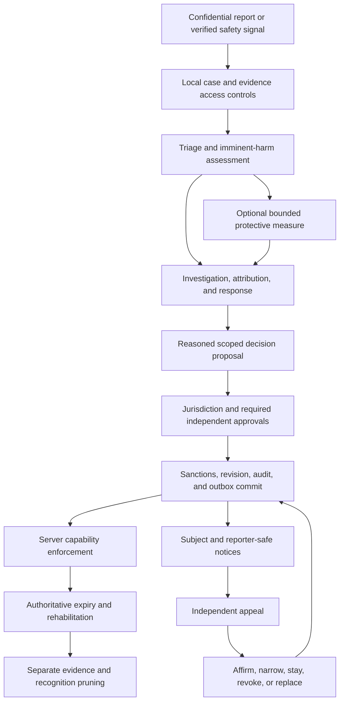

# I-VSD Architectural Consultation: Cross-Solution Moderation, Scoped Sanctions, Due Process, and Identity Continuity

Last Updated: 2026-10-07 Europe/Brussels

## Review Metadata

- Mode: standalone
- Subject: Banning system and moderation identity fence across ISLAMU Solutions
- Workstream: none; no moderation implementation plan/context/tasks triad was supplied or found
- Report kind: architectural-consultation
- Report status: current
- Disposition: ready-for-planning
- Report revision: `R3-2026-10-07`
- Evidence cutoff: 2026-10-07
- Reviewed input: customization review input Git blob `cf8a38cda54dd193dced37b57d0cd45b1088e804`; original redesign input blob `a07f719876bce0f9ff5d8c0cf7a5b318f13dee61`; repository HEAD `0d4ab8d5a62e74ebcd9476a1b47eddda7ea270e1`, with unrelated working-tree changes excluded from this review
- Supersedes: `R2-2026-10-07` of this same consultation; preserves its cross-solution architecture and findings
- CTO review: architectural refinements applied; implementation readiness remains unapproved
- I-VSD alignment: current for this consultation revision; not `plan-aligned` with an implementation triad
- User approval: authorizes consultation redesign, not implementation, operational activation, legal conclusions, or religious rulings
- Research methods: repository knowledge graph and bounded source inspection; Tavily MCP for primary-source research; Context7 MCP for official framework documentation

## Executive Summary

ISLAMU needs a moderation capability that protects people across its participating solutions without turning every community dispute into exclusion from every product. An identity-wide ban, an Event-only ban, an instance suspension, a community restriction, and a prohibition on sending messages are different decisions. They need different issuing authorities, evidence, remedies, enforcement points, and retention rules. Two ban counters and a recognition hash cannot represent this system.

The recommended product is **one reusable moderation domain and application engine, embedded by default in each solution, with an optional remotely hosted authority using the same engine**. The embedded deployment MUST provide full local reporting, investigation, sanctions, appeals, identity continuity, audit, and recovery in a locally runnable single binary. It MUST NOT require Keycloak, Cerbos, Coop, Osprey, Infisical, Redis, a message broker, or a separate moderation process. Existing approved local authentication, authorization, secret-authority, and storage choices still apply. Remote hosting changes transport, authority ownership, and availability requirements; it does not create a second implementation of the rules.

Cross-software moderation operates inside an **explicit trust domain**: a named set of operators and installations that accept a documented moderation constitution and identity-mapping contract. Official ISLAMU-operated products can participate in one such domain. Independently operated installations do not join merely because they run ISLAMU software, authenticate through the same identity provider, or recognize the same DID. This distinction prevents a central service, compromised provider, or tenant moderator from acquiring undeclared authority over unrelated communities.

Every sanction names its subject, issuing authority, scope, restricted capabilities, effective interval, rule version, evidence basis, decision revision, review deadline, and appeal route. Scope and severity are independent. A serious Event-only upload ban does not necessarily restrict another solution. An identity-wide restriction can prohibit messaging while preserving reading, appeals, data requests, and eligible transactions. An organization suspension is not automatically a ban on every member.

The primary differentiator should be **precise protection with explainable, reversible enforcement**: reliable action restrictions; confidential reporting; trained review; independent appeals; local autonomy within a published safety floor; accessible recovery; transparent incident and appeal status; and corrections that reach every enrolled recipient. AI and external queues can assist review, but cannot silently become sanction authorities. Broad permanent exclusions require stronger evidence and approval than narrow temporary interventions.

The system must also serve **both configuration extremes as first-class products**. A small self-hoster starts with a complete, curated local policy and a simple administration view, not an empty policy designer. A large ISLAMU-operated platform can configure its reason taxonomy, sanction templates, graduated responses, review queues, approval matrices, language variants, delegated community policies, retention, and fairness controls. Advanced mode exposes the same engine's configuration; it does not switch to a separate product, remove safeguards, or require remote hosting.

Moderation configuration is a governed control plane: scalar settings use the existing hierarchical settings conventions; rich policies and catalogues use typed, versioned definitions; the Administration Console, native commands, configuration manifests, and tenant configuration packages share the same validation and coordinated mutation authority. Portable configuration contains no subjects, cases, sanctions, credentials, endpoint bindings, or adjudicator privileges. Importing a policy never grants permission to issue it. Recommendation 15 defines this contract, including progressive disclosure, catalogue lifecycles, preview/diff/approval, staged activation, extensions, and fairness.

The 2026-10-05 report also contained technical and ethical errors. Raw delimiter concatenation is not collision-safe serialization. OIDC issuer/subject values cannot be indiscriminately lowercased. A movable AT Protocol PDS is not the stable account identity. Verified email does not prove one human identity. HMAC data is not automatically anonymous. A database transaction does not atomically update unrelated databases and remote services. Banning someone does not justify automatically wiping all their content. These claims are corrected below.

This is a comprehensive architecture and provider-responsibility specification, not proof of a perfect implementation. Disconnected applications cannot instantly learn a new remote ban; downloaded content cannot be recalled; distinct unlinked identities remain an accepted recognition limit. The report defines observable correctness, operational gates, and explicit consistency choices instead of promising impossible guarantees. `ready-for-planning` permits a repository-grounded implementation plan; it does not authorize a production rollout or claim that banning is already implemented.

## Scope

### Included

- Identity-wide, solution/project, deployment-instance, tenant, organization/group, resource, and action-specific sanctions.
- Human users, delegated/service principals, organizational actors, and content/resource subjects, without conflating their responsibilities.
- Reporting, protective intervention, investigation, adjudication, appeal, expiry, rehabilitation, correction, and oversight.
- Cross-solution identity mapping, trust enrollment, recipient qualification, revocation, reconciliation, and departure.
- Embedded single-binary and optional remote-authority deployment bindings with shared policy semantics.
- API, native operations, BFF, SignalR, MCP, machine credentials, queued work, and external side-effect enforcement.
- Active-ban deletion continuity, ordinary fresh registration, pseudonymous recognition, retention, key rotation, and restore protection.
- Clean Architecture, native CQS, HAL, portable persistence, transactional outbox/inbox, accessibility, localization, operator recovery, and measurable release gates.
- Highly configurable moderation settings, portable typed policy/catalogue manifests, administrative editing, simple/advanced presets, delegated customization, reviewed extensions, and configuration fairness.
- Islamic value-sensitive analysis of provider responsibility across UX, architecture, governance, support, operations, and data sharing.

### Not established by this consultation

No code, generated migrations, authentication authority, shared identity service, microservice, policy engine, or deployment packaging is implemented here. No existing plan is approved or silently broadened. Religious rulings, statutory applicability, retention terms, staffing capacity, identity-proofing requirements, and actual performance remain subject to the named validation gates.

The consultation preserves the full cross-solution vision. Later implementation MUST split risk into reviewable PRs, not shrink this vision to an Event-only fence. Required dependent slices belong in one coherent plan, not scattered mandatory backlog fragments or competing active triads.

## Claim Boundary

Selected Islamic values guide provider-controlled decisions. They do not certify outcomes or supply binding religious-legal conclusions. The previous report's categorical `HARAM`/`Wajib` labels and universal legal-compliance assertions are withdrawn. Qualified Sunni scholars own contested religious determinations; deployment-specific counsel owns legal applicability and lawful processing assessments.

Standards and industry guidance provide functional constraints, not a complete moderation constitution. Santa Clara Principles are voluntary guidance. GDPR, DSA, and the ICO Children's Code have deployment-dependent applicability. An erasure exception for legal claims is not blanket authorization to retain all sanction histories forever.

Evidence levels below distinguish **source-inspected reality**, **primary-document facts**, **proposed design**, and **unvalidated outcomes**. Neither a current report nor an architectural score is runtime, adversarial, stakeholder, or operational proof.

## Source-Grounded Current State

### Verified repository reality

| Evidence | What was inspected | Supported conclusion |
| --- | --- | --- |
| `E01` | [Account moderation roadmap](../../dev/next/account-moderation-retention.md) | Future requirements distinguish ordinary erasure, restricted existing accounts, and rejection before provisioning after active-ban deletion. Capture is not authorized merely for warnings or past bans. |
| `E02` | [Public erasure guide](../../docs/public/documentation/readme/security-and-identity/privacy-erasure.md), fresh registration and reserved-key sections | Moderation recognition is a future lifecycle. Reserved keys are optional for ordinary erasure/enrollment. Live rotation is not implemented. |
| `E03` | [Coop and Osprey guide](../../docs/public/documentation/readme/integrations-and-ai/coop-and-osprey.md) | External queues/signals do not replace local policy, enforcement decisions, or authoritative database state. |
| `E04` | [UserExternalLogin](../../src/Explore.Domain/UserExternalLogin.cs) and [AuthenticationProviderKind](../../src/Explore.Domain/Enums/AuthenticationProviderKind.cs) | Existing bindings are application-user/provider records. The enum includes Development; it is not proof of a portable global human identity. |
| `E05` | [Existing identity-fence repository](../../src/Explore.Persistence/Privacy/ErasureAuthority/ProviderPrimitives/EfCorePrivacyErasureAuthorityRepository.IdentityFence.cs), identity gate/find/subject methods | A provider-specific serialized identity gate and erasure facts exist. Their names do not establish the proposed moderation ledger or cross-solution authority. |
| `E06` | [PrivacyErasureApplier](../../src/Explore.Application/Services/PrivacyErasureApplier.cs), local application sequence | Current erasure hard-deletes some PII/tokens, tombstones actors, soft-deletes the user, records coverage, and queues provider/cache work. It is not a universal cascade that physically deletes every account-related row. |
| `E07` | [OspreyModerationSignalProvider](../../src/Explore.Infrastructure/Services/Moderation/OspreyModerationSignalProvider.cs), evaluation entrypoint | Advisory evaluation adapter exists with HTTP/gRPC selection. Inspection was bounded; it is not proof that all callback/enforcement paths are safe. |
| `E08` | [CoopReviewQueueProvider](../../src/Explore.Infrastructure/Services/Moderation/Coop/CoopReviewQueueProvider.cs), mirroring entrypoint | Queue mirroring is an existing integration seam, not a sanction authority. |
| `E09` | [TenantDelegationSettingDefinitions](../../src/Explore.Domain/Settings/Definitions/TenantDelegationSettingDefinitions.cs) | Instance-level reporting-provider delegation locks exist. The proposed moderation-policy lock is not an implemented setting. |
| `E10` | [GovernanceSettingKeys](../../src/Explore.Domain/Constants/GovernanceSettingKeys.cs), bounded settings inventory; [Quick Reference](../../docs/internal/QUICK_REFERENCE.md) | Existing governance has explicit setting families and a five-tier cascade. Moderation jurisdiction cannot be inferred from a setting override alone. |
| `E11` | [EventReportProviderEnvelope](../../src/Explore.Application/Features/EventReporting/Models/EventReportProviderEnvelope.cs) and [ReviewCaseEnvelope](../../src/Explore.Application/Features/EventReporting/Models/ReviewCaseEnvelope.cs) | Both carry tenant/case/scope/idempotency metadata. The proposed `AuthorReputationSnapshot` is absent from these inspected contracts. |
| `E12` | [ActorModerationRecord](../../src/Explore.Domain/ActorModerationRecord.cs) | An actor/action/reason/time/decision-maker record exists; this shape is not the comprehensive scope, expiry, appeal, and capability model proposed here. |
| `E13` | [global.json](../../global.json), [PROJECTS.md](../../PROJECTS.md), [AGENTS.md](../../AGENTS.md) | SDK is pinned to 10.0.302; native CQS, HAL, generated artifacts, targeted verification, and embedded-first requirements constrain delivery. |
| `E14` | [SettingDefinition](../../src/Explore.Domain/Settings/SettingDefinition.cs) | Definitions declare type, default, category, scope bounds, locks, allowed values, and `RequiresCoordinatedMutation`. Sensitive metadata is not permission to store new secrets in settings. |
| `E15` | [Configuration Manifest](../../docs/internal/CONFIGURATION_MANIFEST.md), structural/authority/import sections; [ConfigurationManifestReader](../../src/Explore.Infrastructure/ConfigurationManifest/ConfigurationManifestReader.cs) | Bounded strict JSON, independent allowlists, typed documents, startup modes, and coordinated atomic application exist. Adding a setting definition does not automatically make it portable. |
| `E16` | [ConfigurationPortabilityRegistry](../../src/Explore.Application/Features/ConfigurationManifest/Catalog/ConfigurationPortabilityRegistry.cs) and [catalogue descriptors](../../src/Explore.Application/Features/ConfigurationManifest/Catalog/ConfigurationManifestCatalogDescriptors.cs) | Portability declares authority, classification, schema, dependencies, mapping and supported operations. General `tenant.lookups` and extension portability are currently unavailable; moderation catalogue support must be explicitly implemented. |
| `E17` | [Setup Assistant live import architecture](../../docs/internal/SETUP_ASSISTANT_ARCHITECTURE.md), live import section; [public manifest guide](../../docs/public/documentation/readme/configuration-and-operations/configuration-manifests.md) | Staged upload/preview/apply binds artifacts, target revisions, mappings, approvals, expiry, and one-time sessions. Manifests exclude runtime/provider bindings, secrets, PII, application and operational state. |
| `E18` | [PublicationPolicyMutationBoundary](../../src/Explore.Application/Settings/PublicationPolicyMutationBoundary.cs) and [ICoordinatedSettingMutationStore](../../src/Explore.Application/Contracts/Persistence/ICoordinatedSettingMutationStore.cs) | Existing policy mutation validates a complete proposed state under coordinated authority. The inspected store is publication-specific, not an already generic moderation policy store. |
| `E19` | [EventReportReasonCode](../../src/Explore.Domain/Enums/EventReportReasonCode.cs) and [EventReportReasonCodePolicy](../../src/Explore.Application/Features/EventReporting/Policies/EventReportReasonCodePolicy.cs) | Current report reasons are enum-backed with static metadata/options. They are not operator-editable moderation lookup tables. |
| `E20` | [InstanceModerationReportingSettingsController](../../src/Explore.API/Controllers/InstanceModerationReportingSettingsController.cs) and [InstanceGovernanceSettingsController](../../src/Explore.API/Controllers/InstanceGovernanceSettingsController.cs), bounded administrative entrypoints | Administration already separates reporting-provider locks and instance governance through authenticated native commands. This is not a comprehensive moderation configuration UI. |

The knowledge graph was consulted before code exploration. At the recorded HEAD, a one-hop impact query over the actor moderation record, erasure applier, and report envelope returned 22 directly changed nodes, 11 impacted nodes, and six additional affected files. The affected-flow query returned zero indexed flows for the selected erasure/envelope paths. **Zero indexed flows is a coverage limitation, not proof of zero callers or zero risk.** Future planning must trace enrollment, binding changes, native authorization, and provider execution explicitly.

No moderation triad referencing this consultation or its roadmap was found in the searched `dev/` artifacts. Another workstream has a pre-existing `*-cto-review.md`; it is unrelated and was not changed. This review creates no branch, worktree, review file, ADR, backlog brief, or implementation triad.

The customization follow-up queried the graph before inspecting settings/manifest/reason seams. A one-hop query over `SettingDefinition`, `EventReportReasonCodePolicy`, and `ConfigurationPortabilityRegistry` reported 24 directly changed nodes, seven impacted nodes, and six additional files. Graph lookup did not resolve several manifest classes or settings-controller names; bounded native inspection supplied those facts. This is exploratory impact context, not a product-code change or complete call-graph proof.

### Corrections to the previous blueprints

| Previous assertion | Corrected requirement |
| --- | --- |
| Two counters plus `BanKind` constitute the moderation engine | Model adjudication, independent sanctions, capability effects, scope, authority, appeals, and bounded history. Counters are derived policy inputs. |
| `v1:kind:issuer:subject` neutralizes delimiter collisions | Use versioned unambiguous byte serialization with length-delimited fields and deterministic encoding. |
| Lowercase issuer/subject generally; strip issuer slashes | Preserve validated protocol identity semantics. OIDC issuer and subject are case-sensitive; no generic URL rewriting. |
| Bind AT Protocol identity to its PDS origin | Bind to the validated account DID and its protocol namespace; PDS migration does not change the sanction subject. |
| Verified email prevents shared-family-email false positives | Mailbox control is not human uniqueness or proof that two accounts are the same person. No email-only merge or sanction inheritance. |
| Tier A means every trace of the account is physically gone | Promise the documented purge/tombstone/retention lifecycle, not absolute oblivion of lawful records, backups, or independent recipients. |
| HMAC digests and reputation counters are non-PII | Treat recognizable digests, pseudonyms, behavioral histories, and small-cohort signals as potentially personal information. |
| PostgreSQL-specific SQL demonstrates database portability | The shown SQL was not portable. Define logical constraints; generate provider-specific migrations through repository tooling. |
| Redirect query parameters convey authoritative ban status | Return a subject-bound recovery view; no sensitive reasons, trusted expiry, or enforcement decision from browser query parameters. |
| A missing subject can simply return from the admission interceptor | Required identity evidence that is missing or invalid fails the affected admission check. |
| Current-key-only lookup is enough for rotation | Read every retained approved key generation; HMAC-only old records cannot be rehashed without seeing the underlying identifier again. |
| Serializable transactions make multi-store erasure atomic | Single-store atomicity and cross-store durable coordination are different contracts, requiring explicit gates and recovery. |
| Instance ban immediately wipes the user's content | Quarantine/remove offending content through separate authorized decisions; preserve appeal/legal evidence within policy. |

## Findings

All findings remain **open** unless stated otherwise: design mitigation is not implemented resolution. Stable `IVSD-F001` through `IVSD-F019` and their `IVSD-M*` mappings are preserved. `IVSD-F020` through `IVSD-F025` extend the review for progressive configuration, catalogues, portability, policy activation, personalization and extensions.

### IVSD-F001: Deletion must not erase an active sanction

A sanctioned person can otherwise return through fresh provisioning while victims still face the same risk. Conversely, preserving old permissions or purchases to retain a ban would resurrect unrelated private account history. The provider controls identity capture, the erase/admit ordering, and the retained-purpose boundary.

`IVSD-M001` requires an independently owned moderation subject, scoped active sanctions, and coordinated capture before binding disposal. Preserve original effective/expiry instants and only separately justified history. A fresh account gets a fresh internal ID and no recovered private graph. This serves harm prevention and justice without treating erasure as loss of all rights. Existing erasure code is not evidence that this future ban engine exists.

- Lifecycle/severity/type: open / critical / future security-and-privacy integration gap.
- Principles/domains/stakeholders: non-harm, justice, trusteeship / identity, privacy / victims, sanctioned users, operators.
- Controlled decision/evidence: erase/admit coordination / `E01`, `E02`, `E05`, `E06`; source-inspected requirements and seams.
- Mitigation/owner/validation: `IVSD-M001` / identity and privacy maintainers / deterministic delete/admit/link races and restore tests.
- Escalation: deployment-specific legal basis and scope of retained recognition.

### IVSD-F002: A safety ledger must not become a perpetual shadow identity

Fingerprinting every erased person, or capturing a person solely for old warnings, would convert an account-deletion promise into indefinite tracking. Reusing the same digest across unrelated installations would also enable correlation beyond the sanction's purpose.

`IVSD-M002` preserves the existing active-ban-only capture boundary. Expiry of enforcement, expiry of justified history, and deletion of recognition are separate transitions. Permanent exclusion requires periodic necessity review, not permanent retention of all evidence. Concealing faults and rehabilitation require a real route out of a served sanction; they do not imply erasure of independently required legal records.

- Lifecycle/severity/type: open / high / retention and purpose-limitation risk.
- Principles/domains/stakeholders: dignity, concealment of faults, rehabilitation, trusteeship / privacy, governance / all users and reformed participants.
- Controlled decision/evidence: capture eligibility and cross-domain sharing / `E01`, `E02`, `S08`; inspected policy and primary legal text.
- Mitigation/owner/validation: `IVSD-M002` / privacy owner / no-capture, purge, legal-hold, recipient-correction tests.
- Escalation: action-only erasure continuity extension and any indefinite recognition policy.

### IVSD-F003: Sanction time and state need explicit semantics

A nullable expiry cannot distinguish no sanction, an indefinite sanction, scheduled activation, and a revoked decision. Re-registration must not restart a seven-day suspension. An expiry sweeper that is late must not prolong it.

`IVSD-M003` separates lifecycle state, start/end instants, review deadline, and retention deadline. Server `TimeProvider` evaluates `[EffectiveFrom, EffectiveUntil)`; UI countdowns are descriptive only. Appeals, expiry, and renewal create versioned transitions. A new sanction must cite a new authorized decision rather than silently extending the old one.

- Lifecycle/severity/type: open / high / domain-state correctness gap.
- Principles/domains/stakeholders: justice, truthfulness / domain, UX / sanctioned people, moderators.
- Controlled decision/evidence: time/state representation / `E01`, `E12`; source requirements and proposed model.
- Mitigation/owner/validation: `IVSD-M003` / domain owner / exact-boundary, overlap, restart, clock-fault tests.
- Escalation: policy owners set defensible review and duration bounds.

### IVSD-F004: Authentication identifiers are not interchangeable human identities

OIDC pairwise subjects can differ across clients; equal bare subjects can belong to different issuers. AT Protocol hosts and handles can change. Local subjects from two installations are unrelated. Generic lowercasing, issuer rewriting, or email equality can punish the wrong person or admit the sanctioned account.

`IVSD-M004` requires protocol-qualified exact identity evidence and explicit, verified mapping into a trust-domain subject. Linking/unlinking is authorized, auditable, and challengeable. Independent identities remain unlinked absent proof. Justice requires both evasion resistance and protection against false attribution.

- Lifecycle/severity/type: open / critical / false linkage and recognition bypass.
- Principles/domains/stakeholders: justice, trusteeship / identity, federation / household members, compromised-account users, all participants.
- Controlled decision/evidence: stable identity and mapping / `E04`, `S01`, `S02`, `S03`, `S10`; inspected shape and protocol facts.
- Mitigation/owner/validation: `IVSD-M004` / identity owner / issuer-case, pairwise-subject, PDS migration, malicious-link tests.
- Escalation: identity assurance, controller boundaries, and contested linkage review.

### IVSD-F005: Context can improve review while also creating stigma

Reviewers need context, but unresolved reports, account age, verification tier, and global ban counts are not reliable guilt measures. Sending them to every external queue can leak behavioral history and bias adjudication against newcomers or less verified people.

`IVSD-M005` replaces a universal reputation score with purpose- and scope-qualified confirmed findings, overturned status, expiry, and uncertainty. Default external dispatch remains metadata-first. Allegations are distinguished from adjudicated facts; access to more history requires a justified review need. AI can prioritize cases but does not determine guilt.

- Lifecycle/severity/type: open / high / information-sharing and biased adjudication risk.
- Principles/domains/stakeholders: careful verification, justice, excellence / data, AI / reported users, reporters, reviewers.
- Controlled decision/evidence: context selection and dispatch / `E03`, `E07`, `E08`, `E11`, `S07`; inspected seams and guidance.
- Mitigation/owner/validation: `IVSD-M005` / moderation and privacy owners / scope-filtered payload, reversal, bias evaluation.
- Escalation: new behavioral attributes or materially automated adverse decisions.

### IVSD-F006: Key custody and rotation can forget bans or expose people

Losing a recognition key breaks matching; a leaked key and ledger permit guessing against known identities. A stored key ID alone solves neither problem. Old HMAC digests cannot simply be converted to a new key without the original input.

`IVSD-M006` requires an approved stable secret authority, separate recognition and signing purposes, retained-generation inventory, value-free diagnostics, coordinated rotation, and recovery drills. Approved environment injection is a first-class standalone option; Infisical is not mandatory. Pseudonymous records remain access-controlled personal information.

- Lifecycle/severity/type: open / critical / cryptographic custody and recovery risk.
- Principles/domains/stakeholders: trusteeship, privacy / operations / subjects, operators.
- Controlled decision/evidence: key lifecycle / `E01`, `E02`, `E05`, `E13`; inspected configuration contract.
- Mitigation/owner/validation: `IVSD-M006` / security and operations owners / lost-key, overlap, compromise, partial-rollout drills.
- Escalation: compromised-key retention trade-off and recovery authorization.

### IVSD-F007: Cross-software protection must not become covert surveillance

Device tracking, IP-based identity linking, public accusation registries, and speculative account graphs can harm innocent users and create a centrally searchable dossier. Cross-software reach magnifies that harm.

`IVSD-M007` prohibits these mechanisms as product policy. Restrict recognition to verified permitted identifiers and explicit mappings. Ordinary rate-limiting or security-log processing has a separately assessed purpose; it is not permission to correlate people for bans. The accepted distinct-identity evasion limit remains explicit.

- Lifecycle/severity/type: open / high / surveillance and reputational harm risk.
- Principles/domains/stakeholders: privacy, dignity, avoidance of spying and unfounded suspicion / data, UX / all communities.
- Controlled decision/evidence: correlation and disclosure / `E01`, `S08`; inspected policy and primary privacy text.
- Mitigation/owner/validation: `IVSD-M007` / architecture and privacy owners / collection inventory and export-access review.
- Escalation: any proposed identity-correlation expansion; no religious ruling inferred here.

### IVSD-F008: Authority failure is not a clean moderation result

A timeout, missing key, stale policy, or unreadable ledger must not be interpreted as “no active restriction.” Blocking every recovery page on that same outage is also harmful and can trap people without appeal.

`IVSD-M008` distinguishes deny, permit, and authority-unavailable. Deny covered protected actions when required authority is unavailable; preserve independently safe recovery paths. Ordinary erasure does not acquire an unrelated mandatory recognition secret. Explicitly disabled optional retention is not accidental fallback from an enabled authority.

- Lifecycle/severity/type: open / critical / fail-open and overbroad outage handling.
- Principles/domains/stakeholders: trusteeship, non-harm, accessibility / security, operations / victims, subjects, self-hosters.
- Controlled decision/evidence: failure composition / `E01`, `E02`, `S05`, `S06`, `D01`; inspected and documented semantics.
- Mitigation/owner/validation: `IVSD-M008` / application and operations owners / unavailable-provider, stale-snapshot, recovery tests.
- Escalation: owner must approve each action's freshness/availability budget before activation.

### IVSD-F009: Shared infrastructure needs bounded protective authority

An operator may need to quarantine dangerous uploads or suspend abusive credentials to protect other tenants and infrastructure. That responsibility does not establish a universal legal rule, justify arbitrary cross-product exile, or authorize wiping every item authored by the user.

`IVSD-M009` grants explicit instance-protection capabilities with reasoned, time-bounded emergency intervention and subsequent review. Content quarantine, user participation restrictions, tenant service suspension, and infrastructure shutdown are separate decisions. A legal takedown is recorded under its actual authority and challenge limits.

- Lifecycle/severity/type: open / critical / shared-service safety and excessive-remedy risk.
- Principles/domains/stakeholders: non-harm, proportional justice, trusteeship / operations, governance / tenants, attendees, operators.
- Controlled decision/evidence: protective authority and content disposition / `E09`, `E10`, `S09`; inspected delegation seams and legal text.
- Mitigation/owner/validation: `IVSD-M009` / instance safety owner / narrowly scoped emergency and evidence-preservation tests.
- Escalation: counsel and trained safeguarding personnel determine actual legal/reporting duties.

### IVSD-F010: Policy inheritance is not permission to erase community autonomy

Local communities can legitimately differ in ordinary conduct rules. An instance or suite authority can also abuse a “safety floor” to impose uniformity or retaliate against a community. A configurable warning ladder alone does not resolve that conflict.

`IVSD-M010` separates published shared safety obligations from tenant etiquette, delegated authority, and controlled policy exceptions. Rules are versioned and understandable; local decisions cannot silently acquire wider scope. Settings locks do not confer cross-solution jurisdiction. Consultation and justice require challengeable authority, not just configurability.

- Lifecycle/severity/type: open / high / autonomy and policy-governance risk.
- Principles/domains/stakeholders: consultation, justice, legitimate local variation / governance / tenants, community leaders, suite stewards.
- Controlled decision/evidence: policy floor and delegation / `E09`, `E10`, `S07`; source seams and guidance.
- Mitigation/owner/validation: `IVSD-M010` / governance owner / inheritance, lock, exception, scope-escalation tests.
- Escalation: steward approves the constitution; contested religious norms require scholarly input.

### IVSD-F011: A forged or excessive decision could exclude people everywhere

A valid provider signature proves origin, not jurisdiction. If an advisory callback or tenant moderator can issue an identity-wide sanction, compromise of that boundary can exclude innocent people across products and expose their histories.

`IVSD-M011` makes trust enrollment, bounded delegation, subject mapping, recipient qualification, capability scope, and independent approval prerequisites. Cross-solution permanent exclusion requires two distinct authorized reviewers; the proposer cannot supply both approvals. This is the **Worst Break**, with mandatory failing tests before enforcement implementation.

- Lifecycle/severity/type: open / blocker / cross-solution authority compromise.
- Principles/domains/stakeholders: justice, trusteeship, non-harm / security, federation / all participating communities.
- Controlled decision/evidence: decision admission and jurisdiction / `S01`, `S04`, `S07`; primary standards/guidance plus proposed boundary.
- Mitigation/owner/validation: `IVSD-M011` / security and suite governance owners / forged, over-scoped, replayed, colluding-reviewer tests.
- Escalation: activation requires a staffed independent-review mechanism.

### IVSD-F012: Distributed revocation has unavoidable freshness limits

Cached claims and disconnected receivers cannot enforce a remote decision they have not learned. An asynchronous outbox does not make distributed bans instantaneous. False guarantees would mislead victims and operators.

`IVSD-M012` declares an action-specific consistency profile, revision tracking, bounded positive caches/leases, gap detection, and authoritative reconciliation. Critical actions require current authority or remain unavailable. Report acknowledgements distinguish accepted, locally applied, pending, and quarantined recipients.

- Lifecycle/severity/type: open / critical / stale admission and misleading guarantees.
- Principles/domains/stakeholders: truthfulness, trusteeship, non-harm / distributed systems / users, operators, safety staff.
- Controlled decision/evidence: freshness and offline policy / `S04`, `S05`, `S06`, `D02`, `D03`; documented limits.
- Mitigation/owner/validation: `IVSD-M012` / infrastructure owner / partitions, missed events, old tokens, in-flight action tests.
- Escalation: approve exposure bounds per capability; do not advertise unmeasured guarantees.

### IVSD-F013: Partial restrictions need an exhaustive action contract

A publication ban can be bypassed through create-and-publish, scheduled jobs, imports, an MCP tool, or a machine credential acting for the same user if only the visible publish button is checked.

`IVSD-M013` requires a versioned capability catalogue and enforcement in native use cases as well as transport. Resolve ownership and delegation server-side. Unknown security-sensitive capabilities cannot become implicitly permitted; new catalogue versions need policy review and endpoint coverage.

- Lifecycle/severity/type: open / critical / alternative-path authorization bypass.
- Principles/domains/stakeholders: justice, trusteeship / application, API / victims, organizers, integration users.
- Controlled decision/evidence: action registration and enforcement / `E13`, `S05`, `S11`, `D01`; repository rules and authorization guidance.
- Mitigation/owner/validation: `IVSD-M013` / solution application owner / every equivalent action path and on-behalf credential tests.
- Escalation: each product owner signs off on its coverage inventory.

### IVSD-F014: Notice and appeal must survive suspension and deletion

Opaque bans, appeals controlled by the original moderator, inaccessible language, or a deleted account with no proof-bound remedy leave people unable to challenge mistakes. Reporters also need a safe route to challenge inaction.

`IVSD-M014` provides specific notices, protected evidence summaries, independent human review, accessible status, and proof-bound recovery for deleted subjects without creating a normal account. Revocation recomputes effective restrictions; it does not lift unrelated valid sanctions.

- Lifecycle/severity/type: open / high / due-process and accessibility failure.
- Principles/domains/stakeholders: justice, dignity, truthfulness, excellence / UX, support / sanctioned users, reporters, language minorities.
- Controlled decision/evidence: remedies and review independence / `E01`, `S07`, `S09`, `S12`; requirements and guidance.
- Mitigation/owner/validation: `IVSD-M014` / appeals owner / deleted-subject recovery, recusal, notice, reporter-appeal tests.
- Escalation: legal deadlines and external-remedy obligations where applicable.

### IVSD-F015: Reports, compromised accounts, and moderator abuse require different responses

Many reports are not many independent facts. A compromised account is not evidence that its owner intended the misconduct. An administrator can misuse access, widen sanctions, retaliate against reporters, or inspect unrelated cases.

`IVSD-M015` separates allegations, corroborated evidence, actor attribution, and decision authority. Require recusal, scoped evidence access, dual control for broad decisions, protected staff complaints, moderator credential revocation, and a bounded emergency lane. Volume may alter triage capacity, not establish guilt.

- Lifecycle/severity/type: open / critical / adversarial adjudication and insider misuse.
- Principles/domains/stakeholders: careful verification, justice, privacy / governance, security / reporters, accused users, moderators.
- Controlled decision/evidence: adjudication and privileged access / `S07`, `S09`, `S10`, `S12`; guidance and proposed design.
- Mitigation/owner/validation: `IVSD-M015` / moderation operations owner / brigading, retaliation, compromised-account, privilege-abuse exercises.
- Escalation: independent oversight for complaints against the issuing authority.

### IVSD-F016: Evidence integrity and privacy need compatible lifecycles

Indefinite immutable evidence can contradict erasure and expose victims. Immediate indiscriminate destruction can prevent a fair appeal or necessary legal response. Neither an audit hash nor removal of a display name proves anonymity.

`IVSD-M016` separates restricted evidence storage, integrity-protected minimal decision facts, correction annotations, recipient notices, bounded retention, and narrowly authorized holds. Audit integrity means detectable unauthorized changes, not an eternal personal dossier.

- Lifecycle/severity/type: open / high / evidence retention and disclosure risk.
- Principles/domains/stakeholders: trusteeship, concealment of faults, justice / privacy, operations / reporters, subjects, operators.
- Controlled decision/evidence: evidence disposition / `E06`, `S08`, `S09`; inspected lifecycle and legal text.
- Mitigation/owner/validation: `IVSD-M016` / privacy and evidence owners / access, deletion, hold, appeal preservation, restore tests.
- Escalation: counsel defines record-class obligations and lawful disclosure exceptions.

### IVSD-F017: Standalone support fails if embedded mode is a reduced product

A mandatory moderation server, cloud identity broker, external review queue, or network-only secret service would violate the requested single-binary default. Separate embedded and remote rule implementations would drift on precisely the safety boundaries that need parity.

`IVSD-M017` uses one engine and deployment bindings, with full embedded case/appeal functionality and approved local authorities. Remote mode is explicitly selected, never an outage fallback. Disconnected standalone installations cannot promise simultaneous suite-wide enforcement.

- Lifecycle/severity/type: open / critical / deployment and maintainability mismatch.
- Principles/domains/stakeholders: trusteeship, autonomy, truthfulness / architecture, portability / self-hosters, maintainers.
- Controlled decision/evidence: packaging and provider composition / user requirement, `E13`; proposed architecture, not packaging proof.
- Mitigation/owner/validation: `IVSD-M017` / platform owner / dependency-free standalone and common conformance suite.
- Escalation: reusable-package ownership, licensing, and operational support contract before extraction.

### IVSD-F018: Restore or policy replay can reinstate an overturned sanction

An old backup, delayed apply message, missing revocation tombstone, or lost approval policy can resurrect bans or silently restore permissions. Merely storing current rows is insufficient for recovery.

`IVSD-M018` persists authoritative revisions, bounded replay protection, restore watermarks, and reconciliation state. Restore remains gated until policy, identity mappings, active sanctions, reversals, and retention are reconciled. A corrected case cannot be reactivated by an older signed message.

- Lifecycle/severity/type: open / critical / recovery and replay corruption.
- Principles/domains/stakeholders: justice, trusteeship / persistence, operations / subjects, operators.
- Controlled decision/evidence: recovery and history compaction / `E01`, `E02`, `E05`, `S04`; existing requirements and proposed contract.
- Mitigation/owner/validation: `IVSD-M018` / persistence and operations owners / stale backup, out-of-order reversal, cursor-gap tests.
- Escalation: explicit supported backup horizon and recovery procedure.

### IVSD-F019: Safety operations must account for children, victims, and moderator wellbeing

Exposing reporters, copying dangerous evidence into ordinary tickets, untrained handling of urgent threats, or unstaffed appeal queues can defeat an otherwise sound design. More invasive age verification is not automatically a safer answer.

`IVSD-M019` requires protective defaults, confidential reporting, restricted evidence handling, trained safeguarding escalation, meaningful language support, and workload/exposure controls. Community members do not become investigators. Staffing evidence is an activation gate for broad sanctions.

- Lifecycle/severity/type: open / high / safeguarding and operational readiness gap.
- Principles/domains/stakeholders: non-harm, dignity, trusteeship, excellence / support, operations / children, victims, reviewers.
- Controlled decision/evidence: reporting defaults and handling capacity / `S07`, `S09`, `S13`; primary guidance.
- Mitigation/owner/validation: `IVSD-M019` / safeguarding owner / staffed exercises and representative usability validation.
- Escalation: trained personnel and jurisdiction-specific duties; contested classifications to scholars.

### IVSD-F020: Simple and advanced operators need the same complete configurable engine

A small self-hoster should not have to invent a policy, classify every setting, and assemble an appeal workflow before handling the first report. A large platform should not be forced into one fixed warning ladder, reason list, or queue. Treating these as separate implementations would create inconsistent protection and unnecessary maintenance.

`IVSD-M020` provides curated versioned presets, progressive disclosure, effective-configuration explanations, and the same configurable engine in both deployments. Presets are complete starting configurations, not secret authorities. Advanced features remain available locally; enabling an expert view cannot enable federation or relax remedies by itself.

- Lifecycle/severity/type: open / high / operator usability and configuration-completeness gap.
- Principles/domains/stakeholders: excellence, trusteeship, consultation / product, operations / small self-hosters, large operators, moderators.
- Controlled decision/evidence: configuration experience and defaults / user requirement, `E14`, `E20`; inspected seams and proposed design.
- Mitigation/owner/validation: `IVSD-M020` / moderation product and platform owners / default-profile completeness, simple/advanced parity and operator usability tests.
- Escalation: representative small and large operators must validate presets before they are advertised.

### IVSD-F021: Editable catalogues must not rewrite the meaning of past decisions

Custom reasons and sanction types are necessary, but changing a label, severity mapping, or template must not silently reclassify a person's old conduct. Numeric lookup IDs from another installation cannot safely identify the same rule. Deleting a referenced reason can break appeal and audit explanations.

`IVSD-M021` uses scoped, namespaced, versioned catalogues with local `int` lookup IDs, immutable published codes/revisions, localization, retirement, and authoritative reference mapping. Decisions bind the actual rule/reason/template revision. Operators customize sanction composition and presentation; new executable effect kinds still require reviewed implementation.

- Lifecycle/severity/type: open / critical / catalogue reinterpretation and cross-installation mapping risk.
- Principles/domains/stakeholders: justice, truthfulness, trusteeship / domain, persistence / subjects, reviewers, federation recipients.
- Controlled decision/evidence: catalogue ownership and lifecycle / `E16`, `E19`; inspected static reasons and portability limitations, with the versioned replacement explicitly proposed.
- Mitigation/owner/validation: `IVSD-M021` / domain and catalogue owners / referenced-retirement, code collision, revision binding and import mapping tests.
- Escalation: new rule classification or cross-solution equivalence needs governance review.

### IVSD-F022: Configuration import must not smuggle wider authority or private state

A manifest can become a mass-assignment boundary if arbitrary keys, privileged ownership, hidden defaults, or source-instance IDs are accepted. A legitimate tenant import must not disable suite safeguards, change a provider endpoint, import bans, or grant its author adjudicator privileges.

`IVSD-M022` extends the existing explicit portability contract rather than inventing a second configuration loader. Admit only registered scalar settings and typed moderation sections; bind preview/diff/mapping/approval to the target revision and recheck at apply. Cases, subjects, active sanctions, keys, runtime bindings and staff authority remain excluded.

- Lifecycle/severity/type: open / blocker / manifest authority escalation and sensitive-state import.
- Principles/domains/stakeholders: trusteeship, justice, privacy / administration, portability / all governed communities and data subjects.
- Controlled decision/evidence: manifest allowlists and target admission / `E15`-`E17`, `S14`; inspected contracts and primary security guidance.
- Mitigation/owner/validation: `IVSD-M022` / configuration portability and security owners / hostile import, stale preview, lock bypass, over-scoped section and write-free validation tests.
- Escalation: any expansion of sovereign, runtime, or private-data portability requires an explicit separate review.

### IVSD-F023: A policy must never become active half-updated

Changing the reason catalogue, sanction templates, reviewer quorum, intake, and appeal requirements one setting at a time can temporarily create impossible or unsafe combinations. A file watcher or framework reload notification is not proof that every handler sees one approved complete policy.

`IVSD-M023` compiles and validates a complete proposed policy revision, coordinates mutation with affected authorities, and publishes one immutable activation snapshot. A case records its relevant conduct/procedure revisions; an import or rollback cannot erase sanctions or reopen previously closed subjects. Replicas acknowledge applied versions rather than implying instant fleet-wide activation.

- Lifecycle/severity/type: open / critical / partial policy activation and concurrent-admin race.
- Principles/domains/stakeholders: trusteeship, truthfulness, justice / application, operations / subjects, staff, platform operators.
- Controlled decision/evidence: activation and rollback / `E14`, `E15`, `E18`, `D04`; inspected coordinated mutation and documented options semantics.
- Mitigation/owner/validation: `IVSD-M023` / application and configuration owners / concurrent edit, incompatible dependency, atomic snapshot and rollback tests.
- Escalation: activation semantics that alter rights, retention, or cross-solution responsibility revalidate I-VSD.

### IVSD-F024: Personalization cannot become hidden unequal treatment

Community rules, language support, accessible notices, and case routing legitimately vary. Undisclosed harsher sanctions for newcomers, unverified users, demographic groups, political opponents, donors, or non-paying members do not follow from ordinary customization. “More restrictive” is not automatically more just.

`IVSD-M024` distinguishes presentation preferences, legitimate contextual policy, and individualized decisions. Templates require transparent scope and evidence; accommodations improve access without changing guilt standards. Prohibit VIP immunity, arbitrary group punishment, unrelated attribute predicates, and covert expansion of sanctions. Test policy equivalence and evaluate outcomes with privacy-preserving evidence.

- Lifecycle/severity/type: open / high / discriminatory configuration and procedural unfairness.
- Principles/domains/stakeholders: justice, dignity, consultation, excellence / governance, UX, evaluation / minority communities, newcomers, vulnerable people, all subjects.
- Controlled decision/evidence: personalization predicates and exceptions / `S07`-`S10`, `S13`, user requirement; primary guidance and proposed safeguards.
- Mitigation/owner/validation: `IVSD-M024` / governance, accessibility and privacy owners / equal-context decision, accommodation, exception and fairness review fixtures.
- Escalation: sensitive-data evaluation and contested local norms require qualified review; no fairness certification is inferred.

### IVSD-F025: Extensions must not create an unreviewed second enforcement system

Large operators need policy packs, typed signals, workflow routing, and new supported capabilities. Arbitrary scripts, SQL predicates, unsigned hot-loaded plugins, or provider-supplied “sanction kinds” can instead bypass jurisdiction, leak evidence, or split embedded/remote behavior.

`IVSD-M025` separates declarative customization, advisory integration, and reviewed executable extensions. Extensions declare supported engine/catalogue versions, effect handlers, configuration schema, portability, tenant/authority context, dependencies, and conformance. Unknown executable semantics fail activation; administrators cannot turn a new lookup label into arbitrary code.

- Lifecycle/severity/type: open / critical / extension privilege and semantic-drift risk.
- Principles/domains/stakeholders: trusteeship, non-harm, privacy / extensibility, architecture / users, self-hosters, maintainers.
- Controlled decision/evidence: extension admission / `E13`, `E16`, `S11`; repository constraints and proposed contract.
- Mitigation/owner/validation: `IVSD-M025` / platform and extension owners / missing-handler, incompatible-version, secret-egress and embedded/remote conformance tests.
- Escalation: executable dependencies and changed collection/authority require security, provenance and I-VSD review.

## Recommendations

### 1. Define the product promise in measurable terms

The selling point is not “we ban more people.” It is that a restriction is **accurate in subject, limited in scope, reliable on every relevant action, comprehensible to the affected person, reversible through real remedies, and operable without cloud dependence**.

Required product capabilities are confidential reports; structured investigation; temporary protective measures; content remedies; scoped warnings and sanctions; action restrictions; independent appeals; rehabilitation and probation; moderation of service/delegated principals; suite enrollment and scoped propagation; moderated erasure continuity; operator recovery; and privacy-preserving oversight.

Blocking, muting, declining contact, and personal content filters are user controls, not adjudicated misconduct. They do not add strikes or silently become shared bans. Discovery downranking or reduced distribution is an explicit reviewable capability effect, not an undisclosed “shadow ban.” Tenant/service quarantine and child-safeguarding interventions have their own subjects and remedies.

### 2. Separate identity, authority, scope, effect, and policy

These five concepts MUST NOT collapse into one `IsBanned` field.

| Concept | Meaning and invariant |
| --- | --- |
| Identity | The proven account or principal being evaluated. Not necessarily one uniquely identified human. |
| Authority | The operator or delegated role entitled to issue this decision. Signature validity alone supplies no jurisdiction. |
| Scope | Where the decision applies: trust domain, solution, instance, tenant, organization/group, or resource. |
| Effect | What is restricted: admission, participation, publishing, messaging, uploads, administration, or a typed obligation. |
| Policy | The versioned rules, evidence standards, approvals, duration bounds, retention, and remedies used to decide. |

Every evaluation context is server-authored and qualified by `TrustDomainId`, `SolutionId`, `InstanceId`, relevant tenant/organization/resource coordinates, `ModerationSubjectId`, capability, current time, policy version, and authority revision. Proposed IDs are explicit qualified identifiers, not bare tenant slugs or trusted browser headers.

“Project” here means a registered product/solution such as Event, not a tenant, repository folder, or arbitrary caller-supplied label. Organization/group and resource ownership are product relationships, not additional steps in a universal linear scope hierarchy.

#### Scope examples

| Sanction | Required result |
| --- | --- |
| Identity-wide participation exclusion in official suite domain | Applies to that verified suite subject in every enrolled installation covered by the issuing authority; recovery remains available. |
| Event-only ban | Blocks covered Event capabilities across explicitly selected Event installations; other solutions remain usable. |
| Event instance ban | Applies only to that deployment, not every Event instance. |
| Tenant A messaging ban | Messaging in Tenant A is denied; Tenant B and unrelated publishing remain governed by their own policies. |
| Event X publishing restriction | Stops direct publish, publish-on-create, imports, schedules, and delegated execution affecting X. |
| Suite-wide messaging restriction | Applies only to installations that implement and enroll the shared messaging capability; it does not imply a ban on reading or logging into unrelated tools. |
| Organization suspension | Restricts the organizational actor/service, not every member's personal account absent separate findings. |

Use a typed selector with required coordinates for each scope, not nullable fields whose combinations are guessed. IDs MUST be qualified across installations; a tenant UUID collision in another installation does not create jurisdiction.

#### Effective restrictions

An action is allowed only if ordinary authorization permits it **and** the moderation evaluation permits it **and** any required obligations are satisfied. Applicable denials compose by union. Narrow authority cannot override a valid wider restriction, and revoking one sanction cannot erase another independent sanction.

Scopes are evaluated by membership/ownership predicates, not “largest enum wins.” A trust-domain restriction may be capability-limited; a resource restriction may be severe. Permanent scope does not mean permanent ownership of all user data.

Recovery capabilities are separate typed operations outside participation grants. A decision cannot delete its own appeal route. Abuse of an appeal channel can lead to a narrow rate or contact restriction, with an alternative remedy channel and review; it cannot silently remove all remedies.

### 3. Establish a moderation constitution and authority matrix

| Issuer | Default permitted authority | Forbidden escalation |
| --- | --- | --- |
| User | Personal block/mute/report and authorized own-data requests | Sanctioning others or modifying shared evidence |
| Resource/organization moderator | Explicit assigned resource/community conduct scope | Automatic tenant, instance, solution, or identity-wide bans |
| Tenant moderator | Assigned tenant cases and capability restrictions | Other tenants, suite identity, unrelated installations |
| Instance safety officer | Published instance safety floor, bounded infrastructure protection | Claiming authority over every deployment of the product |
| Solution steward | Explicit enrolled solution jurisdiction | Other solutions without suite delegation |
| Suite adjudicator | Explicit trust-domain mandate for cross-solution harms | Unenrolled operators or opaque universal blacklists |
| Appeals reviewer | Assigned review scope, with authority to correct the challenged decision | Original issuer reviewing their own case; lifting unrelated sanctions |
| Machine integration | Contracted input/transport capability only | Gaining sanction authority through a valid webhook or API credential |

Moderation power MUST be a separately granted capability; “administrator” is not enough. Assignment, privilege revocation, evidence access, export, and broad-sanction approvals are audited. A reviewer whose authority has been revoked cannot approve a pending decision using an old session.

Recommended activation defaults: identity-wide sanctions disabled until a constitution, verified subject mapping, and independent review staffing exist; permanent cross-solution exclusion requires two distinct authorized reviewers with conflict checks; automatic permanent bans disabled. Emergency intervention defaults to the narrowest effective resource/instance scope, expires no later than 24 hours unless independently renewed, and cannot become permanent because a reviewer missed a deadline. These are proposed product defaults, not already approved operator policies.

Local autonomy does not permit retaliation or evasion of agreed safety obligations. Central authority does not permit punishing legitimate disagreement as cross-service danger. Shared policy changes require a new version, impact review, operator notice, and explicit recipient acceptance where delegation changes.

### 4. Use one reusable engine with embedded and remote bindings

The proposed reusable component is **ISLAMU Moderation**. This is a logical package/module boundary, not an existing repository project or a dependency selected in this review.

| Layer | Responsibility |
| --- | --- |
| Moderation Domain | Scope and capability semantics; case/decision/sanction/appeal invariants; transition methods; policy values. No HTTP, EF provider, IdP, UI, or queue dependency. |
| Moderation Application | Native commands/queries, manual validation, jurisdiction checks, adjudication, evaluation, erasure coordination, and transactional orchestration through contracts. |
| Persistence | Entity repositories, indexed projections, portable mappings, concurrency/gates, provider-specific migrations, authority checkpoints, and outbox/inbox durability. Repositories return entities. |
| Infrastructure | Identity/secret providers, signature validation, optional remote transport, evidence storage, notifications, Coop/Osprey, and observability adapters. |
| Solution integration | Registers capabilities and trustworthy resource/tenant/delegation context; invokes the common engine from use cases. |
| API/BFF/client | Transport and safe session composition; generated contracts; server HAL affordances; accessible presentation. No duplicated sanction arithmetic. |

Keep the core domain small enough to understand. Extract it from repository-native behavior once the first bounded Event slice proves the seams; do not start with a universal policy DSL, duplicated persistence entities, or a generic workflow framework. Shared native-operation contracts must preserve the repository's dependency directions. A reusable extraction is a deliberate package-boundary change requiring architecture tests and ownership, not permission for Domain to reference Event infrastructure.

#### Deployment bindings

| Mode | Authority and dependencies | Guarantees and limits |
| --- | --- | --- |
| `Embedded` - default | Full engine in the solution process; durable local SQLite authority/storage for the minimum standalone profile; approved local identity and secret injection | Full local moderation and remedies with no mandatory remote process. Single writer ownership; no shared SQLite file across replicas/NFS. |
| `RemoteAuthority` - explicit | Same engine hosted as an independently operated service; authenticated solution-to-authority contract; shared durable relational authority | Cross-solution adjudication and evaluation for enrolled installations. Network freshness and in-flight limits must be declared. No automatic local fallback. |
| Embedded with enrolled signed updates | Local engine plus explicit trusted snapshot/decision exchange | Useful for intermittent/offline operators; bounded or manual propagation, never instantaneous cross-software authority. Imports must meet the same admission rules. |

Single-binary means the minimum profile can authenticate, authorize, collect reports, review, sanction, appeal, schedule sweeps, and store state locally without starting another daemon. Optional email, queues, AI, external identity, authorization, or secret services enhance that profile; they do not supply missing mandatory moderation workflows.

Several solution modules in one process may share one embedded engine and transactional store. Separately deployed processes cannot obtain instantaneous shared decisions merely from identical packages. They select remote authority or explicitly bounded enrolled synchronization. Separate offline standalone installations remain locally authoritative.

The remote provider is a real deployment choice, not a shim for a legacy API. Both bindings run common semantic conformance fixtures; transport, failure, concurrency, and deployment tests remain binding-specific. Parity covers authority, scope, rights, lifecycle, and failure semantics, not a false claim that local transactions and distributed delivery have identical consistency.

### 5. Model the complete lifecycle

Cases, decisions, and sanctions have different states.

- **Case:** submitted, triaged, investigating, awaiting response/review, decided, or closed. Closure does not destroy the sanction or evidence policy.
- **Decision:** proposed, approved, rejected, corrected, or superseded. It records rule/evidence revisions and authorized reviewers.
- **Sanction:** scheduled, active, stayed, expired, revoked, or superseded. Temporary/permanent duration is explicit and independent of lifecycle.
- **Appeal:** submitted, admissibility review, independent review, decided, or externally referred. A stay is an explicit authorized decision, not automatic removal of all protection.
- **Protective measure:** narrow temporary intervention with its own expiry and mandatory review; not a concealed permanent punishment.



Warnings are structured decisions with reason, scope, relevant conduct category, appeal, and decay. A report is not a warning. A warning is not a global strike. Counts derive from qualifying confirmed, unexpired, non-overturned decisions within the applicable policy scope and window.

Progressive policies are typed and versioned: qualifying category, window, thresholds, permitted interventions, maximum duration, approval requirements, decay, probation, and retention. Different reports of one incident do not multiply strikes. Changing a policy does not retroactively reclassify resolved conduct without a specifically authorized reviewed transition.

Temporary bans end at their recorded UTC instant even if a sweep is delayed. Probation is a new disclosed capability/obligation policy with its own expiry, not an invisible permanent risk score. Renewals cite fresh evidence and cannot accumulate indefinitely through automatic “temporary” extensions.

### 6. Define capability effects rather than a binary lockout

The catalogue MUST distinguish ordinary participation from recovery and existing obligations. Example proposed capabilities include `event.publish`, `event.register`, `message.send`, `resource.upload`, `community.join`, `tenant.administer`, and `moderation.decide`. Exact names are implementation proposals, not existing routes.

Supported effect types should be deliberately limited:

1. **Deny:** no permission to perform the named action in scope.
2. **Require review:** submission goes to a real pending state and cannot become public through an alternative route.
3. **Limit:** a typed rate/quota obligation with authoritative accounting, not merely a UI suggestion.
4. **Quarantine/remove:** a resource/content decision with separate evidence and restoration semantics.
5. **Notify/warn:** disclosed notice without covert permission loss.

Do not encode arbitrary scripting expressions in sanction rows. Every effect requires a solution-owned enforcing handler and a conformance test. Unknown effect kinds, unsupported catalogue versions, or unmapped protected actions quarantine the decision and deny affected dependent actions rather than silently dropping protection.

A participation ban does not automatically confiscate purchases, settle disputes, cancel contracts, erase financial records, or block statutory requests. Event must separately define safe refund, cancellation, ticket-transfer, organizer replacement, attendee notice, and urgent location/safety access. Sensitive duties use qualified recovery workflows; they do not restore ordinary participation.

Machine credentials MUST carry validated on-behalf attribution where appropriate. User restrictions apply to user-delegated work; service-principal restrictions apply to the service. The system must not invent a human owner for a genuinely autonomous service or let a revoked user escape through an old API key.

### 7. Enforce at every use-case and execution boundary

Authentication proves a credential; authorization and moderation decide an action. Sign-in claims and cookies are not the authoritative current sanction ledger.

| Boundary | Required enforcement |
| --- | --- |
| Enrollment/admission | Check identity-wide/selected solution admission restrictions before new User/Actor/binding/session creation. Tenant-only and action-only sanctions do not become universal sign-in bans. |
| Native CQS | Common evaluation before the protected use case; trusted resource/tenant ownership and delegated actor context; commit-bound coordination for races. |
| HTTP API/MCP | Same native authority, not a second transport-only rule. Reject missing/wrong tenant and forged target coordinates. |
| BFF/browser | HttpOnly server session, server-owned tokens, antiforgery for unsafe requests, stripped untrusted headers, generated API contracts. |
| SignalR/long-lived sessions | Current authority per protected invocation; targeted disconnect/invalidation helps convergence but is not the only enforcement. |
| Queued jobs/imports/schedules | Re-evaluate responsible subject and capability at execution; queued-before-ban is not authorized forever. |
| External side effects | Check at dispatch; use operation IDs and explicit idempotency; document already-dispatched effects that cannot be recalled. |
| Uploads/downloads | Qualify minting and redemption of access links; short-lived URLs or proxy enforcement where required. Previously downloaded bytes are not revocable. |
| HAL/UI | Emit links from server evaluation; client renders available actions from `_links`. Hidden buttons never replace server checks. |

ASP.NET Core resource authorization documentation confirms that `[Authorize]` alone cannot evaluate a resource that has not yet been loaded (`D01`). Context7 also confirms SignalR's cached-principal concern (`D02`). The repository is pinned to .NET 10; .NET 11 authentication-refresh examples returned in documentation are not a usable .NET 10 implementation contract.

Protected subject/case data needs authenticated subject proof or privileged resource authorization, even when a repository convention marks ordinary public GET endpoints anonymous. A subject-sensitive view is not a public lookup API. Preserve the existing transport policy and enforce the data-access boundary explicitly; do not assume `GET` means public evidence.

Errors use repository RFC 7807 ProblemDetails: `401` for absent required authentication, `403` for a known prohibited action, `409` for stale decision/concurrency conflict, `429` for an enforced quota/rate limit, and `503` for required authority unavailable. None carries raw identity claims, keys, reporter information, internal provider exceptions, or sensitive evidence.

### 8. Specify distributed consistency honestly

Three distinct concepts MUST be visible to operators:

- **Decision commitment:** the authority durably accepted a valid decision.
- **Recipient application:** one enrolled installation applied a particular revision.
- **Action admission:** an operation passed its required authoritative or freshness-bounded check.

Remote action admission is not atomic with a later product-database commit merely because both services use transactions. A read immediately before a write still has a check-to-use race.

#### Consistency profiles

| Profile | Enforcement contract |
| --- | --- |
| Commit-serialized local | Sanction revision/subject gate and protected state transition share a proven local transactional ordering. A sanction committed first prevents later admission/commit under the older revision. |
| Current remote authority | Obtain a current, operation-bound evaluation from the linearizable authoritative revision; no indefinite positive cache. Already admitted in-flight operations have a separately bounded settlement window. |
| Bounded snapshot | Admit only against a complete verified scope snapshot/lease within the action's approved maximum age. An expired lease denies covered protected actions until reconciliation. |

Recommended starting limits for ordinary remotely governed mutations are a maximum five-second positive snapshot age, one-second maximum clock uncertainty, and five-second maximum in-flight settlement. The resulting conservative exposure bound is **eleven seconds**, not five. These are proposed acceptance limits, not measured guarantees; expiry/monotonic-clock semantics, complete snapshots, and bounded execution must be demonstrated. If prerequisites cannot be established, use current authority or disable the covered action.

Critical authority changes, identity linking, administrative actions, and high-impact safety operations default to current authority with no positive snapshot cache. A requirement for “no product commit after remote revocation” additionally needs a proven permit/fencing or authority-owned execution protocol; this report does not pretend an ordinary RPC provides it. Such a capability MUST NOT advertise strict commit serialization until implementation proves it.

Permits/receipts, if used, bind authority generation, subject revision, solution/instance/scope, capability, resource, operation ID, expiry, and intended audience. They are not reusable bearer permissions across resources. Starting a new action after expiry is forbidden; a long-running action cannot silently renew itself from stale state.

SSF/CAEP are candidates for security-event interoperability (`S04`), not a complete sanction protocol. Session-revocation events do not encode every product action or provide adjudication. OAuth token revocation/introspection can have propagation/cache windows (`S05`, `S06`).

#### Propagation and reconciliation

The authority transaction writes decision/sanction state, revision, minimized audit fact, and outbox work. Receivers authenticate and authorize the sender, validate audience/delegation/schema/policy/subject, deduplicate by authority-qualified message ID, and apply a monotonic aggregate revision with an inbox entry in one local transaction.

Do not assume ordering across subjects or across the network. Detect missing sequence ranges and incomplete snapshot coverage. Delayed activation cannot overwrite a newer revocation. Removal/correction messages need retained ordering evidence until all supported replay/backup horizons pass. A global cursor is a transport checkpoint; aggregate revisions are the correctness boundary.

Receivers acknowledge durable application separately from receipt. Failed recipients remain visible with revision lag and safe status; outbox retries/dead letters do not report “enforced everywhere.” Reconciliation fetches a complete authorized snapshot plus watermark, validates it, installs it transactionally, and then processes later changes. Partial snapshots cannot prove absence of a restriction.

### 9. Design identity mapping and deletion recognition precisely

An active local account maps to a moderation subject through trusted enrollment and verified binding. A suite subject is qualified by its identity authority/trust domain; it is not the Event user UUID reused everywhere. Applications receive audience-specific identifiers where practical, reducing unnecessary correlation. A trusted resolver maintains the authorized mapping; tenant moderators cannot query an unrestricted suite identity graph.

OIDC identity uses validated issuer and subject semantics, including pairwise-subject/sector behavior. Do not infer that different pairwise subjects are the same user. Cross-client mapping needs the authority's explicit contract or user-mediated proof of control. AT Protocol uses the verified DID; a PDS endpoint is transport/resolution context, not part of the stable banned identity. Local identity includes a stable deployment/authority namespace; copying a database into a new trust domain cannot inherit undeclared global identity.

Link/unlink and account-recovery flows are attack surfaces. Require fresh proof and conflict checks; serialize binding changes with relevant subject admission gates; do not merge on a browser field or contact address. Correction of a false link must stop incorrectly inherited restrictions, notify affected controlled recipients, and preserve a minimally retained correction record.

#### Recognition serialization and keys

Use HMAC-SHA-256 over a versioned, purpose-bound, unambiguous encoding of approved identity kind, stable authority namespace, exact validated protocol identifier, and applicable trust-domain recognition purpose. Length-delimited UTF-8 fields or another independently specified deterministic encoding avoid delimiter ambiguity. Store 32 digest bytes or one strictly specified hexadecimal representation.

Issuer aliases are supported only through an approved provider contract; a generic lowercasing/trailing-slash rule is forbidden. Neither Keycloak subjects nor Google subjects should be assumed to have a universal parseable UUID/numeric form merely because a current provider commonly emits one. Development identities cannot enroll into production federation.

Recognition keys are authority-local and purpose-separated. Do not share raw digests or a common secret among unrelated operators. Remote recognition requests require authenticated, scoped, abuse-controlled service access; no public “is this email banned?” oracle. Mailbox equality alone does not justify propagation or linking, even if both addresses are verified.

#### Erasure and partial sanctions

The existing `E01` policy remains the floor:

- Ordinary erasure and warnings/past bans without an active ban create no new recognition fence.
- Existing banned accounts may authenticate into a restricted surface.
- A subject deleted during an active admission ban is recognized and receives **Account suspended** before normal replacement provisioning.
- Expiry/revocation restores eligibility without resurrecting the erased private account graph.

**Proposed extension, not silently approved:** an adjudicated action-specific ban may need minimal recognition on erasure to prevent that same action ban resetting. A future policy must explicitly define qualifying action bans, necessity, duration, review, scope, and user notice before enabling this capture. Mere rate limits, warnings, allegations, or probation do not qualify by default. Until that extension is approved and mapped, the existing narrower capture policy wins.

For a qualifying action-only continuation, a fresh account can be provisioned with only the still-active scoped capability restrictions; it is not globally rejected. A tenant ban cannot block enrollment into unrelated communities. An admission ban rejects only its covered solution/instance/domain. These distinctions are mandatory acceptance scenarios, not a reuse of “any fence means no signup.”

Deleted subjects can obtain a short-lived, purpose- and audience-bound recovery principal after proving a retained recognized identifier. This is not a new User/Actor, ordinary application cookie, or inherited account. It exposes only their own bounded notice/appeal/privacy-status capabilities. No raw reasons or authoritative expiry in URL parameters; no public fingerprint-status lookup.

#### Cross-store ordering

When the account store and moderation authority differ, do not call external providers while holding a product database transaction or claim distributed atomic erasure.

1. Reserve/fence admission for the verified subject and binding revision through the selected authority.
2. Durably commit the eligible minimal recognition and retained sanction revision.
3. Purge/tombstone local data and bind a durable receipt/checkpoint through the existing erasure orchestration.
4. Reconcile retries and incomplete stages idempotently. An unresolved capture/admission state denies affected provisioning; a recoverable failure must not report erasure complete.
5. Preserve independently required old-account anti-resurrection protection. It does not become a sanction on a legitimate new account.

Use per-subject/qualified-identity ordering where possible; the existing provider-specific erasure gate is a seam to investigate, not justification for a fleet-wide lock on every login.

### 10. Make due process a first-class workflow

#### Report and investigation

Offer confidential, accessible reports with safe attachment handling and urgency categories. Acknowledgement reveals no accused person's private history. Give reporters case status and a route to challenge inaction without revealing confidential findings. Deduplicate related incidents, retain evidence provenance, and distinguish first-hand evidence from repeated allegations.

Protect reporter identity by default and explain necessary disclosure exceptions. Give the subject enough factual/rule context to respond through safe redaction or a summary. Evaluate account compromise, language/cultural context, malicious reports, mistaken resource ownership, and uncertainty before attributing conduct. Do not display disturbing evidence automatically; trained reviewers use controlled access and exposure safeguards.

#### Decision and notice

A notice MUST explain the affected capability/resource, applicable rule and version, intelligible reason, scope, effective/expiry instant or permanence, review schedule, material automation involvement, retention impact, and available remedies. Reporter-safe and subject-facing notices are separate views.

Require the least restrictive effective intervention and evidence commensurate with severity. Permanent cross-solution exclusion requires documented cross-solution risk, reliable attribution, explicit jurisdiction, independent approvals, and scheduled necessity review. A local etiquette breach is not enough.

#### Appeals and correction

Appeals accept new evidence, mistaken identity/account-compromise claims, proportionality challenges, and procedural complaints. Reviewers must be uninvolved and conflict-free; complaints about an authority have a channel outside that authority's control. A standalone operator lacking an independent reviewer must disclose the limit and keep broad/permanent delegated sanctions disabled until an agreed external review arrangement exists.

Publish response objectives and progress updates, with faster urgent-harm review. Legal time limits override product targets where applicable. Missed review deadlines create escalation and can end an emergency measure; they never silently affirm permanent guilt.

Affirming, narrowing, staying, revoking, or replacing a decision is versioned. Recompute remaining sanctions rather than blindly “unban user.” Restore quarantined content only where safe and authorized. Notify controlled recipients of material corrections; track unacknowledged recipients. Already disclosed copies and independent operators cannot be promised erased without evidence.

### 11. Use durable relational state without an event-sourcing obligation

The recommended baseline is ordinary typed aggregates, minimized decision history, indexed current enforcement projections, and transactional outbox/inbox. Full event sourcing, a graph database, a workflow server, or an external policy language is not required merely because the product is complex.

| Proposed aggregate/record | Purpose and ownership |
| --- | --- |
| `ModerationSubject` | Stable purpose-bound subject; distinct from erased private account identity; qualified authority and subject kind. |
| `ModerationCase` | Allegations, assigned scope, investigation state, evidence references, and reviewer assignments. |
| `ModerationDecision` | Rule/evidence revision, reason, attribution, approvals, and correction links. |
| `ModerationSanction` | One independently revocable scoped effect, lifecycle, start/end/review/retention, and concurrency revision. |
| `ModerationAppeal` | Proof-bound claimant, challenged decision, independent reviewer, evidence response, and remedy status. |
| `ModerationIdentityFence` | Eligible deleted-subject recognition, key/encoding version, retention purpose/deadline, shared subject reference. |
| `ModerationTrustEnrollment` | Issuer/recipient delegation, allowed scopes/effects, approved keys, policy/catalogue versions, and departure state. |
| `ModerationInbox` / outbox work | Replay-safe delivery and durable local application/dispatch status. |
| `ModerationEnforcementProjection` | Indexed active restrictions with revision and coverage; never more authoritative than the ledger. |
| `ModerationPolicyBundle` / policy change set | Immutable effective configuration, catalogue dependencies, approvals and activation revision; distinct from individual cases and sanctions. |
| Moderation catalogue definitions | Scoped local `int` lookups for report/decision reasons, violation categories, severity, sanction types/templates, queues and remedy labels; qualified codes and publication revisions for portability. |
| Moderation localization/preset definitions | Typed accessible notice/localization packs and curated preset base revisions; no executable effect or hidden authority. |

These are proposed logical names, not existing classes. `UserModerationLedger`, previously proposed as a counters table, is not an adequate independent authority. Derive counters from qualifying decisions; introduce a summary projection only when measured demand justifies it.

Keep authority-owned global records separate from tenant-owned case/evidence queries. Explicit tenant-qualified predicates and existing query-filter/RLS defenses protect tenant records. Cross-tenant authority evaluation returns the minimum decision, not unrestricted case data. Do not casually disable filters to obtain a suite-wide result.

Enforce typed scope validity, nonnegative counters where materialized, decision/sanction referential integrity, unique authority-qualified operation/message IDs, unique eligible digest/key/purpose mapping, and valid temporary intervals. Use `Guid` UUIDv7 aggregate identities, `int` lookup values, and `long` cursors/revisions where appropriate.

Index enforcement by qualified subject and scope/capability/effective interval; recognition by purpose/kind/key/digest; work by status/deadline; history by subject/scope/category/window; appeals by assigned review/deadline. Avoid scanning the full case/evidence history for every request. Domain/application owns evaluation; persistence returns entities and maps no API DTOs.

EF optimistic concurrency detects conflicting updates, not all admission races or duplicate inserts (`D03`). Define the actual subject/revision gate and transaction ownership separately. SQLite single-writer behavior, PostgreSQL locking/RLS, and SQL Server/MariaDB/MySQL semantics require provider-specific evidence. Application-managed concurrency values are needed where native generated tokens are unavailable.

Migration files and snapshots are generated only through repository tooling. The old SQL blueprint is removed rather than preserved as a compatibility contract. A reusable authority's hosted provider support must be explicitly declared; do not infer that every existing primary database supports every authority topology.

### 12. Bound data sharing, evidence, audit, and rehabilitation

Default external context is metadata-first and case-scoped. Send only information necessary for the selected provider purpose: reason category, relevant scope, final qualifying findings within a bounded window, current protective measures, uncertainty, and revision. Do not send a cross-suite behavioral dossier, plaintext identity, reporter details, complete appeal evidence, or credentials.

Any transport credentials needed by existing provider adapters remain infrastructure concerns; public/shared moderation contracts and browser DTOs MUST NOT expose them. Candidate shared envelopes are not copies of the existing secret-bearing infrastructure envelope.

| Record class | Required lifecycle |
| --- | --- |
| Allegations/report attachments | Restricted access, investigation/appeal need, category-specific expiry; unsubstantiated allegations do not become permanent strikes. |
| Confirmed findings | Relevant scope/category/window, reversals and decay, minimal reasons; no public stigma registry. |
| Active sanctions | Exact enforcement interval and necessity review; independent correction/revocation. |
| Identity recognition | Only eligible capture purpose; active enforcement and separately justified history deadline; erase when purpose ends. |
| Appeal and correction | Preserve enough for meaningful review and non-resurrection of overturned decisions; minimize subject/evidence linkage. |
| Integrity audit | Minimal accountable transitions/access facts, retention and privileged access; governed corrections/deletion compatible with obligations. |
| Delivery tombstones/checkpoints | Retain for the documented maximum replay/backup horizon, then compact safely; reject ancient input outside that horizon. |
| Legal hold | Named authority, purpose, record classes, expiry/review, access control; no blanket “everything forever.” |

Permanent sanctions have no automatic participation expiry but still require review and proportionate record retention. A review deadline is not a hidden expiry unless policy explicitly says so. Silence is not renewed evidence.

Public transparency uses sufficiently aggregated, privacy-reviewed statistics, including decision categories, scope, turnaround, appeal outcomes, and correction failures. Avoid small-cohort deanonymization and demographic profiling without a separately justified evaluation purpose. Subjects get their own decision record; moderators get only assigned evidence; operators get safe operational health.

### 13. Operate and recover without silently changing authority

#### Configuration contract

The following new settings are **proposed**, not currently supported environment variables. Final names/catalogue entries require implementation planning and simultaneous public/internal documentation.

| Setting family | Proposed default/behavior |
| --- | --- |
| Authority mode | `Embedded`; `RemoteAuthority` only by explicit operator selection. Failure never changes mode. |
| Trust domain/enrollment | Local domain by default; no automatic federation. Wider jurisdiction needs explicit enrollment and constitution. |
| Remote endpoint/audience/credentials | Required and validated only in remote mode; TLS and scoped machine authentication; no browser exposure. |
| Capability consistency profiles | Local commit-serialized where proven; current authority for critical remote actions; bounded snapshots only with approved limits. |
| Emergency measure maximum | Proposed 24-hour ceiling before independent renewal; no unattended permanent conversion. |
| Identity-wide sanctions | Disabled until authority, reliable mapping, dual control, and independent remedies are staffed. |
| Retention | No universal invented day count. Require purpose-specific operator policy and validated legal/safeguarding constraints. |
| Recognition secrets | Preserve `PRIVACY_ERASURE_IDENTITY_FENCE_KEY` and `PRIVACY_ERASURE_IDENTITY_FENCE_KEY_ID` anchors until an approved catalogue change; required only for enabled eligible recognition. |

Secrets originate in the explicitly selected approved authority: environment injection for the minimum standalone profile, Infisical where chosen, or Development/Testing-only User Secrets where explicitly selected. No predictable/ephemeral fallback, database-stored secret values, or mandatory cloud secret service.

Startup verifies selected provider composition, durable storage ownership, authority generation, key inventory for retained records, policy/catalogue compatibility, restore checkpoints, and required local jobs. Readiness denies affected protected traffic until reconciliation; liveness is distinct. Safe privacy/appeal routes must have an independently validated degraded-mode contract.

#### Key rotation and compromise

Separate recognition HMAC keys from transport signing/encryption keys and session credentials. Write new recognition using the active generation; read all retained eligible generations. On recognized presentation, approved re-keying can compute a new digest without keeping the raw identifier, but untouched old records still require the old key until pruning or a reviewed recovery decision. No bulk “rehash” claim.

Rotation inventories affected records/replicas, distributes approved generations, verifies convergence, changes writers, reconciles readers, and retires old material only when evidence supports it. Compromise may force a trade-off between continued recognition and privacy exposure; isolate the compromised authority, restrict matching access, and use a reviewed incident plan. Missing keys never become clean absence.

#### Backup, restore, and provider departure

Back up the authority, subject mappings, policies, key references/material through the approved custody process, outbox/inbox state, and evidence according to their separate classes. A primary database restored alone cannot prove current bans or reversals. Gate traffic; reconcile newer authority facts and erasure/revocation watermarks; rebuild projections; verify recipients; only then restore covered operations.

Trust-domain departure is explicit: stop accepting new delegated decisions, revoke machine access, settle pending appeals, preserve justified local restrictions through named local adoption or expiry, notify users of governance changes, and prune unnecessary shared mappings. Unplugging the service is not a secret mass-unban or permanent lockout.

Embedded-to-remote migration exports minimized typed records/checkpoints, validates identity/scopes/policy/keys, imports under a new authenticated authority generation, proves enforcement parity, and switches ownership at a controlled boundary. Avoid concurrent uncontrolled dual writers. Remote-to-embedded requires local adoption of actual authority and recovery rules, not copying opaque remote rows and calling them local.

#### Observability and incident controls

Measure safe aggregate authority failures, revision/recipient lag, stale lease denials, oldest outbox/inbox work, dead letters, overdue protective reviews/appeals, correction completion, and recognition-pruning backlog. No subjects, fingerprints, evidence, credentials, or high-cardinality tenant/person identifiers in ordinary metrics/logs/traces.

A compromised delegate's kill switch revokes that delegate and quarantines its pending decisions; it does not revoke every valid unrelated sanction. Break-glass access is narrowly scoped, independently authenticated, time-bounded, audited, and reviewed. A recovery session does not grant participant or sanction-issuing authority.

Quartz sweeps handle expiry notifications, review escalation, retention, and reconciliation scheduling. Enforcement evaluates time inline and does not await a sweep. Durable outbox/inbox drains use the repository's existing mechanisms; no new hand-rolled polling service.

### 14. Evaluate alternatives and complexity deliberately

| Alternative | Assessment and decision |
| --- | --- |
| Expand only the erasure fingerprint table | Reject as the complete product: it cannot represent authority, partial restrictions, adjudication, or remedies. Retain recognition as one subsystem. |
| One compulsory global moderation microservice | Reject: violates standalone autonomy and concentrates availability/governance risk. Offer the shared engine as an optional host. |
| Separate local and cloud implementations | Reject: semantic/security drift and duplicated maintenance. Share engine and conformance fixtures. |
| Encode bans in IdP-disabled accounts/JWT roles only | Reject: overbroad project impact, cached-token exposure, poor scope and remedies. Identity authentication and sanction authority remain distinct. |
| Adopt a remote policy engine as the sanction database | Reject as ownership model. Cerbos or another selected authorization provider can evaluate ordinary access, not replace adjudication/history. |
| Automatic global blacklist from reports, email, or AI score | Reject: attribution, proportionality, insider abuse, privacy, and remedy failures. |
| Unbounded offline positive cache | Reject: no finite revocation guarantee. Use explicit bounded freshness or deny covered actions. |
| Universal event sourcing/graph/workflow platform | Not justified now. Relational aggregates, minimized history, projections, and outbox solve the identified requirements with fewer operating systems. Reconsider only on measured need. |
| Immediate wiping of all banned-user content | Reject: destroys appeal evidence and unrelated content/obligations. Use separate quarantine/removal decisions. |
| Perfect distinct-person recognition | Reject as a promise: incompatible with accepted non-surveillance limits and many-to-many credential ownership. |

No new dependency, vendor, container image, or package version is selected by this report. Optional standards interoperability is not an instruction to copy another system's implementation. Public AGPL distribution and every approved alternative outbound path must remain lawful for any later dependency selection.

### 15. Make highly configurable moderation a governed product capability

This section is a required architecture expansion, not optional polish. It specifies how the same moderation engine remains easy for a small self-hoster and extensible for the largest participating ISLAMU platform.

Its planning inventory comprises 23 configuration families and 14 editable catalogue categories. The catalogue distinguishes operator-defined policy data from registered executable semantics; the configuration experience distinguishes presentation preferences from approved enforcement changes.

#### 15.1 Progressive configuration: complete defaults, not separate engines

Two dimensions remain independent: **operator experience** (`Simple` or `Advanced`) and **active policy preset**. A user can choose a simple interface while running a complex reviewed policy. An advanced operator can use a standard preset without customizing every field. Changing the interface must never change enforcement.

| Experience / example preset | Operator experience | Required behavior |
| --- | --- | --- |
| Simple / Local Community | Guided setup, ready-to-use reasons/templates, one local review queue, explicit manual decisions, useful notices and appeal status | Fully local and single-binary; reporting and remedies work immediately; external signals/federation disabled unless explicitly enrolled. No hidden permanent auto-ban ladder. |
| Advanced / Community Network | Rich catalogues, delegated tenant policies, specialized queues, typed graduated responses and scheduled policy changes | Same engine and safeguards; show inherited values, locks, effective scopes, compatibility and change impact. |
| Advanced / ISLAMU Suite | Cross-solution policy packs, shared-taxonomy mapping, stronger review matrices, specialist teams, controlled integration and fairness evaluation | Requires explicit suite jurisdiction, reviewer independence and operational staffing. It remains a policy configuration, not a universal blacklist or mandatory cloud edition. |

These preset names and contents are proposals. They are not new deployment modes, existing enum members, marketing tiers, or validated community policies.

The shipped local preset MUST be a fully validated immutable revision with a modest curated taxonomy, manual review, narrow temporary measures, readable notices, and a disclosed remedy arrangement. A small operator can begin without constructing a rule graph or running another service. Broader/permanent powers whose independent-review prerequisites are unmet remain unavailable; the interface explains how to meet them.

Advanced controls use progressive disclosure: basic fields first, grouped expert fields, searchable setting explanations, dependency warnings, effective-value inspection, and a safe preview. Do not require raw JSON editing for routine tasks. An expert typed editor can coexist with forms, but it uses identical schemas and native validation.

Preset updates do not silently overwrite local customization. Bind `PresetCode` and revision to the installed base; show a three-way diff between old base, local overrides, and proposed new base. Conflicts require explicit resolution. Resetting a preference is different from resetting an active policy; neither deletes cases or sanctions.

#### 15.2 Separate four kinds of configuration

| Kind | Authoritative storage and mutation | Portability / examples |
| --- | --- | --- |
| Deployment configuration | Explicit selected runtime authority; validated startup or coordinated provider migration | Nonportable in moderation manifests: authority topology, endpoints, credentials, database, signing/recognition keys, storage bindings. |
| Governed scalar settings | Existing typed setting registry and applicable hierarchical settings; coordinated native mutation when safety-dependent | Explicitly allowlisted portable switches, bounds, preset selection, locale preferences, and policy references resolved at the destination. |
| Rich moderation definitions | Typed relational catalogues and immutable/versioned policy aggregates; complete policy validation | Approved typed policy/catalogue documents with scoped names and dependency mapping; never arbitrary JSON/EAV execution rules. |
| Operational and subject state | Existing domain records, adjudication authority and restricted stores | Not configuration: reports, evidence, decisions, sanctions, appeals, subject identity, holds on actual cases, staff assignments and credentials. |

The existing five-tier settings cascade remains User -> Group -> Organization -> Tenant -> Instance where a registered setting permits it. **Suite/solution authority is a separate policy/delegation dimension, not an invented sixth or seventh tier silently added to `SettingScope`.** Incoming suite policy constrains a local authority through explicit enrollment and supported policy references.

User-scope preferences cover language, accessible presentation and notification choices, not their own sanction strength, retention exemption, reviewer quorum, or access permission. Organization/group overrides require an explicitly applicable community relationship. Arbitrary overlapping memberships cannot select the weakest discipline policy; policy composition must declare how applicable profiles combine.

Every proposed setting definition needs exact type/default, scope bounds, category, allowed values or semantic bounds, lock behavior, mutability/restart requirements, coordinated-mutation flag, dependencies, portability classification, and public/internal documentation. `IsSensitive` metadata does not authorize secret values in a settings row.

Scalar resolution returns an **effective value explanation**: inherited or local, owning scope, active definition/profile revision, lock/ceiling, permitted edit/reset affordances, and pending change status. Privileged topology/key details remain restricted. The UI must not merely show the stored override while hiding the actual effective policy.

Safety composition is typed, not “every smaller number is safer.” A maximum temporary duration is a ceiling; reviewer quorum and remedy access are floors; delegated capability/scope sets are set restrictions; presentation labels have no authority effect. Longer bans, longer retention, and broader collection are not automatic safety improvements. Invalid combinations are rejected as a complete proposed state.

#### 15.3 Operator-editable catalogues and lookup tables

Lookup configuration is central to the product. The existing static `EventReportReasonCodePolicy` cannot be described as fulfilling this requirement. The recommended replacement is scoped editable catalogues with seeded defaults and published definition revisions; obsolete hard-coded reason-option paths are removed once the new contract is ready.

| Proposed catalogue | Configurable fields / behavior | Boundary that remains enforced |
| --- | --- | --- |
| Report reasons | Qualified code, localized label/description, categories, available report targets, form guidance, optional subreason, visibility/order | A reporter selects an allegation, not a verdict. Selection never issues a sanction or establishes legal guilt. |
| Decision/ban reasons | Rule reference, subject-facing explanation template, evidence standard, compatible scope and sanction families | Separate from report reasons; adjudication records the actual proved basis and version. |
| Violation categories/subcategories | Parent taxonomy, community applicability, repeat-offense grouping, related guidance | No cross-solution equivalence or strike aggregation merely because labels resemble each other. |
| Severity definitions | Display label, calibrated priority/response guidance, allowed intervention envelope | Severity does not automatically widen jurisdiction or imply permanent punishment. |
| Sanction type definitions | Operator name, supported subject kind, typed effect composition, capability set, duration/review bounds, notices, eligibility constraints | Only registered executable effects; no arbitrary scripts or capability grants from a lookup row. |
| Sanction templates | Named combinations of approved types, required parameters, scoped applicability, approval requirements | Templates are proposals until a valid individual decision; changing a template does not mutate existing sanctions. |
| Duration/progression profiles | Qualifying category, counted findings/window, advisory or bounded automatic response, decay, maximum total duration, probation | No allegation-based strikes, automatic permanent exclusion, or indefinite temporary renewal. |
| Evidence standards | Required verified facts, admissible source classes, confidence/uncertainty recording, subject-response requirements | A prose label such as “confirmed” is not proof. Policy must enforce the declared required facts. |
| Review priorities and queues | Urgency code, team-role requirements, business calendar, routing predicates, escalation/overflow | Team membership/permission is separately granted; queue configuration cannot grant staff evidence access. |
| Disposition/remedy reasons | Dismissal, duplicate, insufficient evidence, narrowed action, restoration or referral labels and notice templates | Executable case/appeal transitions remain defined by the engine; a new label cannot invent a privileged transition. |
| Appeal categories | Mistaken identity, new evidence, procedure, proportionality, account compromise, contextual accommodation | No removal of meaningful appeal categories required by the applicable policy/rights floor. |
| Retention policy classes | Purpose, record category, necessity review, bounded schedules and legal-review requirement | No manifest-imported case holds, indefinite blanket retention, or erasure exception invented by a category name. |
| Notice/localization packs | Locale, accessible plain-language text, variable allowlist, fallback and branding | No reporter disclosure, raw HTML/script injection, omitted mandatory reasons/remedies, or changing machine authority via translated text. |
| Capability/subject descriptors | Human-readable descriptions and operator-selected supported subsets | Executable capabilities, subject-kind semantics and handler coverage are registered by reviewed solution code, not administrator text. |

Report-reason and decision-reason catalogues can share approved taxonomy references, but they MUST NOT be the same status or be automatically converted into one another. A general `Other` report route accepts bounded explanation without making arbitrary text executable policy.

Each locally persisted lookup has an `int` primary identity, owner qualification, stable namespaced code, publication revision, active/retired state, sort/localization metadata, and explicit dependencies. Policy bundles and approval/change-set aggregates use UUIDv7 `Guid`; cursors use `long`. Across installations, references use **authority namespace + stable code + definition revision**, not the local numeric lookup ID.

Published semantic fields are immutable. Editing creates a new draft revision; active and historical decisions retain their original reason/rule/template revision and required subject-facing explanation context. Labels and translations can be corrected through a traceable non-semantic localization revision; a correction cannot disguise a semantic reclassification.

Retired values disappear from new-choice lists but remain explainable in valid historical cases. Referenced definitions are not casually hard-deleted. An unused draft may be removed under its owning authorization. Codes cannot be recycled to mean different conduct. Parent taxonomy links and dependencies are acyclic and scoped; limits on depth/count/size are schema-owned.

Instance/global defaults may be adopted into a tenant profile without copying authority. Tenants can add local reason codes and narrower templates within delegation. A suite steward can publish shared safety definitions, but an unrelated operator is not forced to install them. A local reason maps to a shared category only through an explicit reviewed equivalence with provenance; mapping creates no shared ban by itself.

#### 15.4 Configuration families and administration settings

The following catalogue is the minimum planning inventory, not an implemented list of keys or environment variables. Dotted setting names are illustrative proposals where shown; complex fields belong in typed documents/relational definitions rather than comma-separated strings.

| Family | Configuration surface | Simple behavior / advanced controls |
| --- | --- | --- |
| Experience and presets | Simple/Advanced UI preference; installed preset/base revision; explicit overrides | Curated local default; advanced three-way upgrades and profile dependencies. |
| Reporting access | Existing intake policy integration, allowed target kinds, confidential/anonymous report policy, required fields, attachment limits | Accessible guided reports; advanced reason-specific forms and safeguards. Disabling one intake path must preserve the required safety/remedy route. |
| Intake abuse controls | Rate/window bounds, duplicate grouping, safe contact limits, abuse review | Bounded defaults; distinguish abusive traffic from legitimate frequent reporters and appeals. |
| Reasons and taxonomy | Catalogue enablement, local additions, ordering, localization, shared mappings | Seeded usable reasons; deep operator-controlled catalogues with immutable semantic revisions. |
| Sanction repertoire | Available supported types/effects, duration ceilings, scope/capability applicability | Manual narrow actions; advanced typed composites and per-category restrictions. |
| Progressive response | Advisory thresholds, eligible confirmed findings, decay, probation, anti-double-counting, maximum cumulative duration | Automatic punitive escalation off by default; advanced bounded rules with explicit approvals and human challenge. |
| Evidence and attribution | Required facts, provenance, uncertainty, compromise checks, response opportunity | Explainable manual review; advanced category-specific standards, without treating popularity as proof. |
| Queue and assignment | Routing, required specialist roles, priorities, staffing calendars, overflow | One local queue; advanced teams and escalation while access remains separately authorized. |
| Review approval | Scope/type quorum, separation of duties, recusal, proposal expiry | Narrow local review; stronger and configurable approval requirements for wider effects, never below required floors. |
| Emergency interventions | Eligible categories, narrow scope, maximum TTL, required review/renewal | Explicit expiring protection; advanced trained escalation and urgency policies. |
| Appeals and complaints | Categories, deadlines/objectives, independent review eligibility, stay conditions, external routes | Visible appeal status; advanced dispute routing and procedural checks. |
| Notifications | Recipient views, channels, locale, templates, delivery escalation | Local in-app notices work without email; optional channels never become the only remedy. |
| Retention and pruning | Approved record-class policy, review dates, purpose/expiry, queue monitoring | Conservative bounded classes; advanced legal/safeguarding requirements with documented activation gates. |
| Governance/delegation | Lockable fields, scope ceilings, allowed templates, who may propose/publish | Local control with explained locks; suite/instance policy floors and explicit recipient delegation. |
| Federation policy | Supported shared capability categories, proposed equivalences, recipient enrollment prerequisites | Off until explicit enrollment; advanced approved sharing profiles. Actual keys, grants and endpoints remain nonportable runtime/authority state. |
| Enforcement freshness | Policy requirements per capability, permitted stale-age/in-flight ceilings | Proven local semantics; advanced remote profiles subject to the existing complete exposure bound. |
| Advisory integrations | Permitted signal categories, evidence-disclosure policy, local reaction ceilings | Off or metadata-first; advanced reviewed providers. Connection/credential setup is a separate deployment surface. |
| Automation | Eligible deterministic protective rules, confidence inputs, expiry/review limits, human checkpoints | No automatic permanent ban; advisory-first defaults and explicit bounded opt-in. |
| Fairness and exceptions | Transparent applicability predicates, accommodation routes, reviewed exceptions, comparison fixtures | Same conduct standards by default; advanced evaluated context, never donor/VIP immunity. |
| Accessibility/personalization | Language, text size/contrast preferences, accessible notice formats, notification windows | Usable defaults; individual accommodation does not alter culpability or unrelated people's rights. |
| Audit/transparency | Safe event classes, aggregate reporting, disclosure redaction, access review | Minimal accountable records; advanced aggregate oversight, no public blacklist. |
| Policy release | Draft/review/publish/retire, effective date, revision pinning, staged recipients, verified rollback | Immediate local activation only after validation; advanced explicit rollout and acknowledgements. |
| Extension governance | Approved pack IDs/versions, supported schemas/effects, code-owner admission | No extensions required; advanced reviewed additions with full local/remote conformance. |

Every family must have explicit Administration Console coverage or an intentionally read-only/operator-controlled surface. A discoverable settings catalogue returns metadata, effective value and allowed actions, not confidential source values or a generic unrestricted mutation API.

High-impact change permissions are distinct from sanction-issuing permissions. A case reviewer may select approved reasons/templates without editing their definitions; a taxonomy editor may draft labels without gaining permission to publish a suite-wide policy; a publisher may activate an approved revision without assigning themselves as a reviewer.

#### 15.5 Portable manifests and tenant configuration packages

Extend the established `ConfigurationManifest` and `TenantConfigurationPackage` contracts. Do not add a parallel `moderation-config.json` reader, generic lookup-dump import, or unbounded extension bag.

The current registry's `tenant.lookups` and extension sections are unavailable (`E16`). Proposed moderation catalogue portability is therefore a deliberate capability: register explicit moderation sections with schema, owner, authority, portability class, dependencies/references, export/preview/diff/apply/verify behavior, and supported rollback/deletion disposition. No flag is enabled solely because a setting or lookup table exists.

| Proposed portable section | Contains | Does not contain |
| --- | --- | --- |
| Moderation scalar policy settings | Allowlisted supported values and portable logical profile references | Runtime endpoints, credentials, keys, arbitrary setting names, staff grants |
| Moderation reason/taxonomy catalogue | Bounded typed definitions, namespaced codes/revisions and localization | Allegations, actual misconduct history, evidence, raw subject identifiers |
| Moderation sanction/template catalogue | Supported effect references, typed parameters, applicability and approval requirements | Active sanctions, permissions to issue them, invented handlers |
| Moderation workflow policy | Queue/routing/retention/appeal policies and role requirements | Actual team memberships, case assignments, operational queue contents |
| Moderation notice/preset pack | Typed notice templates, presentation variants, preset base/dependency references | Scripts, secrets, private disclosures, deployment bindings |

These are logical section proposals, not valid members of the currently shipped wire schema. Choose exact section keys and contract revision during implementation; update shared wire contracts, source-generated serializers, schema generation, compiler, portability catalogue, live import, standalone CLI, export metadata and documentation together. Tenant packages include only independently allowed tenant sections.

Preserve strict ingestion rules: UTF-8 JSON, no unknown/duplicate fields, no implicit coercion, bounded file/depth/token/object/array/string budgets. The existing 4 MiB and 256-entry-per-array bounds are not automatically sufficient for large catalogues; the plan must measure realistic packs and specify bounded typed partitioning or an explicitly reviewed limit change. Do not promise unlimited reasons or disable size guards.

Portable references are logical source codes. A preview resolves them into target-local records under target authority; instance/tenant IDs and active policy revisions are server-owned. Mapping must detect collisions, absent dependencies, unsupported effect handlers, incompatible revisions, semantic mismatch and lock violations. A “same display name” match is forbidden.

Export supports an **Overrides** view and a **Portable effective** view where the existing owning contract supports them. A flattened effective export identifies omitted authority, base revisions, and origin; flattened values do not import the source operator's locks or powers. Preserve the established omission metadata. A target may enforce stronger/different local prerequisites, and preview must expose every difference.

Import must name its supported apply behavior. Merge can add approved definitions/overrides; retirement applies only to explicitly selected owned definitions with safe references. Omission must not ambiguously mean revoke all policy, reset all values, or delete active sanctions. Destructive replacement is not assumed to be a generic current mode.

Validation and preview are write-free for moderation configuration. They return normalized typed diff, effective before/after policy, scope affected, dependencies, authority/lock conflicts, reference mappings, required approvals and safe fairness warnings. Import cannot become an approval merely because schema validation succeeded.

Bind apply to artifact digest, selected-section digest, mapping digest, target configuration/catalogue revision, approval digest, expiry and actor/target authority. Revalidate all bindings and permissions inside the owning mutation boundary. A stale preview returns conflict and requires a fresh preview; do not silently recompute a different change and apply it.

Schema/structural validation is only the first gate. Domain validation checks jurisdiction, scope composition, remedy/safety floors, referenced definitions, durations, evidence standards, complete routing, retention prerequisites and fairness constraints. The same native validation owns bootstrap imports, live administration and future CLI application paths.

Manifest checksums detect artifact identity, not issuer jurisdiction. A third-party/community policy pack is reviewed data, not a privileged authority even if signed. Existing startup modes remain `Off`, `ValidateOnly`, and `Bootstrap`; validation-only never publishes a policy or creates moderation audit/outbox rows. Moderation support does not silently change startup rerun semantics.

#### 15.6 Administration and coordinated policy publication

The proposed Administration Console has distinct capability-owned surfaces:

1. **Overview and effective policy:** preset, active revision, inherited/locked values, remedy readiness, and safe health.
2. **Reason/taxonomy editor:** draft/review/localize/retire and dependency inspection.
3. **Sanction designer:** configure supported typed effect compositions and templates, preview subject/scope consequences.
4. **Progression and automation:** independently understandable conditions, qualifying findings, expiry and human checkpoints.
5. **Queues and review requirements:** role requirements, routing/calendar/SLA, conflicts and recusal prerequisites.
6. **Appeals, notices and accessibility:** mandatory content and locale fallback, independent-review rules and accommodation.
7. **Delegation and shared policy:** effective floors/ceilings, locks, controlled equivalence and enrolled scope.
8. **Manifest import/export:** staged artifact, preview, mapping, diff, required approval and apply status.
9. **Policy release and comparison:** immutable revisions, synthetic simulations, staged recipients and reversal/rollback disposition.
10. **Privacy and oversight:** retention policy configuration, safe aggregate fairness review, and separate protected operational access.

A local simple view groups these into a few guided tasks and hides complexity, not required functionality. Expert mode exposes detailed controls without a raw “edit all settings” endpoint. Existing controllers are partitioned by route capability; future moderation configuration APIs must follow that convention, native CQS, RFC 7807 and generated HAL/OpenAPI contracts rather than a generic lookup/CRUD framework.

A proposed `ModerationPolicyMutationBoundary` follows the established **pattern**, not the publication-specific types, from `E18`. Safety-dependent settings use coordinated mutation metadata. Compile the complete proposed catalogues, templates, settings and applicability into a validated immutable policy snapshot; reject the whole proposal if any dependency is invalid.

Acquire deterministic qualified target/dependency locks before reading the transaction's authoritative snapshot; recheck current revision, locks, approvals and permissions; publish catalogue/policy references, revision, minimized audit and outbox effects atomically within the owning local store. No external provider calls inside that transaction.

Framework `IOptionsMonitor` notifications (`D04`) may expose deployment option updates, but they are not this policy protocol. A request/action uses one coherent approved policy revision rather than reading a different live option for each field. Cached projections invalidate after commit and reconcile through durable effects; old and new fields cannot be mixed into an undocumented hybrid.

Policy publication and **activation** are distinguished. A local single-process activation can atomically switch its current snapshot after validation. A remote fleet has recipient application states and acknowledgements; each action applies its declared revision/freshness profile. A scheduled change must enforce `EffectiveFrom` and readiness rather than trusting a timer event.

Do not retrospectively change the rule applicable to old conduct by modifying the active preset. Record the substantive rule revision applied to the finding and the procedure revision used for current review; if a more favorable policy should affect existing sanctions, use an explicitly authorized review/change set with notice. A rollout cannot rewrite individual decisions through a bulk settings update.

Rollback publishes a new approved policy revision restoring compatible configuration. It does not decrement decision cursors, recover erased PII, revoke all current sanctions, or restore retired privileges. Definitions still referenced by cases remain available for interpretation. Any effect on pending reviews or individual sanctions is a separate authorized action.

#### 15.7 Fairness, personalization and policy simulation

Fairness is an enforceable requirement, not a promise that administrator freedom produces equitable results.

- The same verified conduct, applicable rule, authority, evidence and relevant context must receive the same available decision envelope regardless of unrelated account prestige, donor status, popularity or personal dislike.
- Personalization covers accessible presentation, language, communication needs and legitimate community context. A subject preference cannot grant immunity or alter another person's sanction.
- Legitimate policy differences are visible: local conduct rules, scope, intervention limits and review requirements. Do not disguise a harsher default as a translation or rename.
- Exceptions name purpose, authorized scope, justification, expiry, review and affected obligations. No secret VIP list, blanket group guilt, hidden permanent probation, or infinite exception renewal.
- Greater collection, longer retention and broader sanctions require necessity/proportionality review; a configurable checkbox does not justify them.
- Child-protective and disability accommodations improve safety and participation without treating a person as guilty because of an attribute. Sensitive attributes must not be introduced as casual penalty predicates.

A bounded policy simulator evaluates synthetic cases and approved de-identified fixtures against a proposed revision. It displays applicable rules, evidence prerequisites, permitted effects, scope, duration/approval bounds, remedy availability and differences from the active revision. It does not issue decisions, write strikes, send notices, or claim to predict the correct human outcome.

Simulation and differential/property-based fixtures can prove specific invariants: renaming a label leaves machine effects unchanged; reversing an unrelated finding does not change a scope; changing a protected irrelevant attribute does not worsen the response; unavailable evidence cannot satisfy a required standard. Do not use live private case histories for arbitrary expert experimentation.

Outcome fairness review examines reversals, missed appeals, false links, outlier duration/renewal, configuration exceptions, language accessibility and inconsistent application, using separately justified privacy-preserving evaluation. No demographic collection or automated “fairness score” is mandated by this report. Independent oversight validates actual outcomes before fairness is marketed as established.

#### 15.8 Extension contract without unbounded customization

Support three distinct extension levels:

1. **Declarative packs:** additional bounded reasons, templates, notices, routing/progression profiles and reviewed mappings composed from already supported effects.
2. **Advisory adapters:** typed evidence/signals or external review queues, with explicit disclosure, timeouts and local adjudication.
3. **Executable product extensions:** reviewed code introducing a real capability/effect handler, schema, domain/application validation, persistence needs and all enforcing entrypoints.

Administrators can install an approved declarative pack without deploying a microservice. They cannot introduce an executable effect by editing `SanctionTypeDefinition`. No arbitrary runtime JavaScript, SQL, shell, reflection-loaded unreviewed assembly, or general expression engine is introduced through configuration.

An executable extension declares exact namespace/version, supported engine/wire/catalogue versions, registered effect/capability codes, bounded parameters, required authority/context, data classification/retention, portability support, resource limits, integration failure behavior, and common embedded/remote conformance. It must be compatible with intended licensing and preserve Clean Architecture. No extension grants jurisdiction simply because a suite operator installs it.

Activation fails when a policy references an unavailable handler or incompatible extension; do not drop an unknown effect and grant access. Removal is dependency-aware: retire templates, reconcile active referenced policy/sanctions, and approve migration before removing required code. Both deployment bindings implement the same supported extension semantics.

#### 15.9 End-to-end examples for both extremes

**Small independent community:** the operator installs the single binary, selects the local preset, chooses language and an understandable reporting contact, and uses seeded report reasons and temporary/manual sanction templates. One local queue, in-app notices, local settings and complete case history work without external AI, email or federation. A reason can be added through a bounded draft form, reviewed and published as a local revision. An appeal remains visible, and any limitation in independent staffing is disclosed rather than hidden by “simple mode.”

**ISLAMU-operated suite:** the operator adopts an approved shared safety pack and registers supported capabilities for each solution. Specialized report categories route to trained teams, case decisions use reason-specific evidence standards, different sanction templates target precise actions/projects, and broader sanctions require the configured independent quorum. Tenants retain delegated local conduct definitions and accessible notices. Policy publication previews catalogue mappings, compares synthetic cases, records approvals, stages recipient activation and reports actual applied revisions.

**Portability between them:** exporting the suite's approved policy configuration does not export its users, allegations, cases, bans, reviewer accounts, keys, or power. A smaller operator can preview and adopt supported parts, see unmet staffing/handler/authority prerequisites, choose a local profile, and decline federation. Same engine, different explicit configuration; neither is a reduced-quality fork.

#### 15.10 Configuration definition of done

A later implementation is incomplete until both extremes can operate the same tested capabilities; every setting family has a governed surface; reasons and sanction templates are actually editable and revisioned; portable sections are explicitly supported; admin/native/manifest mutations enforce identical validation; and complete policy updates cannot transiently disable protection or remedies.

Documentation must explain exact keys/types/defaults/scopes, supported preset revisions, catalogue ownership, effective-value resolution, locks, import/preview/rollback, upgrade conflicts, extension prerequisites, and the difference between configuration and operational state. Ship public operator guidance and internal architecture anchors together with actual feature delivery, not as aspirational existing behavior.

## Behavioral Scenarios

The scenarios use RFC 2119 requirements. They are independent expected behavior, not test assertions copied from future implementation.

| ID | WHEN | THEN |
| --- | --- | --- |
| `SC01` | An Event-only ban is active | Covered Event actions MUST be denied; another solution MUST NOT inherit the ban without a separately valid applicable decision. |
| `SC02` | A suite subject has an identity-wide participation ban | Enrolled covered installations MUST enforce it under the declared consistency profile; unrelated self-hosters MUST NOT be treated as enrolled. |
| `SC03` | Tenant A denies messaging | Tenant B and unrelated capabilities MUST remain independently evaluated; no global account lockout. |
| `SC04` | An action is permitted by roles but prohibited by a sanction | The action MUST be denied through API, native CQS, MCP, queued, and delegated equivalents. |
| `SC05` | A signed advisory callback requests a broad sanction | It MUST NOT become an executable sanction; receipt creates at most an authorized advisory input. |
| `SC06` | A tenant moderator proposes wider jurisdiction | The proposal MUST fail authority validation; no outbox decision or scope widening is committed. |
| `SC07` | One reviewer or conflicted identities supply both required approvals | Permanent cross-solution exclusion MUST remain unapproved. |
| `SC08` | One sanction is revoked while another still prohibits the action | Effective denial MUST remain; the revoked restriction MUST stop contributing. |
| `SC09` | A temporary sanction reaches its exact end instant | Its denial MUST end without waiting for a sweep; sign-in/retry/deletion MUST NOT restart it. |
| `SC10` | A clean or warnings-only account is erased | No new recognition fence MUST be created; otherwise admissible re-enrollment MUST use a fresh internal account without private-history resurrection. |
| `SC11` | An active admission-banned account is erased and returns | Recognition MUST reject covered provisioning/session creation; proof-bound remedies MUST NOT require a replacement ordinary account. |
| `SC12` | A qualifying action-only ban is erased after policy approval | Only approved scoped capability continuity MAY attach to the fresh account; global admission MUST NOT be denied solely because a recognition row exists. |
| `SC13` | Delete, admit, link, or unlink race on the same proved identifier | No unrestricted admission or duplicate moderation history MUST arise; incomplete authority state MUST fail closed on affected paths. |
| `SC14` | Equal subjects occur under different OIDC issuers or pairwise sectors | The system MUST NOT infer equality; validated explicit mapping is required. |
| `SC15` | An AT Protocol account changes handle/PDS but retains DID | Matching the same proved DID MUST preserve applicable sanctions; transport migration MUST NOT reset identity. |
| `SC16` | Two people share a verified mailbox/contact address | Email equality MUST NOT merge them or propagate sanctions. |
| `SC17` | A receiver gets activation revision 4 after revocation revision 5 | It MUST NOT reactivate revision 4; replay and gap handling MUST preserve correction. |
| `SC18` | A remote authority is unreachable or a complete snapshot expires | Covered dependent actions MUST fail safely; embedded local authority MUST NOT be silently substituted. |
| `SC19` | A SignalR connection, API key, or scheduled job predates the ban | Protected execution MUST consult current required authority, not merely old claims or queue-time permission. |
| `SC20` | A restore is older than a sanction/reversal or erasure checkpoint | Covered admission MUST remain gated until authoritative reconciliation and projection rebuild complete. |
| `SC21` | An emergency measure misses review or is repeatedly renewed without evidence | It MUST NOT become permanent by neglect; expiry/escalation and independent renewal rules apply. |
| `SC22` | A subject or reporter appeals | Meaningful safe status, new evidence, recusal, and an independent decision path MUST be available within the declared remedy scope. |
| `SC23` | A policy or capability version is unknown | It MUST NOT yield an implicit permit; quarantine incompatible input and block affected dependent capabilities. |
| `SC24` | A queued notification/webhook retries after a decision commits | Deduplication MUST prevent repeated state transitions; delivery MUST NOT be described as enforced until recipient application is acknowledged. |
| `SC25` | A recognition key is missing, rotated incompletely, or compromised | Active recognition MUST NOT silently vanish; diagnosis/recovery MUST disclose no key or raw identifier. |
| `SC26` | No justified evidence/recognition purpose remains | Controlled retained records MUST be pruned under policy; audit integrity MUST NOT be used as an excuse for indefinite PII. |
| `SC27` | An organization or autonomous service is suspended | Personal users MUST NOT automatically inherit a ban; genuine user-delegated work MUST NOT evade its user's restrictions. |
| `SC28` | The minimum standalone binary is run without optional services | Reporting through remedies and local enforcement MUST remain available; no mandatory remote dependency may appear. |
| `SC29` | An operator leaves a trust domain or loses a delegate | Authority transition MUST be explicit, recoverable, and visible; no silent mass-unban or undeclared permanent delegated power. |
| `SC30` | A banned participant has an eligible refund, privacy request, or urgent safety need | A qualified recovery workflow MUST remain accessible without restoring ordinary participation. |
| `SC31` | A small operator starts the minimum profile with its shipped preset | Complete local reporting, seeded choices, manual protection, notices and remedies MUST work without designing a policy or connecting a mandatory service. |
| `SC32` | An operator changes Simple/Advanced presentation mode | Effective enforcement, delegation, active policy and rights MUST remain unchanged. |
| `SC33` | A tenant adds a local reason or sanctioned-action template | It MUST remain within that tenant's explicit catalogue/delegation scope; a display label MUST NOT create suite jurisdiction or executable effects. |
| `SC34` | A published reason/template is edited or retired | Existing decisions MUST retain their original semantic revision and explanations; referenced history MUST NOT be reinterpreted or broken. |
| `SC35` | A pack contains lookup IDs/codes colliding with target definitions | Preview MUST resolve qualified semantic references or report a conflict; matching numeric IDs or display names MUST NOT establish equivalence. |
| `SC36` | An import contains secrets, cases, bans, runtime endpoints, staff grants or unsupported sections | It MUST be rejected before configuration mutation; no private state or authority can be smuggled through a valid-looking pack. |
| `SC37` | A catalogue, target revision, approval or mapping changes after preview | Apply MUST reject the stale binding without partial writes and require a fresh preview. |
| `SC38` | The same proposed policy is submitted through UI, native command or manifest | Native validation, authority, effective semantics and failure behavior MUST agree; no channel-specific bypass. |
| `SC39` | A multi-field edit creates missing reason/template dependencies or removes required remedies | The complete proposal MUST fail atomically; no half-updated active policy may escape. |
| `SC40` | A new preset revision conflicts with local overrides | Upgrade MUST show the three-way conflict and require explicit resolution; it MUST NOT silently overwrite local customization. |
| `SC41` | An irrelevant prestige/donor attribute changes, or an accommodation is requested | The decision envelope MUST NOT grant immunity or worsen culpability from that attribute; accommodation MUST improve access without removing others' rights. |
| `SC42` | A catalogue or extension pack names an unavailable/unknown executable effect | Activation MUST fail or quarantine affected dependent configuration; the effect MUST NOT be silently ignored to grant access. |
| `SC43` | A moderation manifest runs in `ValidateOnly` | No moderation configuration, publication audit, outbox effect or active policy revision MUST be written. |
| `SC44` | Policy publication, scheduled activation or rollback races with protected execution | Each operation MUST use a coherent valid revision; rollback MUST NOT erase independent sanctions, recover erased data, or decrement authority cursors. |
| `SC45` | An effective/flattened configuration is exported and imported elsewhere | Source powers, sovereign locks and private state MUST remain omitted; target authority and unresolved mappings MUST be explicit in preview. |
| `SC46` | Narrower settings or overlapping organization/group profiles conflict | The declared applicability/composition rules MUST enforce valid floors/ceilings; a caller MUST NOT select the weakest profile or override another authority. |
| `SC47` | Progression uses duplicate allegations, resolved findings, or repeated temporary renewals | Invalid contributions MUST be excluded; configured bounds and required reviewed evidence MUST prevent indefinite punishment by arithmetic. |
| `SC48` | A large pack exceeds structural budgets or declares cyclic/missing dependencies | Validation MUST reject it safely without partial activation; platform scale MUST NOT disable bounded ingestion safeguards. |

## CTO Evaluation, Stress Tests, and Risk Register

### Three-dimensional scorecard

Scores assess the consultation, not shipped code. A score of 5 requires evidence beyond architectural prose.

| Dimension | 2026-10-05 baseline | Revised design | Remaining proof |
| --- | --- | --- | --- |
| Completeness | 2/5: fence-focused, missing cross-solution/action/remedy authority | 4/5: capability, rights, deployment, lifecycle, progressive configuration and catalogue coverage | Stakeholder/staffing/operator validation; exact plan/task and product capability mapping |
| Correctness | 1/5: unsafe normalization, ambiguous state, false atomicity | 4/5: explicit time, scope, linkage, races, freshness, and recovery contracts | Failing invariant tests, real-provider contention, partition/replay/restore evidence |
| Coherence | 2/5: implementation aspirations mixed with reality and local/global authority | 4/5: shared engine, clean layers, HAL, native CQS, qualified authority | Package-boundary proof and embedded/remote conformance |

### Socratic challenges and decisions

| Challenge | Architectural answer / unresolved gate |
| --- | --- |
| Who authorizes a ban beyond one product? | Enrolled trust-domain delegation plus stronger evidence/approvals; no brand-name jurisdiction. |
| Can a central authority become an oppressive blacklist? | Narrow published powers, independent remedies, recipient enrollment, auditable privilege use, and departure. Staffing/governance need proof. |
| Can Event bans accidentally become suite bans? | Scope and capability coordinates are mandatory typed values; policy/template defaults cannot widen jurisdiction. |
| Can a ban stop already connected clients? | Every protected invocation checks required authority; disconnect helps convergence but cached claims do not define current permission. |
| Can remote revocation be instantaneous during partition? | No. Explicit current-authority/bounded-snapshot semantics and availability trade-offs; no impossible guarantee. |
| Can action restrictions be evaded by deletion? | Qualified continuity needs an explicitly approved policy extension; clean/warnings-only capture remains forbidden. |
| Can a reporter or AI prove guilt by volume? | No. Evidence provenance, individual assessment, uncertainty, attribution, and independent review. |
| Can an innocent family member inherit a ban? | Mailbox equality is not identity; issuer/proof mapping and correction remedies are required. |
| Can a self-hoster operate everything locally? | Required minimum embedded profile includes all local workflows; actual packaging proof is outstanding. |
| Can audit be immutable and PII erased? | Integrity-protected minimal facts, governed retention/corrections, and separate evidence stores; no universal anonymity promise. |
| Does more complexity guarantee a better product? | No. Add mechanisms only for named invariants; reject generic frameworks and dependency proliferation absent measured need. |
| Can the simplest host and the largest platform both use the full engine? | Complete curated presets and progressive disclosure versus rich typed configuration; all capabilities are governed by the same tested semantics. |
| Can a portable policy grant its author's privileges? | No. Only explicitly allowed configuration is imported under target authority; staff grants, bans, subjects and runtime bindings are excluded. |
| Can “custom sanction types” mean arbitrary execution? | No. Administrators compose registered effects; new executable behavior is a reviewed extension with conformance and coverage. |
| Can a fairness setting prove equal outcomes? | No. Enforce specific invariants, review legitimate applicability/exception rules, and obtain privacy-preserving outcome evidence. |

### The Worst Break

**A compromised tenant moderator or advisory provider gets one authenticated input accepted as an identity-wide decision, excludes innocent people across every enrolled solution, and then obstructs correction through stale replay.**

This combines unauthorized reach, false attribution, and ineffective remedy. The mandatory **Phase Red: Cross-Solution Authority Invariant Tests** MUST precede sanction/admission handler implementation. Tests must show: tenant proposals cannot escape jurisdiction; signed advisory events cannot create sanctions; wrong audience/domain/subject mapping is rejected; one/conflicted reviewer cannot satisfy dual control; stale messages cannot resurrect a revoked ban; appeals remain proof-bound and usable. Assert durable sanctions, effective action outcomes, and recipient state, not `Received(1)` or copied policy calculations.

The same Phase Red must cover the **configuration route into the Worst Break**: tenant manifests, policy templates, catalogue scope, stale previews and forged approval metadata cannot install wider jurisdiction or disable correction. Test complete effective state and committed facts, not only schema success or controller call counts.

### Ranked risks and minimum acceptable fixes

| Priority / severity | Risk | Minimum acceptable fix | Owner / activation gate |
| --- | --- | --- | --- |
| 1 / blocker | Unauthorized cross-solution power (`IVSD-F011`) | Explicit jurisdiction/delegation, dual control, worst-break Red tests | Security + suite governance / before broad-sanction implementation activation |
| 2 / critical | False identity merge or wrong-person ban (`IVSD-F004`) | Qualified protocol identity, reviewed mappings, correction route | Identity owner / before federation |
| 3 / critical | Uncovered action/delegation path (`IVSD-F013`) | Catalogue and native/execution coverage with deny-by-default | Each solution owner / before capability release |
| 4 / critical | Delete/admit/restore escape (`IVSD-F001`, `IVSD-F018`) | Authority-first continuity and recovery gates; real races | Privacy + persistence / before retained recognition |
| 5 / critical | Stale distributed permissions (`IVSD-F008`, `IVSD-F012`) | Approved freshness profiles, gap reconciliation, partition tests | Infrastructure / before remote-authority release |
| 6 / critical | Keys lost or compromised (`IVSD-F006`) | Tested overlap/recovery, purpose separation, no fallback | Security operations / before recognition |
| 7 / critical | Compulsory services or provider semantic drift (`IVSD-F017`) | Full embedded packaging and common conformance | Platform / before standalone release |
| 8 / high | Appeals/retention/safeguarding unstaffed (`IVSD-F014`-`IVSD-F016`, `IVSD-F019`) | Independent remedies, bounded access/retention, trained handling | Operations/privacy/safeguarding / before affected public activation |
| 9 / blocker | Configuration imports widen authority (`IVSD-F022`) | Registered typed allowlists, target-owned mapping, preview/approval binding and native authority parity | Configuration + security / before moderation import |
| 10 / critical | Catalogue edits or partial policy activation reinterpret decisions (`IVSD-F021`, `IVSD-F023`) | Immutable semantic revisions and complete coordinated policy publication | Domain + application / before configurable enforcement |
| 11 / critical | Extensions bypass shared semantics (`IVSD-F025`) | Registered executable effects and full embedded/remote conformance | Platform / before extension activation |
| 12 / high | Simple mode incomplete or customization unfair (`IVSD-F020`, `IVSD-F024`) | Curated complete presets, progressive UI, applicability/exception invariants and representative review | Product + governance / before advertised configuration/fairness claims |

The scope matches all four right-sizing symptoms: multiple capabilities, more than ten major tasks, many layers, and independently valuable backend delivery. Therefore **one mega-PR is rejected**. Because this is a consultation and no active triad exists, no scope is secretly moved to backlog. A future single dependency-ordered plan must divide implementation into bounded PRs and retain every required capability and mitigation.

## Planning Handoff

- Workstream: none; this is not an approved implementation plan.
- Status: current consultation, ready-for-planning; technical execution approval not granted.
- Reviewed input: `R3-2026-10-07`, anchored to the customization input blob and repository HEAD above.
- Refresh triggers: changed jurisdiction, identity assurance/linking, action-ban erasure capture, automated adverse decisions, retention, remedy independence, trust enrollment, provider failure profile, deployment responsibility, preset/catalogue semantics, portable authority classification, personalization predicates, or executable extensions.
- Required next artifact: one repository-grounded moderation plan/context/tasks triad, bound to the exact consultation revision and an appropriately refreshed workstream I-VSD assessment.
- Preservation: transfer the scorecard, challenges, Worst Break, ranked minimum fixes, scenarios, and exact finding/mitigation mappings into the triad; do not replace them with a separate CTO-review file.

### Dependency-ordered delivery boundaries

Each boundary has its own Red -> Green -> Refactor sequence and reviewable commits. This sequence describes prerequisites, not ungrounded file/commit packets for a nonexistent implementation plan.

| Boundary | Required invariant-first work and exit |
| --- | --- |
| Authority and capability foundation | Red scope/composition/jurisdiction/Worst Break tests; Green typed engine and catalogue; Refactor clean package seams. No outward provider may gain execution authority. |
| Configuration and catalogue foundation | Red immutable reason/template references, inheritance/fairness, complete-policy races and hostile preview/import tests; implement typed catalogues, curated presets and coordinated policy mutation. Manifest support remains unavailable until its explicit contract is shipped. |
| Local case, decision, sanction, and appeal lifecycle | Red exact-time/overlap/recusal/appeal/correction tests; implement durable local workflows and minimized audit/outbox. No inaccessible remedy path. |
| Event use-case integration | Red alternative-path/delegation/session/background tests; integrate native authorization and API contracts; stabilize generated HAL/OpenAPI before UI. |
| Identity continuity and privacy integration | Red delete/admit/link/restore/key tests; integrate approved capture and existing erasure authorities. No new capture for warnings-only deletion. |
| Cross-solution identity and trust enrollment | Red pairwise/issuer/false-link/delegation/departure tests; implement qualified mapping and recipient admission. No unenrolled self-hoster reach. |
| Remote host and delivery conformance | Red replay/order/gap/partition/lease/in-flight tests; host the same engine and prove common semantics plus transport-specific limits. |
| Accessible moderator/subject/reporter experience | Test public contracts and meaningful recovery/appeal interactions; HAL-only action affordances; no client security authority. |
| Simple/advanced administration and configuration portability | Prove progressive experience parity, effective-value explanations, catalogue editing, preset upgrades, typed export/import and staged activation through the same native authority. No alternate raw-settings or lookup-dump bypass. |
| Standalone packaging and operational release | Prove full minimum dependency profile, all required providers, migration/restore/rotation, trained operations, public/internal docs, and final governance/I-VSD gates. |

### Required mapping ledger

| Finding -> mitigation | Required scenario / delivery boundary |
| --- | --- |
| `IVSD-F001` -> `IVSD-M001` | `SC10`-`SC13`, `SC20` / identity continuity |
| `IVSD-F002` -> `IVSD-M002` | `SC10`, `SC12`, `SC26` / privacy and release policy gate |
| `IVSD-F003` -> `IVSD-M003` | `SC08`, `SC09`, `SC21` / local lifecycle |
| `IVSD-F004` -> `IVSD-M004` | `SC13`-`SC16` / identity and enrollment |
| `IVSD-F005` -> `IVSD-M005` | `SC05`, `SC22`, `SC26` / case and provider context |
| `IVSD-F006` -> `IVSD-M006` | `SC25` / identity and operational release |
| `IVSD-F007` -> `IVSD-M007` | `SC14`, `SC16`, `SC26` / identity, privacy review |
| `IVSD-F008` -> `IVSD-M008` | `SC18`, `SC23`, `SC25`, `SC30` / every provider-dependent boundary |
| `IVSD-F009` -> `IVSD-M009` | `SC03`, `SC21`, `SC27`, `SC30` / protective lifecycle |
| `IVSD-F010` -> `IVSD-M010` | `SC01`-`SC03`, `SC06`, `SC23` / authority/policy foundation |
| `IVSD-F011` -> `IVSD-M011` | `SC02`, `SC05`-`SC07`, `SC17` / first Phase Red |
| `IVSD-F012` -> `IVSD-M012` | `SC17`-`SC20`, `SC24` / remote delivery |
| `IVSD-F013` -> `IVSD-M013` | `SC04`, `SC19`, `SC23`, `SC27` / solution integration |
| `IVSD-F014` -> `IVSD-M014` | `SC11`, `SC22`, `SC30` / appeal and recovery |
| `IVSD-F015` -> `IVSD-M015` | `SC05`-`SC07`, `SC21`, `SC22` / adjudication and oversight |
| `IVSD-F016` -> `IVSD-M016` | `SC20`, `SC26` / evidence and privacy |
| `IVSD-F017` -> `IVSD-M017` | `SC18`, `SC28`, `SC29` / packaging and conformance |
| `IVSD-F018` -> `IVSD-M018` | `SC17`, `SC20`, `SC24`, `SC29` / recovery and delivery |
| `IVSD-F019` -> `IVSD-M019` | `SC21`, `SC22`, `SC30` / safeguarding and public activation |
| `IVSD-F020` -> `IVSD-M020` | `SC31`, `SC32`, `SC40` / presets and simple/advanced administration |
| `IVSD-F021` -> `IVSD-M021` | `SC33`-`SC35`, `SC47`, `SC48` / typed catalogue foundation |
| `IVSD-F022` -> `IVSD-M022` | `SC35`-`SC38`, `SC43`, `SC45` / configuration portability and target authority |
| `IVSD-F023` -> `IVSD-M023` | `SC37`-`SC40`, `SC44`, `SC46` / coordinated policy publication |
| `IVSD-F024` -> `IVSD-M024` | `SC41`, `SC46`, `SC47` / personalization, exceptions and fairness validation |
| `IVSD-F025` -> `IVSD-M025` | `SC33`, `SC42`, `SC48` / extension and handler conformance |

The future tasks file MUST include exact phase-owned paths and self-sufficient Conventional Commit contracts: truthful type/scope/title/body, release treatment/trailers, inspection commands, explicit `git add -- <owned paths>`, path-limited commit commands, and verification disposition. This review does not invent those paths, execute commits, or grant implementation approval. No final umbrella commit and no mandatory scope lost through PR splitting.

Greenfield delivery removes obsolete binary-only moderation contracts once replacements are proven. Do not keep legacy DTOs, route aliases, or normalization adapters for backward compatibility. Destructive development resets still require explicit authorization. Generated migrations/clients remain generated; breaking changes require truthful public/internal migration and operator instructions.

## Validation Gaps

### Invariant and integration proof

Phase Red must use independently specified observable outcomes, compile against the intended seams, and fail for the expected missing invariant before production implementation. It must cover the Worst Break, scope composition, false linkage, expiry boundaries, duplicate/reordered decisions, delete/admit races, stale sessions/delegated work, key failures, restore, inaccessible appeals, catalogue reinterpretation, hostile imports, stale previews, partial policy activation, invalid preset upgrades and unfair applicability.

Use barriers or exact subscribed events to order concurrency deterministically; fixed sleeps or timing-luck polling are not proof. Mock only approved external infrastructure/time, not the internal behavior being tested. Reject internal call-count mirroring, framework boilerplate, raw source/CSS scraping, and tests that simply recompute production logic.

Ring 1 covers pure normalization, scope, policy, and state invariants in Domain/Application slices. Ring 2 checks the touched project with one selected provider. Ring 3 runs the supported real-provider matrix and migration/architecture gates once at workstream exit. Provider-native safety contracts cannot be inferred from SQLite alone. Quarantine unrelated test failures rather than repairing them inside this workstream.

The implementation plan must resolve concrete commands from [PROJECTS.md](../../PROJECTS.md). No .NET build or product tests were run for this documentation-only consultation. Listed future tests are requirements, not passing evidence.

### Proposed acceptance targets, not measurements

| Measure | Candidate release criterion / qualification |
| --- | --- |
| Embedded hot-path overhead | p95 at most 5 ms at declared representative cardinality/hardware; benchmark cold paths separately. No claim established here. |
| Remote freshness exposure | Per-capability proven bound accounting for snapshot age, clock uncertainty, propagation, and in-flight work; example ordinary-mutation budget is eleven seconds, subject to prerequisites. |
| Scope/authority correctness | Zero unauthorized cross-scope sanctions in adversarial contract and real-engine race fixtures. |
| Remedy correctness | Appeals usable during all supported restriction/deletion states; zero original-issuer self-review; reversals cannot be replayed away. |
| Standalone completeness | Minimum profile executes every local workflow without contacting mandatory remote services; sustained restart/restore evidence. |
| Privacy | No raw identity/secret/evidence in telemetry; no warnings-only capture; eligible recognition/evidence prunes according to policy. |
| Operational responsiveness | Proposed urgent triage within one staffed hour and protective review within 24 hours; ordinary appeal acknowledgement within two staffed days. Validate staffing, time zones, and applicable legal deadlines before advertising. |
| Configuration completeness | Both simple and advanced operators can use the same local engine; every defined family has a governed admin/read-only surface and exact documented ownership. |
| Catalogue and portability integrity | Historical reason/template semantics remain stable; bounded imports map qualified references; validation-only is write-free and stale preview/apply conflicts are atomic. |
| Fair configuration | Synthetic equivalence/differential fixtures pass for irrelevant-attribute changes, accommodations, exception bounds and locked-policy applicability; real outcome claims require additional independent evidence. |

Use realistic subject/sanction cardinalities, multiple overlapping scopes, bursts, cold caches, adversarial partitions, large reconciliation gaps, and least-privileged real database roles. Performance thresholds are product proposals and need operator feedback; do not certify “enterprise-grade” from a table.

## Stakeholders

Attendees and victims need effective protection without becoming investigators or exposing private reports. Accused and sanctioned people need accurate attribution, proportional scope, meaningful notice, safe existing obligations, and an independent remedy. Reformed people need served sanctions to stop contributing and unjustified recognition to end.

Children and vulnerable people need understandable reporting, protective defaults, and trained handling rather than indiscriminate identity-document collection. Household members and compromised-account users need protection against false linkage. Moderators need bounded access, training, recusal support, safe evidence presentation, and sustainable workloads.

Tenant leaders need community autonomy under an intelligible agreed safety floor. Instance operators need narrowly justified infrastructure protection and recoverable local deployment. Suite stewards need auditable cross-solution powers and recipient enrollment. Independent self-hosters need the ability to decline federation, inspect policy, leave a trust domain, and retain lawful local operation.

Maintainers need one engine, explicit package ownership, portable persistence contracts, and independently reviewable delivery. Privacy, legal, safeguarding, and scholarly reviewers need accurately bounded claims and enough evidence to judge actual deployments. No stakeholder group is represented by a counter, inferred identity, or unvalidated normative assertion.

Small operators additionally need a usable default and understandable effective settings without specialist policy-engine expertise. Large operators need deep customization, controlled automation, reproducible packs and change governance without resorting to insecure custom scripts. Configuration editors and policy publishers need separated privileges; tenant leaders and affected participants need to see which local differences actually apply and how to challenge unfair rules.

## I-VSD Principles And Domains

| Principle | Provider responsibility in this design | Main mappings |
| --- | --- | --- |
| `'Adl` - justice | Accurate subjects, proportionate scope, independent review, consistent expiry, correction, and non-discriminatory configuration | `IVSD-M003`, `IVSD-M004`, `IVSD-M011`, `IVSD-M014`, `IVSD-M021`, `IVSD-M024` |
| `Daf' al-Darar` - harm prevention | Stop demonstrated harm through precise action protection; prevent moderator abuse and infrastructure-wide collateral damage | `IVSD-M001`, `IVSD-M009`, `IVSD-M013`, `IVSD-M015` |
| `Amanah` - entrusted responsibility | Honest guarantees, scoped power, safe custody, accountable access, tested recovery, and atomic policy configuration | `IVSD-M006`, `IVSD-M008`, `IVSD-M012`, `IVSD-M018`, `IVSD-M022`, `IVSD-M023`, `IVSD-M025` |
| `Sitr` - concealment of faults | No public stigma registry or unnecessary cross-suite histories; restricted evidence and bounded retention | `IVSD-M002`, `IVSD-M005`, `IVSD-M016` |
| `Tawbah` and forgiveness | Served penalties stop blocking, rehabilitation is real, and minor history does not become perpetual tracking | `IVSD-M002`, `IVSD-M003` |
| Avoidance of spying and unfounded suspicion | No device/IP person-linking or guilt by resemblance/report volume; recognize the evasion boundary | `IVSD-M004`, `IVSD-M007`, `IVSD-M015` |
| `Shura` - consultation | Community input, explicit delegation, intelligible policy floors, and challengeable central authority | `IVSD-M010`, `IVSD-M011`, `IVSD-M019` |
| `Sidq` - truthfulness | Explain actual restrictions, automation, expiry, retention, recipient lag, and evidence limits | `IVSD-M003`, `IVSD-M012`, `IVSD-M014` |
| `Ihsan` - excellence | Contextual review, accessible remedies, trained safeguarding, usable simple defaults and deep maintainable configuration | `IVSD-M005`, `IVSD-M014`, `IVSD-M019`, `IVSD-M020` |

These connections concern design choices and their consequences, not definitive judgments about a person's character, repentance, or religious standing. Product moderation must not claim knowledge of inner intent or spiritual status.

## Escalation Needed

1. **Suite governance, before identity-wide activation:** approve who governs which enrolled solutions, shared safety rules, dual-control thresholds, independent appeals, emergency powers, operator departure, and public accountability. Recommendation: narrow common safety authority, not universal behavioral conformity.
2. **Privacy/legal, before eligible recognition and federation:** determine applicable controller/recipient roles, lawful purpose and basis, cross-border sharing, record-class retention, legal holds, data-subject remedies, and actual statutory applicability. HMAC does not supply this authorization.
3. **Action-ban erasure continuity, before expanded capture:** explicitly approve or reject the proposed extension beyond the existing admission-ban-focused roadmap. Until then, do not fingerprint action-only/warnings-only deletion by implication.
4. **Safeguarding, before public high-risk operations:** trained handling, urgent routes, child-protective defaults, necessary reporting/disclosure rules, and prohibited evidence redistribution.
5. **Qualified Sunni scholarship:** contested community norms, broad exclusion/rehabilitation policy, and any proposed religious classification. The system must support disagreement and procedural safeguards without fabricating a fatwa.
6. **Platform ownership, before reusable extraction/remote release:** package ownership, API/catalogue versioning, licensing, shared conformance, authority consistency profiles, and actual standalone support.
7. **Configuration governance, before publishing presets/packs:** approve editable catalogue semantics, protected floors/ceilings, delegated overrides, preset upgrade/rollback, portability classification, automation and exception boundaries. Recommendation: deep explicit configuration with shared native validation, not arbitrary scripts or privileged imports.
8. **Fairness/usability, before outcome claims:** validate the small-operator default and large-platform workflow with representative operators; review contextual policy and accessibility exceptions; obtain independent, privacy-preserving evidence for any advertised fairness outcome.

These gates do not block writing the architecture report. They block unsupported operational activation and implementation-policy assumptions in the later plan.

## Evidence Reviewed

Repository evidence `E01`-`E20` is indexed in Source-Grounded Current State. External sources below were accessed on 2026-10-07 through Tavily MCP, except `D01`-`D04`, resolved and queried through Context7 MCP. Only independently written functional facts and URLs are retained; tool-returned examples are not incorporated or passed as implementation material.

| ID / primary source | Verified functional fact and use |
| --- | --- |
| `S01` [OIDC Core 1.0, errata set 2](https://openid.net/specs/openid-connect-core-1_0.html) | Issuer-qualified, case-sensitive subjects and pairwise subject behavior constrain cross-client identity mapping. |
| `S02` [AT Protocol DID specification](https://atproto.com/specs/did) | DID is account identity; identifier syntax/validation is protocol-defined, not generic string lowercasing. |
| `S03` [AT Protocol account migration](https://atproto.com/guides/account-migration) | Host/service changes accompany migration while the existing DID identifies the account. The initially attempted `/specs/account-migration` URL was 404 and is not used as evidence. |
| `S04` [OpenID Shared Signals Framework 1.0](https://openid.net/specs/openid-sharedsignals-framework-1_0.html) and [CAEP 1.0](https://openid.net/specs/openid-caep-1_0.html) | Security-event exchange and session-revocation interoperability do not themselves establish sanction jurisdiction or complete scope semantics. |
| `S05` [RFC 7009, token revocation](https://www.rfc-editor.org/rfc/rfc7009.txt) | Revocation may have propagation delay; self-contained tokens require additional coordination or bounded lifetime. |
| `S06` [RFC 7662, token introspection](https://www.rfc-editor.org/rfc/rfc7662.txt) | Positive caching trades current authorization knowledge for performance; expiry constrains cache validity. |
| `S07` [Santa Clara Principles](https://santaclaraprinciples.org/) | Meaningful notice, culturally competent independent review, and reporting against abusive flagging inform remedies; voluntary, not legal certification. |
| `S08` [GDPR, Regulation 2016/679](https://eur-lex.europa.eu/eli/reg/2016/679/oj/eng) | Minimization, purpose/retention, erasure/correction, and recipient duties constrain attributable records where applicable. |
| `S09` [DSA, Regulation 2022/2065](https://eur-lex.europa.eu/eli/reg/2022/2065/oj/eng) | Reasons, complaints, misuse assessment, and minors' safety have service-dependent requirements/exemptions; no universal blacklist mandate. |
| `S10` [NIST SP 800-63A-4](https://pages.nist.gov/800-63-4/sp800-63a.html) | Identity proofing is more than address confirmation; mailbox control does not establish a unique human identity. |
| `S11` [NIST SP 800-162](https://csrc.nist.gov/pubs/sp/800/162/upd2/final) and [OWASP authorization guidance](https://cheatsheetseries.owasp.org/cheatsheets/Authorization_Cheat_Sheet.html) | Subject/object/action/environment evaluation, least privilege, deny by default, and repeated authorization inform capability enforcement. |
| `S12` [UN Guiding Principles, grievance criteria](https://www.ohchr.org/sites/default/files/documents/publications/guidingprinciplesbusinesshr_en.pdf) | Accessible, predictable, equitable remedies and other redress routes inform operational review; not a prebuilt moderation constitution. |
| `S13` [ICO Children's Code standards](https://ico.org.uk/for-organisations/uk-gdpr-guidance-and-resources/childrens-information/childrens-code-guidance-and-resources/age-appropriate-design-a-code-of-practice-for-online-services/code-standards) | Protective defaults, minimal sharing, understandable reporting, and risk-proportionate age assurance inform safeguarding; UK-context guidance. |
| `S14` [OWASP mass-assignment guidance](https://cheatsheetseries.owasp.org/cheatsheets/Mass_Assignment_Cheat_Sheet.html) | Bind only deliberately editable fields and separate input contracts from sensitive domain state; importing configuration does not authorize privileged fields. Only the functional guidance is used. |
| `D01` [ASP.NET Core resource authorization](https://learn.microsoft.com/en-us/aspnet/core/security/authorization/resource-based?view=aspnetcore-10.0) | Resource authorization needs actual resource context; endpoint attributes alone do not establish permission. Context7 library `/dotnet/aspnetcore.docs`. |
| `D02` [ASP.NET Core SignalR authorization](https://learn.microsoft.com/en-us/aspnet/core/signalr/authn-and-authz?view=aspnetcore-10.0) | Established connections/cache and token expiry need explicit current-data enforcement or termination. Do not rely on later-framework refresh APIs. Same Context7 library. |
| `D03` [EF concurrency](https://learn.microsoft.com/en-us/ef/core/saving/concurrency), [transactions](https://learn.microsoft.com/en-us/ef/core/saving/transactions), and [SQLite limits](https://learn.microsoft.com/en-us/ef/core/providers/sqlite/limitations) | Optimistic concurrency, transaction ownership, and provider limitations are distinct mechanisms. Context7 library `/dotnet/entityframework.docs`. |
| `D04` [ASP.NET Core options](https://learn.microsoft.com/en-us/aspnet/core/fundamentals/configuration/options?view=aspnetcore-10.0) | Options notifications, scoped snapshots and reload validation are framework mechanisms, not atomic publication/approval of a cross-setting moderation policy. Context7 library `/dotnet/aspnetcore.docs`; the policy-mutation conclusion is this report's architecture, not a claimed framework guarantee. |

### Provenance and independent-design record

Access basis was public standards, guidance, and official documentation; research sent no local source, secret, tenant data, or personal identifiers externally. Search results suggesting mirrors/draft editions were not treated as the normative source when a current primary document was available.

Observed functional constraints are separated from ISLAMU design choices. The trust-domain constitution, qualified scope/effect model, native CQS integration, embedded-first binding, recovery principal, and risk-based delivery boundaries are independently designed for repository requirements. No competitor implementation structure or expressive material is reproduced.

Abstraction/filtration review: interoperable issuer/subject semantics, revocation facts, authorization inputs, notice/appeal expectations, and ordinary relational/outbox patterns are functional constraints or commonplace engineering mechanisms. They do not justify copying external code, workflow expression, schemas, or prose. Dependency selection is deferred; this report adds none. A later implementer must receive this source-free specification plus repository context and perform its own provenance/SSO and dependency checks.

## Missing Evidence

- No implementation proves the proposed shared moderation engine, remote authority, typed capability catalogue, or standalone packaging.
- No stakeholder interviews, representative appeal/accessibility studies, governance adoption, trained staffing, or scholarly/legal determinations were performed.
- No benchmarks, provider contention, partition/in-flight experiments, migration rehearsals, key-compromise drills, or recipient recovery exercises were run.
- The bounded graph inspection does not fully trace every enrollment, login-linking, machine, native-operation, queue, or SignalR path.
- No other ISLAMU Solution codebase was inspected; cross-solution contract adoption and identity/capability equivalence need evidence from each participating product.
- Final retention periods, action-ban capture eligibility, global sanction thresholds, legal duties, and freshness budgets are not silently approved by this report.
- No editable moderation catalogue, portable moderation section, policy snapshot/mutation boundary, preset upgrade, administration designer or extension conformance was implemented or tested. The existing registry marks generic lookup/extension portability unavailable.
- No representative operator study proves the proposed Simple/Advanced experience; no empirical fairness result, large policy-pack benchmark, or live multi-replica policy rollout was established.

## Context Inventory

**Existing inspected types:** `ActorModerationRecord`, `UserExternalLogin`, `AuthenticationProviderKind`, `PrivacyErasureApplier`, the selected privacy identity-fence repository, `EventReportProviderEnvelope`, `ReviewCaseEnvelope`, `OspreyModerationSignalProvider`, `CoopReviewQueueProvider`, delegation-setting definitions, `SettingDefinition`, `ConfigurationManifestReader`, portability/catalogue descriptors, publication-policy mutation, the static report-reason policy and bounded settings controllers.

**Proposed, not implemented:** reusable ISLAMU Moderation engine; moderation subjects, scoped sanctions, decisions/appeals, trust enrollment, capability catalogue, inbox/enforcement projections, proof-bound deleted-subject recovery, remote authority host, action-ban erasure continuity, scoped editable moderation lookups, immutable policy bundles, Simple/Advanced administration, curated presets, coordinated moderation mutation, portable typed sections and reviewed extensions.

**Existing reserved configuration:** `PRIVACY_ERASURE_IDENTITY_FENCE_KEY` and `PRIVACY_ERASURE_IDENTITY_FENCE_KEY_ID`; approved Infisical folder `/api` when Infisical is selected. They remain optional for ordinary erasure/enrollment. Other setting names/defaults in this report are proposals.

**Implementation documentation obligations:** update both public operator/adopter guides and internal architecture anchors for actual administrative/API/configuration changes. Relevant anchors include privacy erasure, authorization, moderation integrations, configuration, self-hosting, operations, multi-tenancy, API/OpenAPI/HAL, and troubleshooting. Do not edit those guides now as if proposed behavior had shipped.

For customization, also update the configuration-manifest/tenant-package contract, portability registry and generated schema documentation, Administration Console guide, catalogue/preset upgrade guidance, standalone setup/CLI boundaries, effective-setting explanations, and extension ownership. Do not imply that current generic lookup portability already supports moderation.

## Common Overlooked Failures And Outcomes

1. **Signed but unauthorized input:** valid signature, wrong jurisdiction. Reject enforcement; retain safe incident evidence.
2. **Same UUID, different installation:** scope coordinates collide. Qualify IDs and reject the wrong audience.
3. **Same human, different pairwise OIDC subjects:** no proven map. Do not guess; expose honest coverage limits.
4. **Same verified mailbox, different people:** no identity merge or collateral ban.
5. **DID retained, PDS changed:** preserve matching; do not key account identity to the old host.
6. **Action ban plus new account:** after approved continuity, restrict only the qualified action; do not resurrect old privileges or reject unrelated participation.
7. **Report brigade:** deduplicate and investigate; allegations do not become convictions.
8. **Overturned case, cached reputation:** remove its policy contribution and propagate correction; no permanent hidden score.
9. **Unban while another sanction remains:** recompute rather than indiscriminately lifting all restrictions.
10. **Scheduled publication after ban:** execution-time check blocks the prohibited transition.
11. **Old API key or SignalR connection:** old claims do not grant continuing permission.
12. **Missing complete snapshot:** absence of one row is not proof of permission.
13. **Old signed ban after reversal:** monotonic revision/tombstone rejects resurrection.
14. **Expiry sweep delayed:** inline time check ends the sanction exactly.
15. **Unreviewed emergency:** expires/escalates; does not become permanent by neglect.
16. **Lost HMAC generation:** deny affected recognition and recover; never generate an ephemeral substitute.
17. **Remote outage:** preserve genuine local authority and safe remedies; do not invent local fallback for delegated decisions.
18. **Standalone operator lacks appeal independence:** disclose limitation and do not activate powers requiring that independence.
19. **Moderation ban used to wipe all content:** separate removal authority and evidence/obligation review.
20. **Restored authority is older than the product database or vice versa:** readiness stays gated until reconciled.
21. **User leaves federation:** handle pending sanctions/remedies through explicit local adoption/expiry and mapping minimization.
22. **Already downloaded content or dispatched external effect:** do not promise recall; apply future-access restrictions and documented remediation.
23. **Permanent sanction equals permanent dossier:** reject that implication; review necessity and record-class retention.
24. **New capability slips into an old policy version:** no implicit permission; require catalogue review and conformance.
25. **Simple view hides incomplete workflow:** a preset must already support meaningful local moderation/remedies; hiding controls is not functionality.
26. **An editable label changes guilt standards:** semantic revision is immutable; localization corrections cannot rewrite a finding.
27. **A numeric lookup ID exists in both installations:** require qualified semantic mapping, not accidental numeric equality.
28. **Manifest says a queue member is an administrator:** staff grants are not portable policy; reject the unauthorized field.
29. **Policy edits remove appeal or reporting dependencies halfway through:** validate and commit the complete proposed state or none.
30. **Preset upgrade overwrites local norms:** show three-way conflicts and retain approved overrides until explicitly resolved.
31. **Custom sanction names an unknown effect:** a catalogue row is not executable code; activation must fail safely.
32. **Policy rollback unbans everyone:** restoring configuration is not revoking individual sanctions.
33. **A “fairness profile” gives donors immunity:** reject irrelevant privilege predicates and review justified accommodations separately.
34. **A large platform disables manifest limits:** scale requires explicit bounded typed partitioning or reviewed budgets, not unlimited input.

## Review Lifecycle

| Date | Previous status | New status | Trigger | Evidence / consequence |
| --- | --- | --- | --- | --- |
| 2026-10-05 | None | current | Initial dual-tier banning/fence consultation | Historical revision introduced `IVSD-F001`-`IVSD-F010`; several technical/authority claims are corrected here. |
| 2026-10-07 | current, earlier narrow revision | stale during substantive redesign | User requires all-solution, project-specific, action-specific moderation and standalone-first architecture | Provider authority, stakeholders, retention proposal, and remedy mappings materially changed; previous alignment could not be carried forward. |
| 2026-10-07 | stale during redesign | current / ready-for-planning | Re-evaluated all retained findings, added `IVSD-F011`-`IVSD-F019`, primary-source research, explicit scenarios/gates | `R2-2026-10-07` matches this consultation only; no triad approval, implementation proof, legal certification, or scholarly approval inferred. |
| 2026-10-07 | current `R2`, temporarily stale for expanded scope | current / ready-for-planning | User requires highly configurable settings/manifests, administration, lookups and fairness for both small hosts and major platforms | `R3-2026-10-07` preserves prior architecture and adds `IVSD-F020`-`IVSD-F025`, scenarios `SC31`-`SC48`, repository configuration evidence and governed customization; no implementation or policy approval inferred. |

## Consultation Verification Record

This is a Tier 4 documentation-only edit using the I-VSD report contract and Senior CTO partial-input review rules. The intent registry has no dedicated consultation-only entry; no product/security implementation intent or broad test suite is invoked merely because the document describes security.

Required checks are path-limited whitespace validation, Markdown structural parsing, local link integrity, required report metadata/headings, stable finding/mitigation/scenario mappings, and confirmation that only the requested report was edited by this review. Skill frontmatter schema applies to `SKILL.md`, not to this consultation's report metadata.

Executed validation for `R2-2026-10-07`:

- `git diff --check -- islamic-value-sensitive-design/consultations/i-vsd-banning-system-and-moderation-identity-fence.md`: passed.
- `pandoc --from=gfm --to=json islamic-value-sensitive-design/consultations/i-vsd-banning-system-and-moderation-identity-fence.md`: parsed successfully; the structural predicate below returned `true`.
- The identifier predicate returned `true`: 19 distinct finding IDs, 19 distinct mitigation IDs, and 30 distinct scenario IDs. The required mapping ledger was reviewed alongside that count.
- The repository-relative link pipeline below passed for all 18 distinct local targets.
- Required headings and review metadata were inspected with native `grep` tooling. No review branch/worktree/triad was created.

Exact parser predicates and link check used for that earlier revision after the initial combined shell command failed to parse:

```bash
pandoc --from=gfm --to=json islamic-value-sensitive-design/consultations/i-vsd-banning-system-and-moderation-identity-fence.md |
  jq -e '[.blocks[] | select(.t == "Header" and .c[0] == 2)] | length >= 16'

pandoc --from=gfm --to=json islamic-value-sensitive-design/consultations/i-vsd-banning-system-and-moderation-identity-fence.md |
  jq -e '([.. | objects | select(.t? == "Code") | .c[1] | select(test("^IVSD-F[0-9]{3}$"))] | unique | length == 19) and ([.. | objects | select(.t? == "Code") | .c[1] | select(test("^IVSD-M[0-9]{3}$"))] | unique | length == 19) and ([.. | objects | select(.t? == "Code") | .c[1] | select(test("^SC[0-9]{2}$"))] | unique | length == 30)'

pandoc --from=gfm --to=json islamic-value-sensitive-design/consultations/i-vsd-banning-system-and-moderation-identity-fence.md |
  jq -r '.. | objects | select(.t? == "Link") | .c[2][0] | select(startswith("../../"))' |
  sort -u |
  while IFS= read -r link; do
    test -f "islamic-value-sensitive-design/consultations/$link" || exit 1
    printf "OK %s\n" "$link"
  done
```

Product build/tests, runtime moderation QA, all-provider migrations, dependency scans, and implementation commit contracts are not executed: no product code, dependencies, generated artifacts, or implementation triad changed. Existing unrelated working-tree changes and the unrelated historical CTO-review file remain outside scope.

Executed validation for `R3-2026-10-07`:

- `git diff --check -- islamic-value-sensitive-design/consultations/i-vsd-banning-system-and-moderation-identity-fence.md`: passed.
- `pandoc --from=gfm --to=json islamic-value-sensitive-design/consultations/i-vsd-banning-system-and-moderation-identity-fence.md`: parsed successfully. The same identifier predicate above, with required counts `25`, `25`, and `48`, returned `true`.
- The repository-relative link pipeline above passed for all 31 distinct local targets.
- A parsed-table finding predicate returned `true` for all 25 findings; the finding/mitigation mapping ledger and new `SC31`-`SC48` scenarios were inspected alongside the configuration section.
- Metadata/revision, all ten section-15 headings, new source evidence and synchronized mappings were inspected using bounded native tools. The setting/catalogue tables were reviewed for configuration-versus-authority separation and existing portability limitations.

The earlier 19/30 counts remain historical `R2` evidence, not current-revision validation. No product builds/tests or moderation runtime validation were run for this documentation-only update; representative usability, fairness outcomes, extension behavior and manifest/policy implementation remain unproved.
