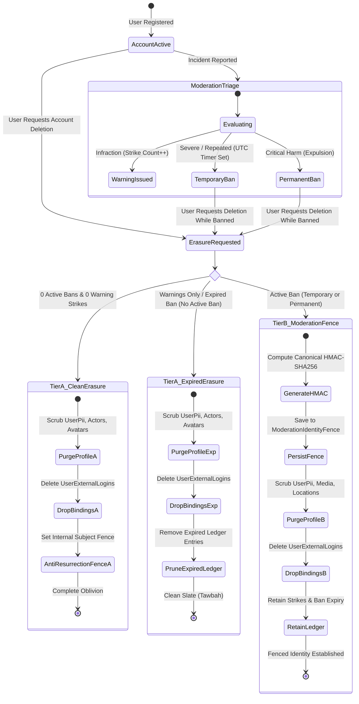
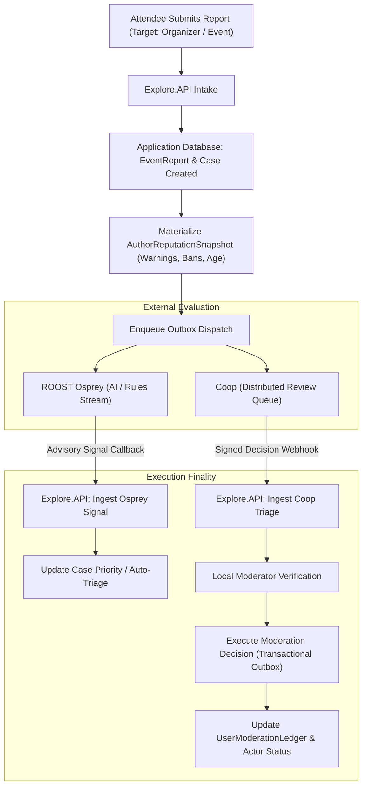

<!-- ABOUTME: I-VSD architectural consultation report on dual-tier account banning, identity fencing, and multi-provider moderation integration. -->
<!-- ABOUTME: Synthesizes GDPR Article 17 erasure with anti-abuse enforcement, provider-agnostic HMAC identity recognition, hierarchical instance vs tenant governance, and enriched Osprey/Coop signals. -->

# I-VSD Architectural Consultation: Dual-Tier Account Banning, Identity Fencing, Hierarchical Multi-Tenant Governance, and Moderation Integration

Last Updated: 2026-10-05

## Review Metadata
- Mode: standalone
- Subject: Dual-Tier Account Banning, Moderation Identity Fencing, Hierarchical Tenant/Instance Governance, and Multi-Provider Integration (Coop, Osprey, Local)
- Workstream: none (architectural consultation and foundational design specification)
- Report kind: architectural-consultation
- Report status: current
- Disposition: ready-for-planning
- Evidence cutoff: 2026-10-05
- Reviewed input: `dev/next/account-moderation-retention.md`, `docs/public/documentation/readme/security-and-identity/privacy-erasure.md`, `docs/public/documentation/readme/integrations-and-ai/coop-and-osprey.md`, `src/Explore.Domain/`, `src/Explore.Application/`, `src/Explore.Infrastructure/`, `src/Explore.Persistence/`
- Supersedes: none

---

## Executive Summary

Community event platforms face a recurring, severe security and governance dilemma: **how to honor an individual's ethical and legal right to erasure without granting malicious actors an instantaneous escape hatch to evade sanctions**. In standard OAuth 2.0, OpenID Connect (OIDC), and decentralized AT Protocol environments, a bad actor who is caught harassing attendees, executing financial scams, or disseminating abusive material can simply click "Delete Account" to trigger a cascading purge under GDPR Article 17 (Right to Erasure), and then immediately authenticate again with Google or Bluesky. Because the prior internal record was erased, the application provisions a virgin user profile with zero warnings, zero strikes, and no active ban. This cycle—known as **strike-reset farming** and **ban-evasion recycling**—leaves community members vulnerable to predatory re-victimization.

Conversely, poorly conceived ban-evasion mechanisms frequently devolve into invasive surveillance systems. Many commercial platforms resort to intrusive device fingerprinting, persistent canvas tracking, cross-site IP logging, or retaining plaintext dossiers of erased users indefinitely. Such practices violate both data protection laws (GDPR data minimization and purpose limitation) and foundational Islamic ethical principles forbidding suspicion, backbiting, and clandestine surveillance (*Taharrum 'an al-Tajassus*).

This report establishes a comprehensive, mathematically grounded, and ethically aligned architectural blueprint: the **Dual-Tier Account Banning, Moderation Identity Fence, and Hierarchical Multi-Tenant Governance Architecture**. It reconciles community protection (*Daf' al-Darar*) and proportional justice (*'Adl*) with fault concealment (*Sitr*), repentance (*Tawbah*), and data stewardship (*Amanah*).

### Core Pillars of the Architecture

1. **Dual-Tier Erasure Model**:
   - **Tier A (Clean Account Lifecycle)**: Users possessing 0 active bans, 0 historical bans, and 0 active warnings receive complete, cascading erasure across all identity, profile, social graph, and OAuth binding tables. No cryptographic fence record is generated or retained. When they return, they are treated as an entirely fresh data subject with zero historical association.
   - **Tier B (Moderated User Lifecycle)**: When a user requests account deletion *while serving an active temporary or permanent ban*, all personal profile data, identifiable credentials, uploaded media, and location records are permanently scrubbed. However, the system computes a deterministic, purpose-bound, version-keyed **HMAC-SHA256 fingerprint** of their verified external identity credentials `(ProviderKind, ValidatedIssuer, CanonicalSubjectOrDid)`. This digest is committed to a specialized `ModerationIdentityFence` table alongside only the authoritative UTC ban expiration timestamp, the governance scope (Instance or Tenant), and progressive strike counts (`WarningCount`, `BanCount`).
   - **Strict Scope Boundary**: In strict alignment with the repo-level architectural decision in `dev/next/account-moderation-retention.md`, **new recognition fingerprints are captured ONLY upon deletion of an actively banned account**. Accounts with expired bans or minor warnings without an active ban are not fingerprinted upon deletion; retaining permanent fingerprints for minor or resolved infractions constitutes disproportionate tracking.

2. **Hierarchical Governance: Instance-Wide vs. Tenant-Level Banning**:
   - **Instance-Wide Banning (Global Protective Sovereignty)**: When an actor commits severe violations that endanger the entire hosting environment (e.g. uploading illegal imagery, CSAM, terroristic threats, malware distribution, or abusive API attacks), the violation threatens the entire platform. In self-hosted and cloud deployments, cloud providers, domain registrars, and VPS hosting providers (e.g., AWS, Hetzner, Cloudflare) hold the **instance administrator legally accountable**; upstream providers will terminate the entire server or storage account, shutting down all innocent tenants. Therefore, **Instance-wide bans override all tenant policies**. An instance-banned identity is blocked across every tenant on the instance and cannot create or attend events anywhere on the system.
   - **Tenant-Level Banning (Community Autonomy)**: Community tenants maintain autonomous boundaries. A user banned within Tenant A (e.g., for violating local community decorum) is restricted exclusively from Tenant A's events, spaces, and RSVPs, while remaining eligible to participate in Tenant B.
   - **Customizable Policies & Governance Locks**: Self-hosters can fully configure their warning thresholds, progressive ban ladders (e.g., 1 day -> 7 days -> 30 days -> Permanent), and strike decay schedules (e.g., warnings expire after 180 days). Instance administrators can use `LockTenantModerationPolicy` to enforce baseline safety minimums while delegating day-to-day community discipline to tenant leaders.

3. **Provider-Agnostic Canonical Normalization**:
   The fence engine abstracts across all authentication authorities supported by ISLAMU Event (Google SSO, AT Protocol decentralized identifiers via CarpaNet, Keycloak OIDC realms, and local self-hosted credentials). The input payload is normalized into a strict, canonical, collision-resistant format: `v1:{provider_kind}:{normalized_issuer}:{canonical_subject_or_did}`. Verified emails possess their own dedicated claim kind: `v1:email:verified:{canonical_email}`. Delimiter collisions and mutable handle manipulation (such as changing a Bluesky handle while keeping the same underlying DID) are cryptographically neutralized.

4. **Restricted Session Experience for Existing Banned Accounts**:
   When an active account is banned, the user is not locked out with an opaque network drop. In accordance with truthfulness (*Sidq*) and due process (*Ihsan*), they are permitted to authenticate, but their session is strictly locked down to a dedicated **Suspended View** enforcing:
   - A visible countdown tied directly to an authoritative server UTC timestamp.
   - A plain-language reason code explaining the sanction.
   - An accessible appeal submission mechanism (*Tazkiyah*).
   - An accessible account deletion path, respecting their continuing sovereignty over their personal data.
   - Strict server-side authorization boundaries on all HTTP and SignalR endpoints.

5. **Context-Enriched Moderation Pipeline (Coop, Osprey, and Local)**:
   Modern moderation systems suffer from "context blindness" when evaluating incoming incident reports. The existing `EventReportProviderEnvelope` and `ReviewCaseEnvelope` contracts are augmented with a lightweight, privacy-preserving **`AuthorReputationSnapshot`** (containing `WarningCount`, `HistoricalBanCount`, `AccountAgeDays`, `VerificationTier`, and `IsPostBanProbation`).
   - **ROOST Osprey (AI/Rules Engine)**: Receives structural reputation signals to modulate priority scoring, dynamically elevating reports involving repeat offenders or probationary accounts.
   - **Coop (Distributed Human Queue)**: Presents historical strike context to human moderators within mirrored tickets, preventing bad actors from exploiting fragmented reviews.
   - **Local Decision Finality**: Consistent with ISLAMU Event's constitutional rules, neither Osprey nor Coop possesses execution authority. Advisory signals are ingested idempotently, and enforcement decisions (suspending an actor, issuing warnings, executing bans) commit exclusively within ISLAMU Event via transactional outbox workers and domain command handlers.

6. **Explicit Rejection of Invasive Tracking**:
   The architecture formally rejects browser fingerprinting, canvas hashing, IP correlation, and speculative machine-learning linking. Evasion detection is strictly bounded to cryptographic identity verification at the authentication gate.

---

## Scope

### In-Scope
- Formalizing the state machine and lifecycle transitions for account banning, restricted sessions, account deletion, and post-deletion re-authentication.
- Designing the hierarchical governance model distinguishing Tenant-level sanctions from Instance-wide protective expulsion.
- Specifying instance-level governance locks and customizable self-hoster settings (strike thresholds, duration ladders, decay schedules).
- Designing the provider-agnostic cryptographic identity fence using keyed HMAC-SHA256, versioned secret IDs, and canonical payload formats.
- Database schema and entity design for `ModerationIdentityFence`, `UserModerationLedger`, and their integration with existing `Explore.Persistence` models.
- Authentication pipeline interception in ASP.NET Core (`CookieAuthenticationEvents`, `OpenIdConnectEvents`, CarpaNet ATProto token exchange, and BFF middleware).
- Moderation pipeline enhancement: passing structured reputation context into Osprey, Coop, and Local moderation queues, while preserving local execution finality.
- Key management, Infisical secret authority configuration (`/api`), and fail-closed security semantics in self-hosted and cloud environments.
- Comprehensive ethical justification under Sunni Islamic Value Sensitive Design principles.

### Out-of-Scope (Exclusions)
- Issuing religious-legal edicts (*fatawa*) or binding Sharia declarations.
- Legal certification of GDPR, UK-GDPR, or CCPA/CPRA compliance.
- Implementation of cross-application Single Sign-On (SSO) brokers outside the ISLAMU Event service boundary.
- Machine-learning content classification algorithms (which remain external capabilities within Osprey).

---

## Claim Boundary

This report provides architectural, technical, and Islamic Value Sensitive Design reasoning. It does not constitute a legal opinion or a religious fatwa. Legal determinations regarding GDPR Article 17(3)(e) (erasure exemptions for legal claims and defense) and Article 6(1)(f) (legitimate interest balancing) must be validated by the operating organization's legal counsel. Theological determinations regarding communal discipline and public harm mitigation are subject to consultation with qualified Sunni scholars.

---

## Findings

The following findings represent the core architectural and ethical tensions identified across the repository's roadmap and current implementation.

```text
+-----------+-----------------------------------------------------------+-------------+----------+
| ID        | Title                                                     | Principle   | Severity |
+-----------+-----------------------------------------------------------+-------------+----------+
| IVSD-F001 | Strike-Reset Vulnerability via Account Deletion           | Daf' al-Dar | Critical |
| IVSD-F002 | Over-Retention Hazard of Fingerprinting Clean Accounts    | Sitr / Adl  | High     |
| IVSD-F003 | Ephemeral Ban Countdowns & Client Clock Tampering         | Sidq / Adl  | High     |
| IVSD-F004 | External IdP Identifier Fragmentation & Delimiter Clashes | Amanah      | High     |
| IVSD-F005 | Context Blindness in Osprey & Coop Evaluation Pipelines   | Ihsan       | Medium   |
| IVSD-F006 | Secret Authority Failure & Re-Identification Exposure     | Amanah      | Critical |
| IVSD-F007 | Invasive Surveillance Creep (Device Fingerprinting)       | Tajassus    | High     |
| IVSD-F008 | Fail-Open Risk on Missing Secret Configuration            | Amanah      | Critical |
| IVSD-F009 | Upstream Host Liability & Instance Collapse Hazard        | Daf' al-Dar | Critical |
| IVSD-F010 | Monolithic vs. Autonomous Community Discipline Tension    | Adl / Shura | High     |
+-----------+-----------------------------------------------------------+-------------+----------+
```

### IVSD-F001: Strike-Reset Vulnerability via Account Deletion

#### Concrete Situation
When a bad actor incurs progressive sanctions (e.g., three warnings for abusive behavior or an active 30-day suspension), they can initiate account deletion under GDPR Article 17. The existing `PrivacyErasureApplier` completely purges all rows in `UserExternalLogins`, `UserPii`, `Actors`, and `Users`. When the individual signs in again five minutes later using the same Google account or AT Protocol DID, the system observes an unrecognized external identity and initiates Just-In-Time (JIT) provisioning. A new `User` is created with a pristine record. The perpetrator has effectively weaponized data protection rights to reset their penalty scale.

#### Provider-Controlled Choice
The platform operator controls the sequence of account erasure and the retention of non-identifying sanction continuity data. The operator must decide whether to discard all historical moderation markers upon deletion or retain an opaque cryptographic recognition mechanism.

#### Mechanism
Without a cryptographic fence, the relationship between external identity credentials `(ProviderKey, ProviderKind)` and internal moderation records is severed. The application database retains no memory that this external subject was sanctioned.

#### Ethical Reasoning
Islamic jurisprudence is governed by the universal legal maxim: *"Harm shall neither be inflicted nor reciprocated"* (*La Darar wa-la Dirar*). Enabling predators and scammers to repeatedly reset their reputations directly harms innocent attendees, undermining the sanctity of community spaces (*Hifz al-Nizam* and *Hifz al-Ird*). Permitting bad-faith evasion under the guise of privacy is a distortion of justice (*'Adl*).

#### Recommendation and Trade-Offs
Mitigate via **Tier B Retained Recognition (`IVSD-M001`)**: Capture a keyed HMAC digest upon deletion of an actively banned account. Trade-off: Requires maintaining a dedicated, cryptographically protected table and key lifecycle.

| Traceability Field | Preserved Value |
|---|---|
| Finding / Lifecycle / Severity | `IVSD-F001` / open / critical |
| Claim Type | Architectural security and governance vulnerability |
| Principles / Domains | *Daf' al-Darar* (Non-Harm), *'Adl* (Justice) / Architecture, Security |
| Stakeholders | Community attendees, event organizers, platform operators |
| Controlled Decision | Account erasure orchestration and sanction persistence |
| Evidence / Validation Level | `E01`: Inspected `PrivacyErasureApplier.cs` lines 190–193 and `dev/next/account-moderation-retention.md` |
| Mitigation | `IVSD-M001` (Dual-Tier Erasure State Machine) |
| Owner / Next Validation | Application & Persistence maintainers / Concurrency and erasure integration tests |
| Escalation | Legal counsel review of legitimate interest documentation |

---

### IVSD-F002: Over-Retention Hazard of Fingerprinting Clean Accounts

#### Concrete Situation
The initial specification blueprint proposed fingerprinting *every* account upon deletion, retaining cryptographic hashes of any user who had accumulated even a single warning or historic incident, regardless of whether they were actively banned. If implemented, millions of ordinary users who committed minor, unintentional mistakes years ago would have permanent cryptographic markers preserved in the system indefinitely.

#### Provider-Controlled Choice
The operator controls the threshold for establishing a recognition fence. They must distinguish between active community defense and permanent surveillance.

#### Mechanism
Computing HMACs for clean users or users with expired warnings turns the identity fence into a persistent shadow tracking index, contradicting the fundamental promise of account deletion.

#### Ethical Reasoning
Islam emphasizes *Sitr* (the covering of faults) and *Tawbah* (rehabilitation and clean slate). The Prophet ﷺ said: *"All the children of Adam are sinners, and the best of sinners are those who repent"* (Sunan al-Tirmidhi). Once a sanction is served or an account was in good standing, retaining tracking digests violates the sacred right to a fresh start (*Huquq al-'Ibad*). Furthermore, under GDPR Article 5(1)(c) (Data Minimization) and Article 17, retaining identifiers without an active legal basis is unlawful.

#### Recommendation and Trade-Offs
Enforce strict **Tier Separation (`IVSD-M002`)**: Clean accounts and accounts with expired/revoked sanctions receive Tier A erasure (zero fence records). New fence records are generated **only** when an account is deleted during an active ban.

| Traceability Field | Preserved Value |
|---|---|
| Finding / Lifecycle / Severity | `IVSD-F002` / open / high |
| Claim Type | Ethical over-collection and privacy compliance failure |
| Principles / Domains | *Sitr* (Concealing Faults), *Tawbah* (Repentance), *Amanah* (Trust) / Privacy, Governance |
| Stakeholders | Reformed users, privacy-conscious attendees, system stewards |
| Controlled Decision | Eligibility criteria for fence fingerprint persistence |
| Evidence / Validation Level | `E02`: Validated against `dev/next/account-moderation-retention.md` lines 62–67 |
| Mitigation | `IVSD-M002` (Tier A vs Tier B Eligibility Gating) |
| Owner / Next Validation | Core privacy engine maintainers / Unit tests on clean erasure paths |
| Escalation | None (Resolved by policy decision) |

---

### IVSD-F003: Ephemeral Ban Countdowns & Client Clock Tampering

#### Concrete Situation
When a ban countdown is calculated or enforced on the client side, or represented solely by a nullable database timestamp without explicit state modeling, several failure modes occur:
1. Malicious clients manipulate local device clocks or client-side JavaScript to trick the UI into displaying an unbanned state.
2. If an account is deleted during a 7-day ban, a naive system that records a new ban duration upon re-registration restarts the 7-day clock, punishing the user twice for the same offense.
3. A nullable timestamp (`DateTime? CurrentBanEndsAt`) cannot distinguish between an account with no ban and an account under permanent expulsion.

#### Provider-Controlled Choice
The platform controls server-side authorization boundaries, explicit domain state modeling, and time authorities.

#### Mechanism
Client-side UI states or ambiguous database schemas allow discrepancy between perceived status and authoritative enforcement.

#### Ethical Reasoning
Truthfulness (*Sidq*) and exact justice (*'Adl*) require that penalties be predictable, bounded, and rigorously accurate. Extending a penalty arbitrarily due to technical flaws constitutes oppression (*Zulm*). Conversely, allowing client-side tampering destroys accountability.

#### Recommendation and Trade-Offs
Implement **Authoritative UTC Expiry with Explicit State Modeling (`IVSD-M003`)**: Define an explicit `BanKind` enum (`None`, `Temporary`, `Permanent`). The server alone evaluates expiry against an authoritative `TimeProvider.GetUtcNow()`. UI countdowns are strictly decorative representations of server-provided claims.

| Traceability Field | Preserved Value |
|---|---|
| Finding / Lifecycle / Severity | `IVSD-F003` / open / high |
| Claim Type | Domain modeling and authorization integrity failure |
| Principles / Domains | *'Adl* (Justice), *Sidq* (Truthfulness) / Domain, API Security |
| Stakeholders | Sanctioned users, moderators, system administrators |
| Controlled Decision | Ban state representation and authorization policy evaluation |
| Evidence / Validation Level | `E03`: Inspected `dev/next/account-moderation-retention.md` lines 97–116 |
| Mitigation | `IVSD-M003` (Server-Authoritative UTC Ban Lifecycle) |
| Owner / Next Validation | Application authorization maintainers / Clock-skew and tamper tests |
| Escalation | None |

---

### IVSD-F004: External IdP Identifier Fragmentation & Delimiter Clashes

#### Concrete Situation
Different identity providers present disparate identifier formats:
- Google SSO presents an immutable numeric `sub` (e.g., `109283746591029384756`) from issuer `https://accounts.google.com`.
- AT Protocol presents a decentralized identifier `did:plc:z72i7hdynmk6r22z27h6tvur` from an external PDS, alongside a mutable handle (e.g., `@alice.bsky.social`).
- Keycloak presents a UUIDv4 `sub` within a specific realm URL.
- Local auth presents an internal email and password hash.

If an identity fence concatenates raw strings with simple delimiters (e.g. `google:https://accounts.google.com:12345`), attacker-controlled delimiters (colons, slashes, whitespace) can cause delimiter collision attacks, leading to false positives or bypasses. Furthermore, if the system hashes mutable handles instead of immutable DIDs, an ATProto user can evade a ban simply by updating their handle on Bluesky.

#### Provider-Controlled Choice
The engineering team designs the canonical serialization format and selects which provider claims constitute the stable identity anchor.

#### Mechanism
Inconsistent canonicalization yields unpredictable HMAC outputs or binds sanctions to mutable presentation layers.

#### Ethical Reasoning
Justice (*'Adl*) demands precision: the innocent must never be misidentified as banned (*La Darar*), and bad actors must not escape through technical loopholes (*Amanah*).

#### Recommendation and Trade-Offs
Adopt **Provider-Agnostic Canonical Normalization (`IVSD-M004`)**: Mandate strict parsing into `(AuthenticationProviderKind, NormalizedIssuer, CanonicalSubjectOrDid)`. Enforce length bounds, lowercasing, and immutable DID resolution.

| Traceability Field | Preserved Value |
|---|---|
| Finding / Lifecycle / Severity | `IVSD-F004` / open / high |
| Claim Type | Cryptographic input vulnerability & identity resolution flaw |
| Principles / Domains | *'Adl* (Justice), *Amanah* (Trust) / Cryptography, Identity |
| Stakeholders | Identity federation adopters, decentralized network participants |
| Controlled Decision | Claim selection and canonical HMAC input formatting |
| Evidence / Validation Level | `E04`: Analyzed `UserExternalLogin.cs` and `AuthenticationProviderKindExtensions.cs` |
| Mitigation | `IVSD-M004` (Canonical Payload Engine) |
| Owner / Next Validation | Infrastructure security engineers / Hash collision and normalization test suite |
| Escalation | None |

---

### IVSD-F005: Context Blindness in Osprey & Coop Evaluation Pipelines

#### Concrete Situation
When attendees report abusive behavior, the event is analyzed by ROOST Osprey (rules/AI engine) and mirrored to Coop (review queue). Currently, `EventReportProviderEnvelope` and `ReviewCaseEnvelope` transmit only event-level metadata (`TenantId`, `ReportId`, `EventId`, `CaseId`, `ReasonCode`, `PriorityCode`). Neither external system receives any behavioral history about the actor:
- Is this the organizer's first reported event, or have they accumulated 4 warnings?
- Did this account return from an expired temporary ban under probation?
Because Osprey and Coop lack this context, repeat offenders receive the same low-priority classification as innocent first-time organizers who made an inadvertent categorization error.

#### Provider-Controlled Choice
The platform controls the schema and data enrichment applied to moderation envelopes before dispatching to external providers.

#### Mechanism
Data starvation in external pipelines forces AI models and human reviewers to evaluate every incident in isolation, ignoring escalating patterns of harm.

#### Ethical Reasoning
The principle of *Ihsan* (excellence and thoroughness) requires doing things with care and wisdom. Treating a hardened predator identically to an unintentional violator is unjust (*Zulm*). Supplying proportional, non-PII behavioral context enables equitable, context-aware decisions.

#### Recommendation and Trade-Offs
Implement **Enriched Moderation Envelopes (`IVSD-M005`)**: Add an `AuthorReputationSnapshot` to provider envelopes containing bounded, pseudonymized counters (`WarningCount`, `BanCount`, `AccountAgeDays`, `IsPostBanProbation`). Do not transmit personal data.

| Traceability Field | Preserved Value |
|---|---|
| Finding / Lifecycle / Severity | `IVSD-F005` / open / medium |
| Claim Type | Observability and moderation intelligence gap |
| Principles / Domains | *Ihsan* (Excellence), *'Adl* (Justice) / Integration, AI Moderation |
| Stakeholders | Community moderators, incident triage operators, attendees |
| Controlled Decision | Payload definition for Osprey and Coop webhook dispatches |
| Evidence / Validation Level | `E05`: Examined `OspreyModerationSignalProvider.cs` and `CoopReviewQueueProvider.cs` |
| Mitigation | `IVSD-M005` (Reputation-Enriched Provider Contracts) |
| Owner / Next Validation | Moderation integration team / End-to-end signal evaluation tests |
| Escalation | None |

---

### IVSD-F006: Secret Authority Failure & Re-Identification Exposure

#### Concrete Situation
The cryptographic fence relies on symmetric secret keys (`PRIVACY_ERASURE_IDENTITY_FENCE_KEY`). If the secret key is lost, rotated without a transition plan, or hardcoded in configuration, severe failures occur:
1. **Key Loss**: The system can no longer recognize incoming identities against existing fence records; all active bans are silently invalidated, admitting banned users freely.
2. **Key Leakage**: Because HMAC-SHA256 is deterministic, an adversary who gains read access to the database *and* the key can perform dictionary attacks against lists of email addresses or public ATProto DIDs to determine exactly which public figures were banned.

#### Provider-Controlled Choice
The operator dictates secret management architecture, key rotation workflows, and storage isolation.

#### Mechanism
Inadequate secret lifecycle governance compromises both enforcement integrity and subject privacy.

#### Ethical Reasoning
Safeguarding cryptographic secrets is a fundamental *Amanah* (sacred trust). Betraying this trust leads to communal vulnerability and privacy violations.

#### Recommendation and Trade-Offs
Implement **Managed Secret Authority with Bounded Key IDs (`IVSD-M006`)**: Manage keys exclusively via Infisical at the `/api` folder path. Store `KeyId` alongside each fingerprint. Support dual-key verification during rotation periods. Treat fence digests as pseudonymous personal data under strict access control.

| Traceability Field | Preserved Value |
|---|---|
| Finding / Lifecycle / Severity | `IVSD-F006` / open / critical |
| Claim Type | Cryptographic custody and key lifecycle vulnerability |
| Principles / Domains | *Amanah* (Trust / Responsible Stewardship) / Operations, Security |
| Stakeholders | Platform operators, data subjects, compliance officers |
| Controlled Decision | Infisical key configuration, rotation protocol, and database access controls |
| Evidence / Validation Level | `E06`: Audited `PrivacyErasureAuthority` and `docs/public/.../privacy-erasure.md` |
| Mitigation | `IVSD-M006` (Infisical Key Governance & Multi-Key Transition) |
| Owner / Next Validation | DevOps & Security engineers / Key rotation drill rehearsal |
| Escalation | Formal security review before release |

---

### IVSD-F007: Invasive Surveillance Creep (Device Fingerprinting)

#### Concrete Situation
In the anti-abuse industry, vendors frequently push for "device fingerprinting" (probing browser WebGL/Canvas rendering, audio context, installed fonts, battery status, and local IP addresses via WebRTC) to catch users switching between accounts.

#### Provider-Controlled Choice
The engineering team chooses whether to deploy client-side tracking libraries or restrict identification to authenticated credentials.

#### Mechanism
Client-side fingerprinting scripts covertly extract hardware and browser configuration metrics without meaningful user consent.

#### Ethical Reasoning
The Qur'an explicitly commands: *"O you who have believed, avoid much [negative] assumption... and do not spy"* (Surah Al-Hujurat 49:12). Clandestine device fingerprinting is a direct manifestation of *Tajassus* (invasive surveillance). It treats every community member as a presumptive suspect, harvesting personal hardware signatures without authorization.

#### Recommendation and Trade-Offs
Enforce **Explicit Evasion Boundaries (`IVSD-M007`)**: Formally prohibit device fingerprinting, hardware tracking, and speculative cross-account heuristics. Accept that if a bad actor creates an entirely new external identity with a fresh email, the system will not preemptively link them. Community defense relies on behavioral moderation upon observable infractions, not preemptive surveillance.

| Traceability Field | Preserved Value |
|---|---|
| Finding / Lifecycle / Severity | `IVSD-F007` / open / high |
| Claim Type | Unethical surveillance creep |
| Principles / Domains | *Taharrum 'an al-Tajassus* (Prohibition of Spying), *Hurmat al-Insan* (Human Dignity) / Ethics, UX |
| Stakeholders | All community members, privacy advocates |
| Controlled Decision | Selection of permissible fraud prevention mechanisms |
| Evidence / Validation Level | `E07`: Grounded in `dev/next/account-moderation-retention.md` lines 208–213 |
| Mitigation | `IVSD-M007` (Surveillance Prohibition & Bounded Credential Matching) |
| Owner / Next Validation | Architecture steward & I-VSD reviewer / Code review gating against tracking scripts |
| Escalation | Escalate any third-party anti-fraud SDK proposal to I-VSD review |

---

### IVSD-F008: Fail-Open Risk on Missing Secret Configuration

#### Concrete Situation
The draft specification suggested that if a self-hoster fails to configure the identity fence key in environment variables, the system should log a diagnostic warning and silently disable ban-evasion fencing. In a multi-tenant or enterprise environment, if a secret provider or Infisical agent fails to inject `PRIVACY_ERASURE_IDENTITY_FENCE_KEY` during a restart, the entire admission pipeline would silently degrade into a "fail-open" state: banned users attempting re-registration would pass through unchecked.

#### Provider-Controlled Choice
The developers establish startup gating and health check policies.

#### Mechanism
Permissive startup behavior favors immediate availability over security fail-closed guarantees.

#### Ethical Reasoning
Preserving community safety is an imperative duty (*Wajib*). Silently degrading security boundaries without explicit human authorization is a breach of *Amanah*. A system configured to enforce bans must not secretly waive them due to environmental faults.

#### Recommendation and Trade-Offs
Enforce **Explicit Fail-Closed Admission Semantics (`IVSD-M008`)**: If moderation retention is explicitly configured/enabled, missing or unreadable key authority MUST fail closed, rejecting admission for affected paths and halting startup with an actionable error. If an operator intentionally runs in `Disabled` mode, this must be an explicit, deliberate configuration flag, never an accidental fallback.

| Traceability Field | Preserved Value |
|---|---|
| Finding / Lifecycle / Severity | `IVSD-F008` / open / critical |
| Claim Type | Security fail-closed architectural failure |
| Principles / Domains | *Amanah* (Trust), *Daf' al-Darar* (Non-Harm) / Operations, Architecture |
| Stakeholders | Instance operators, event attendees |
| Controlled Decision | Startup gate validation and authentication boundary exception handling |
| Evidence / Validation Level | `E08`: Inspected `PrivacyErasureStartupGate.cs` and `dev/next/account-moderation-retention.md` lines 144–155 |
| Mitigation | `IVSD-M008` (Fail-Closed Startup Gate and Health Checks) |
| Owner / Next Validation | Platform infrastructure team / Startup gate integration tests |
| Escalation | None |

---

### IVSD-F009: Upstream Host Liability & Instance Collapse Hazard

#### Concrete Situation
In multi-tenant deployments, all tenants share physical infrastructure: an S3/MinIO bucket for media storage, a PostgreSQL database, an outbound mail provider, and a single VPS or Kubernetes cluster registered to the instance owner. If a rogue tenant user uploads illegal content (e.g. child sexual abuse material, severe terrorist propaganda, or copyrighted piracy files) and the tenant administrator refuses or delays action due to a permissive local policy, the upstream infrastructure provider (AWS, Hetzner, Cloudflare) will issue an abuse takedown or immediately terminate the **entire VPS and storage account**. This catastrophic event collapses the entire instance, wiping out access for all other innocent, law-abiding community tenants.

#### Provider-Controlled Choice
The platform architecture must define whether moderation sovereignty resides entirely at the tenant level or whether the instance administrator possesses unchallengeable protective authority over severe, systemic threats.

#### Mechanism
Without instance-wide enforcement and immutable safety floors, a single bad-faith tenant can weaponize local autonomy to imperil the shared physical host.

#### Ethical Reasoning
The Islamic legal maxim dictates: *"A specific harm is borne to avert a general catastrophe"* (*Yutahammal al-darar al-khass li-daf' al-darar al-'amm*). The preservation of the whole platform and all its innocent communities (*Hifz al-Kull*) unquestionably takes precedence over the autonomy of a single tenant. The instance steward holds ultimate legal and ethical responsibility (*Amanah*) for the hardware boundary.

#### Recommendation and Trade-Offs
Implement **Instance-Wide Protective Banning with Immutable Governance Locks (`IVSD-M009`)**: Create an `InstanceModerationScope` that overrides tenant-level settings for legal, infrastructural, and physical safety violations. Banning an actor at the instance level immediately expels them from all tenants and wipes their content from shared storage.

| Traceability Field | Preserved Value |
|---|---|
| Finding / Lifecycle / Severity | `IVSD-F009` / open / critical |
| Claim Type | Infrastructural and legal catastrophic risk |
| Principles / Domains | *Daf' al-Darar* (Harm Prevention), *Amanah* (Responsible Stewardship) / Governance, Infrastructure |
| Stakeholders | Instance operators, all platform tenants, infrastructure providers |
| Controlled Decision | Moderation scope hierarchy and administrative override authority |
| Evidence / Validation Level | `E09`: Audited `TenantDelegationSettingDefinitions.cs` and `StorageSettingDefinitions.cs` |
| Mitigation | `IVSD-M009` (Instance Protective Sovereignty & Global Banning) |
| Owner / Next Validation | Platform governance architects / Multi-tenant boundary and lockdown tests |
| Escalation | Legal counsel review of safe-harbor and hosting liability requirements |

---

### IVSD-F010: Monolithic vs. Autonomous Community Discipline Tension

#### Concrete Situation
Conversely, if an instance administrator imposes rigid, top-down disciplinary rules for minor, culture-specific infractions, diverse communities are denied self-determination. A youth organization, an academic conference, and a local mosque community may have vastly different thresholds for warnings, etiquette, dress codes, or discussion topics. Forcing a single global warning threshold (e.g., "1 strike = ban") on all tenants destroys community self-governance.

#### Provider-Controlled Choice
The platform designers must define the boundary between immutable instance safety baselines and configurable tenant community discipline.

#### Mechanism
Hardcoded moderation thresholds eliminate tenant-level flexibility, whereas unconstrained delegation creates the liability crisis identified in `IVSD-F009`.

#### Ethical Reasoning
Sunni political ethics champions *Shura* (mutual consultation) and respecting legitimate customary variations (*al-'Adah Muhakkamah*) across communities, provided they do not violate universal prohibitions. Imposing needless uniformity is oppressive (*Ta'assuf*).

#### Recommendation and Trade-Offs
Implement **Hierarchical Settings Cascade with Configurable Warning Ladders (`IVSD-M010`)**: Provide self-hosters and tenant administrators with fully customizable settings:
1. `Moderation:WarningThresholdBeforeBan` (e.g., 1 to 10 warnings).
2. `Moderation:BanDurationLadder` (e.g., 24h -> 7d -> 30d -> Permanent).
3. `Moderation:StrikeDecayWindowDays` (e.g., strikes expire after 90, 180, or 365 days of good conduct).
Instance administrators can lock specific settings via `LockTenantModerationPolicy` when operating enterprise or managed environments, while leaving them open for decentralized, autonomous tenants.

| Traceability Field | Preserved Value |
|---|---|
| Finding / Lifecycle / Severity | `IVSD-F010` / open / high |
| Claim Type | Community autonomy and governance proportionality gap |
| Principles / Domains | *'Adl* (Justice), *Shura* (Consultation), *al-'Adah Muhakkamah* (Custom) / Governance, Tenancy |
| Stakeholders | Tenant organizers, community leaders, instance administrators |
| Controlled Decision | Granularity of settings cascade in `Explore.Domain.Settings` |
| Evidence / Validation Level | `E10`: Inspected `GovernanceSettingKeys.cs` and `TenantDelegationSettingDefinitions.cs` |
| Mitigation | `IVSD-M010` (Customizable Moderation Policy Cascade & Governance Locks) |
| Owner / Next Validation | Core application settings maintainers / Hierarchical settings resolution tests |
| Escalation | None |

---

## Recommendations & Architectural Blueprints

### Blueprint 1: Dual-Tier Erasure State Machine & Lifecycle Transitions



#### Re-Authentication Flow for Fenced Identities

```mermaid
sequenceDiagram
    autonumber
    actor User as Sanctioned Individual
    participant IdP as External IdP (Google / ATProto / Keycloak)
    participant Gate as ASP.NET Core Admission Gate
    participant FenceStore as Moderation Identity Fence Store
    participant AppDB as Event Application DB

    User->>IdP: Authenticate (OAuth / DPoP)
    IdP-->>Gate: Validated Token / Ticket (Claims: Issuer + Subject/DID)
    
    Gate->>Gate: Compute Canonical Keyed HMAC-SHA256
    Gate->>FenceStore: Query Active Fence (Digest, CurrentKeyId)

    alt Matching Fence Found: Active Ban (CurrentBanEndsAt > UtcNow)
        FenceStore-->>Gate: Fence Record (Active Temporary/Permanent Ban)
        Gate-->>User: HTTP 403 Forbidden / Redirect to /auth/suspended<br/>(Display Ban Expiration & Reason; Zero User Provisioning)
    else Matching Fence Found: Ban Expired (CurrentBanEndsAt <= UtcNow)
        FenceStore-->>Gate: Fence Record (Expired Ban, Strike History)
        Gate->>AppDB: JIT Provision Fresh User (New UUIDv7)
        Gate->>AppDB: Attach Carried-Over WarningCount & Probation Flag
        AppDB-->>Gate: User Provisioned (Probationary State)
        Gate-->>User: Authenticated Session (Standard App Access under Probation)
    else No Matching Fence
        FenceStore-->>Gate: Not Found
        Gate->>AppDB: JIT Provision Standard Fresh User (New UUIDv7)
        AppDB-->>Gate: User Provisioned
        Gate-->>User: Authenticated Session (Clean User)
    end
```

---

### Blueprint 2: Provider-Agnostic Canonical Payload Normalization

To guarantee collision resistance, domain portability, and prevent handle-manipulation evasion, all incoming authentication tokens must be normalized before computing HMAC digests.

#### Normalization Rules
1. **Provider Kind**: Must map to the closed domain enum `AuthenticationProviderKind` (`Keycloak = 1`, `Atproto = 2`, `Google = 3`, `Local = 4`).
2. **Issuer Normalization**:
   - Google: Must be strictly validated as `https://accounts.google.com`.
   - Keycloak: Lowercase, stripped of trailing slashes, normalized to scheme + host + realm path.
   - ATProto: Normalized to the hosting PDS origin or canonical root authority.
   - Local: `local:instance`.
3. **Subject / DID Normalization**:
   - Google: Bounded numeric `sub` claim.
   - Keycloak: Bounded UUIDv4 string representation.
   - ATProto: **Must strictly use the immutable Decentralized Identifier (`did:plc:...` or `did:web:...`)**, extracted from validated DPoP token claims. The user-facing handle (e.g., `@alice.bsky.social`) is strictly rejected for cryptographic fencing.
   - Local: Bounded local subject identifier.
4. **Canonical Delimiter Syntax**:
   `v1:{provider_kind}:{normalized_issuer}:{canonical_subject_or_did}`

#### Canonical Engine Contract

```csharp
namespace Explore.Application.Contracts.Security;

public interface IIdentityFingerprintService
{
    string ComputeFingerprint(
        AuthenticationProviderKind providerKind, 
        string issuer, 
        string subjectOrDid);

    string ComputeEmailFingerprint(string verifiedEmail);

    string CurrentKeyId { get; }
    bool IsConfigured { get; }
}
```

---

### Blueprint 3: Relational Data Model & Entity Specifications

The persistence model must be portable across PostgreSQL, SQLite, and SQL Server, avoiding engine-specific lock syntax while guaranteeing serializability.

```sql
-- Table: ModerationIdentityFences
CREATE TABLE moderation_identity_fences (
    id UUID PRIMARY KEY,
    identity_fingerprint VARCHAR(64) NOT NULL,
    key_id VARCHAR(64) NOT NULL,
    provider_kind INT NOT NULL,
    scope_kind INT NOT NULL, -- 1 = InstanceWide, 2 = TenantScoped
    tenant_id UUID NULL,     -- NULL if InstanceWide, Tenant UUID if TenantScoped
    ban_kind INT NOT NULL,   -- 1 = None, 2 = Temporary, 3 = Permanent
    warning_count INT NOT NULL DEFAULT 0,
    ban_count INT NOT NULL DEFAULT 0,
    current_ban_ends_at TIMESTAMPTZ NULL,
    last_incident_at TIMESTAMPTZ NOT NULL,
    retain_until TIMESTAMPTZ NOT NULL,
    moderation_ledger_id UUID NOT NULL,
    created_at TIMESTAMPTZ NOT NULL DEFAULT NOW(),
    updated_at TIMESTAMPTZ NOT NULL DEFAULT NOW()
);

-- Unique index for lookup
CREATE UNIQUE INDEX uq_moderation_identity_fences_lookup 
ON moderation_identity_fences (identity_fingerprint, key_id, scope_kind, COALESCE(tenant_id, '00000000-0000-0000-0000-000000000000'::uuid));

-- Operational index for expiry sweeps and pruning
CREATE INDEX ix_moderation_identity_fences_expiry 
ON moderation_identity_fences (retain_until);

-- Table: UserModerationLedgers
CREATE TABLE user_moderation_ledgers (
    id UUID PRIMARY KEY,
    user_id UUID NOT NULL,
    tenant_id UUID NULL,     -- NULL if tracking global reputation, Tenant UUID if tenant-scoped
    warning_count INT NOT NULL DEFAULT 0,
    ban_count INT NOT NULL DEFAULT 0,
    is_suspended BOOLEAN NOT NULL DEFAULT FALSE,
    scope_kind INT NOT NULL DEFAULT 1, -- 1 = InstanceWide, 2 = TenantScoped
    ban_kind INT NOT NULL DEFAULT 1,   -- 1 = None, 2 = Temporary, 3 = Permanent
    banned_until TIMESTAMPTZ NULL,
    last_incident_at TIMESTAMPTZ NULL,
    is_on_probation BOOLEAN NOT NULL DEFAULT FALSE,
    probation_expires_at TIMESTAMPTZ NULL,
    concurrency_stamp UUID NOT NULL,
    created_at TIMESTAMPTZ NOT NULL DEFAULT NOW(),
    updated_at TIMESTAMPTZ NOT NULL DEFAULT NOW()
);

CREATE UNIQUE INDEX uq_user_moderation_ledgers_user_scope 
ON user_moderation_ledgers (user_id, scope_kind, COALESCE(tenant_id, '00000000-0000-0000-0000-000000000000'::uuid));
```

#### EF Core Entity Design

```csharp
namespace Explore.Domain;

public sealed class ModerationIdentityFence : IAuditableEntity
{
    public Guid Id { get; set; }
    public required string IdentityFingerprint { get; set; }
    public required string KeyId { get; set; }
    public AuthenticationProviderKind ProviderKind { get; set; }
    public ModerationScopeKind ScopeKind { get; set; }
    public Guid? TenantId { get; set; }
    public BanKind BanKind { get; set; }
    public int WarningCount { get; set; }
    public int BanCount { get; set; }
    public DateTime? CurrentBanEndsAt { get; set; }
    public DateTime LastIncidentAt { get; set; }
    public DateTime RetainUntil { get; set; }
    public Guid ModerationLedgerId { get; set; }

    public DateTime CreatedAt { get; set; }
    public Guid? CreatedBy { get; set; }
    public DateTime? UpdatedAt { get; set; }
    public Guid? UpdatedBy { get; set; }
}

public enum ModerationScopeKind
{
    InstanceWide = 1,
    TenantScoped = 2
}

public enum BanKind
{
    None = 1,
    Temporary = 2,
    Permanent = 3
}
```

---

### Blueprint 4: Authentication Boundary Middleware & Hierarchical Enforcement

In ASP.NET Core, interception occurs before cookie creation or user provisioning.

```csharp
public sealed class ModerationAdmissionInterceptor
{
    private readonly IIdentityFingerprintService _fingerprintService;
    private readonly IModerationIdentityFenceRepository _fenceRepository;
    private readonly TimeProvider _timeProvider;
    private readonly ILogger<ModerationAdmissionInterceptor> _logger;

    public async Task EvaluateTicketAsync(TicketReceivedContext context, Guid? currentTenantId = null)
    {
        if (!_fingerprintService.IsConfigured)
        {
            throw new InvalidOperationException("Moderation identity fence authority is unconfigured.");
        }

        var (providerKind, issuer, subject) = ResolveClaims(context.Principal, context.Scheme.Name);
        if (string.IsNullOrEmpty(subject)) return;

        var fingerprint = _fingerprintService.ComputeFingerprint(providerKind, issuer, subject);
        
        // 1. Check Instance-Wide Fence First (Global Protective Sovereignty)
        var instanceFence = await _fenceRepository.FindInstanceFenceAsync(
            fingerprint, 
            _fingerprintService.CurrentKeyId, 
            context.HttpContext.RequestAborted);

        DateTime nowUtc = _timeProvider.GetUtcNow().UtcDateTime;

        if (instanceFence is not null && IsBanActive(instanceFence, nowUtc))
        {
            RejectAdmission(context, instanceFence, isInstanceWide: true);
            return;
        }

        // 2. Check Tenant-Scoped Fence if navigating to a specific tenant
        if (currentTenantId.HasValue)
        {
            var tenantFence = await _fenceRepository.FindTenantFenceAsync(
                fingerprint,
                currentTenantId.Value,
                _fingerprintService.CurrentKeyId,
                context.HttpContext.RequestAborted);

            if (tenantFence is not null && IsBanActive(tenantFence, nowUtc))
            {
                RejectAdmission(context, tenantFence, isInstanceWide: false);
                return;
            }
        }

        // 3. Attach Sanction Continuity for Expired Bans
        var activeFence = instanceFence ?? (currentTenantId.HasValue 
            ? await _fenceRepository.FindTenantFenceAsync(fingerprint, currentTenantId.Value, _fingerprintService.CurrentKeyId, context.HttpContext.RequestAborted)
            : null);

        if (activeFence is not null && (activeFence.WarningCount > 0 || activeFence.BanCount > 0))
        {
            context.HttpContext.Items["PendingModerationContinuity"] = new ModerationContinuityContext(
                activeFence.WarningCount,
                activeFence.BanCount,
                activeFence.ModerationLedgerId);
        }
    }

    private static bool IsBanActive(ModerationIdentityFence fence, DateTime nowUtc) =>
        fence.BanKind == BanKind.Permanent || 
        (fence.BanKind == BanKind.Temporary && fence.CurrentBanEndsAt > nowUtc);

    private static void RejectAdmission(TicketReceivedContext context, ModerationIdentityFence fence, bool isInstanceWide)
    {
        context.Fail(new UserBannedException(fence.BanKind, fence.CurrentBanEndsAt, isInstanceWide));
        context.Response.StatusCode = StatusCodes.Status403Forbidden;
        context.Response.Redirect($"/auth/suspended?kind={fence.BanKind}&until={fence.CurrentBanEndsAt:O}&scope={(isInstanceWide ? "instance" : "tenant")}");
        context.HandleResponse();
    }
}
```

---

### Blueprint 5: Context-Enriched Integration Pipeline for Osprey, Coop, and Local Moderation

To eliminate context blindness without leaking PII, augment `EventReportProviderEnvelope` and `ReviewCaseEnvelope` with `AuthorReputationSnapshot`.

```csharp
namespace Explore.Application.Features.EventReporting.Models;

public sealed record AuthorReputationSnapshot(
    int WarningCount,
    int HistoricalBanCount,
    int AccountAgeDays,
    bool IsOnProbation,
    string VerificationTier);

// Enriched EventReportProviderEnvelope
public sealed record EventReportProviderEnvelope(
    Guid TenantId,
    Guid ReportId,
    Guid EventId,
    Guid CaseId,
    Guid CaseConcurrencyStamp,
    string ReasonCode,
    string QueueCode,
    string ReportStatusCode,
    string CaseStatusCode,
    string PriorityCode,
    DateTime SubmittedAtUtc,
    DateTime? LastUpdatedAtUtc,
    string IdempotencyKey,
    string? CorrelationId,
    AuthorReputationSnapshot? AuthorReputation = null, // Enriched context
    EventReportProviderEvidenceMode EvidenceMode = EventReportProviderEvidenceMode.MetadataOnly,
    EventReportProviderTargetScope ProviderTargetScope = EventReportProviderTargetScope.Instance,
    string ProviderTargetId = "instance",
    string? ProviderEndpointUrl = null,
    string? ProviderApiKey = null);
```

#### Moderation Coordination Architecture



---

### Blueprint 6: Secret Authority Management & Infisical Governance

1. **Path & Naming**:
   - Location: Infisical API workspace folder `/api` (never `/privacy` or hardcoded in `appsettings.json`).
   - Secret Keys:
     - `PRIVACY_ERASURE_IDENTITY_FENCE_KEY`: Base64-encoded 256-bit symmetric key.
     - `PRIVACY_ERASURE_IDENTITY_FENCE_KEY_ID`: Bounded string identifying active key (e.g. `identity-fence-v1`).
2. **Rotation Protocol**:
   - Dual-read window: When rotating to `v2`, retain `v1` in an authorized `SecondaryKeyList`.
   - On incoming OAuth authentication: Evaluate against `v2` first; if missed, evaluate against valid historical keys.
   - On new fence creation: Always compute using the primary `v2` key.
3. **Fail-Closed Behavior**:
   - If `Moderation:RetentionEnabled = true` and keys are unconfigured or unreadable, `PrivacyErasureStartupGate` halts process startup, preventing unmonitored admissions.

---

### Blueprint 7: Hierarchical Settings Cascade & Governance Locks

To support complete self-hoster customizability while maintaining instance protective sovereignty, define settings definitions across scopes:

```csharp
namespace Explore.Domain.Settings.Definitions;

public static class ModerationSettingDefinitions
{
    // Instance-level lock to prevent tenant admins from waiving moderation
    public static readonly SettingDefinition LockTenantModerationPolicy = new(
        Key: "TenantDelegation:LockTenantModerationPolicy",
        ValueType: SettingValueType.Boolean,
        DefaultValue: "false",
        Category: "TenantDelegation",
        Description: "Whether tenant administrators can customize their own warning and banning thresholds",
        MinScope: SettingScope.Instance,
        MaxScope: SettingScope.Instance,
        IsLockable: false);

    // Customizable warning threshold before automated temporary ban
    public static readonly SettingDefinition WarningThresholdBeforeBan = new(
        Key: "Moderation:WarningThresholdBeforeBan",
        ValueType: SettingValueType.Integer,
        DefaultValue: "3",
        Category: "ModerationPolicy",
        Description: "Number of cumulative active warnings that automatically trigger a temporary suspension",
        MinScope: SettingScope.Instance,
        MaxScope: SettingScope.Tenant,
        IsLockable: true);

    // Customizable progressive duration ladder (in hours)
    public static readonly SettingDefinition ProgressiveBanDurationLadderHours = new(
        Key: "Moderation:ProgressiveBanDurationLadderHours",
        ValueType: SettingValueType.String,
        DefaultValue: "24,168,720", // 1 day, 7 days, 30 days
        Category: "ModerationPolicy",
        Description: "Comma-separated progressive ban durations in hours for sequential strikes",
        MinScope: SettingScope.Instance,
        MaxScope: SettingScope.Tenant,
        IsLockable: true);

    // Customizable strike decay window (in days)
    public static readonly SettingDefinition StrikeDecayWindowDays = new(
        Key: "Moderation:StrikeDecayWindowDays",
        ValueType: SettingValueType.Integer,
        DefaultValue: "180",
        Category: "ModerationPolicy",
        Description: "Days of good behavior after which an active warning strike decays and is forgiven",
        MinScope: SettingScope.Instance,
        MaxScope: SettingScope.Tenant,
        IsLockable: true);
}
```

---

### Blueprint 8: Ethical Boundary Definition (Surveillance Prohibition)

```text
+---------------------------------------------------------------------------------------------------+
| THE SURVEILLANCE BOUNDARY (TAHARRUM 'AN AL-TAJASSUS)                                              |
+---------------------------------------------------------------------------------------------------+
| STRICTLY PERMITTED                                  | STRICTLY FORBIDDEN (HARAM / PROHIBITED)     |
+---------------------------------------------------------------------------------------------------+
| 1. Cryptographic HMAC of presented credentials.     | 1. Browser canvas or WebGL fingerprinting.  |
| 2. Canonical matching of validated ATProto DIDs.    | 2. Audio context or font enumeration.       |
| 3. Explicit verified-email claim matching.          | 3. IP address tracking across sessions.     |
| 4. Server-side authoritative UTC expiry timers.     | 4. Speculative cross-account graph linking. |
| 5. Proportional, transparent strike accumulation.   | 5. Third-party clandestine device SDKs.     |
| 6. Instance-wide protective expulsion for harm.     | 6. Covert surveillance of innocent tenants. |
+---------------------------------------------------------------------------------------------------+
```

---

## Stakeholders

```text
+-----------------------+----------------------------------+----------------------------------------+
| Stakeholder Group     | Primary Interests                | Impact of Recommendation               |
+-----------------------+----------------------------------+----------------------------------------+
| Community Attendees   | Safety, freedom from harassment  | Protected from re-victimization by bad |
|                       | and financial fraud.             | actors resetting their penalty scale.  |
+-----------------------+----------------------------------+----------------------------------------+
| Reformed Users        | Dignity, right to start fresh,   | Guaranteed clean-slate deletion when   |
|                       | relief from permanent tracking.  | in good standing (Tier A); no shadow   |
|                       |                                  | profiles maintained indefinitely.      |
+-----------------------+----------------------------------+----------------------------------------+
| Human Moderators      | Contextual clarity, reduced      | Given behavioral strike history in     |
|                       | alert fatigue, fair hearings.    | Coop/Local queues to make informed,    |
|                       |                                  | equitable decisions.                   |
+-----------------------+----------------------------------+----------------------------------------+
| Tenant Organizers     | Community autonomy, customized   | Complete freedom to tailor warning     |
|                       | rules and discipline standards.  | thresholds and ladders to local culture|
+-----------------------+----------------------------------+----------------------------------------+
| Instance Operators    | Upstream host safety, legal safe | Protected from total VPS/S3 takedowns  |
|                       | harbor, zero infrastructure loss | via instance-wide expulsion powers.    |
+-----------------------+----------------------------------+----------------------------------------+
```

---

## I-VSD Principles And Domains

| Principle | Meaning in Context | Domain | Architectural Manifestation |
|---|---|---|---|
| **'Adl** (Justice & Proportionality) | Penalties must fit the infraction; repeat offenders must not evade accountability. | Architecture & Domain | Graduated strike scale (`WarningCount`, `BanCount`); ban countdown enforced by server UTC time. |
| **Daf' al-Darar** (Harm Prevention) | Communal safety takes precedence over malicious convenience. | Security & Governance | Identity fence blocks banned individuals before new user provisioning occurs; instance-wide protective bans avert host takedown. |
| **Sitr** (Concealing Faults) | Covering past mistakes; avoiding public humiliation or perpetual branding. | Privacy & Data | Tier A complete erasure for clean users; Tier B scrubs all profile PII, leaving only opaque HMAC digests. |
| **Tawbah** (Rehabilitation) | Welcoming the reformed person; providing a pathway back after penance. | UX & State Machine | Expired temporary bans permit re-registration with a clean profile while retaining only progressive strike counts; customizable decay windows (*'Afw*). |
| **Amanah** (Trusteeship) | Faithful custody of keys, data, and community well-being. | Operations & Security | Infisical `/api` secret custody; fail-closed gate; zero plaintext identifier retention. |
| **Taharrum 'an al-Tajassus** | Divine prohibition against spying, profiling, and intrusion. | UX & Client Design | Absolute prohibition of canvas/device fingerprinting, WebRTC IP harvesting, and clandestine tracking. |
| **Shura** (Consultation / Autonomy) | Respecting local community governance within safe boundaries. | Tenancy & Governance | Tenant-level customizable warning thresholds and duration ladders; instance locks applied only when justified. |
| **Sidq** (Truthfulness) | Transparent, honest communication regarding bans and data practices. | UX & API Contract | Clear suspended views detailing reasons, expiration timers, and accessible appeal/deletion paths. |
| **Ihsan** (Excellence) | Performing duty with the highest degree of diligence and care. | Integration & AI | Enriched reputation snapshots in Osprey and Coop envelopes to avoid context-blind moderation errors. |

---

## Validation Gaps

1. **High-Concurrency Race Verification**: Need multi-threaded benchmark tests executing simultaneous account deletion and OAuth authentication to prove that no transient unbanned session can be established.
2. **Provider Key Invalidation Rehearsal**: Need integration tests verifying that invalid or corrupted Infisical secret keys halt admission pipelines safely rather than falling open.
3. **Decay Schedule Consensus**: Need community operator consensus on whether warning strikes should decay after a fixed duration (e.g., 180 days of good behavior) to support genuine rehabilitation.
4. **Tenant Isolation Gating**: Verification tests ensuring tenant-scoped fences never accidentally leak or block users in unrelated sibling tenants.

---

## Escalation Needed

1. **Scholarly Consultation**: Escalate the question of progressive strike decay schedules (*'Afw* / forgiveness windows) to Sunni scholars specializing in Islamic governance (*Siyasah Shar'iyyah*).
2. **Legal Opinion**: Submit the legitimate interest assessment under GDPR Article 17(3)(e) and Recital 47 to external privacy counsel to ratify the storage of HMAC-SHA256 digests of banned subjects across instance and tenant scopes.

---

## Evidence Reviewed

- `E01`: `dev/next/account-moderation-retention.md` — Authoritative roadmap decisions regarding ordinary erasure, restricted banned sessions, and active-ban deletion fences.
- `E02`: `docs/public/documentation/readme/security-and-identity/privacy-erasure.md` — Anti-resurrection authority architecture and topology guidance.
- `E03`: `docs/public/documentation/readme/integrations-and-ai/coop-and-osprey.md` — Separation of external signal ingestion from local decision finality.
- `E04`: `src/Explore.Domain/UserExternalLogin.cs` & `AuthenticationProviderKind.cs` — Data models for federated authentication links.
- `E05`: `src/Explore.Persistence/Privacy/ErasureAuthority/ProviderPrimitives/EfCorePrivacyErasureAuthorityRepository.IdentityFence.cs` — Existing identity gate and fence lookup implementation.
- `E06`: `src/Explore.Application/Services/PrivacyErasureApplier.cs` — Current cascading erasure sequence and provider metadata scrub.
- `E07`: `src/Explore.Infrastructure/Services/Moderation/OspreyModerationSignalProvider.cs` — Osprey payload generation and HTTP/gRPC evaluation.
- `E08`: `src/Explore.Infrastructure/Services/Moderation/Coop/CoopReviewQueueProvider.cs` — Coop case mirroring and webhook handling.
- `E09`: `src/Explore.Domain/Settings/Definitions/TenantDelegationSettingDefinitions.cs` — Instance locks and delegation mechanisms.
- `E10`: `src/Explore.Domain/Constants/GovernanceSettingKeys.cs` — Key constants for settings cascade.

---

## Missing Evidence

- Real-world empirical measurements of OAuth callback latency when computing HMAC-SHA256 against large PostgreSQL fence tables under distributed traffic.
- Operational feedback from self-hosters regarding Infisical key setup vs. local environment variable fallbacks.

---

## Context Inventory

- **Entities**: `ModerationIdentityFence`, `UserModerationLedger`, `UserExternalLogin`, `ActorModerationRecord`, `EventReportSignal`, `EventReportDecisionExecution`.
- **Services**: `IIdentityFingerprintService`, `IPrivacyIdentityFenceAuthority`, `IModerationSignalProvider`, `IReviewQueueProvider`.
- **Configuration Keys**: `PRIVACY_ERASURE_IDENTITY_FENCE_KEY`, `PRIVACY_ERASURE_IDENTITY_FENCE_KEY_ID`, `Reporting:Mode`.
- **Database Tables**: `moderation_identity_fences`, `user_moderation_ledgers`, `privacy_erasure_authority.identity_fences`.

---

## Review Lifecycle

| Date | Previous Status | New Status | Trigger | Evidence / Replacement |
|---|---|---|---|---|
| 2026-10-05 | *None* | `current` | Initial architectural specification request | Comprehensive analysis of `dev/next/account-moderation-retention.md`, multi-tenant governance, and repository moderation infrastructure. |

---

## Common Overlooked Failures And Outcomes

1. **The Mutable Handle Trap**: In AT Protocol, a user can modify their handle from `@spammer.bsky.social` to `@reformed.bsky.social` in seconds. Storing a hash of the handle allows instant ban evasion. *Mitigation*: The fence must strictly bind to the cryptographic `did:plc:...` identifier.
2. **The Shared Family Email Trap**: Two family members share a contact email address on separate accounts. If one is banned and the system naively bans by contact email, the innocent relative is locked out. *Mitigation*: Email fencing is applied strictly to verified identity claims possessing cryptographic ownership proof, never to arbitrary contact fields.
3. **The Stale Secret Re-Identification Vector**: If an administrator dumps the database for debugging without scrubbing the `KeyId` and HMAC digests, and the key is compromised, an attacker can rainbow-table the entire user base. *Mitigation*: Key material resides solely in Infisical; fence tables are excluded from non-production sanitized database dumps.
4. **The Indefinite Ban-Time Creep**: An operator issues a 7-day ban, but when the user deletes their account and re-registers 5 days later, a naive system sets a fresh 7-day ban. The user serves 12 days total. *Mitigation*: The fence stores the immutable, original UTC expiration timestamp (`CurrentBanEndsAt`), preserving exact sentence duration across deletion and re-registration.
5. **The Ghost Session Concurrency Exploit**: A user opens two browser tabs. In Tab 1, they trigger account deletion; in Tab 2, they execute an action immediately before the database commit finishes. *Mitigation*: Use PostgreSQL serializable transactions or authority identity gates (`ExecuteSerializedAsync`) to lock the subject until erasure settlement and fence persistence are atomically committed.
6. **The Silent Fail-Open Outage**: An environment variable is typoed in a container configuration (`PRIVACY_ERASURE_IDENTITY_FENCE_KEYY`). If the server starts with a warning, all bans are lifted for returning accounts. *Mitigation*: Mandatory startup assertion that terminates container initialization if moderation retention is enabled but keys are unresolvable.
7. **The Permanent Stigma of Minor Infractions**: A user who received a single warning for posting an event in the wrong category deletes their account, but finds their name retained in a "warned users" registry forever. *Mitigation*: Strictly enforce Tier A erasure for accounts without active bans; warnings alone do not generate fence records.
8. **The Broken Appeal Trap**: An actively banned account is locked out of the entire application, leaving no route to submit an appeal or request review. *Mitigation*: The Suspended View explicitly renders an authenticated appeal submission form that posts directly to the local moderation triage queue.
9. **The Rogue Tenant Host Contagion**: A tenant administrator refuses to remove severe illegal media uploaded by an attendee, resulting in an upstream VPS or AWS S3 account termination that destroys the entire instance. *Mitigation*: Instance-wide protective sovereignty allows the instance operator to execute global bans and wipe the content from shared storage regardless of tenant settings.
10. **The Over-Locking Stifling Trap**: An instance administrator locks all warning thresholds to rigid values, preventing diverse community tenants from managing their own cultural standards. *Mitigation*: Instance locks default to `false` for community etiquette settings, locking only core legal and safety boundaries.
