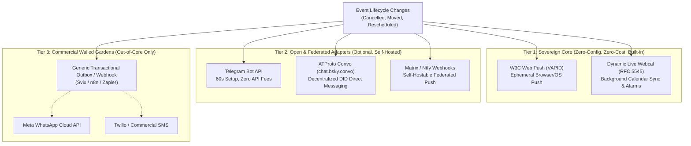

<!-- ABOUTME: Canonical I-VSD report for non-email communication and notification architecture in ISLAMU Event. -->
<!-- ABOUTME: Evaluates sovereign, privacy-preserving event notification channels and establishes a 3-tier delivery hierarchy. -->

# Zero-Email Communication & Notification Architecture — I-VSD Consultancy Report

Last Updated: 2026-09-15

## Review Metadata

- Mode: standalone
- Subject: zero-email-notification-architecture
- Workstream: none
- Report kind: consultancy-report
- Report status: current
- Disposition: advisory
- Evidence cutoff: 2026-09-15
- Reviewed input: working-tree
- Supersedes: none
- Review boundary: Evaluates provider-mediated architectural choices, privacy boundaries, self-hosting autonomy, and attendee dignity across communication channels (W3C Web Push, Dynamic Webcal, Telegram Bot API, ATProto Convo, Matrix, and commercial messaging APIs). Grounded in the existing codebase (`IWebPushNotificationSender`, `NotificationPreferenceChannelEnum`, `AnonymousPiiRetentionUntilUtc`, and `EmailOptionalSelfHostingIntegration`). This report provides design reasoning and ethical analysis, not religious fatwas, Sharia compliance certifications, or legal warranties.

---

## Scope

This consultancy report examines how ISLAMU Event can deliver a first-class, reliable, and privacy-respecting event lifecycle experience (tickets, critical cancellations, time/venue adjustments, and reminders) when outbound SMTP email is disabled or intentionally omitted by the self-hoster.

### In Scope

- **Sovereign Built-in Baseline (Tier 1):** Native W3C Web Push (VAPID) and Dynamic Live Calendar subscriptions (`webcal://` / RFC 5545) requiring zero external SaaS subscriptions, zero credit cards, and zero open inbound ports on the host.
- **Open & Federated Chat Adapters (Tier 2):** Optional, free-to-operate messaging dispatchers including Telegram Bot API, ATProto Direct Messaging (`chat.bsky.convo` via CarpaNet), and Matrix/Ntfy webhooks.
- **Commercial Walled Gardens & Extractive Messaging (Tier 3):** Architectural boundary and policy regarding proprietary, surveillance-heavy, per-conversation billed channels (Meta WhatsApp Cloud API, commercial SMS gateways).
- **Attendee Dignity & Data Minimization:** Ephemeral subscription lifecycles, automated retention limits aligned with `AnonymousPiiRetentionUntilUtc`, single-event scoping, and prevention of persistent cross-event tracking.
- **Truthful UI & Failure Transparency:** Transparent attendee disclosure between active push delivery and bookmarkable self-monitoring fallback modes.

### Out of Scope

- Core payment, ticketing tier pricing, and Stripe Connect payouts (governed by `islamic-value-sensitive-design/consultations/i-vsd-paid-event-payments-consultation.md`).
- Low-level ATProto cryptographic PDS repository handshakes (governed by the ATProto authentication workstream).
- Canonical SMTP infrastructure and transactional outbox reliability mechanics (governed by `docs/internal/SELF_HOSTING.md` and `docs/internal/OPERATIONS.md`).
- Legal compliance opinions regarding local telecommunication marketing regulations (e.g., TCPA, CAN-SPAM, ePrivacy Directive).

### Settled User Decisions

On 2026-09-15, the project steward formally approved adopting a **Strict 3-Tier Notification Hierarchy**:
1. **Tier 1 (Sovereign Built-in Core):** Mandate W3C Web Push and Dynamic Webcal (`webcal://`) as the default, zero-configuration baseline available on every instance out of the box.
2. **Tier 2 (Open & Community Chat Adapters):** Support Telegram Bot API and ATProto Convo (`chat.bsky.convo`) as optional, free-to-operate community dispatchers.
3. **Tier 3 (Proprietary Walled Gardens):** Explicitly banish proprietary SDKs and paid conversation APIs (Meta WhatsApp Cloud API, commercial SMS) from the core repository. Organizations requiring WhatsApp must consume external transactional webhooks (via Svix, n8n, or Zapier); no Meta SDKs, billing logic, or message template pricing will enter core.

---

## Claim Boundary

This report provides normative Islamic Value-Sensitive Design (I-VSD) reasoning regarding provider responsibility, system defaults, data minimization, and technical sovereignty. It is not a formal fatwa, Sharia audit certification, halal/haram ruling, or legal warranty. Technical assessments reflect the ISLAMU Event codebase as of September 2026. Religious-legal questions regarding specific commercial messaging contracts or regional privacy jurisprudence must be escalated to qualified scholarly authorities and legal counsel.

---

## Common Overlooked Failures And Outcomes

### Failures And Their Evidence Limits

1. **The Silent Asymmetry Failure:** Attendees who register without an email address or push channel assume they will be notified if a lecture or halaqah is moved or cancelled, leading to wasted travel and missed gatherings when no push channel was established.
2. **The Walled-Garden Trap:** Self-hosters attempting to use WhatsApp for community notices encounter mandatory Meta Business verification, credit card requirements, template rejection, 24-hour response window cutoffs, and sudden account bans when users tap "Report Spam."
3. **Identifier Creep:** Forcing attendees to provide a personal phone number or email address for a one-off open gathering exposes them to long-term surveillance, data brokers, and corporate marketing graphs.
4. **The False-Delivery Illusion:** Organizers assume that firing a browser push notification guarantees 100% receipt, overlooking browser background sleep, revoked OS permissions, or iOS Home Screen PWA installation requirements.
5. **Subscription Zombiehood:** Anonymous push tokens or Telegram chat IDs retained indefinitely in the database turn a privacy-friendly guest registration into a persistent surveillance ledger across years of events.

### Negative Consequences

- **Breach of Trust (*Khiyanah al-Amanah*):** Attendees lose confidence in grassroots organizers after traveling to an empty venue due to uncommunicated schedule changes.
- **Exclusion of Grassroots Hosts (*Irhāq al-Mustaḍ'afīn*):** Imposing complex third-party SaaS contracts (SendGrid, Meta Business, Twilio) prices out small mosques, student halaqat, and humanitarian initiatives.
- **Surveillance Complicity (*I'ānah 'alā al-Tajassus*):** Funneling community attendance data into proprietary Big Tech advertising graphs compromises attendee privacy and security.

### Intended Positive Outcomes

- **Community Sovereignty (*Istiqlal & Tamkin*):** Any individual can deploy ISLAMU Event on a low-cost VPS and run complete, notification-enabled events without needing port 25 unblocked or paying SaaS tollbooths.
- **Dignity & Privacy by Default (*Hifdh al-'Ird & Khususiya*):** Attendees can RSVP and receive timely alerts with zero personal contact information surrendered.
- **Clarity and Truthfulness (*Sidq & Bayan*):** Attendees and organizers operate with explicit, transparent knowledge of how and when notifications are delivered.

---

## Findings

### IVSD-F001 — The Big Tech Communication Oligopoly and Extractive Intermediation

- **Lifecycle:** open
- **Severity / claim type:** High; provider autonomy, anti-lock-in, and economic justice.
- **Principle / domain:** Independence (*Istiqlal*), removing hardship (*Raf' al-Haraj*), and avoiding exploitation; Strategic & Business Model.
- **Stakeholders / provider decision:** Self-hosters, grassroots masajid, community organizers; whether the platform mandates commercial SaaS aggregators (SendGrid, Twilio, Meta) for baseline event notifications.
- **Evidence:** `docs/internal/SELF_HOSTING.md` lines 105–173 (standalone single-container core); `docker-compose.yml` (zero external SaaS requirements); user alignment decision on 2026-09-15 rejecting native WhatsApp SDKs.
- **Mitigation:** [IVSD-M001](#ivsd-m001--strict-3-tier-notification-hierarchy). Core platform maintains Tier 1 (Web Push + Webcal) as a sovereign, zero-cost baseline. Proprietary channels are excluded from core.
- **Owner / next validation:** Platform Architecture; verify standalone deployment operates full notification lifecycle with zero external API credentials.
- **Escalation boundary:** None.

### IVSD-F002 — Communication Asymmetry in Email-Free Registrations

- **Lifecycle:** open
- **Severity / claim type:** High; contractual faithfulness and harm prevention.
- **Principle / domain:** Trust (*Amanah*), promise-keeping (*Wafa' bil-'Uqud*), and non-harm (*La Darar*); UX & Operations.
- **Stakeholders / provider decision:** Anonymous attendees, event organizers; how to prevent attendees from missing critical updates (cancellations, venue shifts) when no email address is collected.
- **Evidence:** `islamic-value-sensitive-design/consultations/i-vsd-email-optional-self-hosting.md` finding `IVSD-F002`; `src/Explore.Domain/NotificationDelivery.cs`; `GuestRegistrationStatusAccessGuard.cs`.
- **Mitigation:** [IVSD-M002](#ivsd-m002--sovereign-zero-setup-baseline-w3c-web-push--dynamic-webcal). Implement 1-click ephemeral Web Push on the confirmation view paired with dynamic `webcal://` live calendar subscription feeds.
- **Owner / next validation:** Frontend/UX and Application Services; verify registration completion presents clear push affordance and live calendar link.
- **Escalation boundary:** Escalate to community organizers regarding operational protocols for emergency physical signage when zero-contact attendees exist.

### IVSD-F003 — Surveillance Capitalism & Attendee Phone Number Exposure

- **Lifecycle:** open
- **Severity / claim type:** High; privacy, dignity, and anti-surveillance.
- **Principle / domain:** Protection of dignity/privacy (*Hifdh al-'Ird*), prohibition of spying (*Tajassus*), and data minimization; Data Governance & Privacy.
- **Stakeholders / provider decision:** Attendees, vulnerable minority communities, human rights groups; whether attendee phone numbers are required for messaging or exposed to third-party ad networks.
- **Evidence:** Meta WhatsApp Business API terms requiring metadata sharing; `src/Explore.Domain/Entities/RegistrationOrderPii.cs` (restricting PII retention).
- **Mitigation:** [IVSD-M003](#ivsd-m003--ephemeral-token-lifecycle--strict-pii-scrubbing). Reject mandatory phone number collection. Enforce automatic cryptographic token purging at `EventEnd + 7 days` (aligned with `AnonymousPiiRetentionUntilUtc`) for all guest push/bot endpoints.
- **Owner / next validation:** Data Protection & Security; verify automated cleanup jobs purge expired push subscriptions and chat mapping tables.
- **Escalation boundary:** None.

### IVSD-F004 — Decoupling Identity from Messaging via Federated Ecosystems

- **Lifecycle:** open
- **Severity / claim type:** Medium; technical innovation, decentralization, and digital sovereignty.
- **Principle / domain:** Empowerment (*Tamkin*), mutual cooperation (*Ta'awun*), and truthfulness (*Sidq*); Architecture & Federation.
- **Stakeholders / provider decision:** ATProto/Bluesky users, federated community members; how to leverage decentralized identifiers (DIDs) for notification delivery without email intermediaries.
- **Evidence:** `src/Explore.Infrastructure/CarpaNet/` (ATProto integration); Bluesky `chat.bsky.convo` protocol specification; `VisitorAccessCapabilityResolver.cs`.
- **Mitigation:** [IVSD-M004](#ivsd-m004--native-atproto-convo-dispatcher). Add an optional ATProto Convo background dispatcher that allows the event instance's bot DID to send private direct messages to attendee DIDs.
- **Owner / next validation:** ATProto Integration Team; verify bot DID can dispatch event updates to an attendee's Bluesky inbox upon RSVP.
- **Escalation boundary:** Note that while ATProto DMs are private between accounts, they are not yet end-to-end encrypted (E2EE) on the server.

### IVSD-F005 — Cognitive Fatigue, Attention Exploitation & Notification Blast Abuse

- **Lifecycle:** open
- **Severity / claim type:** Medium; respect for human attention and moderation.
- **Principle / domain:** Moderation (*I'tidal*), gentleness (*Rifq*), and avoiding annoyance/harm (*Kaff al-Adha*); UX & Design.
- **Stakeholders / provider decision:** Attendees, organizers; preventing event notification channels from degenerating into spam, unsegmented marketing, or manipulative broadcast channels.
- **Evidence:** `src/Explore.Domain/Enums/NotificationPreferenceEnums.cs` (category splitting: `EventUpdates` vs. `Marketing`); `NotificationPreferenceCategoryCodes`.
- **Mitigation:** [IVSD-M005](#ivsd-m005--purpose-bound-event-scoping--one-click-mute). Guest push and bot subscriptions are hard-scoped strictly to `EventUpdates` (cancellations, room moves, start delays). Marketing broadcasts across zero-email channels are architecturally prohibited.
- **Owner / next validation:** Application CQRS / Notification Orchestrator; enforce category policy gates preventing marketing notifications from targeting ephemeral guest channels.
- **Escalation boundary:** None.

### IVSD-F006 — Transparent Delivery State & The Self-Monitoring Contract

- **Lifecycle:** open
- **Severity / claim type:** Medium; honest representation and eliminating uncertainty.
- **Principle / domain:** Truthfulness (*Sidq*) and eliminating ambiguity (*Gharar*); UX & Operations.
- **Stakeholders / provider decision:** Attendees opting out of all notification channels; ensuring they understand their responsibility to self-monitor.
- **Evidence:** `src/Explore.API/Hateoas/Policies/GuestRegistrationStatusPolicy.cs`; `RegistrationOrder.cs`.
- **Mitigation:** [IVSD-M006](#ivsd-m006--explicit-self-monitoring-mode--claim-contract). When an attendee declines Web Push, Webcal, and chat bots, the UI renders an explicit "Self-Monitoring Mode" banner with a persistent, bookmarkable claim token link.
- **Owner / next validation:** Frontend Team; audit guest registration completion screen states.
- **Escalation boundary:** None.

---

## Recommendations

### Core Architectural Hierarchy

#### IVSD-M001 — Strict 3-Tier Notification Hierarchy
Architect the notification subsystem to treat Tier 1 as mandatory native components compiled into every deployment. Exclude commercial proprietary messaging SDKs from the core codebase. Maintain the single-container SQLite deployment invariant with zero external egress dependencies.

#### IVSD-M002 — Sovereign Zero-Setup Baseline: W3C Web Push & Dynamic Webcal
- **Web Push:** Surface a clear, respectful permission request on the event confirmation screen: *"Enable instant updates for this event (No personal information required)"*. Generate VAPID key pairs within the instance if unconfigured.
- **Dynamic Webcal:** Provide a `webcal://` subscription link alongside static `.ics` downloads. When an event is updated or cancelled in ISLAMU Event, the calendar feed updates the VEVENT properties (`STATUS:CANCELLED`, modified `SUMMARY` with `[CANCELLED]` prefix, or updated `DTSTART`). Attendee devices automatically poll and display native OS calendar alarms.

#### IVSD-M003 — Ephemeral Token Lifecycle & Strict PII Scrubbing
- Anonymous Web Push subscriptions and external bot chat bindings are strictly tied to the specific `RegistrationOrderId`.
- At `EventEnd + 7 days` (governed by `AnonymousPiiRetentionUntilUtc`), physical deletion routines hard-purge push endpoints, auth keys, and chat IDs from the database. No cross-event marketing list can be formed from guest registrations.

#### IVSD-M004 — Native ATProto Convo Dispatcher
Leverage ISLAMU Event's CarpaNet ATProto foundation to support automated direct messaging:
- The self-hosted instance configures a bot DID.
- When an attendee signs in via ATProto, the system offers: *"Receive ticket & updates via Bluesky Direct Message"*.
- Notifications are delivered directly to the attendee's personal Bluesky inbox using `chat.bsky.convo`, keeping communication decentralized and decoupled from email.

#### IVSD-M005 — Purpose-Bound Event Scoping & One-Click Mute
- Ephemeral notification channels are architecturally restricted to `NotificationPreferenceCategoryEnum.EventUpdates` (time changes, venue moves, cancellations, safety notices).
- Outbox workers must reject attempts to route `Marketing` or `ProductAnnouncements` to guest push subscriptions.
- Every chat message (Telegram/ATProto) must include an inline *"Mute updates for this event"* button that instantly detaches the registration.

#### IVSD-M006 — Explicit Self-Monitoring Mode & Claim Contract
If an attendee rejects all notification affordances, the system must not silently fail:
- The confirmation screen explicitly states: *"You have opted out of automatic notifications. Please bookmark this private link or download the calendar event to monitor updates manually."*
- HAL links preserve the unguessable guest status token (`/registrations/guest/{token}`) active until the event archive window closes.

### Rejected Alternatives

- **Native WhatsApp Cloud API in Core:** **Rejected.** Integrating Meta's Cloud API directly into the core repo introduces proprietary SDK dependencies, requires operators to maintain commercial Facebook Developer accounts and credit cards, subjects attendees to Meta's surveillance graph, and invites arbitrary account bans. Organizations requiring WhatsApp must consume external webhooks (Tier 3).
- **Mandatory Email Relay:** **Rejected.** Enforcing SMTP as a hard requirement violates the core self-hosting mission, locks out users on port-25 blocked VPS providers, and creates unnecessary friction for simple community events.
- **Static-Only Calendar Downloads:** **Rejected as a standalone solution.** Static `.ics` files cannot notify attendees of subsequent venue changes or cancellations once downloaded.

---

## Stakeholders

- **Grassroots & Volunteer Organizers:** Masajid committees, halaqah leaders, student organizers; benefit from zero-configuration, zero-cost notification tooling that runs on low-end hardware without third-party accounts.
- **Privacy-Conscious Attendees:** Individuals seeking to participate in community gatherings without surrendering email addresses, phone numbers, or metadata to commercial surveillance systems.
- **Decentralized Ecosystem Adopters:** ATProto and Bluesky users who gain seamless, passwordless, email-free ticketing and notification flows.
- **Platform Maintainers:** Benefit from a clean, modular Clean Architecture codebase free of proprietary SDK churn and brittle commercial API integrations.

---

## I-VSD Principles And Domains

| Principle | Meaning in this Context | Primary Domain |
|---|---|---|
| **Amanah (Trust / Custodianship)** | Delivering event notices reliably without misrepresenting delivery guarantees or abusing attendee attention. | Strategic, UX & Operations |
| **Istiqlal (Sovereignty / Autonomy)** | Ensuring the platform and its operators remain free from extractive Big Tech monopolies and tollbooths. | Strategy & Architecture |
| **Hifdh al-'Ird (Protection of Dignity & Privacy)** | Safeguarding attendee identity; preventing community event attendance from leaking into advertising graphs. | Data Governance & Privacy |
| **Raf' al-Haraj (Removal of Hardship)** | Eliminating technical and financial friction (port 25, DNS records, paid API credits) for grassroots operators. | Strategic & Architecture |
| **Sidq (Truthfulness & Transparency)** | Honestly communicating to attendees whether they will receive active alerts or must self-monitor. | Design & UX |
| **La Darar (Non-Harm)** | Preventing wasted travel and physical disruption resulting from uncommunicated event cancellations. | Operations & Safety |

---

## Validation Gaps

- **iOS Web Push Adoption Limits:** While iOS 16.4+ supports Web Push, it requires the user to add the PWA to their Home Screen. Empirical user testing is required to determine whether mobile web users complete this flow or prefer Dynamic Webcal / Telegram.
- **Calendar Background Sync Latency:** Different mobile operating systems (iOS Calendar vs. Google Calendar on Android) refresh background `webcal://` feeds at varying intervals (from 15 minutes to 24 hours). Empirical sync interval testing is needed to document expected reminder latency for last-minute venue changes.
- **Telegram Bot Abuse Resistance:** Verification that open Telegram bot deep-linking cannot be used to spoof registrations or trigger outbox flooding.

---

## Escalation Needed

- **Fiqh & Ethical Consultation on Safety-Critical Event Notice Duties:** Where an event poses genuine physical or safety risks (e.g., severe weather cancellation or security emergency), what is the moral and religious duty of care (*Mas'uliyyah*) incumbent upon organizers who operate in minimal-data / zero-contact modes? Recommended escalation to qualified community leadership to establish offline contingency runbooks (physical venue signage, volunteer marshals).

---

## Evidence Reviewed

- `docs/internal/SELF_HOSTING.md` (Standalone core bounds and SMTP-optional operation).
- `islamic-value-sensitive-design/consultations/i-vsd-email-optional-self-hosting.md` (Consultancy on zero-email self-hosting and anonymous registration).
- `src/Explore.Domain/Enums/NotificationPreferenceEnums.cs` (Channel and category enum models).
- `src/Explore.Domain/NotificationPreferenceChannel.cs` (Relational preference structures).
- `src/Explore.Application/Contracts/Infrastructure/IWebPushNotificationSender.cs` (Web Push sender abstraction).
- `src/Explore.Infrastructure/WebPush/WebPushNotificationSender.cs` (W3C VAPID push implementation).
- `src/Explore.Domain/Entities/RegistrationOrderPii.cs` (PII retention and scrubbing boundaries).
- W3C Push API & RFC 5545 (iCalendar) specifications.
- Bluesky ATProto `chat.bsky.convo` protocol documentation.

---

## Missing Evidence

- Measured conversion rates for W3C Web Push permission prompts in community event settings.
- Real-world empirical measurements of background Webcal feed sync frequencies across major mobile operating systems.
- Production telemetry on Telegram Bot API rate-limit behavior under concurrent multi-tenant fanout conditions.

---

## Context Inventory

- **Workspace docs & code:** Complete access to domain models, persistence migrations, infrastructure dispatchers, and previous I-VSD governance and consultation reports.
- **Project tools & integrations:** No live external issue tracker or CRM connected; review based on repository source code, architecture specifications, and documented git commit history.
- **Community feedback:** Informed by organizer and attendee experience patterns documented in prior I-VSD workstreams.

---

## Review Lifecycle

| Date | Previous status | New status | Trigger | Evidence / replacement |
|---|---|---|---|---|
| 2026-09-15 | none | current | User brainstorm and explicit request for I-VSD consultation on zero-email alternatives | Authoring of canonical report based on settled 3-Tier Channel Hierarchy decision |
